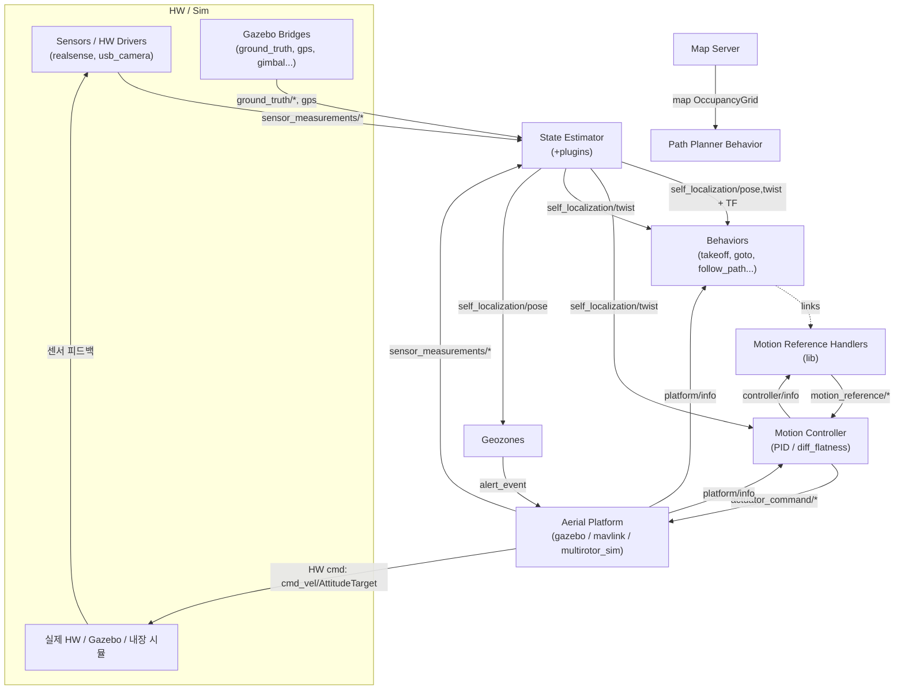
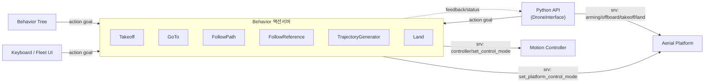

# AeroStack2 노드 분석 (소스 기반)

AS2 = 계층형 드론 자율비행 프레임워크. 각 드론 = 네임스페이스(`drone0/`) 하나, 그 안에 노드들이 표준 토픽으로 연결.

분석 대상: 소스만 (`.git`, `.github` 제외). pub/sub은 `create_publisher`/`create_subscription` 직접 grep + `as2_core` base class 기준.

---

## 1. 표준 인터페이스 (as2_core가 정의, 모든 노드 공유)

토픽 어휘 `as2_names::topics`(`as2_core/include/as2_core/names/topics.hpp`)가 백본. 핵심 계층:

| 토픽 그룹 | 의미 | 방향 |
|---|---|---|
| `sensor_measurements/*` (imu, gps, lidar, camera, battery, odom) | 원시 센서 | platform → estimator |
| `ground_truth/{pose,twist}` | 시뮬 정답값 | sim → estimator |
| `self_localization/{pose,twist,odom}` | 추정 상태 | estimator → 전부 |
| `motion_reference/{pose,twist,trajectory,thrust}` | 목표 레퍼런스 | behavior → controller |
| `actuator_command/{pose,twist,trajectory,thrust}` | 제어 출력 | controller → platform |
| `platform/info` (PlatformInfo) | 플랫폼 상태 플래그 | 브로드캐스트 |
| `controller/info` (ControllerInfo) | 제어 모드 플래그 | 브로드캐스트 |
| `alert_event` (AlertEvent) | 비상 이벤트 | 브로드캐스트 |

데이터 흐름 순환: **platform → state_estimator → behavior → motion_controller → platform**

연결 메커니즘 3종:
1. **토픽** — 고주파 데이터흐름. `as2_names::topics` 표준이름 + 드론 네임스페이스로 자동 매칭
2. **서비스** (`as2_names::services`) — 모드전환/arming/origin 등 단발 명령
3. **액션** (`as2_names::actions::behaviors`) — behavior 장시간 동작, 진행률 피드백 + 취소

---

## 2. 노드별 책임 / pub / sub

### A. Aerial Platform (HW 추상화 — `as2_core::AerialPlatform` 상속)
하드웨어/시뮬과 AS2 사이 다리. base class가 표준 IO 강제.

**공통 (`as2_core/src/aerial_platform.cpp`):**
- sub: `actuator_command/{pose,twist,thrust,trajectory}`, `alert_event`
- pub: `platform/info` (PlatformInfo)
- srv: `set_arming_state`, `set_offboard_mode`, `set_platform_control_mode`, `platform_takeoff`, `platform_land`, `platform/list_control_modes`
- 또한 `sensor_measurements/*` 발행 (as2_core Sensor 클래스 통해)

| 노드 | 역할 | 추가 IO |
|---|---|---|
| `as2_platform_gazebo` | Gazebo 브리지 | pub→Gazebo: cmd_vel(Twist), acro(Acro), arm(Bool); sub: twist_state |
| `as2_platform_mavlink` | MAVROS/PX4 브리지 | sub: mavros State, Odometry; pub: AttitudeTarget, vision_pose/speed, twist setpoint |
| `as2_platform_multirotor_simulator` | 내장 멀티로터 시뮬 | sub: GimbalControl; 물리 적분 |
| `sim_clock_publisher` | 시뮬 `/clock` 발행 | pub: rosgraph_msgs/Clock |

### B. State Estimator (`as2_state_estimator` + 플러그인)
센서 융합 → 자기위치 추정 + TF(`earth→map→odom→base_link`) 발행.
- pub: `self_localization/pose`, `self_localization/twist` (`plugin_base.hpp`)
- 플러그인별 sub:
  - `ground_truth`: `ground_truth/pose`, `ground_truth/twist`, gps
  - `raw_odometry`: `sensor_measurements/odom`, gps
  - `mocap_pose`: mocap4r2 RigidBodies
  - `ground_truth_odometry_fuse`: odom + ground_truth + mocap 융합

### C. Motion Controller (`as2_motion_controller`)
레퍼런스 → 제어출력 변환. controller_manager + controller_handler + 플러그인(PID speed, differential_flatness).
- sub (`controller_handler.cpp`): `motion_reference/{pose,twist,trajectory,thrust}`, `self_localization/twist`, `platform/info`
- pub: `actuator_command/{pose,twist,trajectory,thrust}`, `controller/info` (ControllerInfo)
- srv: `controller/set_control_mode`, `controller/list_control_modes`

### D. Motion Reference Handlers (`as2_motion_reference_handlers`)
라이브러리(노드 아님). behavior/UI가 링크해서 레퍼런스 발행.
- pub: `motion_reference/{pose,twist,trajectory,thrust}`
- sub: `controller/info` (모드 확인용)

### E. Behaviors (`as2_behaviors` — `as2_behavior` 액션서버 베이스)
미션 동작. 액션서버로 노출, 내부서 reference handler 통해 controller 구동. 공통: `behavior_status` 발행, `self_localization/twist`+`platform/info` 구독.

액션 이름 (`as2_names::actions::behaviors`): TakeoffBehavior, GoToBehavior, FollowReferenceBehavior, FollowPathBehavior, LandBehavior, TrajectoryGeneratorBehavior.

| 노드 | 액션/역할 | 특이 IO |
|---|---|---|
| `takeoff_behavior` | TakeoffBehavior | |
| `land_behavior` | LandBehavior | |
| `go_to_behavior` | GoToBehavior | |
| `follow_path_behavior` | FollowPathBehavior | |
| `follow_reference_behavior` | FollowReferenceBehavior | pub: PoseStampedWithIDArray |
| `generate_polynomial_trajectory_behavior` | TrajectoryGeneratorBehavior | sub: yaw(Float32), aruco array; pub: `motion_reference/trajectory`, Path, Marker |
| `path_planner_behavior` | A*/Voronoi 경로계획 | sub: drone pose, OccupancyGrid(`map`); pub: Path, Marker |
| `swarm_flocking_behavior` | 군집 비행 | sub: PoseWithIDArray; 각 drone pose |
| `detect_aruco_markers_behavior` | 아루코 인식 | sub: camera Image+CameraInfo; pub: PoseStampedWithIDArray |
| `gripper_behavior` / `point_gimbal_behavior` | 페이로드 | pub: PWM/Float64, GimbalControl |
| `mass/force_estimation_behavior` | 질량/추력 추정 | sub: Thrust, imu; pub: Float64 디버그 |
| `set_arming_state` / `set_offboard_mode` | platform 상태 동작 | platform srv 호출 |

### F. Map Server (`as2_map_server`)
센서 → 점유격자. plugin `scan2occ_grid`.
- sub: LaserScan; pub: `map`, `map_filtered` (OccupancyGrid)

### G. Behavior Tree (`as2_behavior_tree`)
BT로 미션 오케스트레이션. 액션노드가 behavior 액션서버 호출.
- pub: event String; sub: `platform/info`(is_flying 조건), `alert_event`

### H. Utilities
| 노드 | 역할 | IO |
|---|---|---|
| `as2_external_object_to_tf` | 외부객체 → TF | sub: PoseStamped, NavSatFix, Float32, mocap RigidBodies |
| `as2_geozones` | 지오펜스 감시 | sub: `self_localization/pose`; pub: `alert_event`(AlertEvent), PolygonList |

### I. Gazebo Bridges (`as2_gazebo_assets`)
Gazebo Transport ↔ ROS2 변환. acro, azimuth, gimbal, gps, ground_truth, object_tf_broadcaster, set_entity_pose.
예: `ground_truth_bridge` pub `ground_truth/pose`+`twist`; `gps_bridge` pub NavSatFix; `gimbal_bridge` sub GimbalControl, pub attitude/angular_velocity.

### J. HW Drivers
`as2_realsense_interface`, `as2_usb_camera_interface` → `sensor_measurements/camera`, imu 발행.

### K. User Interfaces (대부분 Python)
| 노드 | 역할 |
|---|---|
| `alphanumeric_viewer` (C++) | 터미널 대시보드. sub: pose/twist/battery/imu/platform info/controller info/actuator_command/references/gps (읽기전용) |
| `keyboard_teleoperation` (Py) | 키보드 텔레옵 → motion reference |
| `fleet_manager_node` (Py) | 다중 드론 관리 |
| `as2_visualization` (Py) | RViz 마커/게이트 발행 |
| `teleop_panel` (rviz plugin) | pub: `alert_event` |

### L. Python API (`as2_python_api`)
노드 아님. DroneInterface 라이브러리 + mission_interpreter. 액션/서비스 클라이언트로 behavior 호출, motion handler로 레퍼런스 발행. 미션 스크립팅 진입점.

---

## 3. 노드간 연계 구조

```
[Sensors / Gazebo bridges / HW drivers]
        │ sensor_measurements/*  (+ ground_truth/*)
        ▼
[State Estimator] ──TF(earth→map→odom→base_link)──► 전체
        │ self_localization/{pose,twist}
        ▼
[Behaviors] ◄──액션서버── [Python API / BehaviorTree / Fleet / Keyboard UI]
        │ (motion_reference_handlers 링크)
        │ motion_reference/{pose,twist,trajectory,thrust}
        ▼
[Motion Controller] ──controller/info──►(handlers 모드확인)
        │ actuator_command/{pose,twist,trajectory,thrust}
        ▼
[Aerial Platform] ──platform/info──► 전체
        │ HW별 명령(cmd_vel / AttitudeTarget / ...)
        ▼
   [실제 HW / Gazebo / 내장 시뮬]
        └──센서 피드백──► 다시 State Estimator (순환)

곁가지:
  Map Server:  LaserScan → map ──► Path Planner Behavior
  Geozones:    self_localization/pose → alert_event ──► Platform / BT (비상)
  Viewer:      전 토픽 구독(읽기전용 모니터)
```

### Mermaid: 핵심 데이터흐름 (토픽)



### Mermaid: 제어/오케스트레이션 (액션·서비스)



**핵심 설계:** 노드는 서로 직접 모름. `as2_core`의 표준 토픽이름 + 드론 네임스페이스로만 결합 → 플러그인(controller/estimator/platform) 교체해도 토픽 계약 동일해 나머지 무영향.

참고: repo 루트에 `AS2_TOP_LEVEL_ARCHITECTURE.md`, `ARCHITECTURE_DIAGRAMS.md` 등 기존 문서도 있음 — 위는 소스 직접 grep 결과.
