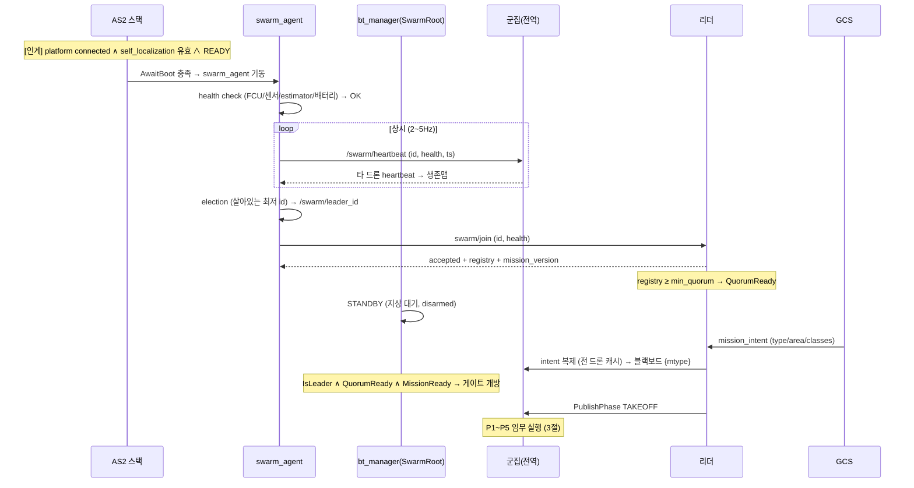

# 드론 부팅 후 동작 시퀀스 (단일기 + 군집)

> **범위**: HW/AS2 스택 부팅 **이후** — swarm_agent 기동 → health/heartbeat/선출/참여/정족수 → BT Phase 0 게이트 → 임무 개시(P1~P5).
> **인계**: `군집드론_부팅시퀀스.md` 5단계(AS2 스택 기동 + EKF 수렴 + 플랫폼 READY)에서 이어짐.
> **근거**: `AS2_SWARM_BOOTSTRAP_DESIGN.md`(Phase0), `AS2_SWARM_BT_DISPATCH_DESIGN.md`(BT), `AS2_SWARM_FULL_DIAGRAM.md`, AS2 실코드(`drone_boot_nodes.md`, `as2_fleet_manager`, `as2_behaviors_swarm_flocking`).

---

## 0. 인계 지점

`군집드론_부팅시퀀스.md` 1~5단계(FC 부팅 → Jetson → MAVROS → AS2 스택 → Pre-arm·EKF 수렴)에서 인계. 그 시점 상태:
- `platform/info.connected = true`, `armed = false`
- `self_localization/{pose,twist,odom}` 유효, TF(earth→map→odom→base) 수렴
- 플랫폼 상태 LANDED/READY, 지상 disarmed

여기서부터 = **swarm_agent + BT Phase 0 → 임무**.

---

## 1. 시퀀스 (Mermaid)



---

## 2. 단계 타임라인 (1기 관점)

| # | 단계 | 상태/동작 | 게이트(다음 조건) | BT 노드 |
|---|---|---|---|---|
| S0 | 스택 READY | platform connected, estimator 수렴, disarmed | `AwaitBoot` | — |
| S1 | swarm_agent 기동 | health_monitor/heartbeat/election/registry up | health OK | `AwaitBoot` |
| S2 | health check | FCU링크·센서·TF·배터리 자가진단 | OK | `ReportHealth` |
| S3 | heartbeat | `/swarm/heartbeat` 발행 + 수신 → 생존맵 | (상시) | `PublishHeartbeat` |
| S4 | 선출 | 최저 id → `/swarm/leader_id` | leader 안정 | `IsLeader`(평가) |
| S5 | 참여 | `swarm/join` → registry 등록 | accepted | `SwarmJoin`(재시도) |
| S6 | 정족수 | registry ≥ quorum | ≥quorum | `QuorumReady` |
| S7 | STANDBY | 지상 대기 (disarmed) | mission_intent | `SafeHover`/대기 |
| S8 | 임무 수신 | GCS intent → 캐시 → `{mtype}` | IsLeader∧Quorum∧Mission | `MissionReady` |
| **S9** | **개시** | 리더 `SwarmCoord` → P1 진입 | — | `PublishPhase TAKEOFF` |

---

## 3. 임무 개시 후 (S9 → P1~P5)

```
P1 TAKEOFF  [개별·순번]  PublishPhase TAKEOFF → per-drone WaitTakeoffSlot 순번
            → Arm→Offboard→Takeoff → AwaitAllAirborne (barrier)
P2 TRANSIT  [편대]       SwarmFlockingStart(편대) → AwaitFormed
            → DriveCentroid(정찰구역 진입점) → 드론 FollowReference 추종
P3 WORK     [임무별]     EO/IR정찰 = 독립 분할(FollowPath+DetectObjects+Gimbal)
            RF = 편대 baseline / 감시 = 거점 loiter / 추적 = HasRole 분기
            → AwaitAllZonesDone (barrier)
P4 REGROUP  [편대]       SwarmFlockingStart 재 → DriveCentroid(home)
P5 LANDING  [개별·순번]  PublishPhase LANDING → WaitLandSlot 순번 → Land
            → AwaitAllLanded → DONE
```

---

## 4. 노드 상태 전이 (per-drone)

```
[부팅] platform/estimator/controller up
   ↓ READY
[지상] swarm_agent: heartbeat ∥ health ∥ election ∥ join   ──(상시)
   ↓ QuorumReady ∧ MissionReady
[리더?]──예──▶ SwarmCoord(조율) ∥ SwarmDrone(실행)
   └──아니오─▶ SwarmDrone(실행, phase 추종)
   ↓ PublishPhase
[비행] TAKEOFF → TRANSIT → WORK → REGROUP → LANDING → DONE
   │
   └─(언제든) alert→Emergency 선점 / 리더상실→재선출 / 배터리→IndividualRTB
```

---

## 5. 지상→비행 천이 게이트 3개

```
G1 AwaitBoot:    platform connected ∧ estimator 유효       (S0→S1)
G2 QuorumReady:  registry ≥ min_quorum                     (S6→S7)
G3 MissionReady: IsLeader ∧ mission_intent 수신            (S8→S9)
```

3 게이트 전부 충족 전엔 **지상 disarmed 유지** → 조기 이륙 방지.
부분 충족 시 동작:
- G1 미충족 → swarm_agent 미기동, 부팅 재시도.
- G2 미충족(정족수 미달) → 지상 STANDBY 대기 (타임아웃 시 축소임무/대기 정책).
- G3 미충족(임무 미수신) → 지상 STANDBY, heartbeat/선출만 지속.

---

## 6. 기존 부팅문서와의 차이

| 항목 | 기존 `군집드론_부팅시퀀스.md` | 신규(본 시퀀스) |
|---|---|---|
| 역할 배정 | 정적 설정 또는 단순 consensus | **heartbeat 기반 선출**(최저 id, 자동 승계) |
| 합류 | DDS discovery | **swarm/join + registry + quorum** |
| 임무 개시 | All-Ready 게이트 → 동시 arm | **3 게이트(Boot/Quorum/Mission) → 순차 이륙** |
| 조율 | mission/formation node(앱 레이어) | **BT(SwarmCoord/SwarmDrone) + swarm_agent 서비스** |
| 단절 생존 | 명시 안 됨 | intent 캐시 + 리더 자율 개시 + 재선출 |

> 기존 문서 1~5단계(HW/스택 부팅)는 유효 — 본 문서는 그 **이후 군집 동작**을 신규 설계로 대체·상세화.

---

## 7. 안전·예외 (전 단계 가로지름)

| 이벤트 | 동작 |
|---|---|
| `alert_event` 수신 | `WaitForAlert` 최상위 선점 → Emergency(호버→복귀→착륙) |
| 리더 heartbeat 끊김 | 재선출(차순위) + mission_intent 캐시로 자율 지속 |
| GCS 단절 | 무영향 (BT 로컬 tick + intent 캐시) |
| 개별 배터리 저하 | `BatteryLow` → IndividualRTB(편대 이탈, 군집 임무 지속) |
| barrier 미충족 | 타임아웃 + 낙오기 제외 정책 (교착 방지) |

---

_관련: `군집드론_부팅시퀀스.md`(HW 부팅 1~5단계), `AS2_SWARM_BOOTSTRAP_DESIGN.md`(Phase0 상세), `AS2_SWARM_BT_DISPATCH_DESIGN.md`(BT), `AS2_SWARM_FULL_DIAGRAM.md`(구조도), `drone_boot_nodes.md`(노드 부팅순서)._
