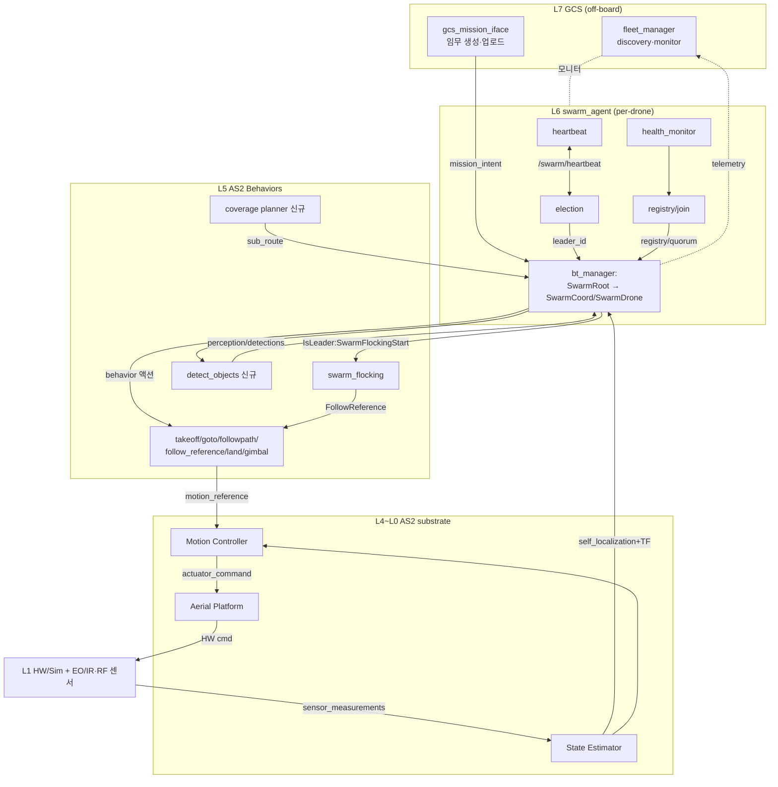
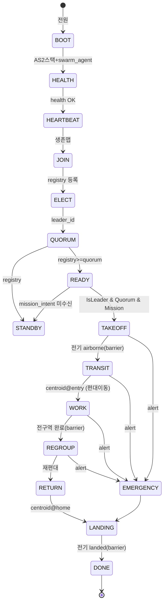
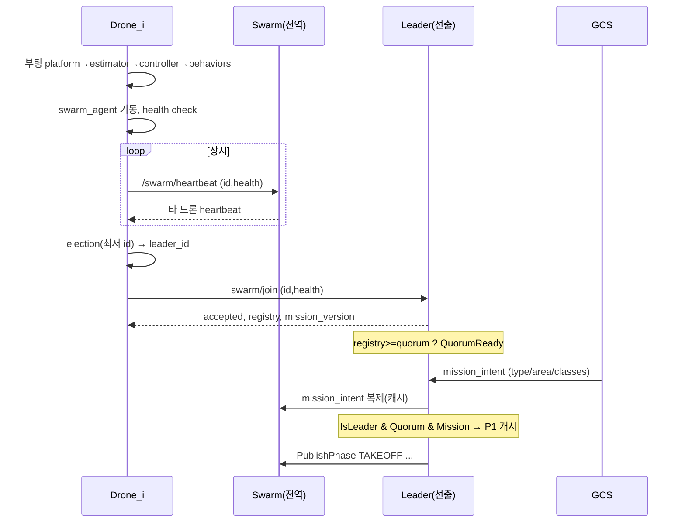
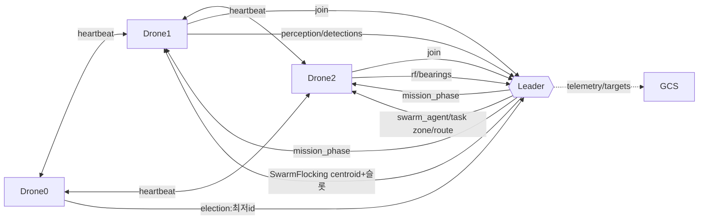

# 군집 정찰 시스템 — 전체 동작 구조 다이어그램

> 부트스트랩(Phase 0) + 임무 BT(P1~P5) + AS2 substrate 종합. 4종 임무(EO/IR 정찰·RF 정찰·감시·추적).
> 근거: `AS2_SWARM_BOOTSTRAP_DESIGN.md`, `AS2_SWARM_BT_DISPATCH_DESIGN.md`, `AS2_RECON_SWARM_PHASED_DESIGN.md`, `AS2_RUNTIME_TOPIC_ICD.md` + AS2 실코드.

---

## 1. 전체 계층 스택 (수직)

```
┌─ L7  GCS (off-board, 제어루프 밖) ───────────────────────────────────────┐
│   fleet_manager(실코드: discovery·fleet_status)  gcs_mission_iface(신규)    │
└───────────────────────────────┬──────────────────────────────────────────┘
        mission_intent / 모니터  │  (끊겨도 임무 지속: intent 캐시)
┌─ L6  swarm_agent (per-drone, 신규 aiss) ──────────────────────────────────┐
│   [백그라운드 서비스]  health_monitor · heartbeat · election · registry     │
│   [bt_manager]  SwarmRoot = 부트스트랩 게이트 + IsLeader 자기선택           │
│       리더 → SwarmCoord (임무 selector + chassis + P3Coord)                 │
│       전체 → SwarmDrone (phase 게이트 + P3Drone)                            │
└───────────────────────────────┬──────────────────────────────────────────┘
        behavior 액션/서비스 호출 │  (Takeoff/GoTo/FollowPath/FollowReference/Land/PointGimbal/DetectObjects)
┌─ L5  AS2 Behaviors (액션서버) ────────────────────────────────────────────┐
│   takeoff·go_to·land·follow_path·follow_reference·point_gimbal             │
│   swarm_flocking(중앙 편대)·detect_objects(신규)·path_planning(coverage 신규)│
└───────────────────────────────┬──────────────────────────────────────────┘
        motion_reference/{pose,twist,trajectory,thrust}                       │
┌─ L4  Motion Reference Handlers (lib)  ─────────────────────────────────────┐
└───────────────────────────────┬──────────────────────────────────────────┘
┌─ L3  Motion Controller (PID / differential_flatness) ─────────────────────┐
└───────────────────────────────┬──────────────────────────────────────────┘
        actuator_command/{pose,twist,trajectory,thrust}                       │
┌─ L2  Aerial Platform (HW 추상화: gazebo / mavlink / multirotor_sim) ───────┐
└───────────────────────────────┬──────────────────────────────────────────┘
        HW cmd (cmd_vel / AttitudeTarget / acro)                              │
┌─ L1  HW / Sim + 센서(EO/IR·LiDAR·GPS·IMU·RF) ─────────────────────────────┐
└───────────────────────────────┬──────────────────────────────────────────┘
        sensor_measurements/* , ground_truth                                  │
┌─ L0  State Estimator → self_localization/{pose,twist,odom} + TF ──────────┐
└───────────────────────────────────────────────────────────────────────────┘
        self_localization → L0~L6 전체 피드백 (순환)
```

---

## 2. 전체 흐름 (Mermaid)



---

## 3. 임무 생명주기 (Phase 0 → P1~P5)



Phase별 제어모드:
```
TAKEOFF [개별·순번]  TRANSIT [편대]  WORK [임무별]  REGROUP/RETURN [편대]  LANDING [개별·순번]
                                      │
        EO/IR정찰·감시 = 독립분할 ────┤
        RF정찰 = 편대 유지(baseline) ─┤
        추적 = 혼합(TRACKER독립/RELAY편대)
```

---

## 4. Phase 0 부트스트랩 시퀀스



---

## 5. BT 디스패치 구조 (계층적)

```
SwarmRoot (전 드론 동일 배포)
│
├─ WaitForAlert → Emergency                              [선점, 최상위]
│
└─ SequenceStar
   ├─ AwaitBoot                                          [B0]
   ├─ RetryUntilSuccessful: SwarmJoin                    [B3]
   └─ Parallel(상시 ∥ 임무)
      ├─ KeepRunning: PublishHeartbeat                   [B2]
      ├─ KeepRunning: ReportHealth                       [B1]
      └─ ReactiveFallback
         ├─ IsLeader & QuorumReady & MissionReady
         │    └─ Parallel
         │       ├─ SwarmCoord  ────────────┐  [리더: 조율]
         │       └─ SwarmDrone               │  [자신도 실행]
         └─ SwarmDrone                       │  [팔로워: per-drone만]
                                             │
   ┌─────────────────────────────────────────┘
   ▼
SwarmCoord (리더)                          SwarmDrone (전 드론)
 L1 HasMissionType selector                 L1 HasMissionType selector
  ├ EOIR_RECON → EoirReconCoord              ├ EOIR_RECON → EoirReconDrone
  ├ RF_RECON   → RfReconCoord                ├ RF_RECON   → RfReconDrone
  ├ SURVEIL    → SurveilCoord                ├ SURVEIL    → SurveilDrone
  └ TRACK      → TrackCoord                  └ TRACK      → TrackDrone
       │                                          │
  L2 SequenceStar (단계)                     L2 phase 게이트 (PhaseIs)
   Cx_SequentialTakeoff                       TAKEOFF → Dx_ArmTakeoff
   →PublishPhase TRANSIT                      TRANSIT → Dx_HoldFormation(FollowReference)
   →Cx_FormUp →DriveCentroid(entry)           WORK    → <임무>P3Drone
   →PublishPhase WORK                         REGROUP → Dx_HoldFormation
   →[<임무>P3Coord]  ◄── 임무 고유            LANDING → Dx_LandSlot
   →PublishPhase REGROUP                      else    → Dx_SafeHover
   →Cx_Regroup →DriveCentroid(home)
   →Cx_SequentialLand
```

공용 chassis = `Cx_*`(coord) / `Dx_*`(drone). 임무별 차이 = `<임무>P3Coord`/`P3Drone` 2개만.

---

## 6. 임무별 P3 (WORK phase) 분기

```
           ┌──────────────── WORK phase ────────────────┐
EO/IR 정찰  │ [독립] FollowPath{sub_route} ∥ DetectObjects(EO/IR) ∥ Gimbal
            │        + ObjectDetected → InspectTarget(loiter)
            │        coord: PartitionAndAssign + FuseDetections + AwaitAllZonesDone
RF 정찰     │ [편대] HoldFormation(baseline) ∥ RfSurvey(DF/삼각측량)→rf/bearings
            │        coord: AssignRfSurvey + DriveCentroid(측위경로) + FuseEmitters
감시        │ [거점] FollowPath{loiter_route} 순환 ∥ DetectObjects ∥ Gimbal
            │        coord: PartitionAndAssign(거점) + FuseDetections
추적        │ [혼합] HasRole: TRACKER→GoTo{target}∥Gimbal / RELAY→HoldFormation
            │        coord: AllocateTrackRoles(반응형, 표적 핸드오프)
           └─────────────────────────────────────────────┘
```

---

## 7. 런타임 데이터 흐름 (수직, 한 명령)

```
mission_intent ─▶ 리더 SwarmCoord(selector→phase) ─▶ BT가 AS2 behavior 액션 호출
   ├ 편대: SwarmFlockingStart ─▶ 드론별 FollowReference ─▶ motion_reference
   ├ 독립: FollowPath/GoTo ─▶ motion_reference
   └ centroid: DriveCentroid ─▶ swarm/base_link TF
        ▼ motion_reference/{pose,twist,trajectory,thrust}
   Motion Controller ─▶ actuator_command/* ─▶ Platform ─▶ HW cmd ─▶ FCU/sim ─▶ 기동
        ▲
센서 ─▶ State Estimator ─▶ self_localization/* ─▶ (BT/controller/편대/탐지) 피드백
인식: EO/IR·RF ─▶ detect_objects/RfSurvey ─▶ perception/detections·rf/bearings
        ─▶ FuseDetections/FuseEmitters ─▶ /swarm/targets·/swarm/emitters ─▶ 리더(재할당/완료판정)
```

---

## 8. 군집 수평 흐름 (드론 간)



- heartbeat = 전드론 메시. election 최저 id → 리더. 리더 사망 → 차순위 승계.
- 리더 = SwarmFlocking centroid·슬롯 + task·phase 발행 + 탐지융합. 팔로워 = 실행 + 인식 보고.

---

## 9. 안전·생존 (가로지름)

```
선점:    alert_event ─▶ WaitForAlert(최상위) ─▶ Emergency (전 phase 무관)
개별RTB: BatteryLow ─▶ IndividualRTB (편대 이탈, 군집 임무 지속)
단절생존:리더 heartbeat 끊김 ─▶ 재선출 / mission_intent 캐시로 자율 지속
        GCS 끊김 ─▶ 무영향(BT 로컬 tick + intent 캐시)
교착방지:per-drone 최종 SafeHover(항상 RUNNING), barrier 타임아웃
```

---

_관련: `AS2_SWARM_BOOTSTRAP_DESIGN.md`(Phase0), `AS2_SWARM_BT_DISPATCH_DESIGN.md`(BT), `swarm_bt/`(XML), `AS2_RUNTIME_TOPIC_ICD.md`(토픽), `AS2_RECON_BEHAVIOR_DESIGN.md`(정찰 behavior)._
