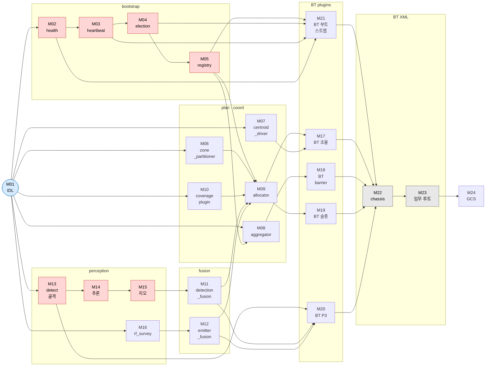

# 군집 정찰 시스템 — 단일 구현 기능 단위 모듈 분리

> **목적**: `AS2_SWARM_SCENARIO_BY_PHASE.md` 전 구간(P0~P5)을 단독 구현·검증 가능한 최소 모듈로 분해.
> **기준**: 단일 책임(1모듈 = 1 ROS 노드·플러그인·라이브러리·XML 묶음), 독립 빌드·테스트 가능, 명확한 입출력 계약.
> **표기**: `(P)`=Pub, `(S)`=Sub, `(AS)`=Action Server, `(AC)`=Action Client, `(SrvS/C)`=Service Server/Client, `(TF)`=TF broadcast/listen.
> **근거**: `AS2_SWARM_SCENARIO_BY_PHASE.md`, `AS2_SWARM_PACKAGE_ARCHITECTURE.md`, `AS2_SWARM_WBS.md`.

---

## 모듈 맵 (패키지별)

```
aiss_swarm_msgs          M01
aiss_swarm_core          M02 M03 M04 M05 M06 M07 M08 M09
aiss_coverage_planner    M10
aiss_swarm_perception    M11 M12
aiss_behaviors_perception M13 M14 M15 M16
aiss_swarm_bt (plugins)  M17 M18 M19 M20 M21
aiss_swarm_bt (XML)      M22 M23
aiss_gcs                 M24
인프라                    M25 M26
```

---

## 계층별 배치 다이어그램

### 다이어그램 1 · 계층-패키지 구조도

> 세로 축 = 추상화 높이 (위↑ 고수준, 아래↓ 저수준). 화살표 = 주요 데이터 흐름 방향.

```
 ╔═══════════════════════════════════════════════════════════════════════╗
 ║  L9 · 인프라                                                          ║
 ║   M25 Sim 환경                    M26 Launch / 파라미터               ║
 ╠═══════════════════════════════════════════════════════════════════════╣
 ║  L8 · aiss_gcs                                                        ║
 ║   M24 gcs_mission_iface                                               ║
 ║            │ /swarm/mission_intent (P)                                ║
 ╠════════════▼══════════════════════════════════════════════════════════╣
 ║  L7 · aiss_swarm_bt — XML 루트                                        ║
 ║   M23 임무 루트 XML (SwarmRoot · Bootstrap · 임무 4종 Coord/Drone)     ║
 ║   M22 chassis XML  (Cx_* · Dx_* 공용 서브트리)                        ║
 ╠════════════════════════════════════════════════════════════════════════╣
 ║  L6 · aiss_swarm_bt — plugins                                         ║
 ║   M21 BT 부트스트랩 7종    M17 BT 조율 7종     M18 BT barrier 4종     ║
 ║   M19 BT 게이트/슬롯       M20 BT P3 임무 12종                        ║
 ╠═══════════════════════╦════════════════════╦══════════════════════════╣
 ║  L5 · aiss_behaviors_ ║  L4 · aiss_swarm_  ║  L3 · aiss_coverage_    ║
 ║       perception      ║       perception   ║       planner           ║
 ║   M13 detect 골격     ║  M11 detect_fusion ║  M10 boustrophedon      ║
 ║   M14 detect 추론     ║  M12 emitter_fusion║       plugin            ║
 ║   M15 detect 지오     ║                    ║                         ║
 ║   M16 rf_survey       ║                    ║                         ║
 ║            │detections║ /swarm/targets (P) ║  /sub_route (Path)      ║
 ╠════════════▼══════════╩════════════════════╩═══════════╦═════════════╣
 ║  L2 · aiss_swarm_core — 계획·조율                      │             ║
 ║   M09 allocator  ◄─── M06 zone_partitioner             │             ║
 ║        ▲         ◄──────────────────────────────────── ╝             ║
 ║   M08 aggregator        M07 centroid_driver                           ║
 ║            │ /swarm/barrier                                           ║
 ╠════════════▼══════════════════════════════════════════════════════════╣
 ║  L1 · aiss_swarm_core — bootstrap                                     ║
 ║   M02 health_monitor → M03 heartbeat → M04 election → M05 registry   ║
 ╠════════════════════════════════════════════════════════════════════════╣
 ║  L0 · aiss_swarm_msgs  (전체 공유 기반 — 전 패키지 의존)              ║
 ║   M01 IDL 정의  (msg × 11 · SwarmJoin.srv · DetectObjects.action)     ║
 ╚═══════════════════════════════════════════════════════════════════════╝

  ─── 재활용 (AS2, 무수정) ──────────────────────────────────────────────
  SwarmFlockingBehavior · FollowPath · Takeoff · Land · GoTo · PointGimbal
  (aerostack2_ws / as2_behaviors_*, as2_motion_*, as2_state_estimator, ...)
```

---

### 다이어그램 2 · 모듈 의존성 DAG

> 화살표 = "→ 의 구현에 필요". 굵은 경로 = 임계 경로(★1·★2·★3 게이트).



---

### 다이어그램 3 · 구간별 모듈 활성 매핑

> 각 구간에서 **신규 구현**이 필요한 모듈만 표시. AS2 재활용 컴포넌트(SwarmFlocking 등) 제외.

```mermaid
flowchart LR
  subgraph P0["P0 · 부트스트랩 ★2"]
    direction TB
    p0a["M01 IDL"]
    p0b["M02 health_monitor"]
    p0c["M03 heartbeat"]
    p0d["M04 election"]
    p0e["M05 registry"]
    p0f["M21 BT 부트스트랩 7종"]
    p0g["M24 GCS mission_iface"]
  end

  subgraph P1["P1 · 순차이륙"]
    direction TB
    p1a["M08 aggregator\n(airborne 판정)"]
    p1b["M18 BT barrier\n(AwaitAllAirborne)"]
    p1c["M19 BT 슬롯\n(WaitTakeoffSlot)"]
  end

  subgraph P2["P2 · 편대 Transit"]
    direction TB
    p2a["M07 centroid_driver"]
    p2b["M17 BT 조율\n(SwarmFlockingStart\nDriveCentroid)"]
    p2c["M18 BT barrier\n(AwaitFormed)"]
  end

  subgraph P3["P3 · 독립정찰 ★1 ★3"]
    direction TB
    p3a["M06 zone_partitioner"]
    p3b["M10 coverage plugin"]
    p3c["M09 allocator"]
    p3d["M13 detect 골격\nM14 추론\nM15 지오"]
    p3e["M16 rf_survey"]
    p3f["M11 detection_fusion"]
    p3g["M12 emitter_fusion"]
    p3h["M20 BT P3 12종"]
  end

  subgraph P4["P4 · 복귀"]
    direction TB
    p4a["M07 centroid_driver"]
    p4b["M17 BT 조율\n(ModifyFormation\nDriveCentroid)"]
    p4c["M08 aggregator\n(zonesdone·formed)"]
  end

  subgraph P5["P5 · 순차착륙"]
    direction TB
    p5a["M08 aggregator\n(landed 판정)"]
    p5b["M19 BT 슬롯\n(WaitLandSlot)"]
  end

  subgraph COMMON["전 구간 공통"]
    direction TB
    cA["M22 chassis XML"]
    cB["M23 임무 루트 XML"]
    cC["M25 Sim 환경"]
    cD["M26 Launch/파라미터"]
  end

  P0 --> P1 --> P2 --> P3 --> P4 --> P5
```



---

### 다이어그램 4 · 게이트 달성 최소 모듈 집합

```
★1 단일기 정찰 박판 (1기 Sim)
├─ [인터페이스]  M01
├─ [경로]        M10 coverage → M06 partitioner
├─ [탐지]        M13 detect 골격 → M14 추론 → M15 지오
├─ [BT 플러그인] M17 조율 · M18 barrier · M19 슬롯
└─ [BT XML]      M22 chassis

★2 자율 개시 (N기 Sim, ★1 독립)
├─ [부트스트랩]  M02 → M03 → M04 → M05
├─ [barrier]     M08 aggregator
├─ [BT 플러그인] M21 부트스트랩 7종 · M19 슬롯
└─ [BT XML]      M23 임무 루트 (SwarmRoot + BootstrapAll)

★3 군집 풀미션 (N기 Sim, ★1 + ★2 전제)
├─ [조율]        M07 centroid_driver · M09 allocator
├─ [융합]        M11 detection_fusion · M12 emitter_fusion
├─ [BT 플러그인] M20 BT P3 12종
└─ [BT XML]      M23 EoirReconCoord/Drone P3 트리

★4 일반성 (★3 전제)
└─ [BT XML 2파일] SurveilP3Coord.xml · SurveilP3Drone.xml 추가만
```

---

## 계층 0 — 인터페이스 (aiss_swarm_msgs)

### M01 · IDL 정의 (msg / srv / action)

| 항목 | 내용 |
|---|---|
| **패키지** | `aiss_swarm_msgs` |
| **유형** | rosidl (msg · srv · action) |
| **구간** | 전 구간 공유 |
| **기능** | 전 노드가 공유하는 데이터 계약 정의. 변경 비용이 가장 큰 단위 → **조기 동결 필수** |
| **구현 파일** | `msg/` 11종, `srv/SwarmJoin.srv`, `action/DetectObjects.action` |
| **메시지 목록** | `Heartbeat`, `Detection`, `DetectionArray`, `TargetTrack`, `TargetTrackArray`, `EmitterTrack`, `EmitterTrackArray`, `RfBearing`, `SwarmTask`, `MissionPhase`, `MissionIntent` |
| **서비스** | `SwarmJoin.srv` — req: `{drone_id, health}` / res: `{accepted, registry[], mission_version}` |
| **액션** | `DetectObjects.action` — goal: `{classes[], min_score}` / result: `{detections[]}` |
| **의존** | `std_msgs`, `geometry_msgs`, `sensor_msgs`, `builtin_interfaces` |
| **DoD** | `colcon build` 성공 + `ros2 interface show` 전 타입 출력 확인 |
| **WBS** | 1.1.1~1.1.4 |
| **규모** | M |

---

## 계층 1 — 부트스트랩 클러스터 (aiss_swarm_core, P0)

### M02 · health_monitor (자가진단 노드)

| 항목 | 내용 |
|---|---|
| **패키지** | `aiss_swarm_core` |
| **유형** | ROS2 노드 (per-drone) |
| **구간** | P0-1 |
| **기능** | FCU·센서·TF·배터리 폴링 → `health` enum 산출 → heartbeat 노드에 전달 |
| **입력** | `/{ns}/platform/info` (S), `/{ns}/self_localization/pose` (S), TF listen (`earth→{ns}/base_link`), 배터리 토픽 |
| **출력** | 내부 enum `health{OK, DEGRADED, FAIL}` → heartbeat 노드에 콜백 주입 |
| **구현 핵심** | ① 각 체크 항목을 독립 타임아웃으로 폴링 ② FAIL 시 재시도 카운트 ③ 결과를 heartbeat 노드 콜백으로 직접 전달 (토픽 불필요) |
| **의존** | M01 |
| **DoD** | FCU 연결 끊어도 FAIL 판정, 재연결 시 OK 복귀 확인 (단위테스트 mock FCU) |
| **WBS** | 1.5.1 |
| **규모** | M |

---

### M03 · heartbeat (발행 + 수신 + 생존맵)

| 항목 | 내용 |
|---|---|
| **패키지** | `aiss_swarm_core` |
| **유형** | ROS2 노드 (per-drone) |
| **구간** | P0-2 |
| **기능** | 자기 `Heartbeat` 발행 + 전 드론 수신 → 생존맵 유지 |
| **입력** | M02 health enum (내부), `/swarm/heartbeat` (S×N, 타 드론 수신) |
| **출력** | `/swarm/heartbeat` (P, 자기 발행), 생존맵 `map<drone_id, Heartbeat>` (내부 공유, M04·M09에 제공) |
| **구현 핵심** | ① 주기 타이머(10 Hz)로 자기 msg 발행 ② 수신 heartbeat로 생존맵 갱신 ③ T_dead 초과 드론은 DEAD 처리 ④ 생존맵 쿼리 API 제공 (election·aggregator 소비) |
| **의존** | M01, M02 |
| **DoD** | N=3 Sim: 드론 1 종료 → T_dead 내 생존맵에서 제거 확인 |
| **WBS** | 1.5.2 |
| **규모** | S |

---

### M04 · election (리더 선출 + 승계)

| 항목 | 내용 |
|---|---|
| **패키지** | `aiss_swarm_core` |
| **유형** | ROS2 노드 (per-drone, 독립 실행 → 전역 합의) |
| **구간** | P0-3 |
| **기능** | 생존맵 감시 → 최저 drone_id로 리더 산정 → 리더 사망 시 차순위 승계 |
| **입력** | M03 생존맵 (내부 API) |
| **출력** | `/swarm/leader_id` (P, `std_msgs/String`) |
| **구현 핵심** | ① 생존맵 변경 시마다 재계산 ② 자기 id == 최저 alive id → 리더 → `IsLeader` 게이트 활성화 ③ 리더 heartbeat 소실 → 재계산 → 승계 |
| **의존** | M03 |
| **DoD** | N=3 Sim: 리더 종료 → 2초 내 차순위 드론이 leader_id 발행 확인 |
| **WBS** | 1.5.3 |
| **규모** | M |

---

### M05 · registry (합류 + 등록부 + 정족수)

| 항목 | 내용 |
|---|---|
| **패키지** | `aiss_swarm_core` |
| **유형** | ROS2 노드 (리더만 활성) |
| **구간** | P0-4 |
| **기능** | `SwarmJoin.srv` 수락 → 등록부 유지 → 정족수 판정 → `/swarm/registry` 발행 |
| **입력** | `swarm/join` (SrvS), M03 생존맵 (DEAD 드론 제거용) |
| **출력** | `/swarm/registry` (P, 등록부 배열), `QuorumReady` 플래그 (내부, M21 BT 소비) |
| **구현 핵심** | ① 요청 드론 health=FAIL이면 거부 ② 등록부 N_min 파라미터 비교 ③ DEAD 드론 자동 제거 ④ 리더 교체 시 노드 재활성화 |
| **의존** | M01, M03, M04 |
| **DoD** | N=3 Sim: 전 드론 join 후 `/swarm/registry` 3기 등재 + QuorumReady 플래그 TRUE 확인 |
| **WBS** | 1.5.4 |
| **규모** | M |

---

## 계층 2 — 계획·조율 클러스터 (aiss_swarm_core, P1~P4)

### M06 · zone_partitioner (구역 분할 라이브러리)

| 항목 | 내용 |
|---|---|
| **패키지** | `aiss_swarm_core` (라이브러리, 노드 아님) |
| **유형** | C++ 공유 라이브러리 |
| **구간** | P3-1 (DISBAND 내 allocator 호출) |
| **기능** | 임무 구역 폴리곤 → N 드론에 균등 분할 → sub-zone 폴리곤 배열 반환 |
| **입력** | `geometry_msgs/Polygon zone`, `int N` |
| **출력** | `vector<geometry_msgs/Polygon> sub_zones` |
| **구현 핵심** | ① 스트립 분할(banding) 기본 ② 면적 균등화 ③ 경계 overlap 마진 파라미터 ④ pluginlib 확장점(Voronoi 등 추후 교체 가능) |
| **의존** | `geometry_msgs`, `nav_msgs` |
| **DoD** | 단위테스트: 정사각형 폴리곤 N=4 → 4 스트립, 면적 오차 ≤5% |
| **WBS** | 1.3.2 |
| **규모** | M |

---

### M07 · centroid_driver (편대 centroid TF 구동)

| 항목 | 내용 |
|---|---|
| **패키지** | `aiss_swarm_core` |
| **유형** | ROS2 노드 (리더만 활성) |
| **구간** | P2-2, P4-2 |
| **기능** | 목표 좌표까지 virtual_centroid를 선형 보간 이동 → centroid TF 연속 broadcast |
| **입력** | `DriveCentroid` 호출(목표점·속도, BT AC에서), 현재 centroid TF |
| **출력** | TF broadcast `earth → swarm/virtual_centroid` (고빈도, 50 Hz 이상) |
| **구현 핵심** | ① 목표점까지 v=speed로 위치 보간 ② 도착 판정(거리 임계 파라미터) ③ `modify_swarm` 폴링 없이 TF broadcast만 사용 (SwarmFlockingBehavior가 TF 참조) ④ 임무 완료 후 마지막 위치에 고정 |
| **의존** | M01, `tf2_ros` |
| **DoD** | Sim: `DriveCentroid(target=[10,0,5])` 호출 → TF `virtual_centroid` 위치가 10초 내 도달 확인 |
| **WBS** | 1.5.6 |
| **규모** | M |

---

### M08 · aggregator (barrier 상태 집계)

| 항목 | 내용 |
|---|---|
| **패키지** | `aiss_swarm_core` |
| **유형** | ROS2 노드 (리더만 활성) |
| **구간** | P1-3, P2-1, P3-6, P4-1, P5-3 |
| **기능** | 전 드론 상태 수집 → airborne / formed / zonesdone / landed 배리어 값 판정·발행 |
| **입력** | `/{ns}/platform/info` (S×N), `/{ns}/self_localization/pose` (S×N), `/swarm/heartbeat` (S), 드론별 WORK 완료 신호 |
| **출력** | `/swarm/barrier` (P, `{airborne, formed, zonesdone, landed}` bool 배열) |
| **구현 핵심** | ① 등록부(M05) 기반 대상 드론 목록 ② 각 barrier 판정 임계값 파라미터화 ③ T_barrier 타임아웃 경과 + coverage율 ≥ 임계 → 낙오기 제외 후 통과 (E4 교착 방지) ④ 낙오기 제외 시 경고 로그 |
| **의존** | M01, M03, M05 |
| **DoD** | N=3 Sim: 드론 1 강제 정지 → T_barrier 후 낙오기 제외하고 `airborne=true` 발행 확인 |
| **WBS** | 1.8.1~1.8.2 |
| **규모** | M |

---

### M09 · allocator (임무 분해 + 배정 + 재할당)

| 항목 | 내용 |
|---|---|
| **패키지** | `aiss_swarm_core` |
| **유형** | ROS2 노드 (리더만 활성) |
| **구간** | P0-5, P3-1 |
| **기능** | `MissionIntent` 수신 → M06(분할)+M10(경로) 호출 → 드론별 `SwarmTask` 발행. `/swarm/targets` 변화 시 재할당. |
| **입력** | `/swarm/mission_intent` (S), `/swarm/registry` (S), `/swarm/targets` (S), `/swarm/emitters` (S) |
| **출력** | `/{ns}/swarm_agent/task` (P, `SwarmTask.msg` per drone) |
| **구현 핵심** | ① intent 수신 시 M06 zone_partitioner + M10 coverage_planner 호출 ② 드론별 `takeoff_slot`·`land_slot` 번호 배정 ③ target 변화(추적 임무) 시 `AllocateTrackRoles` 재계산 ④ 드론 탈락 시 남은 드론으로 재배정 |
| **의존** | M01, M05, M06, M10, M11 |
| **DoD** | N=3 Sim: intent 발행 → 3기에 각각 다른 sub_zone + 동일 classes 포함 SwarmTask 수신 확인 |
| **WBS** | 1.5.5 |
| **규모** | L |

---

## 계층 3 — 커버리지 플래너 (aiss_coverage_planner, P3)

### M10 · boustrophedon coverage planner (플러그인)

| 항목 | 내용 |
|---|---|
| **패키지** | `aiss_coverage_planner` |
| **유형** | `as2_behaviors_path_planning` 플러그인 (pluginlib) |
| **구간** | P3-1 (allocator 호출) |
| **기능** | sub-zone 폴리곤 + FOV/간격 → lawnmower(boustrophedon) 웨이포인트 배열 생성 |
| **입력** | `geometry_msgs/Polygon sub_zone`, `double swath_width`, `double overlap` |
| **출력** | `nav_msgs/Path sub_route` (FollowPath 액션 goal로 사용) |
| **구현 핵심** | ① 폴리곤 bounding box → 스트립 방향 결정 ② swath = camera_FOV × (1 - overlap) ③ 경계 padding 마진 ④ 군집 편대폭 반영 swath 파라미터(1.3.3) |
| **의존** | `as2_behaviors_path_planning` base class, `nav_msgs` |
| **DoD** | 단위테스트: 100×100m 구역, swath=20m → 5 줄 경로, 첫/끝 웨이포인트가 경계 내 확인 |
| **WBS** | 1.3.1, 1.3.3 |
| **규모** | M |

---

## 계층 4 — 융합 (aiss_swarm_perception, P3)

### M11 · detection_fusion (탐지 dedup + 트랙 수명관리)

| 항목 | 내용 |
|---|---|
| **패키지** | `aiss_swarm_perception` |
| **유형** | ROS2 노드 (리더만 활성) |
| **구간** | P3-4 |
| **기능** | N드론 detections → world 좌표 dedup·병합 → `TargetTrack[]` 발행 |
| **입력** | `/{ns}/perception/detections` (S×N, `DetectionArray`) |
| **출력** | `/swarm/targets` (P, `TargetTrackArray`) |
| **구현 핵심** | ① 수신 Detection을 world 좌표로 통일 ② dedup 거리 임계(파라미터) 내 탐지 → 기존 트랙에 병합 ③ 트랙: first_seen, last_seen, observed_by[] 갱신 ④ T_track 내 미관측 트랙 삭제 ⑤ 새 트랙 uuid 발급 |
| **의존** | M01 |
| **DoD** | N=2 Sim: 동일 표적을 2기가 중복 탐지 → `/swarm/targets`에 트랙 1개만 존재 확인 |
| **WBS** | 1.4.1~1.4.2 |
| **규모** | M |

---

### M12 · emitter_fusion (RF 삼각측량)

| 항목 | 내용 |
|---|---|
| **패키지** | `aiss_swarm_perception` |
| **유형** | ROS2 노드 (리더만 활성) |
| **구간** | P3-5 (RF 임무) |
| **기능** | N드론 방위각 → 삼각측량(LS/MLE) → 방사원 위치 추정 → `EmitterTrack[]` 발행 |
| **입력** | `/{ns}/rf/bearings` (S×N, `RfBearing`) |
| **출력** | `/swarm/emitters` (P, `EmitterTrackArray`) |
| **구현 핵심** | ① 방위각 + 드론 위치 → 2D LS 삼각측량 ② baseline 최소거리 미달 시 추정 보류 ③ 트랙 수명관리(M11과 동일 패턴) |
| **의존** | M01 |
| **DoD** | N=2 Sim: 알려진 위치의 RF 에뮬레이터 → `/swarm/emitters` 위치 오차 ≤ 5m 확인 |
| **WBS** | 1.4.3 |
| **규모** | M |

---

## 계층 5 — 인식 behavior (aiss_behaviors_perception, P3)

### M13 · detect_objects behavior — 골격 (EO/IR 파이프라인)

| 항목 | 내용 |
|---|---|
| **패키지** | `aiss_behaviors_perception` |
| **유형** | `BehaviorServer<DetectObjects>` (AS2 behavior, per-drone) |
| **구간** | P3-3 |
| **기능** | `DetectObjects.action` AS 등록 + EO/IR 2-카메라 구독 → 더미 탐지 발행 (추론 통합 전 파이프라인 검증) |
| **입력** | `/{ns}/sensor_measurements/eo/image_raw` (S), `/{ns}/sensor_measurements/ir/image_raw` (S), `camera_info` (S) |
| **출력** | `/{ns}/perception/detections` (P, `DetectionArray`), `DetectObjects.action` feedback |
| **구현 핵심** | ① `detect_aruco_markers_behavior` 코드 복제 후 EO/IR 2채널로 확장 ② 이미지 콜백 큐 ③ 더미 탐지(매 1초 고정 박스) 발행으로 파이프라인 연결 확인 ④ Action cancel/preempt 처리 |
| **의존** | M01, `as2_behavior`, `cv_bridge`, `sensor_msgs` |
| **DoD** | 1기 Sim: 노드 기동 → action goal 전송 → `/perception/detections` 더미 탐지 발행 확인 |
| **WBS** | 1.2.1 |
| **규모** | M |

---

### M14 · detect_objects behavior — 추론 통합 (ONNX/TensorRT)

| 항목 | 내용 |
|---|---|
| **패키지** | `aiss_behaviors_perception` |
| **유형** | M13 기능 확장 (동일 노드, 추론 백엔드 추가) |
| **구간** | P3-3 |
| **기능** | M13 더미 탐지 → 실 ONNX/TensorRT 추론으로 교체 |
| **입력** | M13과 동일 |
| **출력** | M13과 동일 (bbox+class+score 포함) |
| **구현 핵심** | ① ONNXRuntime / TensorRT 세션 초기화 (모델 경로 파라미터) ② 이미지 전처리(resize/normalize) ③ NMS 후처리 ④ EO/IR 채널 독립 추론 후 병합 ⑤ min_score 필터링 |
| **의존** | M13, `onnxruntime` or `tensorrt` |
| **DoD** | 1기 Sim: 알려진 이미지 입력 → bbox 좌표 + class 출력, min_score 미달 탐지 필터 확인 |
| **WBS** | 1.2.2 |
| **규모** | L |

---

### M15 · detect_objects behavior — 지오로케이션 (world 좌표 변환)

| 항목 | 내용 |
|---|---|
| **패키지** | `aiss_behaviors_perception` |
| **유형** | M14 기능 확장 (동일 노드, 좌표 변환 추가) |
| **구간** | P3-3 |
| **기능** | bbox → camera intrinsic + TF + ray-ground 교차 → world 좌표 `PoseStamped` 산출 |
| **입력** | M14 bbox, `camera_info` (intrinsic K), TF listen (`earth → {ns}/camera_link`) |
| **출력** | `DetectionArray.detections[].world_pose` (`PoseStamped`) |
| **구현 핵심** | ① bbox 중심 픽셀 → normalized image coords ② intrinsic K 역변환 → camera ray ③ TF를 통해 earth frame으로 변환 ④ ray-ground 교차 (고도 파라미터 or DEM) ⑤ 결과를 Detection msg에 포함 |
| **의존** | M14, `tf2_ros`, `cv_bridge` |
| **DoD** | 1기 Sim: 알려진 world 좌표의 마커 → 지오로케이션 오차 ≤ 2m (고도 10m 기준) |
| **WBS** | 1.2.3 |
| **규모** | M |

---

### M16 · rf_survey behavior (스캔 + DF + 방위 발행)

| 항목 | 내용 |
|---|---|
| **패키지** | `aiss_behaviors_perception` |
| **유형** | `BehaviorServer<RfSurvey>` (AS2 behavior, per-drone) |
| **구간** | P3-5 (RF 임무) |
| **기능** | RF 수신기 데이터 + 드론 pose → 방위각 산출 → `/rf/bearings` 발행 |
| **입력** | RF HW 드라이버 토픽, `/{ns}/self_localization/pose` (S) |
| **출력** | `/{ns}/rf/bearings` (P, `RfBearing`) |
| **구현 핵심** | ① 스캔 모드: 주파수 스윕 → 피크 감지 ② DF 기동: 방위각 추정 (위상 비교 or 신호 강도 비교) ③ loiter_peak 모드: 피크 상공 호버 |
| **의존** | M01, RF HW 드라이버 |
| **DoD** | RF 에뮬레이터 + 1기 Sim: `/rf/bearings` 방위각 오차 ≤ 10° 확인 |
| **WBS** | 1.2.4 |
| **규모** | L |

---

## 계층 6 — BT 노드 플러그인 (aiss_swarm_bt)

> 전 BT 노드는 `aiss_swarm_bt` 패키지의 `plugin` 라이브러리로 등록. 하나의 빌드 대상이나 기능별 구현 단위로 분리.

### M17 · BT 조율 노드 7종 (§6.1)

| 항목 | 내용 |
|---|---|
| **유형** | BT.CPP plugin (ActionNodeBase / DecoratorNode) |
| **구간** | P0, P2, P4 |
| **노드 목록** | `HasMissionType`, `LatchMissionType`, `PublishPhase`, `SwarmFlockingStart`, `SwarmFlockingStop`, `ModifyFormation`, `DriveCentroid` |
| **기능** | 임무 타입 판별·잠금, phase 방송, SwarmFlocking 기동/해제, centroid 구동 트리거 |
| **주요 구현** | `PublishPhase`: `/swarm/mission_phase` 발행 (rclcpp publisher via BT port) / `SwarmFlockingStart`: AS2 `SwarmFlocking.action` AC / `DriveCentroid`: M07 노드에 목표 전달 (토픽 or 파라미터) |
| **의존** | M01, M07, `as2_behavior_tree`, `behaviortree_cpp_v3` |
| **DoD** | 단위테스트: 각 노드 독립 실행 + 기대 토픽/서비스 발행 확인 (mock ROS) |
| **WBS** | 1.6.1 |
| **규모** | M |

---

### M18 · BT barrier 노드 4종 (§6.2)

| 항목 | 내용 |
|---|---|
| **유형** | BT.CPP plugin (ConditionNode) |
| **구간** | P1~P5 전환점 |
| **노드 목록** | `AwaitAllAirborne`, `AwaitFormed`, `AwaitAllZonesDone`, `AwaitAllLanded` |
| **기능** | M08 aggregator가 발행하는 `/swarm/barrier` 토픽 구독 → 해당 필드 TRUE 시 SUCCESS 반환 |
| **주요 구현** | 각 노드: `/swarm/barrier` (S) → 해당 bool 필드 폴링 → TRUE이면 `NodeStatus::SUCCESS`, FALSE이면 `RUNNING` |
| **의존** | M01, M08 |
| **DoD** | N=3 Sim: M08 aggregator 연동 → 전 드론 이륙 후 `AwaitAllAirborne` SUCCESS 전환 확인 |
| **WBS** | 1.6.2 |
| **규모** | S |

---

### M19 · BT 게이트/슬롯/안전 노드 (§6.3 + 배터리)

| 항목 | 내용 |
|---|---|
| **유형** | BT.CPP plugin (Condition / Decorator) |
| **구간** | P0~P5 (전 구간 보조) |
| **노드 목록** | `PhaseIs`, `WaitForAlert`, `WaitTakeoffSlot`, `WaitLandSlot`, `SafeHover`, `AwaitBatteryLow` |
| **기능** | 단계 게이트, 이착륙 순번 제어, 최종 호버 폴백, 배터리 RTB 트리거 |
| **주요 구현** | `WaitTakeoffSlot`: M09 SwarmTask.takeoff_slot 구독 → 자기 순번 도달 시 child 허가 / `AwaitBatteryLow`: 배터리 토픽 감시 → threshold 이하 시 child 실행 (WaitForAlert와 동일 패턴) / `SafeHover`: 항상 `RUNNING` 반환 (노드 사망 방지) |
| **의존** | M01, M08, M09 |
| **DoD** | 단위테스트: N=3, takeoff_slot 0,1,2 → 순번대로 이륙 허가 확인 |
| **WBS** | 1.6.3 |
| **규모** | S |

---

### M20 · BT P3 임무 노드 12종 (§6.4)

| 항목 | 내용 |
|---|---|
| **유형** | BT.CPP plugin (Action / Condition) |
| **구간** | P3 |
| **노드 목록** | `DetectObjects`, `ObjectDetected`, `InspectTimeout`, `RfSurvey`, `EmitterDetected`, `HasRole`, `TargetLost`, `PartitionAndAssign`, `AssignRfSurvey`, `FuseDetections`, `FuseEmitters`, `AllocateTrackRoles` |
| **기능** | 탐지 액션 실행, 표적 감지 조건, 정밀관측 타임아웃, RF 측위, 구역 분할 배정, 융합 트리거 |
| **주요 구현** | `DetectObjects`: M13 behavior AC / `ObjectDetected`: `/perception/detections` 구독 → min_score 초과 탐지 존재 시 SUCCESS + target_pose 출력 포트 설정 / `PartitionAndAssign`: M09 allocator 호출 트리거 (서비스) |
| **의존** | M01, M09, M11, M12, M13 |
| **DoD** | 1기 Sim: `DetectObjects` 노드 → M13 behavior 기동 → `ObjectDetected` SUCCESS 반환 + `{detection_pose}` 블랙보드 확인 |
| **WBS** | 1.6.4 |
| **규모** | M |

---

### M21 · BT 부트스트랩 노드 7종 (§6.5)

| 항목 | 내용 |
|---|---|
| **유형** | BT.CPP plugin (Action / Condition) |
| **구간** | P0 |
| **노드 목록** | `AwaitBoot`, `ReportHealth`, `PublishHeartbeat`, `SwarmJoin`, `IsLeader`, `QuorumReady`, `MissionReady` |
| **기능** | 자가진단 완료 대기, 건강 보고, heartbeat 발행 트리거, 합류 서비스 호출, 리더 여부·정족수·임무 게이트 |
| **주요 구현** | `AwaitBoot`: M02 health enum 폴링 → OK/DEGRADED 시 SUCCESS / `SwarmJoin`: M05 `swarm/join` SrvC 호출 → accepted=true 시 SUCCESS, slot → 블랙보드 `{my_slot}` / `IsLeader`: `/swarm/leader_id` 구독 → 자기 ns와 일치 시 SUCCESS / `MissionReady`: `/swarm/mission_intent` 수신 + QuorumReady 동시 충족 시 SUCCESS |
| **의존** | M01, M02, M03, M04, M05 |
| **DoD** | N=3 Sim: 부트스트랩 시퀀스 전 단계 SUCCESS 전환 + `IsLeader` 리더 1기만 TRUE 확인 |
| **WBS** | 1.6.5 |
| **규모** | M |

---

## 계층 7 — BT XML 트리 (aiss_swarm_bt)

### M22 · chassis 서브트리 XML

| 항목 | 내용 |
|---|---|
| **유형** | XML (BT.CPP SubTree 정의) |
| **파일** | `swarm_bt/chassis/chassis_coord.xml`, `swarm_bt/chassis/chassis_drone.xml` |
| **구간** | P1~P5 전 임무 공통 골격 |
| **기능** | 임무 무관 공통 SubTree: `Cx_SequentialTakeoff`, `Cx_FormUp`, `Cx_Regroup`, `Cx_SequentialLand` (coordinator) / `Dx_ArmTakeoff`, `Dx_HoldFormation`, `Dx_LandSlot`, `Dx_SafeHover`, `Dx_Emergency`, `Dx_BatteryRTB` (per-drone) |
| **의존** | M17~M19 (BT 노드 플러그인) |
| **DoD** | N=3 Sim: chassis만 로드 → 이륙→편대→착륙 시퀀스 크래시 없이 완주 확인 (★1 전제) |
| **WBS** | 1.6.6 |
| **규모** | S |

---

### M23 · 임무 루트 XML

| 항목 | 내용 |
|---|---|
| **유형** | XML (BT.CPP 루트 트리) |
| **파일** | `swarm_bt/swarm_root.xml`, `swarm_bt/bootstrap/bootstrap_subtrees.xml`, `swarm_bt/swarm_mission_root.xml`, `swarm_bt/swarm_perdrone_root.xml` |
| **구간** | P0~P5 전 구간 통합 |
| **기능** | `SwarmRoot` (최상위 진입점, IsLeader 자기선택) + `BootstrapAll` (P0) + 임무 4종 Coord/Drone 트리 |
| **의존** | M22, M17~M21 |
| **DoD** | N=3 Sim: `SwarmRoot` 로드 → P0 완료 → 리더 SwarmCoord / 팔로워 SwarmDrone 전환 확인 (★2 게이트) |
| **WBS** | 1.6.7, 1.6.8 |
| **규모** | M |

---

## 계층 8 — GCS (aiss_gcs)

### M24 · gcs_mission_iface (임무 생성 + 업로드 + 모니터)

| 항목 | 내용 |
|---|---|
| **패키지** | `aiss_gcs` |
| **유형** | ROS2 노드 (off-board) |
| **구간** | P0-5 |
| **기능** | 운용자 임무 입력(파일 or CLI) → `MissionIntent` 발행 + `/swarm/targets` 모니터 |
| **입력** | 임무 YAML 파일 or ROS2 파라미터 (구역 폴리곤, 클래스, 편대형태), `/swarm/targets` (S) |
| **출력** | `/swarm/mission_intent` (P, `MissionIntent.msg`) |
| **구현 핵심** | ① 임무 YAML 파싱 → MissionIntent 변환 ② `fleet_manager`(재활용) 연동으로 드론 상태 가시화 ③ CLI 커맨드(takeoff/abort/recon) |
| **의존** | M01, `as2_fleet_manager` |
| **DoD** | Sim: YAML 파일 로드 → `/swarm/mission_intent` 발행 + targets 수신 콘솔 출력 확인 |
| **WBS** | 1.7.1~1.7.2 |
| **규모** | M |

---

## 계층 9 — 인프라

### M25 · Sim 환경 (N기 Gazebo + namespace + TF)

| 항목 | 내용 |
|---|---|
| **유형** | launch 파일 + Gazebo world |
| **기능** | N기 멀티로터 Sim 기동, 드론별 `/drone_{i}/` namespace, TF 프레임 규약 설정 |
| **구현 핵심** | ① AS2 Gazebo 플러그인 재활용 ② `earth / swarm_base_link / virtual_centroid` 프레임 규약 ③ EO/IR 카메라 Sim 플러그인 ④ N기 동시 기동 launch 파라미터 |
| **의존** | `as2_gazebo_assets`, `gazebo_ros_pkgs`, M01 |
| **DoD** | N=3 Sim: `ros2 launch` 후 3기 모두 `takeoff_behavior` 성공 확인 |
| **WBS** | 1.11.3~1.11.4 |
| **규모** | M |

---

### M26 · Launch/파라미터 체계 (mission YAML + 블랙보드 주입)

| 항목 | 내용 |
|---|---|
| **유형** | launch 파일 + YAML 스키마 |
| **기능** | 전 패키지 통합 launch, 임무 YAML → BT 블랙보드 주입, 파라미터 오버레이 |
| **구현 핵심** | ① `aiss_swarm_core`, `aiss_swarm_perception`, `aiss_swarm_bt`, `aiss_behaviors_perception` 통합 launch ② BT 블랙보드 초기값 주입 (`recon_area`, `home`, `target_classes`, `formation`) ③ N 파라미터로 드론 수 스케일 |
| **의존** | M02~M24 전체 |
| **DoD** | `ros2 launch aiss_gcs swarm_recon.launch.py n:=3` → 전 노드 기동 + 토픽 그래프 확인 |
| **WBS** | 1.11.5 |
| **규모** | M |

---

## 구현 순서 (DAG)

```
M01 (msgs)
 ├─ M02 → M03 → M04 → M05                 [P0 bootstrap]
 │   └─────────────────── M21 (BT §6.5)
 ├─ M06 → M10 → M09 ──────── M20 일부      [plan/alloc]
 │   └─ M07 → M17 일부       [centroid]
 ├─ M08 → M18                               [barrier]
 ├─ M11, M12 → M20 일부                     [fusion]
 ├─ M13 → M14 → M15                         [perception]
 │   └─ M20 일부
 └─ M16 → M20 일부                          [RF]

M17~M21 (BT plugins) → M22 (chassis XML) → M23 (mission roots)
M24 (GCS) → M25 (Sim) → M26 (Launch)
```

### 게이트 대응

| 게이트 | 필요 모듈 완료 |
|---|---|
| **★1** 단일기 정찰 박판 | M01, M10, M13, M14, M15, M17, M18, M19, M22 (P3 1기 Sim) |
| **★2** 자율 개시 | M01~M05, M08, M19, M21, M23 (P0 N기 Sim) |
| **★3** 군집 풀미션 | ★1 + ★2 + M06, M07, M09, M11, M20, M23 |
| **★4** 일반성 | ★3 + 감시 P3Coord/Drone XML 2파일 추가 |

---

## 모듈 요약 표

| ID | 이름 | 패키지 | 구간 | 규모 | WBS |
|---|---|---|---|---|---|
| M01 | IDL 정의 | aiss_swarm_msgs | 전체 | M | 1.1 |
| M02 | health_monitor | aiss_swarm_core | P0-1 | M | 1.5.1 |
| M03 | heartbeat | aiss_swarm_core | P0-2 | S | 1.5.2 |
| M04 | election | aiss_swarm_core | P0-3 | M | 1.5.3 |
| M05 | registry | aiss_swarm_core | P0-4 | M | 1.5.4 |
| M06 | zone_partitioner | aiss_swarm_core | P3-1 | M | 1.3.2 |
| M07 | centroid_driver | aiss_swarm_core | P2,P4 | M | 1.5.6 |
| M08 | aggregator | aiss_swarm_core | P1~P5 | M | 1.8 |
| M09 | allocator | aiss_swarm_core | P0-5,P3 | L | 1.5.5 |
| M10 | coverage planner plugin | aiss_coverage_planner | P3-1 | M | 1.3.1 |
| M11 | detection_fusion | aiss_swarm_perception | P3-4 | M | 1.4.1~2 |
| M12 | emitter_fusion | aiss_swarm_perception | P3-5 | M | 1.4.3 |
| M13 | detect_objects 골격 | aiss_behaviors_perception | P3-3 | M | 1.2.1 |
| M14 | detect_objects 추론 | aiss_behaviors_perception | P3-3 | L | 1.2.2 |
| M15 | detect_objects 지오로케이션 | aiss_behaviors_perception | P3-3 | M | 1.2.3 |
| M16 | rf_survey behavior | aiss_behaviors_perception | P3-5 | L | 1.2.4 |
| M17 | BT 조율 노드 7종 | aiss_swarm_bt | P0,P2,P4 | M | 1.6.1 |
| M18 | BT barrier 노드 4종 | aiss_swarm_bt | P1~P5 | S | 1.6.2 |
| M19 | BT 게이트/슬롯 노드 | aiss_swarm_bt | 전체 | S | 1.6.3 |
| M20 | BT P3 임무 노드 12종 | aiss_swarm_bt | P3 | M | 1.6.4 |
| M21 | BT 부트스트랩 노드 7종 | aiss_swarm_bt | P0 | M | 1.6.5 |
| M22 | chassis XML | aiss_swarm_bt | P1~P5 | S | 1.6.6 |
| M23 | 임무 루트 XML | aiss_swarm_bt | P0~P5 | M | 1.6.7~8 |
| M24 | gcs_mission_iface | aiss_gcs | P0-5 | M | 1.7 |
| M25 | Sim 환경 | 인프라 | — | M | 1.11.3~4 |
| M26 | Launch/파라미터 체계 | 인프라 | — | M | 1.11.5 |

---

_근거: `AS2_SWARM_SCENARIO_BY_PHASE.md`, `AS2_SWARM_PACKAGE_ARCHITECTURE.md`, `AS2_SWARM_WBS.md`, `AS2_SWARM_NODE_RESPONSIBILITY.md`._
