# 군집 정찰 시스템 — 모듈별 동작 시퀀스

> **기반**: `AS2_SWARM_MODULE_DECOMPOSITION.md` (M01~M26)  
> **목적**: 각 모듈의 내부 동작 흐름 — 트리거 → 처리 단계 → 출력 — 을 시퀀스로 명시.  
> **관점**: 모듈 내부 시각 (외부에서 본 인터페이스는 `AS2_SWARM_MODULE_SEQUENCE.md` 참조).

---

## 계층 0 — M01 · IDL 정의

> 런타임 동작 없음. `colcon build` 시 rosidl_generate_interfaces() 호출로 C++/Python 바인딩 생성.

```
빌드 시퀀스:
  CMakeLists.txt
    rosidl_generate_interfaces(aiss_swarm_msgs
      msg/Heartbeat.msg  msg/Detection.msg  msg/DetectionArray.msg
      msg/TargetTrack.msg  msg/TargetTrackArray.msg
      msg/EmitterTrack.msg  msg/EmitterTrackArray.msg
      msg/RfBearing.msg  msg/SwarmTask.msg
      msg/MissionPhase.msg  msg/MissionIntent.msg
      srv/SwarmJoin.srv
      action/DetectObjects.action
    )
  → ament_index 등록 → 의존 패키지 헤더·타입서포트 생성
```

**메시지 필드 요약**

| 타입 | 핵심 필드 |
|------|-----------|
| `Heartbeat` | drone_id, health_status, battery_level, seq, stamp |
| `Detection` | class_id, score, bbox, world_pose (PoseStamped) |
| `DetectionArray` | header, detections[] |
| `TargetTrack` | uuid, world_pose, class_id, first_seen, last_seen, observed_by[] |
| `SwarmTask` | drone_id, zone (Polygon), sub_route (Path), classes[], takeoff_slot, land_slot, role |
| `MissionIntent` | mission_type, recon_area (Polygon), target_classes[], formation, home (Point) |
| `RfBearing` | frequency (float64), bearing_deg (float64), drone_pose (PoseStamped), stamp |
| `EmitterTrack` | uuid, world_pos (Point), frequency, first_seen, last_seen, observed_by[] |
| `MissionPhase` | phase (string: STANDBY/TAKEOFF/TRANSIT/WORK/REGROUP/LANDING/EMERGENCY), stamp |
| `SwarmTelemetry` | drone_id, airborne (bool), landed (bool), battery_level (float32), stamp |
| `SwarmJoin.srv` | req: {drone_id, health} / res: {accepted, takeoff_slot (int32), land_slot (int32), registry[], mission_version} |

> **[수정 M01-1]** `SwarmJoin.srv` 응답에 `takeoff_slot`·`land_slot` 필드 추가 (M21 `BB[my_slot]` 의존 해소).  
> **[수정 M01-2]** `RfBearing`, `EmitterTrack`, `MissionPhase`, `SwarmTelemetry` 메시지 필드 명시 (M12·M16·M19 구현 기준 제공).

---

## 계층 1 — M02 · health_monitor

> **트리거**: 노드 기동 → 독립 타이머로 지속 폴링.

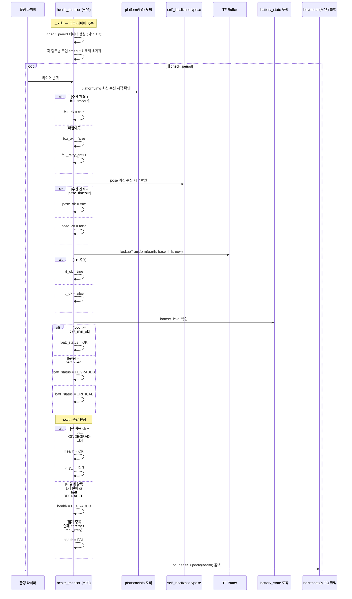
```mermaid
sequenceDiagram
  participant T as 폴링 타이머
  participant HM as health_monitor (M02)
  participant FCU as platform/info 토픽
  participant POSE as self_localization/pose
  participant TF as TF Buffer
  participant BATT as battery_state 토픽
  participant HB as heartbeat (M03) 콜백

  Note over HM: 초기화 — 구독·타이머 등록
  HM->>HM: check_period 타이머 생성 (예: 1 Hz)
  HM->>HM: 각 항목별 독립 timeout 카운터 초기화

  loop 매 check_period
    T->>HM: 타이머 발화

    HM->>FCU: platform/info 최신 수신 시각 확인
    alt 수신 간격 < fcu_timeout
      HM->>HM: fcu_ok = true
    else 타임아웃
      HM->>HM: fcu_ok = false
      HM->>HM: fcu_retry_cnt++
    end

    HM->>POSE: pose 최신 수신 시각 확인
    alt 수신 간격 < pose_timeout
      HM->>HM: pose_ok = true
    else
      HM->>HM: pose_ok = false
    end

    HM->>TF: lookupTransform(earth, base_link, now)
    alt TF 유효
      HM->>HM: tf_ok = true
    else
      HM->>HM: tf_ok = false
    end

    HM->>BATT: battery_level 확인
    alt level >= batt_min_ok
      HM->>HM: batt_status = OK
    else level >= batt_warn
      HM->>HM: batt_status = DEGRADED
    else
      HM->>HM: batt_status = CRITICAL
    end

    Note over HM: health 종합 판정
    alt 전 항목 ok + batt OK/DEGRADED
      HM->>HM: health = OK
      HM->>HM: retry_cnt 리셋
    else 비임계 항목 1개 실패 or batt DEGRADED
      HM->>HM: health = DEGRADED
    else 임계 항목 실패 or retry > max_retry
      HM->>HM: health = FAIL
    end

    HM-->>HB: on_health_update(health) 콜백
  end
```

**상태 전이**

```
CHECKING ──(모든 항목 확인 완료)──► OK
         ──(비임계 실패)───────────► DEGRADED
         ──(임계 실패 or retry초과)► FAIL
FAIL     ──(항목 복구)─────────────► DEGRADED → OK
```

---

## 계층 1 — M03 · heartbeat

> **트리거**: 노드 기동 → 10 Hz 발행 타이머 + 수신 콜백 상시 동작.

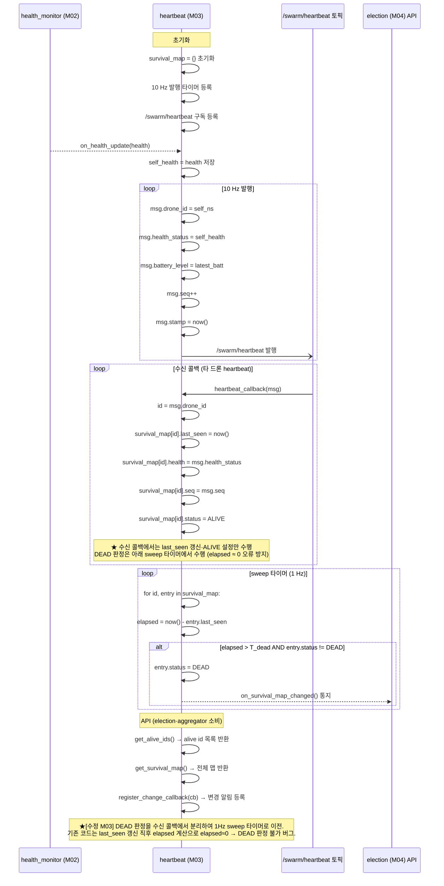
```mermaid
sequenceDiagram
  participant HM as health_monitor (M02)
  participant HB as heartbeat (M03)
  participant NET as /swarm/heartbeat 토픽
  participant EL as election (M04) API

  Note over HB: 초기화
  HB->>HB: survival_map = {} 초기화
  HB->>HB: 10 Hz 발행 타이머 등록
  HB->>HB: /swarm/heartbeat 구독 등록

  HM-->>HB: on_health_update(health)
  HB->>HB: self_health = health 저장

  loop 10 Hz 발행
    HB->>HB: msg.drone_id = self_ns
    HB->>HB: msg.health_status = self_health
    HB->>HB: msg.battery_level = latest_batt
    HB->>HB: msg.seq++
    HB->>HB: msg.stamp = now()
    HB-)NET: /swarm/heartbeat 발행
  end

  loop 수신 콜백 (타 드론 heartbeat)
    NET->>HB: heartbeat_callback(msg)
    HB->>HB: id = msg.drone_id
    HB->>HB: survival_map[id].last_seen = now()
    HB->>HB: survival_map[id].health = msg.health_status
    HB->>HB: survival_map[id].seq = msg.seq
    HB->>HB: survival_map[id].status = ALIVE
    Note over HB: ★ 수신 콜백에서는 last_seen 갱신·ALIVE 설정만 수행<br/>DEAD 판정은 아래 sweep 타이머에서 수행 (elapsed ≈ 0 오류 방지)
  end

  loop sweep 타이머 (1 Hz)
    HB->>HB: for id, entry in survival_map:
    HB->>HB:   elapsed = now() - entry.last_seen
    alt elapsed > T_dead AND entry.status != DEAD
      HB->>HB: entry.status = DEAD
      HB-->>EL: on_survival_map_changed() 통지
    end
  end

  Note over HB: API (election·aggregator 소비)
  HB->>HB: get_alive_ids() → alive id 목록 반환
  HB->>HB: get_survival_map() → 전체 맵 반환
  HB->>HB: register_change_callback(cb) → 변경 알림 등록

  Note over HB: ★[수정 M03] DEAD 판정을 수신 콜백에서 분리하여 1Hz sweep 타이머로 이전.<br/>기존 코드는 last_seen 갱신 직후 elapsed 계산으로 elapsed≈0 → DEAD 판정 불가 버그.
```

---

## 계층 1 — M04 · election

> **트리거**: 생존맵 변경 이벤트 → 즉시 재계산.

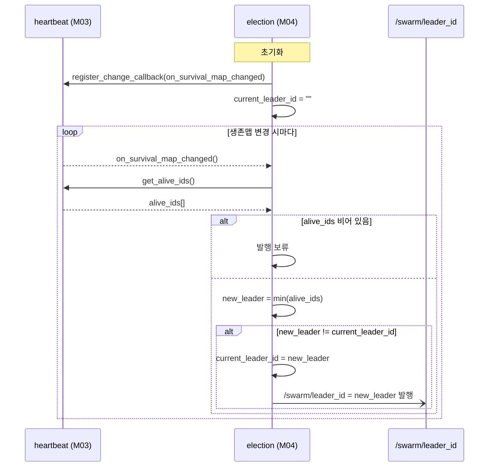
```mermaid
sequenceDiagram
  participant HB as heartbeat (M03)
  participant EL as election (M04)
  participant NET as /swarm/leader_id

  Note over EL: 초기화
  EL->>HB: register_change_callback(on_survival_map_changed)
  EL->>EL: current_leader_id = ""

  loop 생존맵 변경 시마다
    HB-->>EL: on_survival_map_changed()
    EL->>HB: get_alive_ids()
    HB-->>EL: alive_ids[]

    alt alive_ids 비어 있음
      EL->>EL: 발행 보류
    else
      EL->>EL: new_leader = min(alive_ids)
      alt new_leader != current_leader_id
        EL->>EL: current_leader_id = new_leader
        EL-)NET: /swarm/leader_id = new_leader 발행
      end
    end
  end
```

**승계 시나리오**

```
현 leader_id = "drone_0"
drone_0 heartbeat 소실 → T_dead 초과 → survival_map["drone_0"].status = DEAD
on_survival_map_changed() → alive_ids = ["drone_1", "drone_2"]
new_leader = min(["drone_1","drone_2"]) = "drone_1"
/swarm/leader_id = "drone_1" 발행
→ drone_1의 IsLeader BT 조건 true → SwarmCoord 활성

★[수정 M04] 승계 시 registry 복원 절차:
  drone_1.M05는 STANDBY 중 /swarm/registry를 구독·캐싱하고 있음
  → ACTIVE 전환 시 cached_registry를 초기값으로 사용 (공백 registry 방지)
  drone_0이 마지막으로 발행한 /swarm/registry 내용이 drone_1에 복원됨
  → M08 aggregator·M09 allocator의 drone_list가 즉시 유효 상태
```

---

## 계층 1 — M05 · registry

> **트리거**: IsLeader 확인 후 ACTIVE → SwarmJoin.srv 요청 처리.

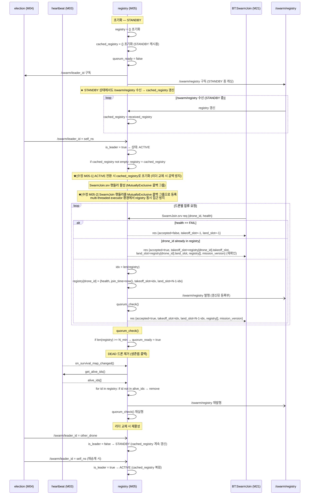
```mermaid
sequenceDiagram
  participant EL as election (M04)
  participant HB as heartbeat (M03)
  participant REG as registry (M05)
  participant BT as BT:SwarmJoin (M21)
  participant NET as /swarm/registry

  Note over REG: 초기화 — STANDBY
  REG->>REG: registry = {} 초기화
  REG->>REG: cached_registry = {} 초기화 (STANDBY 캐시용)
  REG->>REG: quorum_ready = false
  REG->>EL: /swarm/leader_id 구독
  REG->>NET: /swarm/registry 구독 (STANDBY 중 캐싱)
  Note over REG: ★ STANDBY 상태에서도 /swarm/registry 수신 → cached_registry 갱신

  loop /swarm/registry 수신 (STANDBY 중)
    NET->>REG: registry 갱신
    REG->>REG: cached_registry = received_registry
  end

  EL-)REG: /swarm/leader_id = self_ns
  REG->>REG: is_leader = true → 상태: ACTIVE
  REG->>REG: if cached_registry not empty: registry = cached_registry
  Note over REG: ★[수정 M05-1] ACTIVE 전환 시 cached_registry로 초기화 (리더 교체 시 공백 방지)

  Note over REG: SwarmJoin.srv 핸들러 활성 (MutuallyExclusive 콜백 그룹)
  Note over REG: ★[수정 M05-2] SwarmJoin 핸들러를 MutuallyExclusive 콜백 그룹으로 등록<br/>multi-threaded executor 환경에서 registry 동시 접근 방지

  loop 드론별 합류 요청
    BT->>REG: SwarmJoin.srv req {drone_id, health}

    alt health == FAIL
      REG-->>BT: res {accepted=false, takeoff_slot=-1, land_slot=-1}
    else drone_id already in registry
      REG-->>BT: res {accepted=true, takeoff_slot=registry[drone_id].takeoff_slot,<br/>land_slot=registry[drone_id].land_slot, registry[], mission_version} (재확인)
    else
      REG->>REG: idx = len(registry)
      REG->>REG: registry[drone_id] = {health, join_time=now(), takeoff_slot=idx, land_slot=N-1-idx}
      REG-)NET: /swarm/registry 발행 (갱신된 등록부)
      REG->>REG: quorum_check()
      REG-->>BT: res {accepted=true, takeoff_slot=idx, land_slot=N-1-idx, registry[], mission_version}
    end
  end

  Note over REG: quorum_check()
  REG->>REG: if len(registry) >= N_min → quorum_ready = true

  Note over REG: DEAD 드론 제거 (생존맵 콜백)
  HB-->>REG: on_survival_map_changed()
  REG->>HB: get_alive_ids()
  HB-->>REG: alive_ids[]
  REG->>REG: for id in registry: if id not in alive_ids → remove
  REG-)NET: /swarm/registry 재발행
  REG->>REG: quorum_check() 재실행

  Note over REG: 리더 교체 시 재활성
  EL-)REG: /swarm/leader_id = other_drone
  REG->>REG: is_leader = false → STANDBY (cached_registry 계속 갱신)
  EL-)REG: /swarm/leader_id = self_ns (재승계 시)
  REG->>REG: is_leader = true → ACTIVE (cached_registry 복원)
```

---

## 계층 2 — M06 · zone_partitioner

> **유형**: C++ 공유 라이브러리 (동기 호출, ROS 런타임 없음).

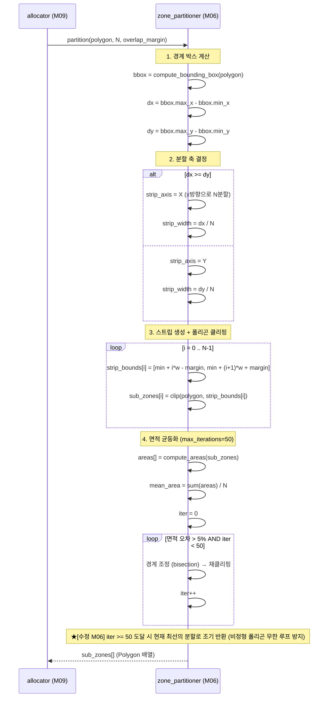
```mermaid
sequenceDiagram
  participant ALLOC as allocator (M09)
  participant ZP as zone_partitioner (M06)

  ALLOC->>ZP: partition(polygon, N, overlap_margin)

  Note over ZP: 1. 경계 박스 계산
  ZP->>ZP: bbox = compute_bounding_box(polygon)
  ZP->>ZP: dx = bbox.max_x - bbox.min_x
  ZP->>ZP: dy = bbox.max_y - bbox.min_y

  Note over ZP: 2. 분할 축 결정
  alt dx >= dy
    ZP->>ZP: strip_axis = X (x방향으로 N분할)
    ZP->>ZP: strip_width = dx / N
  else
    ZP->>ZP: strip_axis = Y
    ZP->>ZP: strip_width = dy / N
  end

  Note over ZP: 3. 스트립 생성 + 폴리곤 클리핑
  loop i = 0 .. N-1
    ZP->>ZP: strip_bounds[i] = [min + i*w - margin, min + (i+1)*w + margin]
    ZP->>ZP: sub_zones[i] = clip(polygon, strip_bounds[i])
  end

  Note over ZP: 4. 면적 균등화 (max_iterations=50)
  ZP->>ZP: areas[] = compute_areas(sub_zones)
  ZP->>ZP: mean_area = sum(areas) / N
  ZP->>ZP: iter = 0
  loop 면적 오차 > 5% AND iter < 50
    ZP->>ZP: 경계 조정 (bisection) → 재클리핑
    ZP->>ZP: iter++
  end
  Note over ZP: ★[수정 M06] iter >= 50 도달 시 현재 최선의 분할로 조기 반환 (비정형 폴리곤 무한 루프 방지)

  ZP-->>ALLOC: sub_zones[] (Polygon 배열)
```

**알고리즘 의사코드**

```python
def partition(polygon, N, overlap=0.05):
    bbox = bounding_box(polygon)
    axis = 'x' if bbox.width >= bbox.height else 'y'
    strip_w = bbox.extent(axis) / N
    sub_zones = []
    for i in range(N):
        lo = bbox.min(axis) + i * strip_w - overlap * strip_w
        hi = bbox.min(axis) + (i+1) * strip_w + overlap * strip_w
        clip_rect = make_rect(axis, lo, hi, bbox)
        sub_zones.append(clip_polygon(polygon, clip_rect))
    return equalize_areas(sub_zones, tolerance=0.05)
```

---

## 계층 2 — M07 · centroid_driver

> **트리거**: BT `DriveCentroid` 액션 goal 수신 → 50 Hz TF broadcast 루프 시작.

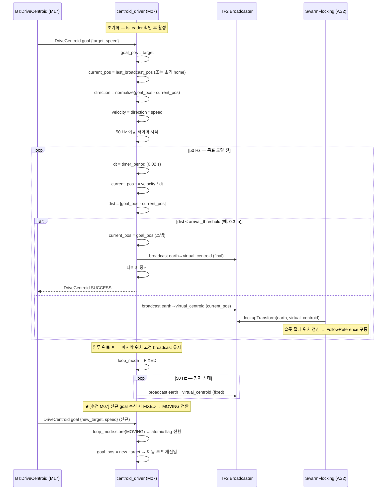
```mermaid
sequenceDiagram
  participant BT as BT:DriveCentroid (M17)
  participant CEN as centroid_driver (M07)
  participant TF as TF2 Broadcaster
  participant FLOCK as SwarmFlocking (AS2)

  Note over CEN: 초기화 — IsLeader 확인 후 활성

  BT->>CEN: DriveCentroid goal {target, speed}
  CEN->>CEN: goal_pos = target
  CEN->>CEN: current_pos = last_broadcast_pos (또는 초기 home)
  CEN->>CEN: direction = normalize(goal_pos - current_pos)
  CEN->>CEN: velocity = direction * speed
  CEN->>CEN: 50 Hz 이동 타이머 시작

  loop 50 Hz — 목표 도달 전
    CEN->>CEN: dt = timer_period (0.02 s)
    CEN->>CEN: current_pos += velocity * dt

    CEN->>CEN: dist = |goal_pos - current_pos|
    alt dist < arrival_threshold (예: 0.3 m)
      CEN->>CEN: current_pos = goal_pos (스냅)
      CEN->>TF: broadcast earth→virtual_centroid (final)
      CEN->>CEN: 타이머 중지
      CEN-->>BT: DriveCentroid SUCCESS
    else
      CEN->>TF: broadcast earth→virtual_centroid (current_pos)
      FLOCK->>TF: lookupTransform(earth, virtual_centroid)
      Note over FLOCK: 슬롯 절대 위치 갱신 → FollowReference 구동
    end
  end

  Note over CEN: 임무 완료 후 — 마지막 위치 고정 broadcast 유지
  CEN->>CEN: loop_mode = FIXED
  loop 50 Hz — 정지 상태
    CEN->>TF: broadcast earth→virtual_centroid (fixed)
  end

  Note over CEN: ★[수정 M07] 신규 goal 수신 시 FIXED → MOVING 전환
  BT->>CEN: DriveCentroid goal {new_target, speed} (신규)
  CEN->>CEN: loop_mode.store(MOVING)  ← atomic flag 전환
  CEN->>CEN: goal_pos = new_target → 이동 루프 재진입
```

---

## 계층 2 — M08 · aggregator

> **트리거**: IsLeader 확인 후 활성 → 구독 데이터를 집계해 barrier 판정·발행.

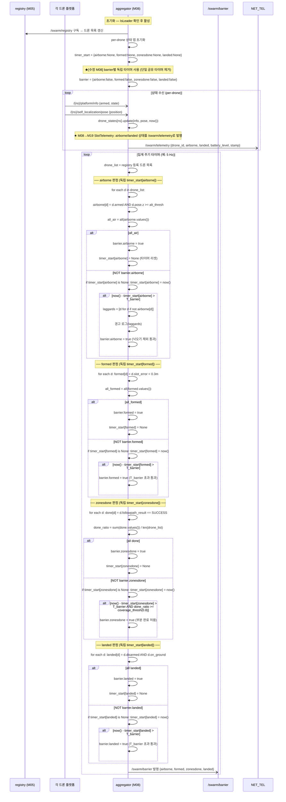
```mermaid
sequenceDiagram
  participant REG as registry (M05)
  participant DRONE as 각 드론 플랫폼
  participant AGG as aggregator (M08)
  participant NET as /swarm/barrier

  Note over AGG: 초기화 — IsLeader 확인 후 활성
  AGG->>REG: /swarm/registry 구독 → 드론 목록 갱신
  AGG->>AGG: per-drone 상태 맵 초기화
  AGG->>AGG: timer_start = {airborne:None, formed:None, zonesdone:None, landed:None}
  Note over AGG: ★[수정 M08] barrier별 독립 타이머 사용 (단일 공유 타이머 제거)
  AGG->>AGG: barrier = {airborne:false, formed:false, zonesdone:false, landed:false}

  loop 상태 수신 (per-drone)
    DRONE-)AGG: /{ns}/platform/info (armed, state)
    DRONE-)AGG: /{ns}/self_localization/pose (position)
    AGG->>AGG: drone_states[ns].update(info, pose, now())
    Note over AGG: ★ M08→M19 SlotTelemetry: airborne/landed 상태를 /swarm/telemetry로 발행
    AGG-)NET_TEL: /swarm/telemetry {drone_id, airborne, landed, battery_level, stamp}
  end

  loop 집계 주기 타이머 (예: 5 Hz)
    AGG->>AGG: drone_list = registry 등록 드론 목록

    Note over AGG: ── airborne 판정 (독립 timer_start[airborne]) ──
    AGG->>AGG: for each d in drone_list:
    AGG->>AGG:   airborne[d] = d.armed AND d.pose.z >= alt_thresh
    AGG->>AGG: all_air = all(airborne.values())
    alt all_air
      AGG->>AGG: barrier.airborne = true
      AGG->>AGG: timer_start[airborne] = None  (타이머 리셋)
    else NOT barrier.airborne
      AGG->>AGG: if timer_start[airborne] is None: timer_start[airborne] = now()
      alt now() - timer_start[airborne] > T_barrier
        AGG->>AGG: laggards = [d for d if not airborne[d]]
        AGG->>AGG: 경고 로그(laggards)
        AGG->>AGG: barrier.airborne = true (낙오기 제외 통과)
      end
    end

    Note over AGG: ── formed 판정 (독립 timer_start[formed]) ──
    AGG->>AGG: for each d: formed[d] = d.slot_error < 0.3m
    AGG->>AGG: all_formed = all(formed.values())
    alt all_formed
      AGG->>AGG: barrier.formed = true
      AGG->>AGG: timer_start[formed] = None
    else NOT barrier.formed
      AGG->>AGG: if timer_start[formed] is None: timer_start[formed] = now()
      alt now() - timer_start[formed] > T_barrier
        AGG->>AGG: barrier.formed = true (T_barrier 초과 통과)
      end
    end

    Note over AGG: ── zonesdone 판정 (독립 timer_start[zonesdone]) ──
    AGG->>AGG: for each d: done[d] = d.followpath_result == SUCCESS
    AGG->>AGG: done_ratio = sum(done.values()) / len(drone_list)
    alt all done
      AGG->>AGG: barrier.zonesdone = true
      AGG->>AGG: timer_start[zonesdone] = None
    else NOT barrier.zonesdone
      AGG->>AGG: if timer_start[zonesdone] is None: timer_start[zonesdone] = now()
      alt now() - timer_start[zonesdone] > T_barrier AND done_ratio >= coverage_thresh(0.8)
        AGG->>AGG: barrier.zonesdone = true (부분 완료 허용)
      end
    end

    Note over AGG: ── landed 판정 (독립 timer_start[landed]) ──
    AGG->>AGG: for each d: landed[d] = d.disarmed AND d.on_ground
    alt all landed
      AGG->>AGG: barrier.landed = true
      AGG->>AGG: timer_start[landed] = None
    else NOT barrier.landed
      AGG->>AGG: if timer_start[landed] is None: timer_start[landed] = now()
      alt now() - timer_start[landed] > T_barrier
        AGG->>AGG: barrier.landed = true (T_barrier 초과 통과)
      end
    end

    AGG-)NET: /swarm/barrier 발행 {airborne, formed, zonesdone, landed}
  end
```

---

## 계층 2 — M09 · allocator

> **트리거**: `/swarm/mission_intent` 수신 → 초기 할당. `/swarm/targets` 변화 → 재할당.

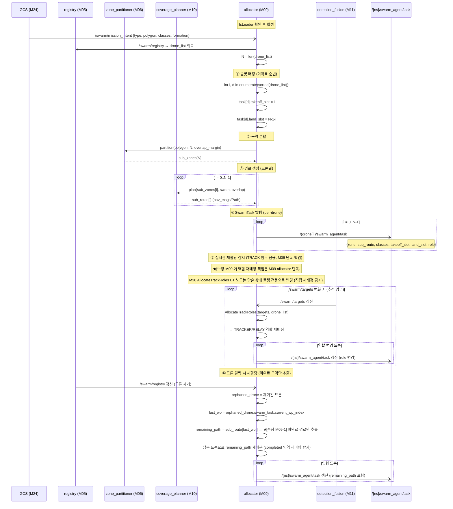
```mermaid
sequenceDiagram
  participant GCS as GCS (M24)
  participant REG as registry (M05)
  participant ZP as zone_partitioner (M06)
  participant CP as coverage_planner (M10)
  participant ALLOC as allocator (M09)
  participant DFUSE as detection_fusion (M11)
  participant DRONE as /{ns}/swarm_agent/task

  Note over ALLOC: IsLeader 확인 후 활성

  GCS-)ALLOC: /swarm/mission_intent {type, polygon, classes, formation}
  ALLOC->>REG: /swarm/registry → drone_list 취득
  ALLOC->>ALLOC: N = len(drone_list)

  Note over ALLOC: ① 슬롯 배정 (이착륙 순번)
  ALLOC->>ALLOC: for i, d in enumerate(sorted(drone_list)):
  ALLOC->>ALLOC:   task[d].takeoff_slot = i
  ALLOC->>ALLOC:   task[d].land_slot = N-1-i

  Note over ALLOC: ② 구역 분할
  ALLOC->>ZP: partition(polygon, N, overlap_margin)
  ZP-->>ALLOC: sub_zones[N]

  Note over ALLOC: ③ 경로 생성 (드론별)
  loop i = 0..N-1
    ALLOC->>CP: plan(sub_zones[i], swath, overlap)
    CP-->>ALLOC: sub_route[i] (nav_msgs/Path)
  end

  Note over ALLOC: ④ SwarmTask 발행 (per-drone)
  loop i = 0..N-1
    ALLOC-)DRONE: /{drone[i]}/swarm_agent/task
    Note over DRONE: {zone, sub_route, classes, takeoff_slot, land_slot, role}
  end

  Note over ALLOC: ⑤ 실시간 재할당 감시 (TRACK 임무 전용, M09 단독 책임)
  Note over ALLOC: ★[수정 M09-2] 역할 재배정 책임은 M09 allocator 단독.
  Note over ALLOC: M20 AllocateTrackRoles BT 노드는 단순 상태 폴링 전용으로 변경 (직접 재배정 금지).
  loop /swarm/targets 변화 시 (추적 임무)
    DFUSE-)ALLOC: /swarm/targets 갱신
    ALLOC->>ALLOC: AllocateTrackRoles(targets, drone_list)
    ALLOC->>ALLOC: → TRACKER/RELAY 역할 재배정
    loop 역할 변경 드론
      ALLOC-)DRONE: /{ns}/swarm_agent/task 갱신 (role 변경)
    end
  end

  Note over ALLOC: ⑥ 드론 탈락 시 재할당 (미완료 구역만 추출)
  REG-)ALLOC: /swarm/registry 갱신 (드론 제거)
  ALLOC->>ALLOC: orphaned_drone = 제거된 드론
  ALLOC->>ALLOC: last_wp = orphaned_drone.swarm_task.current_wp_index
  ALLOC->>ALLOC: remaining_path = sub_route[last_wp:]  ← ★[수정 M09-1] 미완료 경로만 추출
  ALLOC->>ALLOC: 남은 드론으로 remaining_path 재배분 (completed 영역 재비행 방지)
  loop 영향 드론
    ALLOC-)DRONE: /{ns}/swarm_agent/task 갱신 (remaining_path 포함)
  end
```

---

## 계층 3 — M10 · boustrophedon coverage planner

> **유형**: `as2_behaviors_path_planning` 플러그인 (동기 호출).

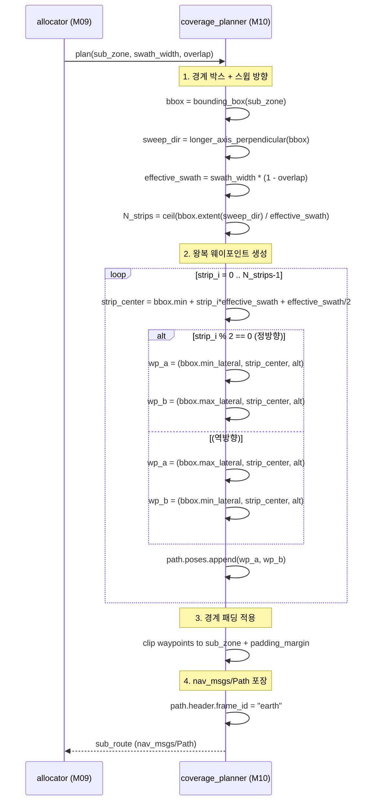
```mermaid
sequenceDiagram
  participant ALLOC as allocator (M09)
  participant CP as coverage_planner (M10)

  ALLOC->>CP: plan(sub_zone, swath_width, overlap)

  Note over CP: 1. 경계 박스 + 스윕 방향
  CP->>CP: bbox = bounding_box(sub_zone)
  CP->>CP: sweep_dir = longer_axis_perpendicular(bbox)
  CP->>CP: effective_swath = swath_width * (1 - overlap)
  CP->>CP: N_strips = ceil(bbox.extent(sweep_dir) / effective_swath)

  Note over CP: 2. 왕복 웨이포인트 생성
  loop strip_i = 0 .. N_strips-1
    CP->>CP: strip_center = bbox.min + strip_i*effective_swath + effective_swath/2
    alt strip_i % 2 == 0 (정방향)
      CP->>CP: wp_a = (bbox.min_lateral, strip_center, alt)
      CP->>CP: wp_b = (bbox.max_lateral, strip_center, alt)
    else (역방향)
      CP->>CP: wp_a = (bbox.max_lateral, strip_center, alt)
      CP->>CP: wp_b = (bbox.min_lateral, strip_center, alt)
    end
    CP->>CP: path.poses.append(wp_a, wp_b)
  end

  Note over CP: 3. 경계 패딩 적용
  CP->>CP: clip waypoints to sub_zone + padding_margin

  Note over CP: 4. nav_msgs/Path 포장
  CP->>CP: path.header.frame_id = "earth"
  CP-->>ALLOC: sub_route (nav_msgs/Path)
```

**스트립 레이아웃 예시 (N_strips=3)**

```
  ┌──────────────────────┐
  │ ─────────────────→   │  strip 0 (정방향)
  │   ←─────────────     │  strip 1 (역방향)
  │ ─────────────────→   │  strip 2 (정방향)
  └──────────────────────┘
        boustrophedon
```

---

## 계층 4 — M11 · detection_fusion

> **트리거**: `/{ns}/perception/detections` 수신 (전 드론 구독) → dedup·병합·발행.

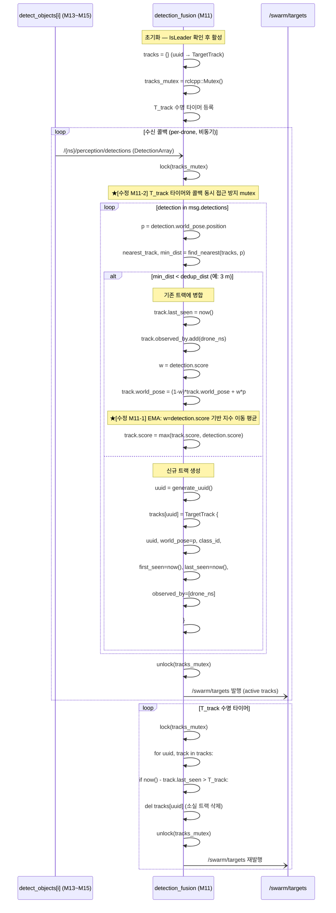
```mermaid
sequenceDiagram
  participant DETECT_i as detect_objects[i] (M13~M15)
  participant DFUSE as detection_fusion (M11)
  participant NET as /swarm/targets

  Note over DFUSE: 초기화 — IsLeader 확인 후 활성
  DFUSE->>DFUSE: tracks = {} (uuid → TargetTrack)
  DFUSE->>DFUSE: tracks_mutex = rclcpp::Mutex()
  DFUSE->>DFUSE: T_track 수명 타이머 등록

  loop 수신 콜백 (per-drone, 비동기)
    DETECT_i-)DFUSE: /{ns}/perception/detections (DetectionArray)
    DFUSE->>DFUSE: lock(tracks_mutex)
    Note over DFUSE: ★[수정 M11-2] T_track 타이머와 콜백 동시 접근 방지 mutex

    loop detection in msg.detections
      DFUSE->>DFUSE: p = detection.world_pose.position

      DFUSE->>DFUSE: nearest_track, min_dist = find_nearest(tracks, p)

      alt min_dist < dedup_dist (예: 3 m)
        Note over DFUSE: 기존 트랙에 병합
        DFUSE->>DFUSE: track.last_seen = now()
        DFUSE->>DFUSE: track.observed_by.add(drone_ns)
        DFUSE->>DFUSE: w = detection.score
        DFUSE->>DFUSE: track.world_pose = (1-w)*track.world_pose + w*p
        Note over DFUSE: ★[수정 M11-1] EMA: w=detection.score 기반 지수 이동 평균
        DFUSE->>DFUSE: track.score = max(track.score, detection.score)
      else
        Note over DFUSE: 신규 트랙 생성
        DFUSE->>DFUSE: uuid = generate_uuid()
        DFUSE->>DFUSE: tracks[uuid] = TargetTrack {
        DFUSE->>DFUSE:   uuid, world_pose=p, class_id,
        DFUSE->>DFUSE:   first_seen=now(), last_seen=now(),
        DFUSE->>DFUSE:   observed_by=[drone_ns]
        DFUSE->>DFUSE: }
      end
    end

    DFUSE->>DFUSE: unlock(tracks_mutex)
    DFUSE-)NET: /swarm/targets 발행 (active tracks)
  end

  loop T_track 수명 타이머
    DFUSE->>DFUSE: lock(tracks_mutex)
    DFUSE->>DFUSE: for uuid, track in tracks:
    DFUSE->>DFUSE:   if now() - track.last_seen > T_track:
    DFUSE->>DFUSE:     del tracks[uuid]  (소실 트랙 삭제)
    DFUSE->>DFUSE: unlock(tracks_mutex)
    DFUSE-)NET: /swarm/targets 재발행
  end
```

---

## 계층 4 — M12 · emitter_fusion

> **트리거**: `/{ns}/rf/bearings` 수신 (전 드론 구독) → 삼각측량 → EmitterTrack 발행.

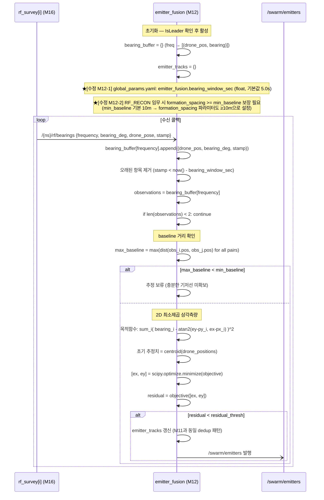
```mermaid
sequenceDiagram
  participant RF_i as rf_survey[i] (M16)
  participant RFUSE as emitter_fusion (M12)
  participant NET as /swarm/emitters

  Note over RFUSE: 초기화 — IsLeader 확인 후 활성
  RFUSE->>RFUSE: bearing_buffer = {} (freq → [(drone_pos, bearing)])
  RFUSE->>RFUSE: emitter_tracks = {}
  Note over RFUSE: ★[수정 M12-1] global_params.yaml: emitter_fusion.bearing_window_sec (float, 기본값 5.0s)
  Note over RFUSE: ★[수정 M12-2] RF_RECON 임무 시 formation_spacing >= min_baseline 보장 필요<br/>(min_baseline 기본 10m → formation_spacing 파라미터도 ≥10m으로 설정)

  loop 수신 콜백
    RF_i-)RFUSE: /{ns}/rf/bearings {frequency, bearing_deg, drone_pose, stamp}
    RFUSE->>RFUSE: bearing_buffer[frequency].append((drone_pos, bearing_deg, stamp))
    RFUSE->>RFUSE: 오래된 항목 제거 (stamp < now() - bearing_window_sec)

    RFUSE->>RFUSE: observations = bearing_buffer[frequency]
    RFUSE->>RFUSE: if len(observations) < 2: continue

    Note over RFUSE: baseline 거리 확인
    RFUSE->>RFUSE: max_baseline = max(dist(obs_i.pos, obs_j.pos) for all pairs)
    alt max_baseline < min_baseline
      RFUSE->>RFUSE: 추정 보류 (충분한 기저선 미확보)
    else
      Note over RFUSE: 2D 최소제곱 삼각측량
      RFUSE->>RFUSE: 목적함수: sum_i( bearing_i - atan2(ey-py_i, ex-px_i) )^2
      RFUSE->>RFUSE: 초기 추정치 = centroid(drone_positions)
      RFUSE->>RFUSE: [ex, ey] = scipy.optimize.minimize(objective)
      RFUSE->>RFUSE: residual = objective([ex, ey])

      alt residual < residual_thresh
        RFUSE->>RFUSE: emitter_tracks 갱신 (M11과 동일 dedup 패턴)
        RFUSE-)NET: /swarm/emitters 발행
      end
    end
  end
```

---

## 계층 5 — M13~M15 · detect_objects behavior

### M13 — Action 서버 골격 + 이미지 파이프라인

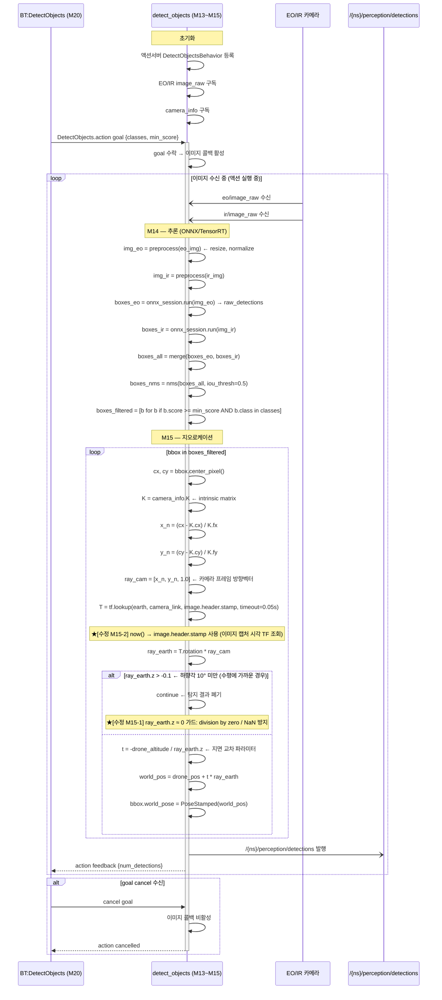
```mermaid
sequenceDiagram
  participant BT as BT:DetectObjects (M20)
  participant DET as detect_objects (M13~M15)
  participant CAM as EO/IR 카메라
  participant NET as /{ns}/perception/detections

  Note over DET: 초기화
  DET->>DET: 액션서버 DetectObjectsBehavior 등록
  DET->>DET: EO/IR image_raw 구독
  DET->>DET: camera_info 구독

  BT->>+DET: DetectObjects.action goal {classes, min_score}
  DET->>DET: goal 수락 → 이미지 콜백 활성

  loop 이미지 수신 중 (액션 실행 중)
    CAM-)DET: eo/image_raw 수신
    CAM-)DET: ir/image_raw 수신

    Note over DET: M14 — 추론 (ONNX/TensorRT)
    DET->>DET: img_eo = preprocess(eo_img)  ← resize, normalize
    DET->>DET: img_ir = preprocess(ir_img)
    DET->>DET: boxes_eo = onnx_session.run(img_eo) → raw_detections
    DET->>DET: boxes_ir = onnx_session.run(img_ir)
    DET->>DET: boxes_all = merge(boxes_eo, boxes_ir)
    DET->>DET: boxes_nms = nms(boxes_all, iou_thresh=0.5)
    DET->>DET: boxes_filtered = [b for b if b.score >= min_score AND b.class in classes]

    Note over DET: M15 — 지오로케이션
    loop bbox in boxes_filtered
      DET->>DET: cx, cy = bbox.center_pixel()
      DET->>DET: K = camera_info.K  ← intrinsic matrix
      DET->>DET: x_n = (cx - K.cx) / K.fx
      DET->>DET: y_n = (cy - K.cy) / K.fy
      DET->>DET: ray_cam = [x_n, y_n, 1.0]  ← 카메라 프레임 방향벡터
      DET->>DET: T = tf.lookup(earth, camera_link, image.header.stamp, timeout=0.05s)
      Note over DET: ★[수정 M15-2] now() → image.header.stamp 사용 (이미지 캡처 시각 TF 조회)
      DET->>DET: ray_earth = T.rotation * ray_cam

      alt ray_earth.z > -0.1  ← 하향각 10° 미만 (수평에 가까운 경우)
        DET->>DET: continue  ← 탐지 결과 폐기
        Note over DET: ★[수정 M15-1] ray_earth.z ≈ 0 가드: division by zero / NaN 방지
      else
        DET->>DET: t = -drone_altitude / ray_earth.z  ← 지면 교차 파라미터
        DET->>DET: world_pos = drone_pos + t * ray_earth
        DET->>DET: bbox.world_pose = PoseStamped(world_pos)
      end
    end

    DET-)NET: /{ns}/perception/detections 발행
    DET-->>BT: action feedback {num_detections}
  end

  alt goal cancel 수신
    BT->>DET: cancel goal
    DET->>DET: 이미지 콜백 비활성
    DET-->>-BT: action cancelled
  end
```

### M14 — ONNX/TensorRT 추론 상세

```
초기화 (노드 기동 시):
  1. model_path 파라미터 로드
  2. OnnxRuntime::SessionOptions 설정 (GPU ep)
  3. session = OnnxRuntime::Session(model_path)
  4. input_name, output_name 조회
  5. input_shape = session.GetInputShape() → [1, C, H, W]

추론 루프 (이미지당):
  1. cv::resize(img, model_H, model_W)
  2. normalize: pixel = (pixel - mean) / std
  3. HWC → CHW 변환
  4. input_tensor = OrtValue::CreateTensor(data)
  5. outputs = session.Run({input_name: input_tensor})
  6. boxes = decode_yolo(outputs[0])  ← x,y,w,h,obj_conf,class_probs
  7. boxes_conf = [b for b if b.obj * b.class_max >= min_score]
  8. boxes_nms = non_max_suppression(boxes_conf, iou=0.5)
  9. return Detection[] {bbox_px, class_id, score}
```

### M15 — 지오로케이션 제약 사항

```
전제 조건:
  - camera_info.K 유효 (calibration 완료)
  - TF: earth → {ns}/camera_link 유효
  - 지면이 드론 정사영 고도에 평면 근사 (DEM 미사용 시)

오차 요인:
  - 드론 자세 추정 오차 → TF 오차 → ray 방향 오차
  - 고도 10m 기준 1° 자세 오차 ≈ 0.17m 위치 오차
  - DoD 기준: ≤ 2m @ 고도 10m
```

---

## 계층 5 — M16 · rf_survey behavior

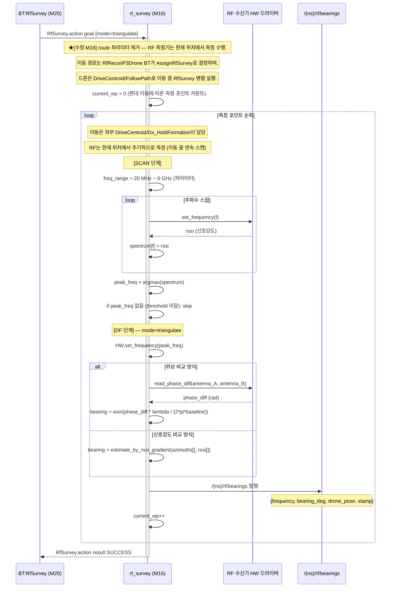
```mermaid
sequenceDiagram
  participant BT as BT:RfSurvey (M20)
  participant RF as rf_survey (M16)
  participant HW as RF 수신기 HW 드라이버
  participant NET as /{ns}/rf/bearings

  BT->>+RF: RfSurvey.action goal {mode=triangulate}
  Note over RF: ★[수정 M16] route 파라미터 제거 — RF 측정기는 현재 위치에서 측정 수행.
  Note over RF: 이동 경로는 RfReconP3Drone BT가 AssignRfSurvey로 결정하며,
  Note over RF: 드론은 DriveCentroid/FollowPath로 이동 중 RfSurvey 병렬 실행.
  RF->>RF: current_wp = 0 (편대 이동에 따른 측정 포인트 카운트)

  loop 측정 포인트 순회
    Note over RF: 이동은 외부 DriveCentroid/Dx_HoldFormation이 담당
    Note over RF: RF는 현재 위치에서 주기적으로 측정 (이동 중 연속 스캔)

    Note over RF: [SCAN 단계]
    RF->>RF: freq_range = 20 MHz ~ 6 GHz (파라미터)
    loop 주파수 스윕
      RF->>HW: set_frequency(f)
      HW-->>RF: rssi (신호강도)
      RF->>RF: spectrum[f] = rssi
    end
    RF->>RF: peak_freq = argmax(spectrum)
    RF->>RF: if peak_freq 없음 (threshold 미달): skip

    Note over RF: [DF 단계] — mode=triangulate
    RF->>RF: HW.set_frequency(peak_freq)
    alt 위상 비교 방식
      RF->>HW: read_phase_diff(antenna_A, antenna_B)
      HW-->>RF: phase_diff (rad)
      RF->>RF: bearing = asin(phase_diff * lambda / (2*pi*baseline))
    else 신호강도 비교 방식
      RF->>RF: bearing = estimate_by_rssi_gradient(azimuths[], rssi[])
    end

    RF->>NET: /{ns}/rf/bearings 발행
    Note over NET: {frequency, bearing_deg, drone_pose, stamp}

    RF->>RF: current_wp++
  end

  RF-->>-BT: RfSurvey.action result SUCCESS
```

---

## 계층 6 — M17~M21 · BT 플러그인 노드

> BT.CPP tick() 반환값: `SUCCESS` / `FAILURE` / `RUNNING`

### BT Condition 노드 공통 패턴

```
tick():
  값 읽기 (토픽/내부 상태)
  조건 평가
  → true  : return SUCCESS
  → false : return FAILURE  (또는 RUNNING — 폴링 조건의 경우)
```

### BT Action 노드 공통 패턴

```
tick():
  if 첫 tick:
    요청 전송 (srv/action goal)
    status = PENDING
    return RUNNING
  if status == PENDING:
    응답 확인
    → 수락됨: status = RUNNING
    → 거부됨: return FAILURE
  if status == RUNNING:
    진행 확인 (action feedback)
    → 완료: return SUCCESS
    → 실패: return FAILURE
    → 진행중: return RUNNING
```

---

### M21 · 부트스트랩 노드 7종

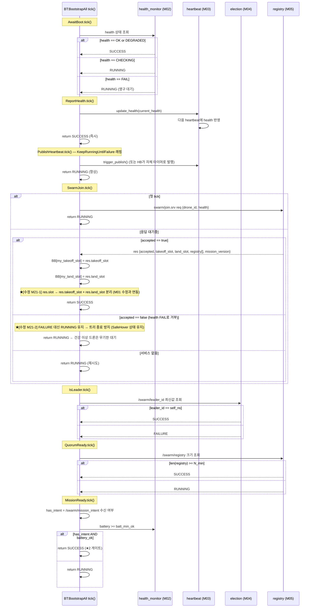
```mermaid
sequenceDiagram
  participant BT as BT:BootstrapAll tick()
  participant HM as health_monitor (M02)
  participant HB as heartbeat (M03)
  participant EL as election (M04)
  participant REG as registry (M05)

  Note over BT: AwaitBoot.tick()
  BT->>HM: health 상태 조회
  alt health == OK or DEGRADED
    HM-->>BT: SUCCESS
  else health == CHECKING
    HM-->>BT: RUNNING
  else health == FAIL
    HM-->>BT: RUNNING (영구 대기)
  end

  Note over BT: ReportHealth.tick()
  BT->>HB: update_health(current_health)
  HB->>HB: 다음 heartbeat에 health 반영
  BT->>BT: return SUCCESS (즉시)

  Note over BT: PublishHeartbeat.tick() — KeepRunningUntilFailure 래핑
  BT->>HB: trigger_publish() (또는 HB가 자체 타이머로 발행)
  BT->>BT: return RUNNING (항상)

  Note over BT: SwarmJoin.tick()
  alt 첫 tick
    BT->>REG: swarm/join.srv req {drone_id, health}
    BT->>BT: return RUNNING
  else 응답 대기중
    alt accepted == true
      REG-->>BT: res {accepted, takeoff_slot, land_slot, registry[], mission_version}
      BT->>BT: BB[my_takeoff_slot] = res.takeoff_slot
      BT->>BT: BB[my_land_slot] = res.land_slot
      Note over BT: ★[수정 M21-1] res.slot → res.takeoff_slot + res.land_slot 분리 (M01 수정과 연동)
      BT->>BT: return SUCCESS
    else accepted == false (health FAIL로 거부)
      Note over BT: ★[수정 M21-2] FAILURE 대신 RUNNING 유지 → 트리 종료 방지 (SafeHover 상태 유지)
      BT->>BT: return RUNNING  ← 건강 이상 드론은 무기한 대기
    else 서비스 없음
      BT->>BT: return RUNNING (재시도)
    end
  end

  Note over BT: IsLeader.tick()
  BT->>EL: /swarm/leader_id 최신값 조회
  alt leader_id == self_ns
    EL-->>BT: SUCCESS
  else
    EL-->>BT: FAILURE
  end

  Note over BT: QuorumReady.tick()
  BT->>REG: /swarm/registry 크기 조회
  alt len(registry) >= N_min
    REG-->>BT: SUCCESS
  else
    REG-->>BT: RUNNING
  end

  Note over BT: MissionReady.tick()
  BT->>BT: has_intent = /swarm/mission_intent 수신 여부
  BT->>HM: battery >= batt_min_ok
  alt has_intent AND battery_ok
    BT->>BT: return SUCCESS (★2 게이트)
  else
    BT->>BT: return RUNNING
  end
```

---

### M18 · barrier 노드 4종

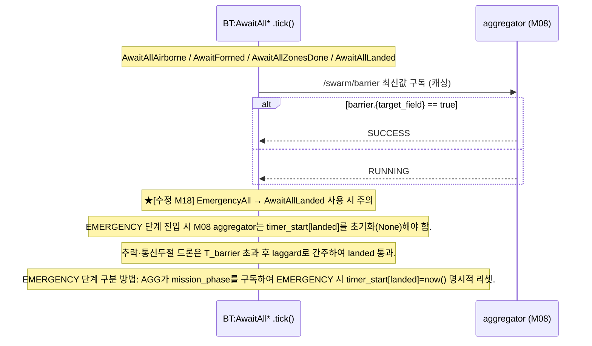
```mermaid
sequenceDiagram
  participant BT as BT:AwaitAll* .tick()
  participant AGG as aggregator (M08)

  Note over BT: AwaitAllAirborne / AwaitFormed / AwaitAllZonesDone / AwaitAllLanded

  BT->>AGG: /swarm/barrier 최신값 구독 (캐싱)
  alt barrier.{target_field} == true
    AGG-->>BT: SUCCESS
  else
    AGG-->>BT: RUNNING
  end

  Note over BT: ★[수정 M18] EmergencyAll → AwaitAllLanded 사용 시 주의
  Note over BT: EMERGENCY 단계 진입 시 M08 aggregator는 timer_start[landed]를 초기화(None)해야 함.
  Note over BT: 추락·통신두절 드론은 T_barrier 초과 후 laggard로 간주하여 landed 통과.
  Note over BT: EMERGENCY 단계 구분 방법: AGG가 mission_phase를 구독하여 EMERGENCY 시 timer_start[landed]=now() 명시적 리셋.
```

---

### M19 · 게이트/슬롯 노드

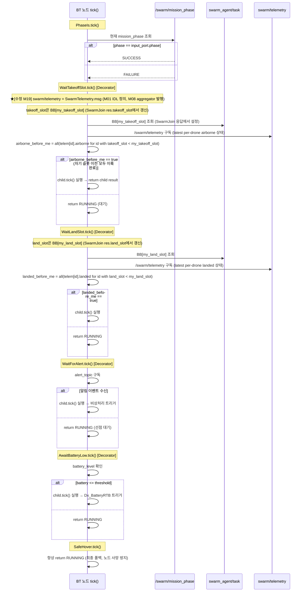
```mermaid
sequenceDiagram
  participant BT as BT 노드 tick()
  participant PHASE as /swarm/mission_phase
  participant TASK as swarm_agent/task
  participant TELEM as swarm/telemetry

  Note over BT: PhaseIs.tick()
  BT->>PHASE: 현재 mission_phase 조회
  alt phase == input_port.phase
    PHASE-->>BT: SUCCESS
  else
    PHASE-->>BT: FAILURE
  end

  Note over BT: WaitTakeoffSlot.tick() [Decorator]
  Note over BT: ★[수정 M19] swarm/telemetry = SwarmTelemetry.msg (M01 IDL 정의, M08 aggregator 발행)
  Note over BT: takeoff_slot은 BB[my_takeoff_slot] (SwarmJoin res.takeoff_slot에서 갱신)
  BT->>TASK: BB[my_takeoff_slot] 조회 (SwarmJoin 응답에서 설정)
  BT->>TELEM: /swarm/telemetry 구독 (latest per-drone airborne 상태)
  BT->>BT: airborne_before_me = all(telem[id].airborne for id with takeoff_slot < my_takeoff_slot)
  alt airborne_before_me == true (자기 슬롯 이전 모두 이륙 완료)
    BT->>BT: child.tick() 실행 → return child result
  else
    BT->>BT: return RUNNING (대기)
  end

  Note over BT: WaitLandSlot.tick() [Decorator]
  Note over BT: land_slot은 BB[my_land_slot] (SwarmJoin res.land_slot에서 갱신)
  BT->>TASK: BB[my_land_slot] 조회
  BT->>TELEM: /swarm/telemetry 구독 (latest per-drone landed 상태)
  BT->>BT: landed_before_me = all(telem[id].landed for id with land_slot < my_land_slot)
  alt landed_before_me == true
    BT->>BT: child.tick() 실행
  else
    BT->>BT: return RUNNING
  end

  Note over BT: WaitForAlert.tick() [Decorator]
  BT->>BT: alert_topic 구독
  alt 알림 이벤트 수신
    BT->>BT: child.tick() 실행 → 비상처리 트리거
  else
    BT->>BT: return RUNNING (선점 대기)
  end

  Note over BT: AwaitBatteryLow.tick() [Decorator]
  BT->>BT: battery_level 확인
  alt battery <= threshold
    BT->>BT: child.tick() 실행 → Dx_BatteryRTB 트리거
  else
    BT->>BT: return RUNNING
  end

  Note over BT: SafeHover.tick()
  BT->>BT: 항상 return RUNNING (최종 폴백, 노드 사망 방지)
```

---

### M17 · 조율 노드 7종

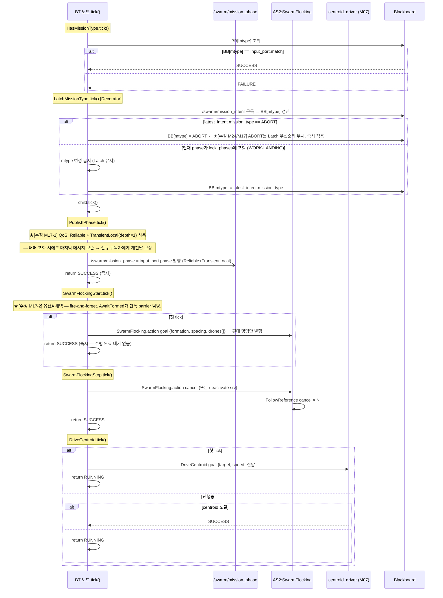
```mermaid
sequenceDiagram
  participant BT as BT 노드 tick()
  participant PHASE as /swarm/mission_phase
  participant FLOCK as AS2:SwarmFlocking
  participant CEN as centroid_driver (M07)
  participant BB as Blackboard

  Note over BT: HasMissionType.tick()
  BT->>BB: BB[mtype] 조회
  alt BB[mtype] == input_port.match
    BB-->>BT: SUCCESS
  else
    BB-->>BT: FAILURE
  end

  Note over BT: LatchMissionType.tick() [Decorator]
  BT->>BB: /swarm/mission_intent 구독 → BB[mtype] 갱신
  alt latest_intent.mission_type == ABORT
    BT->>BB: BB[mtype] = ABORT  ← ★[수정 M24/M17] ABORT는 Latch 우선순위 무시, 즉시 적용
  else 현재 phase가 lock_phases에 포함 (WORK·LANDING)
    BT->>BT: mtype 변경 금지 (Latch 유지)
  else
    BT->>BB: BB[mtype] = latest_intent.mission_type
  end
  BT->>BT: child.tick()

  Note over BT: PublishPhase.tick()
  Note over BT: ★[수정 M17-1] QoS: Reliable + TransientLocal(depth=1) 사용
  Note over BT: — 버퍼 포화 시에도 마지막 메시지 보존 → 신규 구독자에게 재전달 보장
  BT-)PHASE: /swarm/mission_phase = input_port.phase 발행 (Reliable+TransientLocal)
  BT->>BT: return SUCCESS (즉시)

  Note over BT: SwarmFlockingStart.tick()
  Note over BT: ★[수정 M17-2] 옵션A 채택 — fire-and-forget. AwaitFormed가 단독 barrier 담당.
  alt 첫 tick
    BT->>FLOCK: SwarmFlocking.action goal {formation, spacing, drones[]}  ← 편대 명령만 발행
    BT->>BT: return SUCCESS (즉시 — 수렴 완료 대기 없음)
  end

  Note over BT: SwarmFlockingStop.tick()
  BT->>FLOCK: SwarmFlocking.action cancel (또는 deactivate srv)
  FLOCK->>FLOCK: FollowReference cancel × N
  BT->>BT: return SUCCESS

  Note over BT: DriveCentroid.tick()
  alt 첫 tick
    BT->>CEN: DriveCentroid goal {target, speed} 전달
    BT->>BT: return RUNNING
  else 진행중
    alt centroid 도달
      CEN-->>BT: SUCCESS
    else
      BT->>BT: return RUNNING
    end
  end
```

---

### M20 · P3 임무 노드 12종

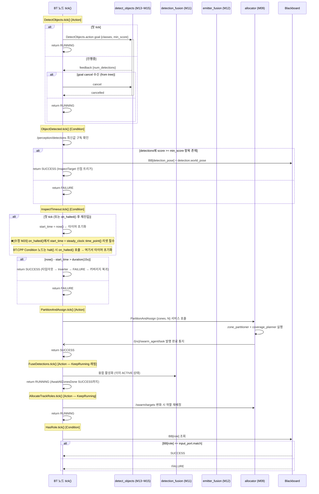
```mermaid
sequenceDiagram
  participant BT as BT 노드 tick()
  participant DETECT as detect_objects (M13~M15)
  participant DFUSE as detection_fusion (M11)
  participant RFUSE as emitter_fusion (M12)
  participant ALLOC as allocator (M09)
  participant BB as Blackboard

  Note over BT: DetectObjects.tick() [Action]
  alt 첫 tick
    BT->>+DETECT: DetectObjects.action goal {classes, min_score}
    BT->>BT: return RUNNING
  else 진행중
    DETECT-->>BT: feedback {num_detections}
    alt goal cancel 수신 (from tree)
      BT->>DETECT: cancel
      DETECT-->>-BT: cancelled
    else
      BT->>BT: return RUNNING
    end
  end

  Note over BT: ObjectDetected.tick() [Condition]
  BT->>BT: /perception/detections 최신값 구독 확인
  alt detections에 score >= min_score 항목 존재
    BT->>BB: BB[detection_pose] = detection.world_pose
    BT->>BT: return SUCCESS (InspectTarget 선점 트리거)
  else
    BT->>BT: return FAILURE
  end

  Note over BT: InspectTimeout.tick() [Condition]
  alt 첫 tick (또는 on_halted() 후 재진입)
    BT->>BT: start_time = now()  ← 타이머 초기화
    Note over BT: ★[수정 M20] on_halted()에서 start_time = steady_clock::time_point{} 리셋 필수
    Note over BT: BT.CPP Condition 노드는 halt() 시 on_halted() 호출 → 여기서 타이머 초기화
  end
  alt now() - start_time > duration(15s)
    BT->>BT: return SUCCESS (타임아웃 → Inverter → FAILURE → 커버리지 복귀)
  else
    BT->>BT: return FAILURE
  end

  Note over BT: PartitionAndAssign.tick() [Action]
  BT->>ALLOC: PartitionAndAssign {zones, N} 서비스 호출
  ALLOC->>ALLOC: zone_partitioner + coverage_planner 실행
  ALLOC-)BT: /{ns}/swarm_agent/task 발행 완료 통지
  BT->>BT: return SUCCESS

  Note over BT: FuseDetections.tick() [Action — KeepRunning 래핑]
  BT->>DFUSE: 융합 활성화 (이미 ACTIVE 상태)
  BT->>BT: return RUNNING (AwaitAllZonesDone SUCCESS까지)

  Note over BT: AllocateTrackRoles.tick() [Action — KeepRunning]
  BT->>ALLOC: /swarm/targets 변화 시 역할 재배정
  BT->>BT: return RUNNING

  Note over BT: HasRole.tick() [Condition]
  BT->>BB: BB[role] 조회
  alt BB[role] == input_port.match
    BB-->>BT: SUCCESS
  else
    BB-->>BT: FAILURE
  end
```

---

## 계층 7 — M22 · chassis XML 서브트리

> **유형**: BT.CPP XML 서브트리 (per-drone). 임무 무관 공통 골격.

```
Dx_ArmTakeoff 실행 흐름:
  IsFlying?
    YES → SUCCESS (이미 비행중)
    NO  → WaitTakeoffSlot (slot 순번 대기)
            → Arm.action
            → Offboard.action
            → Takeoff.action (height=20, speed=2)
            → 실패 시 RetryUntilSuccessful(num_attempts=10)  ★[수정 M22-2] 유한 재시도
            → 10회 실패 시 FAILURE → SafeHover (FCU 고장 격리)

Dx_HoldFormation 실행 흐름:
  FollowReference.action (항상 RUNNING — 편대 추종)

Dx_LandSlot 실행 흐름:
  WaitLandSlot (slot 순번 대기)
    → Land.action (speed=0.5)

Dx_Emergency 실행 흐름:
  ★[수정 M22-1] BB[home] 기본값 = global_params.yaml의 home_pose (launch 시 BT executor가 주입)
  GoTo(home) → Land
  실패 시 → SafeHover (격리)

Dx_BatteryRTB 실행 흐름:
  GoTo(home, max_speed=4.0) → Land  ← BB[home] 기본값 동일 보장
  실패 시 → SafeHover
```

---

## 계층 7 — M23 · 임무 루트 XML

> **유형**: BT.CPP 루트 트리. SwarmRoot → IsLeader 자기선택 → SwarmCoord/SwarmDrone.

```
SwarmRoot tick 흐름:
  Parallel(success=1, failure=1):
    [채널A] KeepRunning: PublishHeartbeat (항상 RUNNING)
    [채널B] SequenceStar:
      BootstrapAll (P0 전체) → SUCCESS 시 아래 진행
      ReactiveFallback:
        ReactiveSequence[IsLeader? → SwarmCoord]
        SwarmDrone (fallback)

SwarmCoord (리더) 주 흐름:
  Parallel(비상 선점):
    WaitForAlert → EmergencyAll
    LatchMissionType → 임무타입 selector:
      EoirReconCoord (EOIR_RECON):
        Cx_SequentialTakeoff → PublishPhase(TRANSIT)
        → Cx_FormUp → DriveCentroid(recon_entry)
        → PublishPhase(WORK)
        → EoirReconP3Coord:
            SwarmFlockingStop → PartitionAndAssign
            → Parallel: FuseDetections ∥ AwaitAllZonesDone
        → PublishPhase(REGROUP) → Cx_Regroup
        → DriveCentroid(home) → Cx_SequentialLand

SwarmDrone (팔로워) 주 흐름:
  Parallel(비상·배터리 선점):
    WaitForAlert → Dx_Emergency
    AwaitBatteryLow → Dx_BatteryRTB
    EoirReconDrone:
      PhaseIs(TAKEOFF)  → Dx_ArmTakeoff
      PhaseIs(TRANSIT)  → Dx_HoldFormation
      PhaseIs(WORK)     → EoirReconP3Drone
      PhaseIs(REGROUP)  → Dx_HoldFormation
      PhaseIs(LANDING)  → Dx_LandSlot
      fallback          → Dx_SafeHover

EoirReconP3Drone tick 흐름:
  ReactiveFallback:
    ObjectDetected? → InspectTarget (선점)
    Parallel: FollowPath ∥ PointGimbal ∥ DetectObjects
```

---

## 계층 8 — M24 · gcs_mission_iface

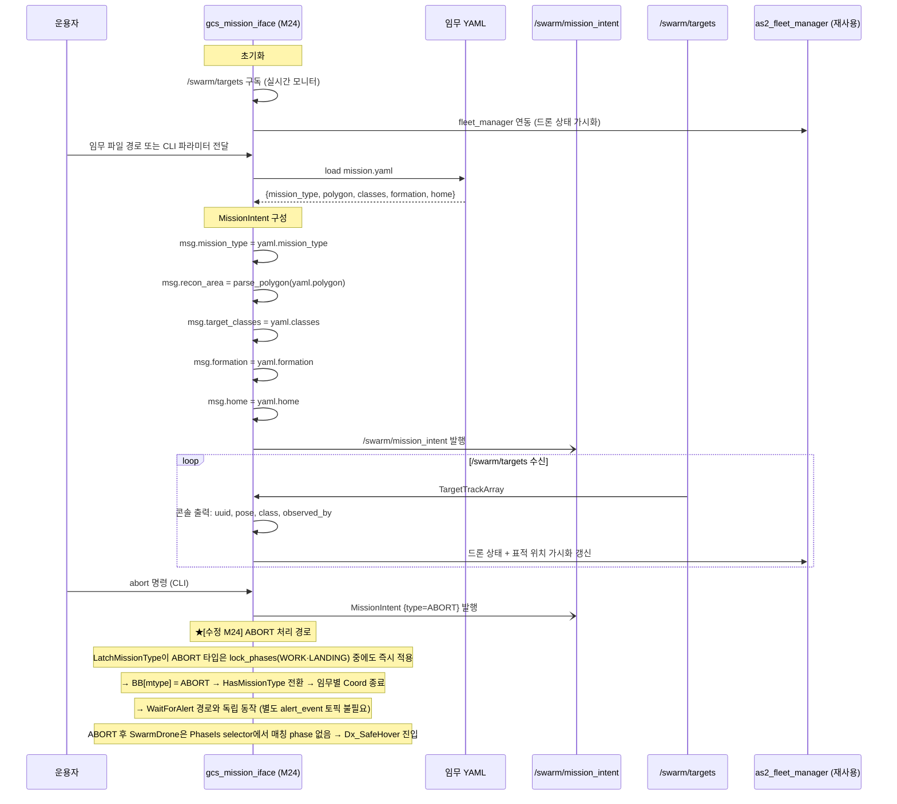
```mermaid
sequenceDiagram
  participant OP as 운용자
  participant GCS as gcs_mission_iface (M24)
  participant YAML as 임무 YAML
  participant NET_MI as /swarm/mission_intent
  participant NET_TG as /swarm/targets
  participant FM as as2_fleet_manager (재사용)

  Note over GCS: 초기화
  GCS->>GCS: /swarm/targets 구독 (실시간 모니터)
  GCS->>FM: fleet_manager 연동 (드론 상태 가시화)

  OP->>GCS: 임무 파일 경로 또는 CLI 파라미터 전달

  GCS->>YAML: load mission.yaml
  YAML-->>GCS: {mission_type, polygon, classes, formation, home}

  Note over GCS: MissionIntent 구성
  GCS->>GCS: msg.mission_type = yaml.mission_type
  GCS->>GCS: msg.recon_area = parse_polygon(yaml.polygon)
  GCS->>GCS: msg.target_classes = yaml.classes
  GCS->>GCS: msg.formation = yaml.formation
  GCS->>GCS: msg.home = yaml.home

  GCS-)NET_MI: /swarm/mission_intent 발행

  loop /swarm/targets 수신
    NET_TG->>GCS: TargetTrackArray
    GCS->>GCS: 콘솔 출력: uuid, pose, class, observed_by
    GCS->>FM: 드론 상태 + 표적 위치 가시화 갱신
  end

  OP->>GCS: abort 명령 (CLI)
  GCS-)NET_MI: MissionIntent {type=ABORT} 발행
  Note over GCS: ★[수정 M24] ABORT 처리 경로
  Note over GCS: LatchMissionType이 ABORT 타입은 lock_phases(WORK·LANDING) 중에도 즉시 적용
  Note over GCS: → BB[mtype] = ABORT → HasMissionType 전환 → 임무별 Coord 종료
  Note over GCS: → WaitForAlert 경로와 독립 동작 (별도 alert_event 토픽 불필요)
  Note over GCS: ABORT 후 SwarmDrone은 PhaseIs selector에서 매칭 phase 없음 → Dx_SafeHover 진입
```

---

## 계층 9 — M25 · Sim 환경

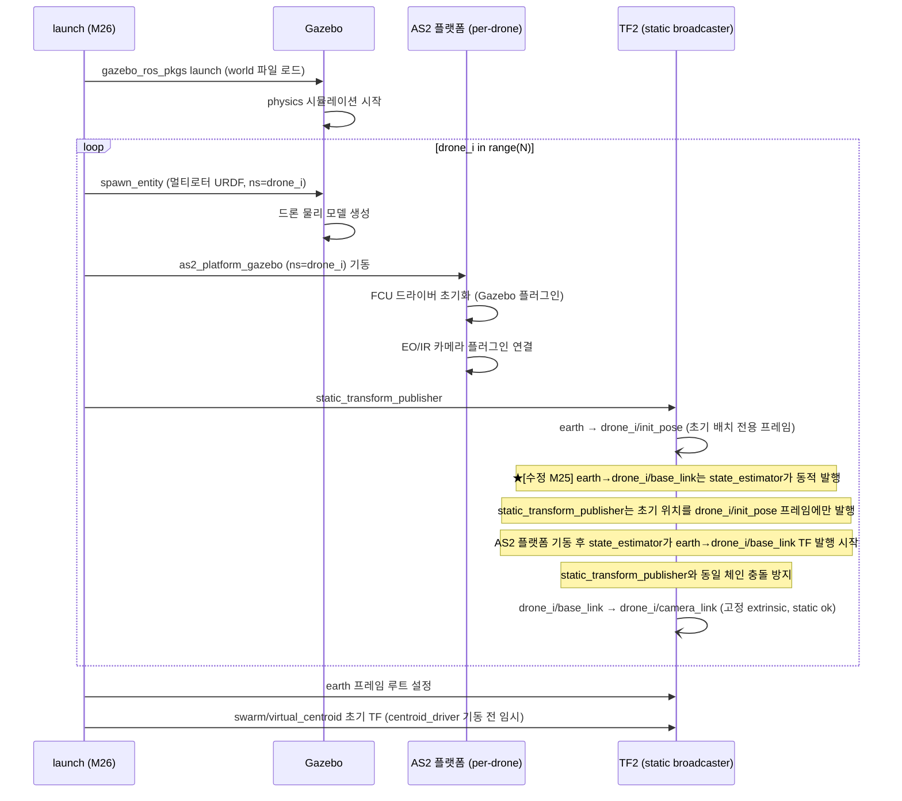
```mermaid
sequenceDiagram
  participant LAUNCH as launch (M26)
  participant GAZ as Gazebo
  participant AS2 as AS2 플랫폼 (per-drone)
  participant TF as TF2 (static broadcaster)

  LAUNCH->>GAZ: gazebo_ros_pkgs launch (world 파일 로드)
  GAZ->>GAZ: physics 시뮬레이션 시작

  loop drone_i in range(N)
    LAUNCH->>GAZ: spawn_entity (멀티로터 URDF, ns=drone_i)
    GAZ->>GAZ: 드론 물리 모델 생성

    LAUNCH->>AS2: as2_platform_gazebo (ns=drone_i) 기동
    AS2->>AS2: FCU 드라이버 초기화 (Gazebo 플러그인)
    AS2->>AS2: EO/IR 카메라 플러그인 연결

    LAUNCH->>TF: static_transform_publisher
    TF-)TF: earth → drone_i/init_pose (초기 배치 전용 프레임)
    Note over TF: ★[수정 M25] earth→drone_i/base_link는 state_estimator가 동적 발행
    Note over TF: static_transform_publisher는 초기 위치를 drone_i/init_pose 프레임에만 발행
    Note over TF: AS2 플랫폼 기동 후 state_estimator가 earth→drone_i/base_link TF 발행 시작
    Note over TF: static_transform_publisher와 동일 체인 충돌 방지
    TF-)TF: drone_i/base_link → drone_i/camera_link (고정 extrinsic, static ok)
  end

  LAUNCH->>TF: earth 프레임 루트 설정
  LAUNCH->>TF: swarm/virtual_centroid 초기 TF (centroid_driver 기동 전 임시)
```

---

## 계층 9 — M26 · Launch/파라미터 체계

```
launch 실행 순서:
  1. Gazebo world + N드론 스폰 (M25)
  2. per-drone 루프 (i = 0..N-1):
     a. AS2 플랫폼 노드 (state_estimator, controller, behavior_*)
     b. aiss_swarm_core (health_monitor, heartbeat, election, registry,
                         aggregator, allocator, centroid_driver)
     c. aiss_swarm_perception (detection_fusion, emitter_fusion)
     d. aiss_behaviors_perception (detect_objects_behavior, rf_survey_behavior)
     e. aiss_swarm_bt (BT executor)
  3. aiss_gcs (gcs_mission_iface) — off-board

파라미터 오버레이:
  global_params.yaml → 전 드론 공통:
    N_min, T_dead (heartbeat 소실 판정), T_barrier (barrier 타임아웃)
    swath_width, coverage_overlap, dedup_dist
    home_pose (Point) — ★[수정 M22-1] Dx_Emergency/Dx_BatteryRTB 기본 귀환지점
    emitter_fusion.bearing_window_sec (float, 기본 5.0) — ★[수정 M12-1] T_window 파라미터
    emitter_fusion.min_baseline (float, 기본 10.0) — RF 삼각측량 최소 기저선
    formation_spacing (float) — RF_RECON 시 min_baseline 이상으로 설정 권장
  drone_i_params.yaml → 개별 (drone_id, initial_pose, model_path ...)
  mission.yaml → 임무 정의 (polygon, classes, formation, home)

블랙보드 초기값 주입 (BT executor):
  recon_area     ← mission.yaml.polygon
  home           ← global_params.yaml.home_pose  (★ mission.yaml.home 오버라이드 가능)
  target_classes ← mission.yaml.classes
  formation      ← mission.yaml.formation
  my_takeoff_slot ← -1 (SwarmJoin 후 갱신 — res.takeoff_slot)
  my_land_slot    ← -1 (SwarmJoin 후 갱신 — res.land_slot)
```

---

## 모듈별 핵심 알고리즘 요약

| 모듈 | 핵심 알고리즘 | 복잡도 |
|------|--------------|--------|
| M04 election | min(alive_ids) — 분산 최솟값 합의 | O(N) |
| M06 zone_partitioner | 스트립 분할 + 폴리곤 클리핑 + 면적 균등화 | O(N·V) |
| M07 centroid_driver | 선형 보간 이동 (Euler integration) | O(1) per tick |
| M10 coverage_planner | 경계박스 기반 boustrophedon 웨이포인트 | O(N_strips) |
| M11 detection_fusion | 근접 트랙 검색 + 가중 평균 위치 병합 | O(D·T) per frame |
| M12 emitter_fusion | LS 삼각측량 (비선형 최적화) | O(N²) per freq |
| M14 detect_objects | ONNX/TRT 추론 + NMS | O(모델 크기) |
| M15 geolocate | 카메라 ray-ground 교차 | O(D) per frame |
| M21 SwarmJoin | 서비스 호출 + 재시도 | O(1) |

---

_근거: `AS2_SWARM_MODULE_DECOMPOSITION.md`, `swarm_bt/swarm_bt_combined.xml`, `swarm_bt/bootstrap/bootstrap_subtrees.xml`, `swarm_bt/chassis/chassis_drone.xml`._

---

## 설계 오류 수정 이력 (AS2_SWARM_DESIGN_REVIEW.md 반영)

| # | 심각도 | 모듈 | 수정 내용 | 위치 |
|---|--------|------|-----------|------|
| 1 | Critical | M03 | DEAD 판정을 수신 콜백에서 1Hz sweep 타이머로 분리 | M03 heartbeat 섹션 |
| 2 | Critical | M01+M21 | SwarmJoin.srv 응답에 takeoff_slot/land_slot 추가, BB 키 분리 | M01 표, M21 섹션 |
| 3 | Critical | M15 | ray_earth.z > -0.1 가드로 division-by-zero/NaN 방지 | M15 지오로케이션 |
| 4 | Critical | M19 | swarm/telemetry (SwarmTelemetry.msg) IDL 정의, M08이 발행 | M01 표, M08·M19 섹션 |
| 5 | Critical | M24/M17 | LatchMissionType에서 ABORT 타입은 lock_phases 무관 즉시 적용 | M17 LatchMissionType |
| 6 | High | M08 | barrier별 독립 timer_start (airborne/formed/zonesdone/landed) | M08 aggregator 섹션 |
| 7 | High | M05 | STANDBY 중 /swarm/registry 캐싱, ACTIVE 전환 시 복원 | M05 registry 섹션 |
| 8 | High | M15 | TF lookup에 now() → image.header.stamp + timeout=0.05s | M15 지오로케이션 |
| 9 | High | M04+M05 | 리더 교체 시 cached_registry 복원 절차 명시 | M04 승계 시나리오 |
| 10 | Medium | M09 | 미완료 경로(current_wp 이후)만 재할당, 역할 재배정 M09 단독 | M09 allocator 섹션 |
| 11 | Medium | M11 | EMA 가중치(w=score) 명시, tracks_mutex 추가 | M11 detection_fusion |
| 12 | Medium | M12 | bearing_window_sec 파라미터 명시, min_baseline 경고 | M12 emitter_fusion |
| 13 | Medium | M16 | route 파라미터 제거, RF는 현재 위치 측정 전용 명확화 | M16 rf_survey |
| 14 | Medium | M17 | PublishPhase QoS Reliable+TransientLocal, SwarmFlockingStart fire-and-forget | M17 BT 노드 |
| 15 | Medium | M18 | EMERGENCY 단계 진입 시 timer_start[landed] 명시적 리셋 | M18 barrier 노드 |
| 16 | Medium | M19/M21 | SwarmJoin 거부 시 FAILURE→RUNNING 전환 (트리 종료 방지) | M21 SwarmJoin |
| 17 | Medium | M20 | InspectTimeout on_halted()에서 타이머 명시적 리셋 | M20 P3 임무 노드 |
| 18 | Medium | M22 | RetryUntilSuccessful 10회 제한, BB[home] 기본값 global_params 주입 | M22 chassis 서브트리 |
| 19 | Low | M06 | bisection max_iterations=50, 조기 반환 | M06 zone_partitioner |
| 20 | Low | M07 | 신규 goal 수신 시 loop_mode atomic flag 전환 | M07 centroid_driver |
| 21 | Low | M01 | RfBearing/EmitterTrack/MissionPhase/SwarmTelemetry 필드 표 추가 | M01 IDL 섹션 |
| 22 | Low | M25 | Static TF → 초기 배치 전용 프레임(init_pose) 분리 | M25 Sim 환경 |
