# 군집 정찰 시스템 — 모듈간 동작 시퀀스

> **기반**: `AS2_SWARM_MODULE_DECOMPOSITION.md` (M01~M26), `AS2_SWARM_SCENARIO_BY_PHASE.md`  
> **목적**: P0~P5 전 구간의 모듈간 ROS2 인터페이스(토픽·서비스·액션·TF) 교환 순서를 명시.  
> **표기**: `-)` publish(비동기), `->>` / `-->>` service·action 요청/응답, `TF` = tf2 broadcast.

---

## 참여자 범례

| 약어 | 모듈 | 역할 |
|------|------|------|
| GCS | M24 gcs_mission_iface | 임무 업로드 (off-board) |
| HM | M02 health_monitor | FCU·센서 자가진단 (per-drone) |
| HB | M03 heartbeat | 생존 발행·생존맵 (per-drone) |
| EL | M04 election | 리더 선출·승계 (per-drone) |
| REG | M05 registry | 합류·등록부·정족수 (리더 전용) |
| AGG | M08 aggregator | barrier 상태 집계 (리더 전용) |
| ALLOC | M09 allocator | 구역분할·배정·재할당 (리더 전용) |
| CEN | M07 centroid_driver | virtual_centroid TF 구동 (리더 전용) |
| DFUSE | M11 detection_fusion | 탐지 dedup·트랙 (리더 전용) |
| RFUSE | M12 emitter_fusion | RF 삼각측량 (리더 전용) |
| DETECT | M13~M15 detect_objects | EO/IR 추론·지오로케이션 (per-drone) |
| RF | M16 rf_survey | RF 스캔·방위 (per-drone) |
| FLOCK | AS2 SwarmFlocking | 편대 슬롯 구동 (AS2 재사용) |
| COORD | BT:SwarmCoord | 리더 BT 트리 (M22·M23) |
| DRONE | BT:SwarmDrone[i] | 팔로워 BT 트리 (M22·M23) |
| AS2 | AS2 behaviors | Takeoff·Land·GoTo·FollowPath (재사용) |

---

## 전체 구간 흐름

```
P0 부트스트랩 ──► P1 순차 이륙 ──► P2 편대 Transit ──► P3 독립정찰 ──► P4 복귀 ──► P5 순차 착륙
  ★2 게이트                                                  ★1·★3 게이트
  (자율 개시)                                              (단일기·군집 정찰)
```

**구간별 핵심 모듈 활성 매핑**

| 구간 | 신규 활성 모듈 | 트리거 → 완료 조건 |
|------|---------------|--------------------|
| P0 | M02·M03·M04·M05·M09·M21·M24 | 부팅 → MissionReady ★2 |
| P1 | M08·M18·M19·M22 | PublishPhase(TAKEOFF) → AwaitAllAirborne |
| P2 | M07·M17·M18 (FLOCK) | PublishPhase(TRANSIT) → centroid@entry |
| P3 | M06·M09·M10·M11·M12·M13~M16·M20 | PublishPhase(WORK) → AwaitAllZonesDone |
| P4 | M07·M08·M17·M18 | PublishPhase(REGROUP) → centroid@home |
| P5 | M08·M18·M19·M22 | PublishPhase(LANDING) → AwaitAllLanded |

---

## 시퀀스 1 — P0 부트스트랩

> 트리거: 전원 인가  
> 완료 조건: ★2 게이트 통과 (MissionReady SUCCESS) → P1 진입  
> 전 드론이 동일 `BootstrapAll` 서브트리 실행. IsLeader로 리더/팔로워 자기선택.

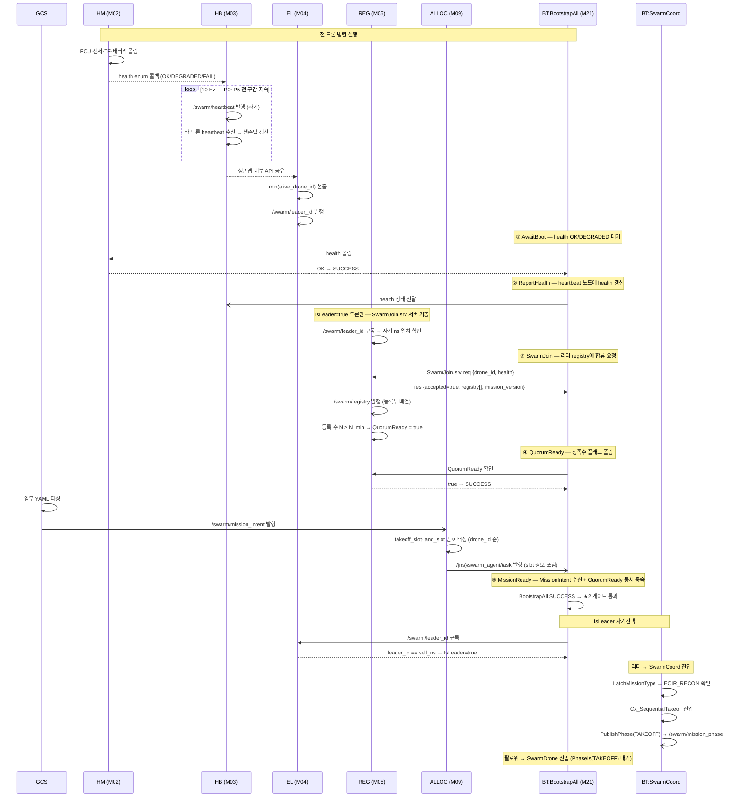

---

## 시퀀스 2 — P1 순차 이륙

> 트리거: PublishPhase(TAKEOFF)  
> 완료 조건: AwaitAllAirborne SUCCESS → PublishPhase(TRANSIT) → P2 진입

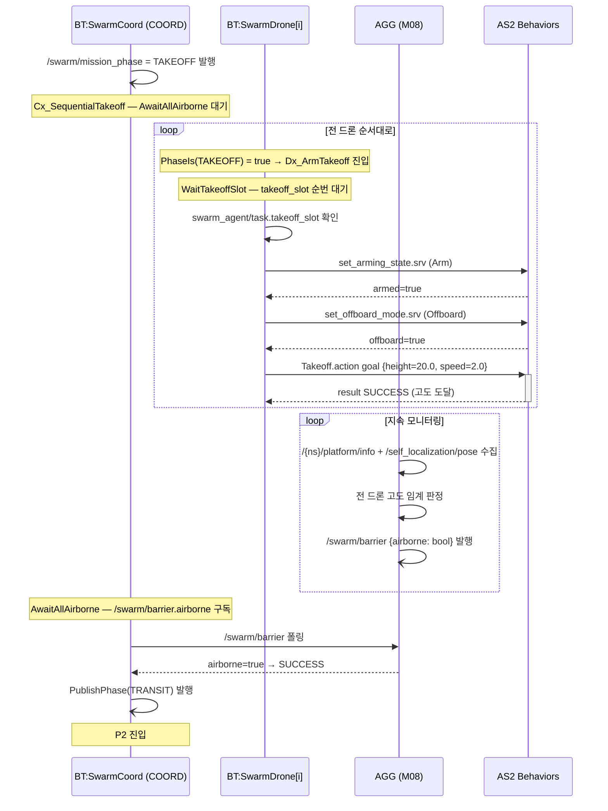

---

## 시퀀스 3 — P2 편대 Transit (FORM_UP → TRANSIT)

> 트리거: PublishPhase(TRANSIT)  
> 완료 조건: centroid@recon_entry 도달 → PublishPhase(WORK) → P3 진입

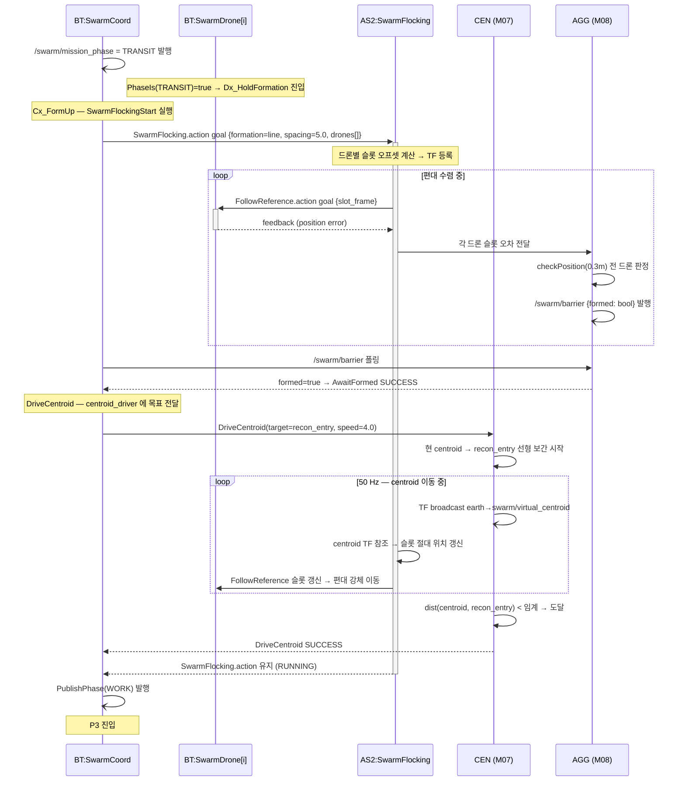

---

## 시퀀스 4 — P3 EO/IR 독립정찰 (DISBAND → RECON → FUSE)

> 트리거: PublishPhase(WORK) — ★1(단일기)·★3(군집) 게이트  
> 완료 조건: AwaitAllZonesDone SUCCESS → PublishPhase(REGROUP) → P4 진입

### 4-a. DISBAND + 구역 배정

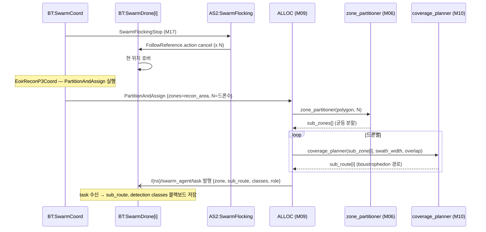

### 4-b. 독립 커버리지 + 탐지 (per-drone 병렬)

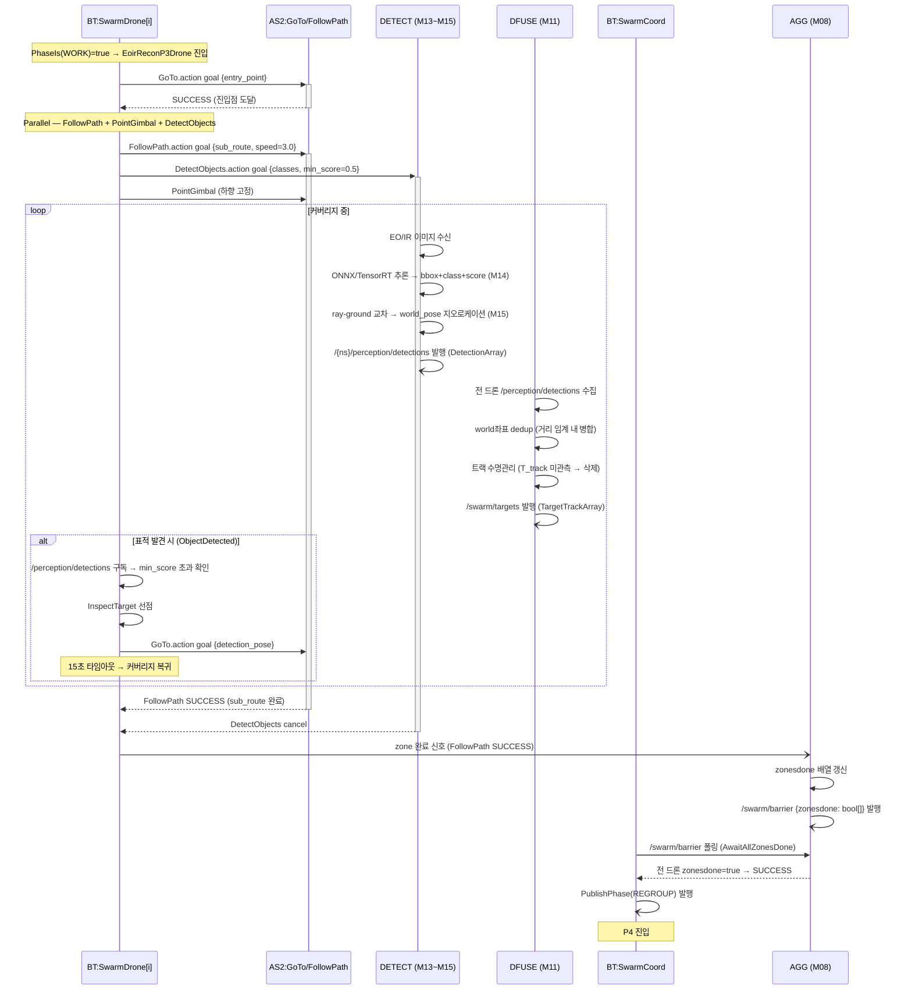

---

## 시퀀스 5 — P3 RF 방사원 탐지 (선택 임무)

> RF_RECON 임무 타입 시 활성. EO/IR 커버리지와 병행 또는 대체.

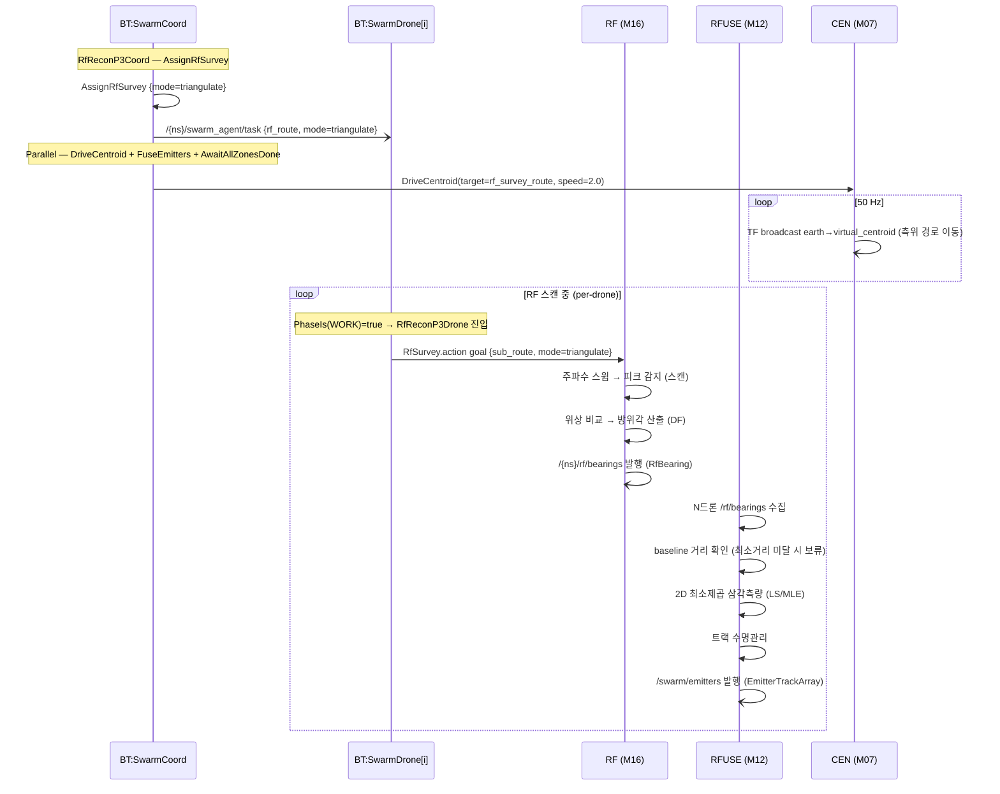

---

## 시퀀스 6 — P4 재편대 · 복귀 (REGROUP → RETURN)

> 트리거: PublishPhase(REGROUP)  
> 완료 조건: centroid@home 도달 → Cx_SequentialLand → P5 진입

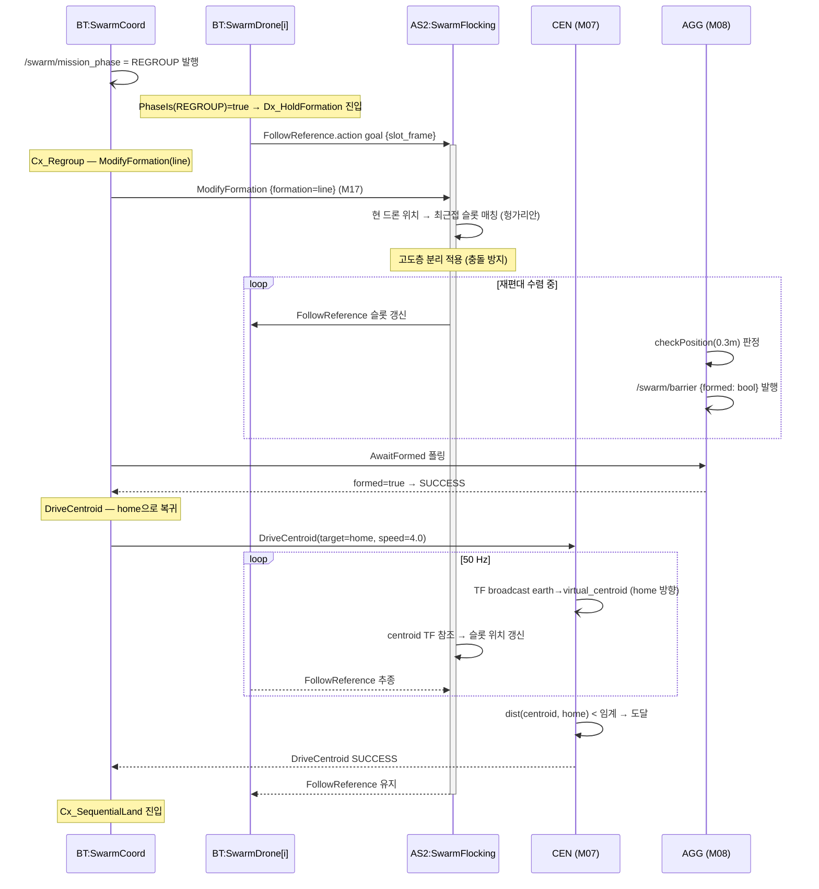

---

## 시퀀스 7 — P5 순차 착륙

> 트리거: Cx_SequentialLand (SwarmFlockingStop → PublishPhase(LANDING))  
> 완료 조건: AwaitAllLanded SUCCESS → PublishPhase(DONE)

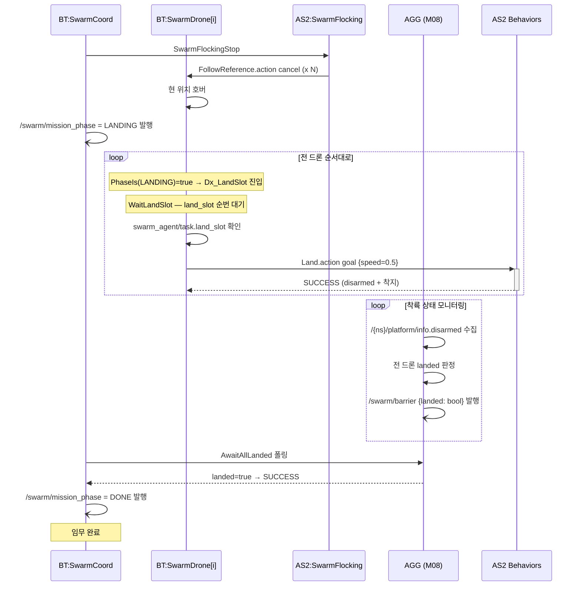

---

## 시퀀스 8 — E1 드론 이탈 (heartbeat 소실)

> 발생: 임의 구간에서 드론 i 통신 두절 또는 충돌

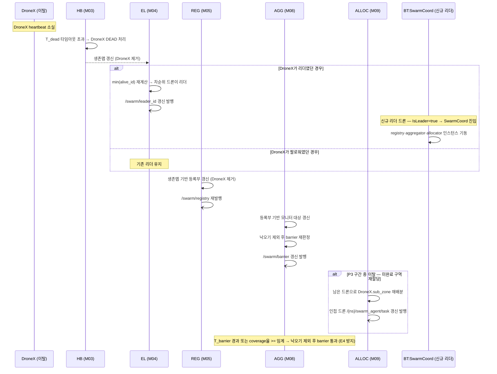

---

## 시퀀스 9 — E2 배터리 경고 (BatteryLow RTB)

> 발생: 임의 구간에서 드론 i 배터리 < 25%

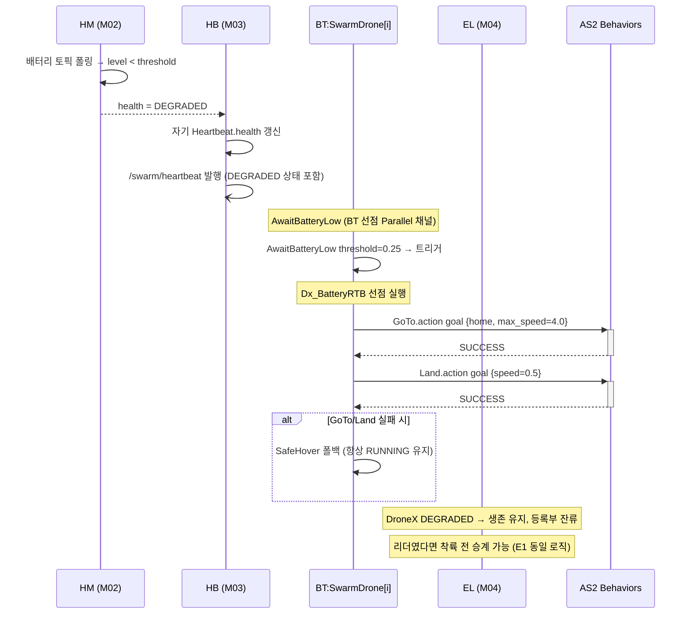

---

## 시퀀스 10 — E4 barrier 교착 방지 (낙오기 타임아웃)

> 발생: 낙오기로 인해 barrier 조건 미충족 → 무한 대기 위험

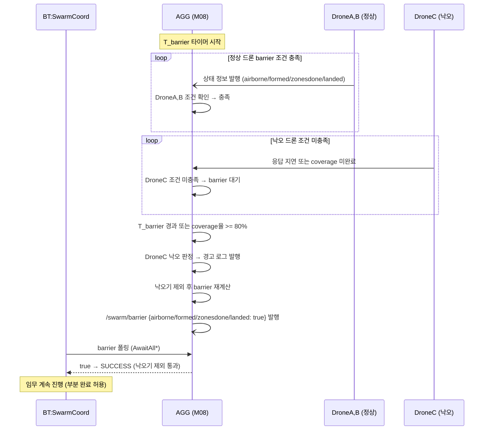

---

## 핵심 인터페이스 요약

### ROS2 토픽 (Publish / Subscribe)

| 토픽 | 발행자 | 구독자 | 메시지 타입 | 구간 |
|------|--------|--------|-------------|------|
| `/swarm/heartbeat` | M03 (전 드론) | M03·M04 (전 드론) | `Heartbeat` | 전체 |
| `/swarm/leader_id` | M04 (전 드론) | M21:IsLeader | `std_msgs/String` | P0~ |
| `/swarm/registry` | M05 (리더) | M08·M09 | `SwarmRegistry` | P0~ |
| `/swarm/mission_intent` | M24 (GCS) | M09·M21:MissionReady | `MissionIntent` | P0-5 |
| `/{ns}/swarm_agent/task` | M09 (리더) | M19·M22 BT 노드 | `SwarmTask` | P0~ |
| `/swarm/mission_phase` | M17:PublishPhase | M19:PhaseIs (전 드론) | `MissionPhase` | P1~ |
| `/swarm/barrier` | M08 (리더) | M18 BT 노드 | `SwarmBarrier` | P1~ |
| `/{ns}/perception/detections` | M13~M15 (per-drone) | M11 (리더) | `DetectionArray` | P3 |
| `/swarm/targets` | M11 (리더) | M09·M24 | `TargetTrackArray` | P3 |
| `/{ns}/rf/bearings` | M16 (per-drone) | M12 (리더) | `RfBearing` | P3-RF |
| `/swarm/emitters` | M12 (리더) | M24 | `EmitterTrackArray` | P3-RF |

### ROS2 서비스

| 서비스 | 서버 | 클라이언트 | 구간 |
|--------|------|------------|------|
| `swarm/join` | M05 registry (리더) | M21:SwarmJoin (전 드론) | P0-3 |
| `set_arming_state` | AS2 (per-drone) | M22:Dx_ArmTakeoff | P1 |
| `set_offboard_mode` | AS2 (per-drone) | M22:Dx_ArmTakeoff | P1 |

### ROS2 액션

| 액션 | 서버 | 클라이언트 | 구간 |
|------|------|------------|------|
| `SwarmFlocking.action` | AS2 SwarmFlocking | M17:SwarmFlockingStart | P2·P4 |
| `FollowReference.action` | AS2 (per-drone) | AS2 SwarmFlocking | P2·P3-RF·P4 |
| `Takeoff.action` | AS2 (per-drone) | M22:Dx_ArmTakeoff | P1 |
| `Land.action` | AS2 (per-drone) | M22:Dx_LandSlot | P5 |
| `GoTo.action` | AS2 (per-drone) | M22 BT | P3·P4·E1·E2 |
| `FollowPath.action` | AS2 (per-drone) | M20:FollowPath BT | P3 |
| `DetectObjects.action` | M13~M15 (per-drone) | M20:DetectObjects BT | P3 |

### TF 프레임

| broadcast | 발행자 | 소비자 | 구간 |
|-----------|--------|--------|------|
| `earth → swarm/virtual_centroid` | M07 centroid_driver (50 Hz) | AS2 SwarmFlocking | P2·P4 |
| `earth → {ns}/base_link` | AS2 상태추정 | M15:지오로케이션 | P3 |
| `earth → {ns}/camera_link` | AS2 상태추정 | M15:ray-ground | P3 |

---

## 모듈 활성 상태 타임라인

```
구간:    │  P0  │  P1  │  P2  │    P3    │  P4  │  P5  │
─────────┼──────┼──────┼──────┼──────────┼──────┼──────┤
M02 HM   │ ████ │ ████ │ ████ │   ████   │ ████ │ ████ │ (전 구간)
M03 HB   │ ████ │ ████ │ ████ │   ████   │ ████ │ ████ │ (전 구간)
M04 EL   │ ████ │ ████ │ ████ │   ████   │ ████ │ ████ │ (전 구간)
M05 REG  │ ████ │      │      │          │      │      │ (P0만)
M08 AGG  │      │ ████ │ ████ │   ████   │ ████ │ ████ │ (P1~P5)
M09 ALLOC│ ████ │      │      │   ████   │      │      │ (P0·P3)
M07 CEN  │      │      │ ████ │          │ ████ │      │ (P2·P4)
M10 CP   │ ████ │      │      │   ████   │      │      │ (P0·P3)
M11 DFUSE│      │      │      │   ████   │      │      │ (P3 EO/IR)
M12 RFUSE│      │      │      │   ████   │      │      │ (P3 RF)
M13~15   │      │      │      │   ████   │      │      │ (P3 EO/IR)
M16 RF   │      │      │      │   ████   │      │      │ (P3 RF)
```

---

_근거: `AS2_SWARM_MODULE_DECOMPOSITION.md`, `AS2_SWARM_SCENARIO_BY_PHASE.md`, `swarm_bt/swarm_bt_combined.xml`, `swarm_bt/chassis/chassis_drone.xml`._
