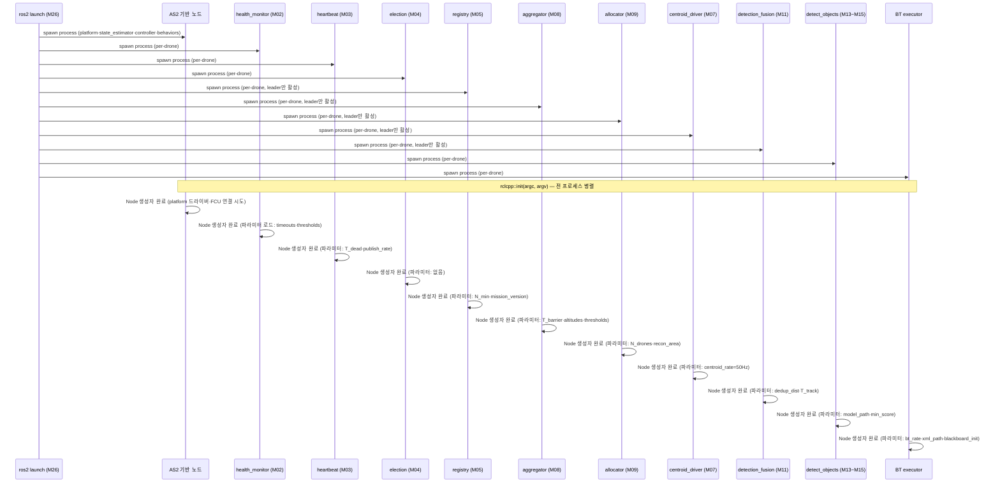
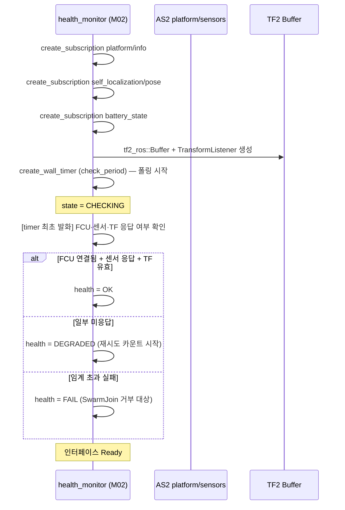
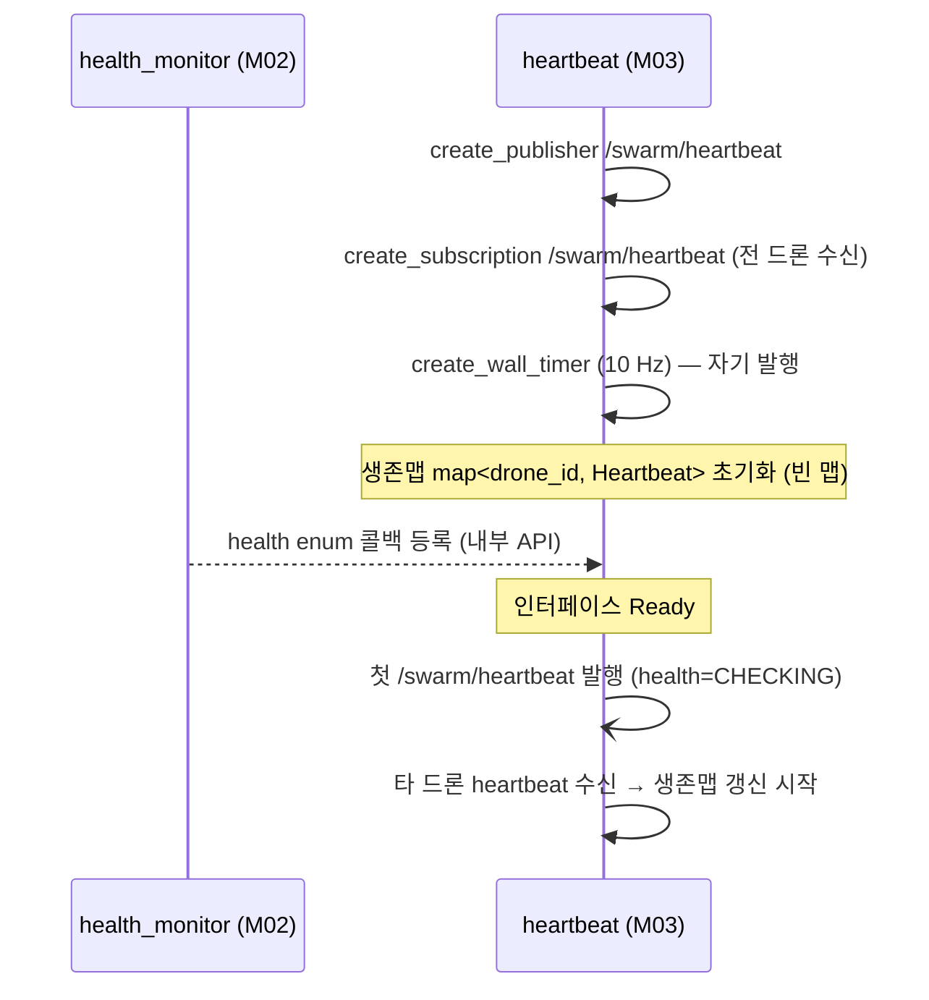
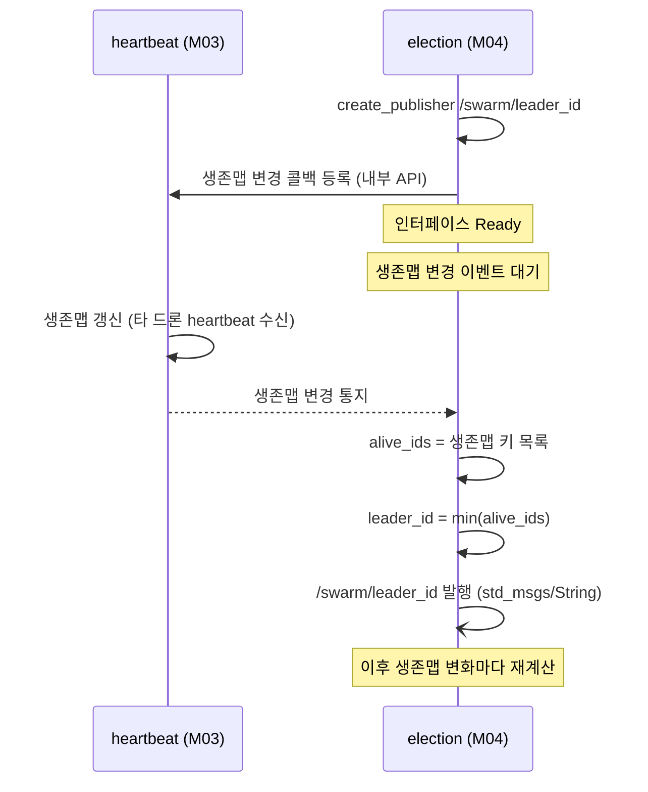
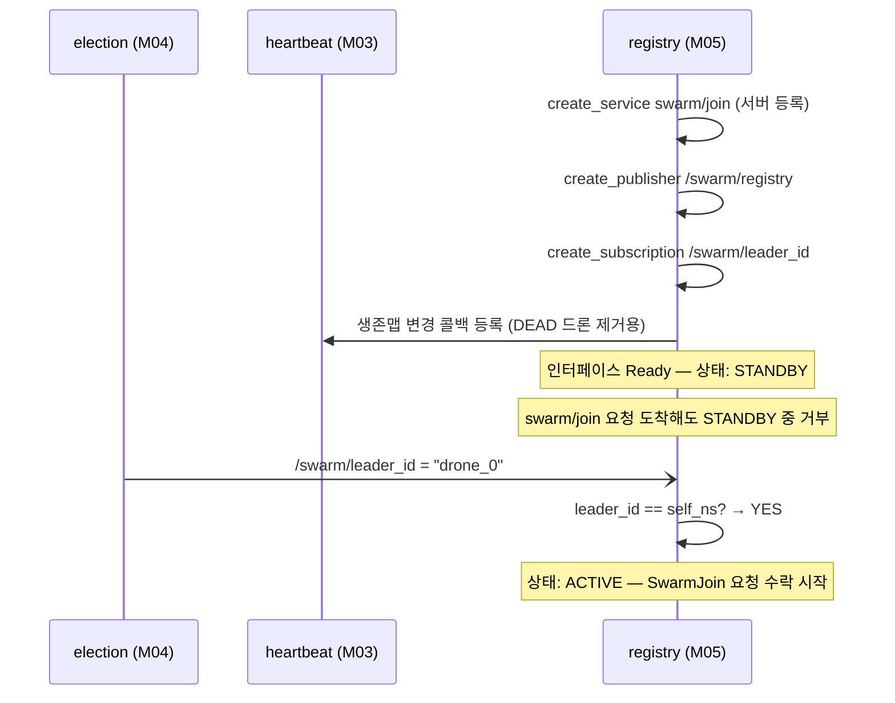
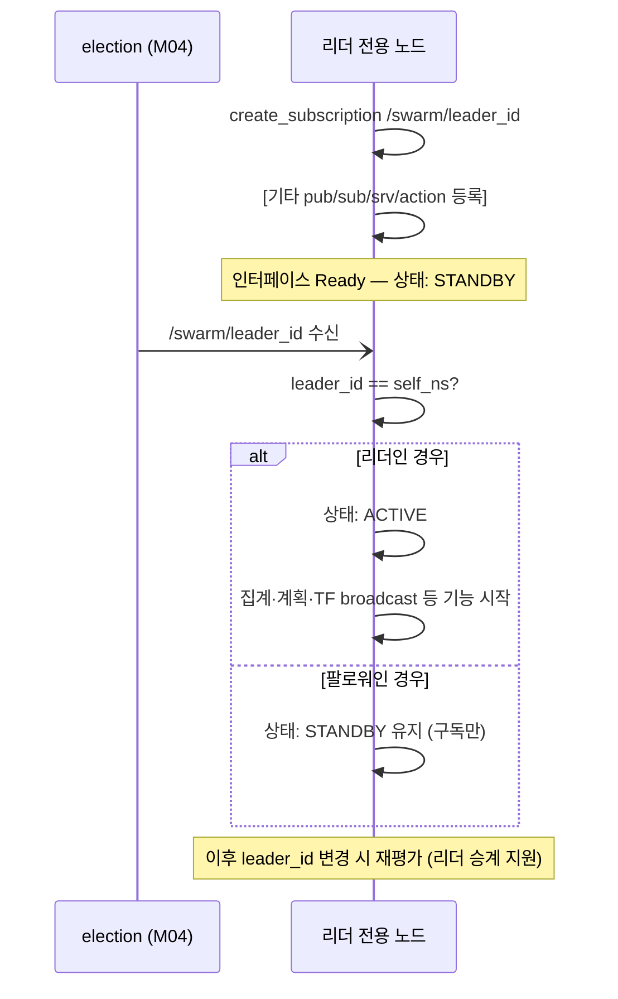
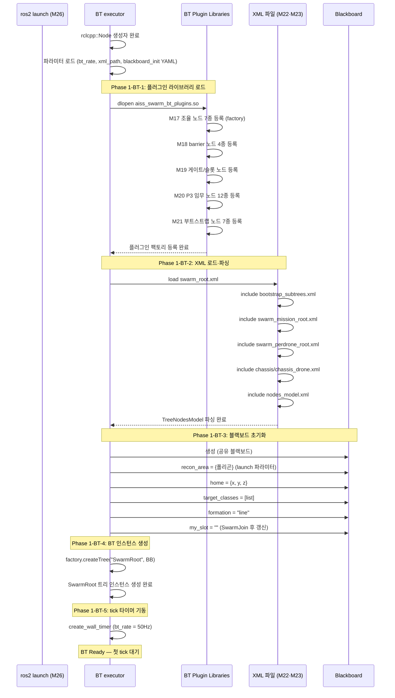
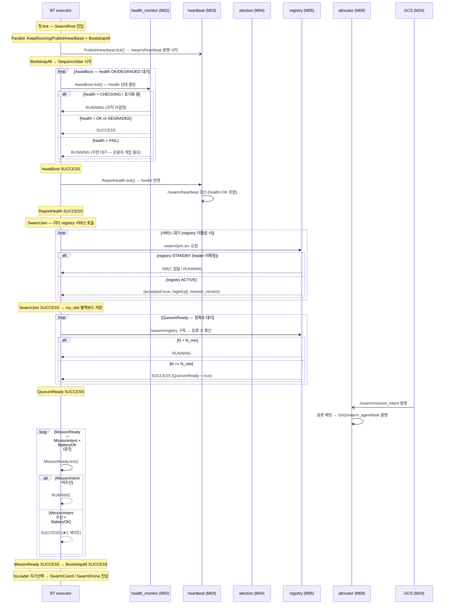

# 군집 정찰 시스템 — 노드 부트 시퀀스

> **범위**: `ros2 launch` 실행 → `BootstrapAll` 첫 BT tick 시작까지의 노드별 초기화 순서.  
> **기반**: `AS2_SWARM_MODULE_DECOMPOSITION.md` (M01~M26), `swarm_bt/bootstrap/bootstrap_subtrees.xml`.  
> **관점**: 노드 프로세스 기동 순서 → ROS2 인터페이스 등록 → 리더 활성화 → BT 엔진 시작.

---

## 부트 단계 정의

```
Phase 0 │ Launch   ros2 launch → 전 노드 프로세스 OS 스폰 (병렬)
Phase 1 │ Init     rclcpp::Node 생성자 → 파라미터 선언·로드 → 인터페이스 등록
Phase 2 │ Ready    첫 timer·heartbeat 발행 → 생존맵 구성 → election 수렴
Phase 3 │ Activate /swarm/leader_id 확정 → 리더 전용 노드 활성화 (M05·M07~M09·M11·M12)
Phase 4 │ BT Start BT 엔진 기동 → 플러그인 로드 → XML 파싱 → 첫 tick (AwaitBoot)
```

---

## 시퀀스 1 — Phase 0·1: Launch → 노드 생성자 완료

> 전 노드는 **비동기 병렬** 기동. 아래 순서는 런치 파일 내 선언 순서 기준이며 실제 OS 스케줄 의존.



---

## 시퀀스 2 — Phase 1: 노드별 ROS2 인터페이스 등록

> 생성자 내에서 pub/sub/srv/action을 등록. 등록 완료 시점이 "인터페이스 Ready".

### 2-a. health_monitor (M02)



### 2-b. heartbeat (M03)



### 2-c. election (M04)



### 2-d. registry (M05) — 리더 전용 노드 등록



### 2-e. 리더 전용 노드 공통 패턴 (M07·M08·M09·M11·M12)



---

## 시퀀스 3 — Phase 1: BT 엔진 기동



---

## 시퀀스 4 — Phase 2·3: 첫 BT tick → BootstrapAll 진입

> 전 노드 초기화 완료 직후 BT가 첫 tick. BootstrapAll은 내부 재시도 루프로 노드 준비 지연을 흡수.



---

## 노드별 초기화 상세

### 인터페이스 등록 목록

| 노드 | Publishers | Subscribers | Srv Server | Srv Client | Action Server | Action Client |
|------|-----------|-------------|------------|------------|---------------|---------------|
| **M02** health_monitor | — | platform/info, pose, battery | — | — | — | — |
| **M03** heartbeat | /swarm/heartbeat | /swarm/heartbeat | — | — | — | — |
| **M04** election | /swarm/leader_id | (M03 생존맵 API) | — | — | — | — |
| **M05** registry | /swarm/registry | /swarm/leader_id | swarm/join | — | — | — |
| **M07** centroid_driver | — | /swarm/leader_id, DriveCentroid 트리거 | — | — | — | — |
| **M08** aggregator | /swarm/barrier | /swarm/leader_id, platform/info×N, pose×N, /swarm/heartbeat, /swarm/registry | — | — | — | — |
| **M09** allocator | /{ns}/swarm_agent/task | /swarm/leader_id, /swarm/mission_intent, /swarm/registry, /swarm/targets, /swarm/emitters | — | — | — | — |
| **M11** detection_fusion | /swarm/targets | /swarm/leader_id, /swarm/registry, /{ns}/perception/detections×N | — | — | — | — |
| **M12** emitter_fusion | /swarm/emitters | /swarm/leader_id, /{ns}/rf/bearings×N | — | — | — | — |
| **M13~M15** detect_objects | /{ns}/perception/detections | eo/image_raw, ir/image_raw, camera_info | — | — | DetectObjectsBehavior | — |
| **M16** rf_survey | /{ns}/rf/bearings | /{ns}/self_localization/pose | — | — | RfSurveyBehavior | — |
| **BT executor** | — | /swarm/leader_id, /swarm/mission_phase, /swarm/barrier, /swarm/registry | — | swarm/join | — | Takeoff, Land, GoTo, FollowPath, SwarmFlocking, DetectObjects |

### 노드 상태 전이

```
health_monitor (M02):
  INIT → CHECKING → OK / DEGRADED / FAIL

heartbeat (M03):
  INIT → READY → BROADCASTING (첫 /swarm/heartbeat 발행 이후)

election (M04):
  INIT → READY → MONITORING → LEADER_PUBLISHED

registry (M05):
  INIT → READY → STANDBY → ACTIVE (IsLeader 확인 후)

aggregator (M08):
  INIT → READY → STANDBY → ACTIVE (IsLeader 확인 후)

allocator (M09):
  INIT → READY → STANDBY → ACTIVE (IsLeader 확인 후)

centroid_driver (M07):
  INIT → READY → STANDBY → ACTIVE (IsLeader 확인 후) → DRIVING (DriveCentroid 호출 후)

detection_fusion (M11):
  INIT → READY → STANDBY → ACTIVE (IsLeader 확인 후) → FUSING (detections 수신 중)

detect_objects behavior (M13~M15):
  INIT → MODEL_LOAD → IDLE → RUNNING (action goal 수신 후)

BT executor:
  INIT → PLUGINS_LOADED → XML_PARSED → BB_INIT → TICKING
```

---

## Phase별 완료 기준 (노드 Ready 게이트)

```
Phase 0 완료 ─── 전 노드 프로세스 OS 스폰 완료
                  판단: pgrep / /proc 기반 (launch 내부 상태)

Phase 1 완료 ─── 전 노드 ROS2 인터페이스 등록 완료
                  판단: ros2 node list에 전 노드 출현 + ros2 topic list 확인 가능
                  키 노드: health_monitor(health timer 기동), heartbeat(첫 발행),
                           BT executor(플러그인 로드·XML 파싱 완료)

Phase 2 완료 ─── election 수렴 → /swarm/leader_id 발행
                  판단: `ros2 topic echo /swarm/leader_id` 안정
                  소요 시간: T_dead 내 생존맵 안정화 (통상 1~2초)

Phase 3 완료 ─── 리더 전용 노드 ACTIVE
                  판단: registry→ swarm/join 서비스 활성, aggregator→ /swarm/barrier 발행 시작
                  소요 시간: Phase 2 완료 후 수십 ms

Phase 4 완료 ─── BT BootstrapAll SUCCESS
                  판단: /swarm/mission_phase = TAKEOFF 발행
                  소요 시간: 전 드론 SwarmJoin 완료 + GCS MissionIntent 수신 후
```

---

## 부트 타임라인 (N=3, Sim 기준)

```
T+0.0s  ros2 launch 실행
T+0.1s  전 노드 프로세스 스폰 (OS 병렬)
T+0.3s  AS2 platform/state_estimator 초기화 완료 (FCU 연결)
T+0.5s  health_monitor health=OK (FCU + 센서 응답 확인)
T+0.5s  heartbeat 첫 발행 → 생존맵 구성 시작
T+0.7s  BT executor: 플러그인 로드 + XML 파싱 완료 → 첫 tick
T+0.7s  AwaitBoot tick 시작 (health 폴링)
T+0.8s  AwaitBoot SUCCESS (health=OK)
T+1.0s  election: 전 드론 heartbeat 수렴 → leader_id 확정
T+1.0s  registry: ACTIVE → swarm/join 서비스 오픈
T+1.2s  전 드론 SwarmJoin 완료 → /swarm/registry (3기 등재)
T+1.2s  QuorumReady = true
T+2.0s  GCS: MissionIntent 발행
T+2.0s  allocator: 슬롯 배정 → swarm_agent/task 발행
T+2.1s  MissionReady SUCCESS → BootstrapAll SUCCESS
T+2.1s  ★2 게이트 통과 → /swarm/mission_phase = TAKEOFF
```

---

## 부트 실패 케이스

| 실패 상황 | 증상 | 원인 | 대응 |
|-----------|------|------|------|
| **FCU 연결 실패** | AwaitBoot RUNNING 무한 대기 | health=FAIL | FCU 연결 확인 후 노드 재기동 |
| **플러그인 로드 실패** | BT executor 크래시 | .so 누락 / 심볼 오류 | colcon build 재실행, ROS_PLUGIN_PATH 확인 |
| **XML 파싱 실패** | BT executor 예외 종료 | XML 문법 오류 / include 경로 오류 | nodes_model.xml ID 확인, 경로 수정 |
| **리더 미선출** | SwarmJoin RUNNING 무한 대기 | 드론 수 < 2 or heartbeat 미수신 | 네트워크 확인, N_min 파라미터 확인 |
| **swarm/join 서비스 없음** | BT SwarmJoin RUNNING 대기 | registry STANDBY (leader 미확정) | election 정상 동작 확인 |
| **GCS MissionIntent 미발행** | MissionReady RUNNING 대기 | GCS 미기동 / YAML 오류 | `ros2 topic pub /swarm/mission_intent` 확인 |
| **QuorumReady 미충족** | 무한 대기 | N < N_min | N_min 파라미터 조정 또는 추가 드론 기동 |
| **ONNX/TRT 모델 로드 실패** | detect_objects 크래시 | model_path 오류 / GPU 메모리 부족 | model_path 파라미터 확인, GPU 자원 확인 |

---

## 노드 의존성 그래프 (부트 순서 임계 경로)

```
ros2 launch
    │
    ├─ AS2 platform ──────────────────────────────► health_monitor (FCU 연결 필요)
    │                                                    │
    ├─ health_monitor ────────────────────────────────── ▼
    │                                              heartbeat (health 콜백)
    │                                                    │ /swarm/heartbeat
    ├─ election ◄─────────────────────────────────────── ┘
    │      │ /swarm/leader_id
    │      ▼
    ├─ registry (STANDBY → ACTIVE)
    │      │ swarm/join.srv
    │      ▼
    │  [BT: SwarmJoin] ─────────────────────────► [BT: QuorumReady]
    │                                                    │
    ├─ GCS (MissionIntent) ──────────────────────────── ▼
    │      │ /swarm/mission_intent                 [BT: MissionReady ★2]
    │      ▼                                             │
    └─ allocator (STANDBY → ACTIVE)                      ▼
           │ /swarm_agent/task              BootstrapAll SUCCESS → P1 진입
           ▼
     BT: /{ns}/swarm_agent/task 수신

★ 임계 경로: AS2_platform → HM → HB → EL → REG → SwarmJoin → QuorumReady → MissionReady
★ 병렬 트랙: BT 엔진 기동(플러그인·XML) → 첫 tick (AwaitBoot 폴링으로 HM 완료 흡수)
```

---

## BT 플러그인 로드 순서

```
BT executor 기동 시 dlopen 순서 (aiss_swarm_bt CMakeLists 등록 순):

1. M21 BootstrapAll 플러그인
   AwaitBoot · ReportHealth · PublishHeartbeat · SwarmJoin
   IsLeader · QuorumReady · MissionReady

2. M17 조율 플러그인
   HasMissionType · LatchMissionType · PublishPhase
   SwarmFlockingStart · SwarmFlockingStop · ModifyFormation · DriveCentroid

3. M18 barrier 플러그인
   AwaitAllAirborne · AwaitFormed · AwaitAllZonesDone · AwaitAllLanded

4. M19 게이트/슬롯 플러그인
   PhaseIs · WaitForAlert · WaitTakeoffSlot · WaitLandSlot
   SafeHover · AwaitBatteryLow

5. M20 P3 임무 플러그인
   DetectObjects · ObjectDetected · InspectTimeout · RfSurvey
   EmitterDetected · HasRole · TargetLost · PartitionAndAssign
   AssignRfSurvey · FuseDetections · FuseEmitters · AllocateTrackRoles

로드 실패 시: BT executor 예외 종료 (전 플러그인 성공 전제)
```

---

## 부트 완료 확인 명령 (Sim 검증용)

```bash
# Phase 1 확인: 전 노드 등록
ros2 node list | grep -E "health_monitor|heartbeat|election|registry"

# Phase 2 확인: leader_id 발행
ros2 topic echo /swarm/leader_id --once

# Phase 3 확인: registry 활성 (swarm/join 서비스 존재)
ros2 service list | grep swarm/join

# Phase 3 확인: barrier 발행 시작
ros2 topic echo /swarm/barrier --once

# Phase 4 확인: BootstrapAll SUCCESS → mission_phase=TAKEOFF
ros2 topic echo /swarm/mission_phase --once
```

---

_근거: `AS2_SWARM_MODULE_DECOMPOSITION.md`, `swarm_bt/bootstrap/bootstrap_subtrees.xml`, `swarm_bt/swarm_bt_combined.xml`._
