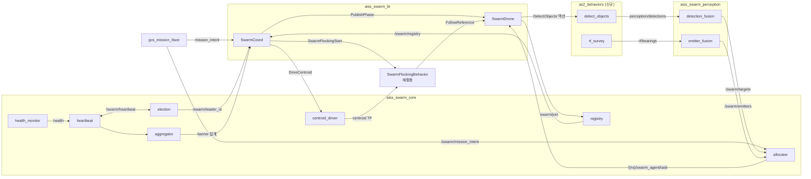

# 군집 정찰 시스템 — 패키지·노드·모듈·인터페이스 관계

> 신규 구현 자산의 **구조 관계**: 패키지 구성 → 노드/모듈 소유 → 인터페이스(pub/sub/srv/action) 배선 → 빌드 의존.
> 근거: `AS2_SWARM_MODULE_MANIFEST.md`(모듈), `AS2_SWARM_INTERFACE_SPEC.md`(인터페이스), `AS2_SWARM_FULL_DIAGRAM.md`(구조), AS2 실코드.

---

## 0. 워크스페이스 분리 (오버레이)

신규 코드는 **별도 워크스페이스 `aiss_ws`**에 둔다. AS2 트리(`aerostack2_ws`)는 무수정 유지. `aiss_ws`가 `aerostack2_ws`를 **오버레이**.

```
e:/Project/AISS.os/
├─ aerostack2_ws/                 # [AS2, 무수정] 업스트림
│   └─ src/aerostack2/            #   재활용 패키지 전부
└─ aiss_ws/                       # [신규] 오버레이 워크스페이스
    └─ src/aiss/                  #   전 aiss 패키지 위치
```

빌드:
```
# 1) 베이스
cd aerostack2_ws && colcon build && source install/setup.bash
# 2) 오버레이 (베이스 source 후)
cd aiss_ws && colcon build && source install/setup.bash
```

원칙: **AS2 트리에 신규 파일 추가 안 함**. 정찰 behavior·coverage plugin도 AS2 트리가 아닌 `aiss_ws`에 둔다(아래 §1). pluginlib는 동일 패키지 불필요 → coverage는 별 패키지에서 AS2 base class 플러그인으로 export.

---

## 1. 패키지 구성 (전부 `aiss_ws/src/aiss/`, 신규 8)

```
aiss_ws/src/aiss/
├─ aiss_swarm_msgs/          # [신규] 인터페이스 (msg/srv/action)
├─ aiss_swarm_core/          # [신규] swarm_agent 서비스군 + 계획 + barrier 집계
│    ├─ health_monitor(node)  heartbeat(node)  election(node)
│    ├─ registry(node)        allocator(node)   centroid_driver(node)
│    ├─ aggregator(node)      zone_partitioner(lib)
├─ aiss_swarm_perception/    # [신규] 융합
│    ├─ detection_fusion(node)  emitter_fusion(node)
├─ aiss_swarm_bt/            # [신규] BT 노드 plugin + 트리 XML
│    ├─ plugins(lib: 26 BT 노드)   trees/(swarm_bt/*)
├─ aiss_gcs/                 # [신규] off-board
│    └─ gcs_mission_iface(node)
├─ aiss_behaviors_perception/  # [신규] 정찰 인식 behavior (AS2 트리 밖)
│    ├─ detect_objects_behavior(node)   rf_survey_behavior(node)
└─ aiss_coverage_planner/    # [신규] coverage plugin (as2_behaviors_path_planning base 상속)
```

> 종전 "AS2 트리 내 3 모듈"(detect_objects/rf_survey/coverage) → **aiss_ws로 이동**: `aiss_behaviors_perception` + `aiss_coverage_planner`. AS2 무수정 유지.

재활용(무수정, `aerostack2_ws`): `as2_core, as2_msgs, as2_behavior, as2_behavior_tree, as2_behaviors_swarm_flocking, as2_behaviors_motion, as2_behaviors_payload, as2_behaviors_path_planning(base), as2_motion_controller, as2_state_estimator, as2_aerial_platforms, as2_fleet_manager`.

---

## 2. 패키지 빌드 의존 그래프

```
                         aiss_swarm_msgs ◄──────────────┐ (전 패키지가 의존)
                          ▲   ▲   ▲   ▲                 │
        ┌─────────────────┘   │   │   └───────────┐     │
 aiss_swarm_core      aiss_swarm_perception   aiss_swarm_bt   aiss_gcs
   │  ▲                       ▲                  │  ▲          │
   │  └── as2_core            └── as2_core       │  └─ as2_behavior_tree
   │      as2_msgs                as2_msgs       │      as2_core/as2_msgs
   │      as2_behaviors_swarm_flocking(centroid) │      as2_behaviors_swarm_flocking
   │                                             │      as2_behaviors_motion (액션 클라)
 aiss_behaviors_perception ── as2_behavior, as2_core, as2_msgs, OpenCV, cv_bridge, aiss_swarm_msgs   # detect_objects, rf_survey
 aiss_coverage_planner     ── as2_behaviors_path_planning(base), pluginlib, nav_msgs, geometry_msgs
 aiss_gcs                  ── aiss_swarm_msgs, as2_fleet_manager
```

규칙: **`aiss_swarm_msgs`가 최하단**(전 패키지 의존). 신규 패키지는 `aerostack2_ws`(베이스) 재활용 패키지에 **단방향 의존**(오버레이). AS2는 신규를 모름(역의존 없음 → 업스트림 정합, AS2 트리 무수정).

---

## 3. 노드 ↔ 인터페이스 매트릭스

표기: **P**=Publish, **S**=Subscribe, **SrvS**=Service Server, **SrvC**=Service Client, **AS**=Action Server, **AC**=Action Client, **TF**=TF broadcast/listen.

| 노드 \ 인터페이스 | heartbeat | mission_intent | mission_phase | swarm_agent/task | targets | emitters | detections | rf/bearings | swarm/join | SwarmFlocking | FollowReference | DetectObjects |
|---|---|---|---|---|---|---|---|---|---|---|---|---|
| **heartbeat** | P/S | | | | | | | | | | | |
| **election** | S | | | | | | | | | | | |
| **registry** | S | | | | | | | | SrvS | | | |
| **allocator** | | S | | **P** | S | S | | | | | | |
| **centroid_driver** | | | S | | | | | | | TF | | |
| **aggregator** | S | | S | | | | | | | | | |
| **health_monitor** | (P→heartbeat) | | | | | | | | | | | |
| **detection_fusion** | | | | | **P** | | S(×N) | | | | | |
| **emitter_fusion** | | | | | | **P** | | S(×N) | | | | |
| **detect_objects** (behavior) | | | | | | | **P** | | | | | AS |
| **rf_survey** (behavior) | | | | | | | | **P** | | | | |
| **gcs_mission_iface** | | **P** | | | S | | | | | | | |
| **SwarmFlockingBehavior** (재활용) | | | | | | | | | | AS | AC(×N) | |
| **bt_manager: SwarmCoord** | | S | **P** | (via allocator) | S | S | | | | AC | | |
| **bt_manager: SwarmDrone** | | | S | S | | | | | SrvC | | AC | AC |

> 핵심 배선:
> - `allocator`가 task **P**, BT가 거기서 분기.
> - `detect_objects`(드론별) → `detection_fusion`(S×N) → `targets`(P) → `allocator`/GCS.
> - `SwarmFlockingBehavior`가 드론별 `FollowReference` **AC**(실코드). `centroid_driver`는 centroid **TF**만.
> - per-drone BT는 `mission_phase` **S** + `swarm_agent/task` **S** + 비행 behavior **AC**.

---

## 4. 노드 간 배선 (Mermaid)



---

## 5. 노드 배치 (per-drone vs 전역 vs GCS)

| 위치 | 노드 | 비고 |
|---|---|---|
| **per-drone (ns)** | health_monitor, heartbeat, election, detect_objects, rf_survey, bt_manager(SwarmCoord+SwarmDrone) | 전 드론 동일 |
| **per-drone, 리더만 활성** | registry, allocator, centroid_driver, detection_fusion, emitter_fusion, aggregator | `IsLeader` 시 동작 (또는 리더 노드에 상주) |
| **off-board (GCS)** | gcs_mission_iface, fleet_manager(재활용) | 제어루프 밖 |
| **per-drone, 리더 SwarmFlocking** | SwarmFlockingBehavior | 리더가 N드론 지휘 (실코드 위상) |

> 선출 결과로 리더 노드가 조율 서비스(registry/allocator/fusion/centroid)를 활성. 리더 교체 시 차순위가 승계 → SPOF 완화. (구현: 노드 상주 + `IsLeader` 게이트, 또는 리더에서만 spawn.)

---

## 6. 인터페이스 소유권 (생산자 단일)

| 인터페이스 | 단일 생산자 | 소비자 |
|---|---|---|
| `/swarm/heartbeat` | 각 드론 heartbeat | election, aggregator |
| `/swarm/leader_id` | election | BT(IsLeader), 전 조율노드 |
| `/swarm/registry` | registry(리더) | BT(QuorumReady), allocator |
| `/swarm/mission_intent` | gcs_mission_iface | allocator, BT(MissionReady) |
| `/swarm/mission_phase` | PublishPhase(리더 BT) | per-drone BT(PhaseIs) |
| `/{ns}/swarm_agent/task` | allocator(리더) | per-drone BT |
| `/{ns}/perception/detections` | 드론 detect_objects | detection_fusion |
| `/{ns}/rf/bearings` | 드론 rf_survey | emitter_fusion |
| `/swarm/targets` | detection_fusion | allocator, GCS |
| `/swarm/emitters` | emitter_fusion | allocator |

> 단일 생산자 원칙 → 충돌·split-brain 방지. 리더 전용 토픽은 선출 후 리더만 발행.

---

## 7. 계층-패키지 매핑 (FULL_DIAGRAM §1 연계)

| Layer | 워크스페이스 | 패키지 | 노드/모듈 |
|---|---|---|---|
| L7 GCS | aiss / as2 | aiss_gcs, as2_fleet_manager(재활용) | gcs_mission_iface, fleet_manager |
| L6 swarm_agent | aiss | aiss_swarm_core, aiss_swarm_perception, aiss_swarm_bt | 조율 6 + 융합 2 + BT |
| L5 Behaviors | aiss + as2(재활용) | aiss_behaviors_perception, aiss_coverage_planner / as2_behaviors_swarm_flocking·motion·payload | detect_objects, rf_survey, coverage / swarm_flocking, motion, gimbal |
| L4~L0 substrate | as2(재활용) | as2_motion_*, as2_aerial_*, as2_state_estimator | 재활용 |
| 인터페이스 | aiss + as2 | aiss_swarm_msgs, as2_msgs | 전 계층 가로지름 |

---

## 8. 빌드·실행 순서

```
빌드(베이스):   aerostack2_ws → colcon build → source install/setup.bash
빌드(오버레이): aiss_ws (베이스 source 후) → colcon build → source install/setup.bash
   순서: aiss_swarm_msgs → aiss_swarm_core / aiss_swarm_perception / aiss_swarm_bt
        / aiss_behaviors_perception / aiss_coverage_planner → aiss_gcs
실행(per-drone): AS2 스택(platform→estimator→controller→behaviors)
              → detect_objects/rf_survey behavior (aiss_behaviors_perception)
              → swarm_agent(health/heartbeat/election/registry)
              → bt_manager(SwarmRoot)
실행(리더 선출 후): allocator/centroid_driver/fusion/aggregator 활성, SwarmFlocking 가동
실행(GCS): fleet_manager + gcs_mission_iface
```

---

_근거: `AS2_SWARM_MODULE_MANIFEST.md`, `AS2_SWARM_INTERFACE_SPEC.md`, `AS2_SWARM_FULL_DIAGRAM.md`, `AS2_SWARM_BT_DISPATCH_DESIGN.md`, AS2 실코드(`as2_behaviors_swarm_flocking`, `as2_fleet_manager`)._
