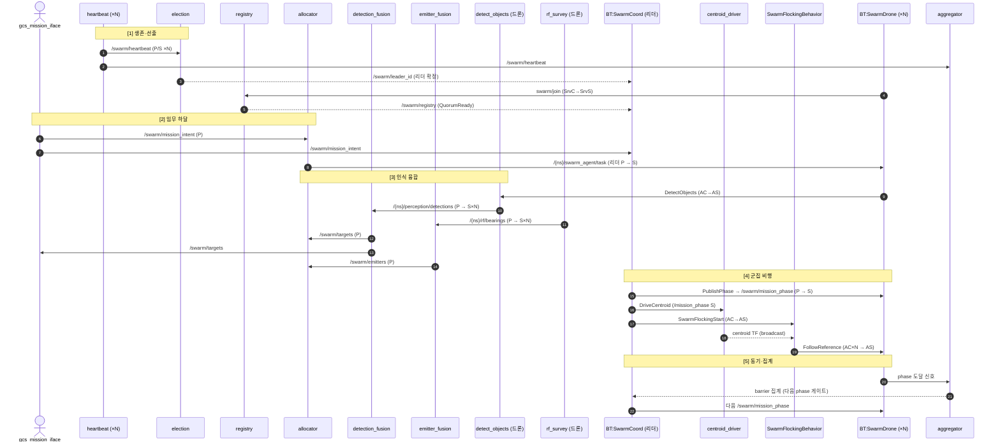

# 군집 정찰 시스템 — 데이터 흐름 시퀀스 다이어그램

> `AS2_SWARM_PACKAGE_ARCHITECTURE.md` §3 노드↔인터페이스 매트릭스의 데이터 흐름을 시간순 시퀀스로 표현.
> 근거: `AS2_SWARM_PACKAGE_ARCHITECTURE.md`, `AS2_SWARM_INTERFACE_SPEC.md`, AS2 실코드.

---

## 시퀀스 (5 흐름)

---

## 읽는 법

- **실선 화살표(`->>`)** = 능동 호출: topic publish, action goal, service request.
- **점선 화살표(`-->>`)** = 결과/상태 반환: leader_id, registry, centroid TF, barrier 집계.
- **centroid = TF broadcast** (topic 아님, 실코드 정합).
- **리더 전용 인터페이스**(registry / swarm_agent/task / mission_phase) = 선출 후 리더만 발행 (단일 생산자, split-brain 방지).
- **barrier(aggregator)** = phase 전환 게이트. 흐름 [4]↔[5] 반복하며 임무 진행.

## 흐름 요약

| # | 흐름 | 트리거 | 산출 |
|---|---|---|---|
| 1 | 생존·선출 | 각 드론 heartbeat | leader_id, registry(quorum) |
| 2 | 임무 하달 | GCS mission_intent | swarm_agent/task (드론별 분배) |
| 3 | 인식 융합 | BT가 detect/rf 기동 | targets, emitters |
| 4 | 군집 비행 | 리더 BT phase 전환 | FollowReference (N드론 추종) |
| 5 | 동기·집계 | 드론 phase 도달 | barrier → 다음 phase |

---

_근거: `AS2_SWARM_PACKAGE_ARCHITECTURE.md` §3·§6, `AS2_SWARM_INTERFACE_SPEC.md`, AS2 실코드(`as2_behaviors_swarm_flocking`)._
