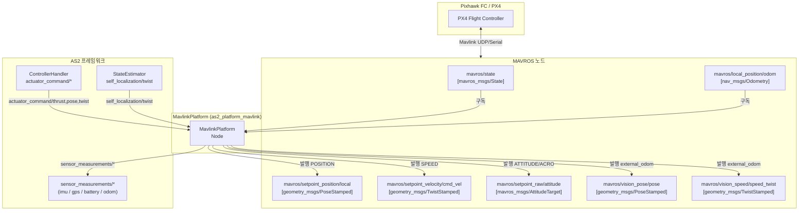

# as2_platform_mavlink 패키지 분석

## 1. 패키지 개요

| 항목 | 내용 |
|---|---|
| 버전 | `1.1.0` |
| 역할 | Mavlink 기반 드론(Pixhawk)과 AS2 프레임워크 사이의 브릿지 |
| 핵심 의존성 | `as2_core`, `mavros`, `mavros_msgs`, `mavros_extras` |
| 빌드 결과물 | 실행 노드 (`as2_platform_mavlink_node`) + 정적 라이브러리 |

---

## 2. 전체 아키텍처

```
[Pixhawk FC / PX4]
       ↕  Mavlink 프로토콜 (UDP/Serial)
  [MAVROS 노드]          ← 외부 패키지, 실제 Mavlink 처리
       ↕  ROS2 topics / services
  [MavlinkPlatform]     ← as2_platform_mavlink 의 핵심 노드
       ↕  AS2 표준 topics
  [AS2 프레임워크]
  (ControllerHandler / StateEstimator / Behaviors...)
```

`MavlinkPlatform`은 Mavlink 프로토콜을 **직접 처리하지 않으며**, MAVROS ↔ AS2 사이의 **변환 브릿지** 역할만 담당합니다.

---

## 3. 클래스 구조

```
rclcpp::Node
    └── as2::Node
            └── as2::AerialPlatform          ← AS2 플랫폼 추상 기반 클래스
                    └── MavlinkPlatform       ← 실제 구현체
                            ├── configureSensors()
                            ├── ownSetArmingState()
                            ├── ownSetOffboardControl()
                            ├── ownSetPlatformControlMode()
                            ├── sendCommand()          ← 100Hz 주기 호출
                            └── ownSendCommand()       ← 제어 모드별 MAVROS 발행
```

---

## 4. 지원 제어 모드 (`control_modes.yaml`)

| 비트 플래그 | 제어 모드 | Yaw 모드 | 좌표계 |
|---|---|---|---|
| `0b00000000` | UNSET | - | - |
| `0b00100100` | **ACRO** | YAW_SPEED | LOCAL_FLU |
| `0b00110001` | **ATTITUDE** | YAW_ANGLE | LOCAL_FLU |
| `0b01000101` | **SPEED** | YAW_SPEED | GLOBAL_ENU |
| `0b01100001` | **POSITION** | YAW_ANGLE | GLOBAL_ENU |

> TRAJECTORY, HOVER, SPEED_IN_A_PLANE 등은 주석 처리(미지원)

---

## 5. 메시지 인터페이스

### MAVROS → MavlinkPlatform (구독)

| 토픽 | 타입 | 목적 |
|---|---|---|
| `mavros/state` | `mavros_msgs/State` | 연결·무장·오프보드 상태 수신 |
| `mavros/local_position/odom` | `nav_msgs/Odometry` | 비행체 위치·속도 수신 → `sensor_measurements/odom` 재발행 |

### MavlinkPlatform → MAVROS (발행)

| 토픽 | 타입 | 사용 제어 모드 |
|---|---|---|
| `mavros/setpoint_position/local` | `geometry_msgs/PoseStamped` | POSITION |
| `mavros/setpoint_velocity/cmd_vel` | `geometry_msgs/TwistStamped` | SPEED |
| `mavros/setpoint_raw/attitude` | `mavros_msgs/AttitudeTarget` | ATTITUDE / ACRO |
| `mavros/vision_pose/pose` | `geometry_msgs/PoseStamped` | external_odom=true 시 |
| `mavros/vision_speed/speed_twist` | `geometry_msgs/TwistStamped` | external_odom=true 시 |

### AS2 → MavlinkPlatform (구독)

| 토픽 | 타입 | 목적 |
|---|---|---|
| `self_localization/twist` | `geometry_msgs/TwistStamped` | external_odom=true 시 TF 변환 후 MAVROS vision 토픽으로 전달 |
| `actuator_command/thrust` | `as2_msgs/Thrust` | 부모 클래스 AerialPlatform이 수신, `command_thrust_msg_` 저장 |
| `actuator_command/pose` | `geometry_msgs/PoseStamped` | 부모 클래스 수신, `command_pose_msg_` 저장 |
| `actuator_command/twist` | `geometry_msgs/TwistStamped` | 부모 클래스 수신, `command_twist_msg_` 저장 |

### MavlinkPlatform → AS2 (발행, 센서)

| 토픽 | 타입 |
|---|---|
| `sensor_measurements/imu` | `sensor_msgs/Imu` |
| `sensor_measurements/battery` | `sensor_msgs/BatteryState` |
| `sensor_measurements/gps` | `sensor_msgs/NavSatFix` |
| `sensor_measurements/odom` | `nav_msgs/Odometry` |

> MAVROS launch에서 remapping으로 처리: `imu/data → /{ns}/sensor_measurements/imu` 등

---

## 6. 서비스 인터페이스

| 서비스 | 타입 | 호출 시점 |
|---|---|---|
| `mavros/cmd/arming` | `mavros_msgs/CommandBool` | `ownSetArmingState()` |
| `mavros/set_mode` | `mavros_msgs/SetMode` | `ownSetOffboardControl()` → OFFBOARD 전환 |
| `mavros/cmd/command` | `mavros_msgs/CommandLong` | `ownKillSwitch()` → `MAV_CMD_COMPONENT_ARM_DISARM(0, 21196)` |

---

## 7. Thrust 정규화 로직

```cpp
// mavlink_platform.cpp:210
auto thrust_normalized = this->command_thrust_msg_.thrust / max_thrust_;
thrust_normalized = std::clamp<float>(thrust_normalized, min_thrust_, 1.0);
```

- AS2의 물리 단위 추력(N)을 MAVROS 입력 범위 `[min_thrust, 1.0]`으로 정규화
- 파라미터: `max_thrust=15.0N`, `min_thrust=0.15`

---

## 8. External Odometry 모드 (`external_odom=true`)

```
[외부 MoCap / 비전 시스템]
        ↓  self_localization/twist (AS2 표준)
[MavlinkPlatform::externalOdomCb()]
        → TF 변환 (base_link ↔ odom 프레임)
        ↓  10ms 타이머 (100Hz)
mavros/vision_pose/pose       →  Pixhawk EKF 융합
mavros/vision_speed/speed_twist  →  Pixhawk EKF 융합
```

`external_odom=false`(기본값)이면 Pixhawk 내장 EKF만 사용하고, vision 토픽은 발행하지 않습니다.

---

## 9. sendCommand() 안전 로직

```cpp
// mavlink_platform.cpp:199
void MavlinkPlatform::sendCommand() {
    if (!getArmingState() || !getOffboardMode() || !has_mode_settled_) {
        mavlink_publishRatesSetpoint(0.0, 0.0, 0.0, min_thrust_);  // 안전 hold
    }
    ownSendCommand();
}
```

무장 미완료 / 오프보드 미전환 / 제어 모드 미설정 상태에서는 최소 추력으로 rates=0 명령을 강제 발행합니다.

---

## 10. 설정 파일

### `platform_config_file.yaml`

```yaml
cmd_freq: 100.0       # 제어 명령 주기 (Hz)
info_freq: 10.0       # platform/info 발행 주기 (Hz)
max_thrust: 15.0      # 최대 추력 (N)
min_thrust: 0.15      # 최소 추력 정규화 하한
external_odom: false  # 외부 오도메트리 사용 여부
```

### `mavros_config.yaml` — 드론별 FCU UDP 포트 설정

```yaml
drone0:  fcu_url: "udp://:14540@127.0.0.1:14557"  # tgt_system: 1
drone1:  fcu_url: "udp://:14541@127.0.0.1:14558"  # tgt_system: 2
drone2:  fcu_url: "udp://:14542@127.0.0.1:14559"  # tgt_system: 3
drone3:  fcu_url: "udp://:14543@127.0.0.1:14560"  # tgt_system: 4
```

---

## 11. 런치 파일 구성

| 파일 | 역할 |
|---|---|
| `as2_platform_mavlink_launch.py` | `MavlinkPlatform` 노드 단독 실행 |
| `mavros_launch.py` | MAVROS 노드 실행 + sensor 토픽 remapping 처리 |

두 런치 파일을 **분리 운영**하여 MAVROS와 MavlinkPlatform을 독립적으로 기동/재기동할 수 있습니다.

---

## 12. 메시지 흐름 다이어그램


