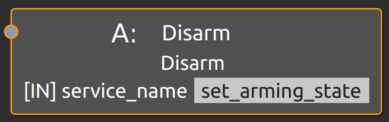
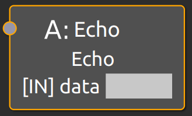
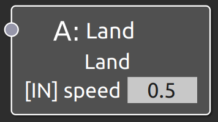
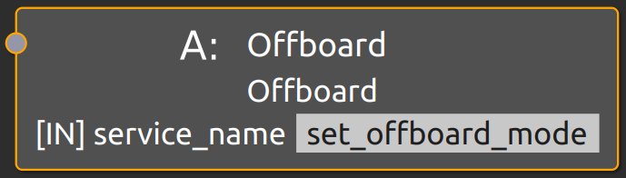
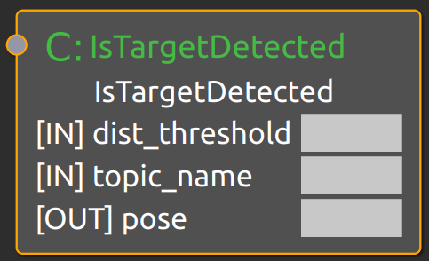

# as2_behavior_tree
This module is used to implement a ROS2 node that executes navigation Behavior Trees for navigation of drone systems. The `behavior_trees` module uses the [Behavior-Tree.CPP library](https://github.com/BehaviorTree/BehaviorTree.CPP) for the core Behavior Tree processing.

The `behavior_trees` module provides navigation-specific behavior tree nodes and a ROS2 node implementation and launchers. It uses [nav2_behavior_tree](https://github.com/ros-planning/navigation2/tree/main/nav2_behavior_tree) C++ template class for easily integrating ROS2 actions and services into Behavior Trees,

## Index
- [Installation](#installation)
- [AeroStack2 BT Nodes](#aerostack2-bt-nodes)
    - [Action](#action)
    - [Condition](#condition)
    - [Control](#control)
    - [Decorator](#decorator)
- [How to create new nodes?](#how-to-create-new-nodes)

## Installation
Dependencies:
```bash
sudo apt-get install ros-$ROS_DISTRO-behaviortree-cpp-v3
sudo apt-get install ros-$ROS_DISTRO-nav2-msgs
sudo apt-get install ros-$ROS_DISTRO-nav2-behavior-tree
```

You may also want to install [Groot](https://github.com/BehaviorTree/Groot) to build your own trees.

## AeroStack2 BT Nodes
AeroStack2 offers a pull of predefined behavior nodes to build your own Behavior Tree.

### Action

<details>
<summary>Show Actions</summary>
<br>

#### Arm
Arms the drone. Input port is not intended to use by the user, but used because `nav2_behavior_tree` service action node implementation.

Returns **SUCCESS** if service result is true. Otherwise, returns **FAILURE**.


| Port | In / Out | Description |
| --- | --- | --- |
| service_name | In | Service name which will be called. |

#### Disarm
Disarms the drone. Input port is not intended to use by the user, but used because `nav2_behavior_tree` service action node implementation.

Returns **SUCCESS** if service result is true. Otherwise, returns **FAILURE**.



| Port | In / Out | Description |
| --- | --- | --- |
| service_name | In | Service name which will be called. |

#### Echo
Prints data getted by input port. Used for debugging purpouses.

Always returns **SUCCESS** after echoing.



| Port | In / Out | Description |
| --- | --- | --- |
| data | In | String to be echoed. |

#### FollowPath
**TBD**

#### GoTo
Go to specified position with given maximum speed and yaw.

Returns **SUCCESS** if action finishes successfully or cancelled. Returns **FAILURE** if action is aborted, goal is rejected or action server fails. While action is executing returns **RUNNING**.


| Port | In / Out | Description |
| --- | --- | --- |
| max_speed | In | Maximum speed in meters per second. |
| pose | In | Goal pose in meters (e.g. `x;y;z`). |
| yaw_angle | In | Yaw angle in radians. |
| yaw_mode | In | Yaw mode (KEEP_YAW = 0; PATH_FACING = 1; FIXED_YAW = 2). |

#### GoTo GPS
Go to specified GPS position with given maximum speed and yaw.

Returns **SUCCESS** if action finishes successfully or cancelled. Returns **FAILURE** if action is aborted, goal is rejected or action server fails. While action is executing returns **RUNNING**.


| Port | In / Out | Description |
| --- | --- | --- |
| alittude | In | Altitude in meters. |
| latitude | In | Latitude in degrees. |
| longitude | In | Longitude in degrees. |
| max_speed | In | Maximum speed in meters per second. |
| yaw_angle | In | Yaw angle in radians. |
| yaw_mode | In | Yaw mode (KEEP_YAW = 0; PATH_FACING = 1; FIXED_YAW = 2). |

#### Land
Land at current position with given speed.

Returns **SUCCESS** if action finishes successfully or cancelled. Returns **FAILURE** if action is aborted, goal is rejected or action server fails. While action is executing returns **RUNNING**.



| Port | In / Out | Description |
| --- | --- | --- |
| speed | In | Land speed in meters per second. |

#### Offboard
Set offboard mode. Input port is not intended to use by the user, but used because `nav2_behavior_tree` service action node implementation.

Returns **SUCCESS** if service result is true. Otherwise, returns **FAILURE**.



| Port | In / Out | Description |
| --- | --- | --- |
| service_name | In | Service name which will be called. |

#### SendEvent
Send event by topic.

Always returns **SUCCESS** after sending the event.


| Port | In / Out | Description |
| --- | --- | --- |
| data | In | Data to send (string). |
| topic_name | In | Topic name where data will be sent. |

#### Takeoff
Takeoff at current position with given height and speed.

Returns **SUCCESS** if action finishes successfully or cancelled. Returns **FAILURE** if action is aborted, goal is rejected or action server fails. While action is executing returns **RUNNING**.


| Port | In / Out | Description |
| --- | --- | --- |
| height | In | Takeoff height in meters. |
| speed | In | Takeoff speed in meters per second. |

</details>

### Condition
<details>
<summary>Show Conditions</summary>
<br>

#### IsFlying
Returns wheter the drone is flying or not.

Returns **SUCCESS** is drone state is flying, otherwise returns **FAILURE**.


<!-- ##### IsTargetDetected
Returns wheter the target detected in topic is inside threshold or not.

Returns **SUCCESS** if target is inside threshold, otherwise returns **RUNNING**.



| Port | In / Out | Description |
| --- | --- | --- |
| dist_threshold | In | Distance threshold in meters. |
| topic_name | In | Topic name of PoseStamped target. |
| pose | Out | Position of target. | -->

</details>


### Control
**-**

### Decorator
<details>
<summary>Show Decorators</summary>
<br>

#### WaitForEvent
Listens for event received in topic and outputs event msg content.

Returns **SUCCESS** on first event received, until that returns **RUNNING**.


| Port | In / Out | Description |
| --- | --- | --- |
| topic_name | In | Topic name where event will be published. |
| result | Out | Content of event msg. |

</details>


## How to create new nodes?
Three steps:
1. Implement your BT Node. You might want to use [Action](include/behavior_trees/bt_action_node.hpp) and [Service](include/behavior_trees/bt_service_node.hpp) BT handlers.
2. Register your Node into the BT [factory](src/behavior_trees_node.cpp).
2. Create the XML definition with Groot and build your new tree.
