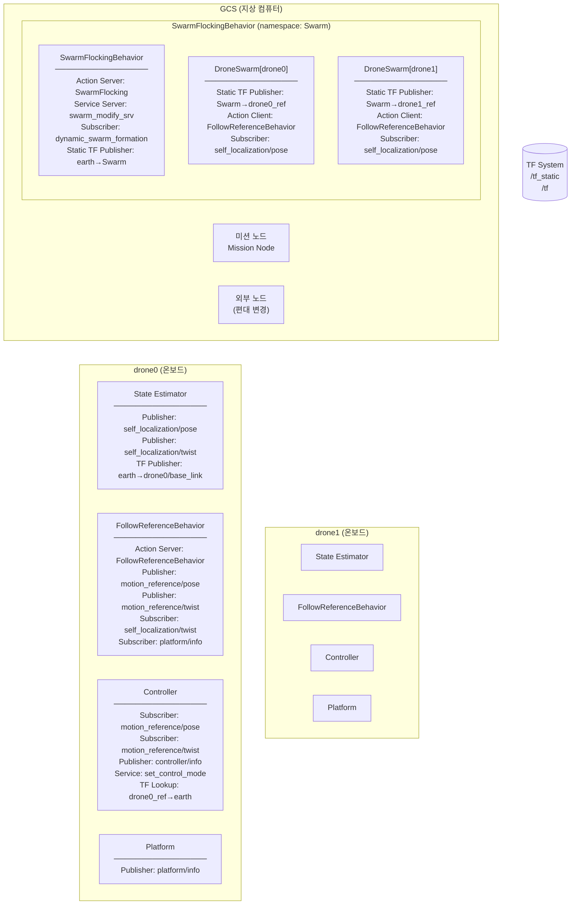
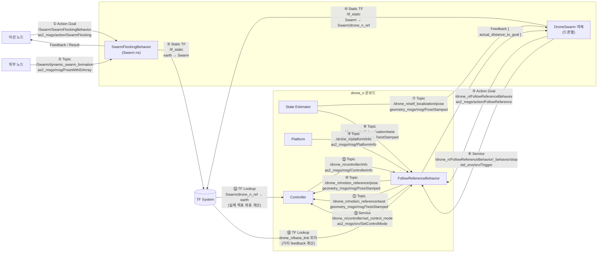

# as2_behaviors_swarm_flocking 노드 간 메시지 흐름

---

## 1. 전체 노드 구성



---

## 2. 메시지 흐름 전체도



---

## 3. 메시지별 상세 내용

### ① `/Swarm/SwarmFlockingBehavior` — Action (GCS 진입점)

| 방향 | 데이터 |
|---|---|
| Goal (미션 → SFB) | `virtual_centroid`: PoseStamped (기준 프레임 + 무게중심 오프셋)<br>`swarm_formation[]`: PoseWithID[] (드론 ID + 편대 오프셋)<br>`drones_namespace[]`: string[] (드론 네임스페이스 목록) |
| Feedback (SFB → 미션) | `swarm_pose`: Pose (현재 스웜 위치) |
| Result (SFB → 미션) | `swarm_success`: bool |

### ② `/Swarm/dynamic_swarm_formation` — Topic

```
as2_msgs/msg/PoseWithIDArray
  └─ poses[]:
       ├─ id: "drone1"           (변경할 드론 ID)
       └─ pose: geometry_msgs/Pose  (새 편대 오프셋)
```
실행 중 개별 드론 편대 위치만 동적 변경할 때 사용.

### ③④ `/tf_static` — Static TF

```
③ SwarmFlockingBehavior 발행:
   parent: virtual_centroid.header.frame_id  (예: "earth")
   child:  "Swarm"
   translation: virtual_centroid.pose.position  (무게중심 위치)

④ DroneSwarm 발행:
   parent: "Swarm"
   child:  "Swarm/drone_n_ref"
   translation: swarm_formation[n].pose.position  (편대 오프셋)
```

### ⑤ `/drone_n/FollowReferenceBehavior` — Action

| 방향 | 데이터 |
|---|---|
| Goal (DS → FRB) | `target_pose.header.frame_id`: `"Swarm/drone_n_ref"`<br>`target_pose.point`: (0, 0, 0) — 항상 원점<br>`yaw.mode`: KEEP_YAW<br>`max_speed_x/y/z`: 15.0 m/s |
| Feedback (FRB → DS) | `actual_speed`: float (현재 속도 m/s)<br>`actual_distance_to_goal`: float (목표까지 거리 m) |
| Result (FRB → DS) | `follow_reference_success`: bool |

> **핵심**: 좌표 `(0,0,0)`은 항상 고정. 실제 위치는 `frame_id`인 TF 프레임이 결정.

### ⑦ `/drone_n/self_localization/pose` — Topic

```
geometry_msgs/msg/PoseStamped
  └─ DroneSwarm가 구독 → checkPosition() 에서 거리 계산용
     (feedback.actual_distance_to_goal < 0.3m 판정)
```

### ⑩ `/drone_n/motion_reference/pose` — Topic

```
geometry_msgs/msg/PoseStamped
  ├─ header.frame_id: "Swarm/drone_n_ref"   ← TF 변환 없이 그대로 전달
  ├─ pose.position: (0.0, 0.0, 0.0)
  └─ pose.orientation: (yaw 각도 포함 쿼터니언)
```
Controller가 이 `frame_id`를 TF 조회해서 earth 좌표로 변환.

### ⑪ `/drone_n/motion_reference/twist` — Topic

```
geometry_msgs/msg/TwistStamped
  ├─ header.frame_id: "earth"
  └─ twist.linear: (max_speed_x, max_speed_y, max_speed_z)  ← 속도 제한
```

### ⑭ TF Lookup — Controller 수행

```
조회: "Swarm/drone_n_ref" 프레임의 (0,0,0) → earth 좌표

TF 체인 역추적:
  earth
    └─ Swarm               (③에서 발행된 virtual_centroid 오프셋)
          └─ Swarm/drone_n_ref  (④에서 발행된 편대 오프셋)

결과: earth 기준 실제 목표 좌표 = virtual_centroid + formation_offset
```

---

## 4. 실행 상태별 활성 메시지 흐름

```
[초기화 시점]
미션 노드 ──①──▶ SwarmFlockingBehavior
                        │
                    ③④ TF 발행 ──▶ /tf_static
                        │
                    ⑤ Action ──▶ FollowReferenceBehavior × N개
                        ▲
                    ⑦ pose ─────── State Estimator (checkPosition 용)

[실행 중 (10Hz 루프)]
FollowReferenceBehavior ──⑩⑪──▶ Controller
                                      │
                                  ⑭ TF 조회 ◀── /tf_static (캐싱)
        ▲                             │
    ⑧ twist                      비행 제어기
    State Estimator
        ▲
    ⑨ platform/info
    Platform

[동적 편대 변경]
외부 노드 ──②──▶ SwarmFlockingBehavior
                        │
                    ④ TF 재발행 ──▶ /tf_static 갱신
                        │
                    ⑤ Action 재전송 ──▶ FollowReferenceBehavior

[중단/Hover 시]
DroneSwarm ──⑥ stop 서비스──▶ FollowReferenceBehavior
                                    │
                               sendHover() 호출
                                    │
                              motion_reference/twist (0속도) ──▶ Controller
```

---

## 5. 메시지 일람표

| # | 경로 | 타입 | 방식 | 방향 |
|---|---|---|---|---|
| ① | `/Swarm/SwarmFlockingBehavior` | `as2_msgs/action/SwarmFlocking` | Action | 미션 → SFB |
| ② | `/Swarm/dynamic_swarm_formation` | `as2_msgs/msg/PoseWithIDArray` | Topic | 외부 → SFB |
| ③ | `/tf_static` (earth → Swarm) | `tf2_msgs/msg/TFMessage` | Static TF | SFB → TF |
| ④ | `/tf_static` (Swarm → drone_n_ref) | `tf2_msgs/msg/TFMessage` | Static TF | DroneSwarm → TF |
| ⑤ | `/drone_n/FollowReferenceBehavior` | `as2_msgs/action/FollowReference` | Action | DroneSwarm → FRB |
| ⑥ | `/drone_n/FollowReferenceBehavior/_behavior/stop` | `std_srvs/srv/Trigger` | Service | DroneSwarm → FRB |
| ⑦ | `/drone_n/self_localization/pose` | `geometry_msgs/msg/PoseStamped` | Topic | SE → DroneSwarm |
| ⑧ | `/drone_n/self_localization/twist` | `geometry_msgs/msg/TwistStamped` | Topic | SE → FRB |
| ⑨ | `/drone_n/platform/info` | `as2_msgs/msg/PlatformInfo` | Topic | Platform → FRB |
| ⑩ | `/drone_n/motion_reference/pose` | `geometry_msgs/msg/PoseStamped` | Topic | FRB → CTL |
| ⑪ | `/drone_n/motion_reference/twist` | `geometry_msgs/msg/TwistStamped` | Topic | FRB → CTL |
| ⑫ | `/drone_n/controller/info` | `as2_msgs/msg/ControllerInfo` | Topic | CTL → FRB |
| ⑬ | `/drone_n/controller/set_control_mode` | `as2_msgs/srv/SetControlMode` | Service | FRB → CTL |
| ⑭ | TF Lookup (drone_n_ref → earth) | tf2 | TF Lookup | TF → CTL |
| ⑮ | TF Lookup (base_link 위치) | tf2 | TF Lookup | TF → FRB |
