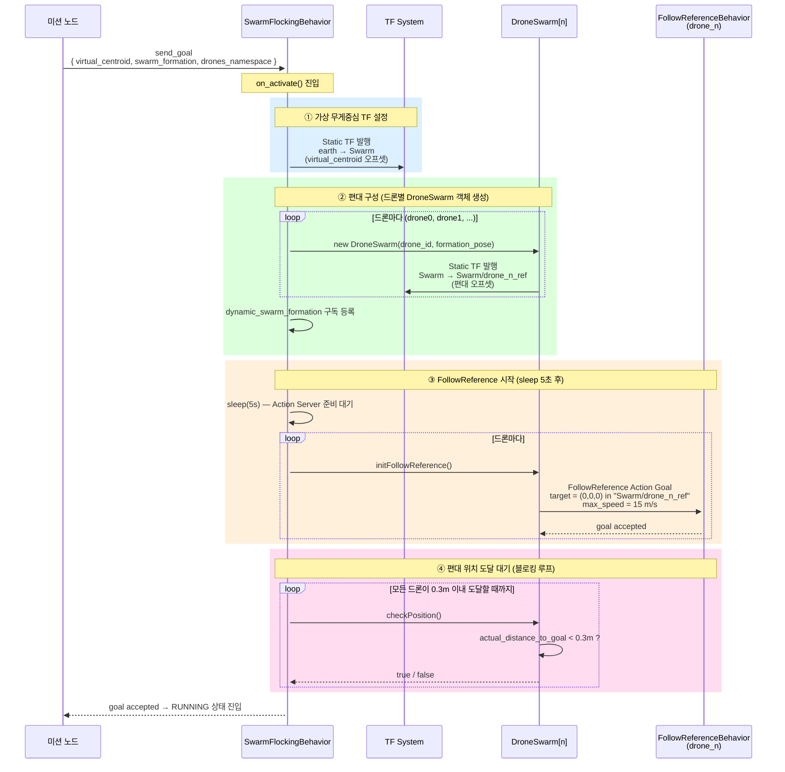
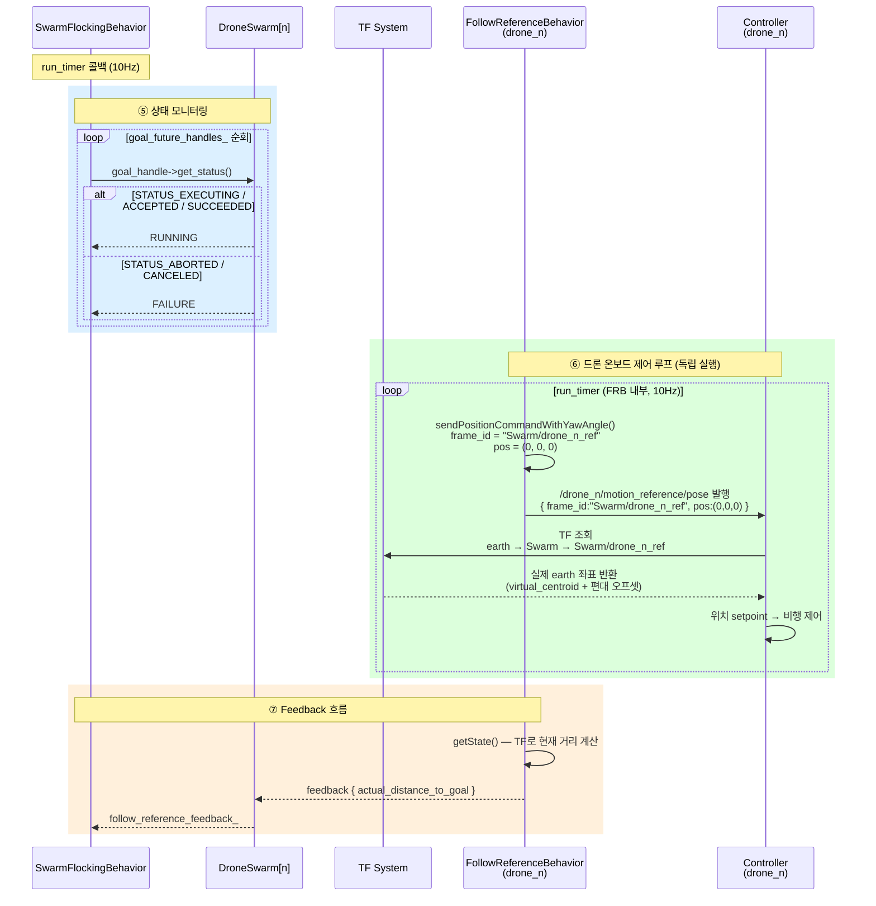
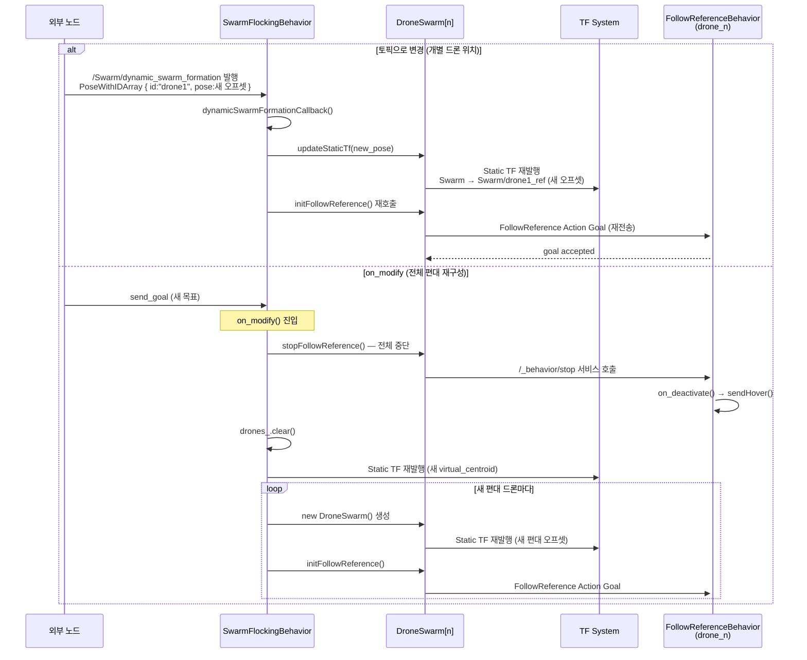

# as2_behaviors_swarm_flocking 동작 시퀀스

## 전체 구성 요소

```
[미션 노드]          GCS 측 실행
[SwarmFlockingBehavior]   GCS 측 실행  (namespace: Swarm)
[DroneSwarm 객체]    SwarmFlockingBehavior 내부 객체 (드론별 1개)
[TF System]          ROS 2 TF 브로드캐스트 / 버퍼
[FollowReferenceBehavior]  드론 온보드 실행 (드론별 1개)
[Controller]         드론 온보드 실행 (드론별 1개)
```

---

## Phase 1. 초기화 (on_activate)



---

## Phase 2. 실행 루프 (on_run)



---

## Phase 3. 동적 편대 변경



---

## Phase 4. 일시정지 / 재개 / 종료

```mermaid
sequenceDiagram
    participant M   as 미션 노드
    participant SFB as SwarmFlockingBehavior
    participant DS  as DroneSwarm[n]
    participant TF  as TF System
    participant FRB as FollowReferenceBehavior<br/>(drone_n)

    alt 일시정지 (on_pause)
        M   ->> SFB : /_behavior/pause 서비스 호출
        SFB ->> TF  : lookupTransform(earth → Swarm)<br/>현재 Swarm 위치 읽기
        SFB ->> TF  : Static TF 재발행 (현재 위치로 고정)<br/>earth → Swarm (현재값으로 덮어쓰기)
        loop 드론마다
            SFB ->> DS  : stopFollowReference()
            DS  ->> FRB : /_behavior/stop 서비스 호출
            FRB ->> FRB : on_deactivate() → sendHover()
        end
        SFB ->> SFB : goal_future_handles_.clear()
    else 재개 (on_resume)
        M   ->> SFB : /_behavior/resume 서비스 호출
        SFB ->> TF  : Static TF 재발행 (goal_.virtual_centroid)
        loop 드론마다
            SFB ->> DS  : initFollowReference()
            DS  ->>+ FRB: FollowReference Action Goal
            FRB -->> DS : goal accepted
        end
    else 종료 (on_execution_end)
        M   ->> SFB : cancel_goal 또는 abort
        Note over SFB: on_execution_end() 진입
        loop 드론마다
            SFB ->> DS  : stopFollowReference()
            DS  ->> FRB : /_behavior/stop 서비스 호출
            FRB ->> FRB : on_deactivate() → sendHover()
        end
        SFB -->>- M  : result { swarm_success }
    end
```

---

## TF 트리 구조 (실행 중 상태)

```
earth (글로벌 기준 프레임)
  │
  └── Swarm                     ← SwarmFlockingBehavior 발행 (virtual_centroid)
        │                          frame_id: virtual_centroid.header.frame_id
        │                          translation: virtual_centroid.pose.position
        │
        ├── Swarm/drone0_ref    ← DroneSwarm[drone0] 발행 (편대 오프셋)
        │                          translation: swarm_formation[0].pose.position
        │
        ├── Swarm/drone1_ref    ← DroneSwarm[drone1] 발행
        │                          translation: swarm_formation[1].pose.position
        │
        └── Swarm/drone2_ref    ← DroneSwarm[drone2] 발행
                                   translation: swarm_formation[2].pose.position

※ 모든 TF는 Static TF — 한 번 발행 후 각 드론 TF buffer에 영구 캐싱
※ virtual_centroid.frame_id 를 drone0/base_link 로 설정하면 리더-팔로워 구조
```

---

## 컨트롤 명령 데이터 흐름

```
SwarmFlockingBehavior
  └─ Static TF 발행: earth→Swarm→drone_n_ref  ← 위치 정보가 여기에 인코딩됨
  └─ FollowReference Goal: target=(0,0,0) in "Swarm/drone_n_ref"
                              │
                              ▼
FollowReferenceBehavior (drone_n)
  └─ /drone_n/motion_reference/pose 발행
       { frame_id: "Swarm/drone_n_ref", position: (0,0,0) }  ← TF 변환 없이 그대로 발행
                              │
                              ▼
Controller (drone_n)
  └─ TF 조회: "Swarm/drone_n_ref" (0,0,0) → earth 좌표 변환
       = virtual_centroid 위치 + 편대 오프셋
  └─ 위치 setpoint → 비행 제어기 전송
```
