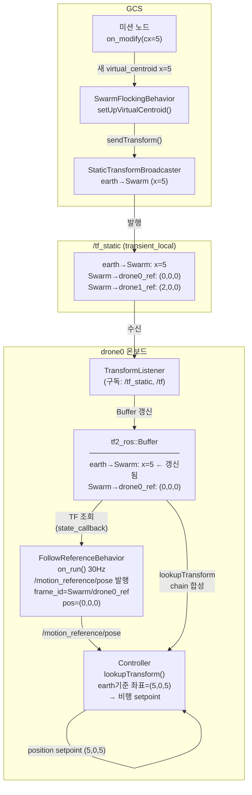

# 편대 전진 이동: TF 변경·발행·참조 구조

---

## 1. 전진 이동의 두 가지 방식

현재 코드에서 편대 전체가 전진하려면 **`Swarm` TF 위치를 변경**해야 한다.  
코드상 Swarm TF가 갱신되는 경로는 두 가지다.

| 방식 | 트리거 | 특성 |
|---|---|---|
| **A. 외부 on_modify** | 미션 노드가 새 `virtual_centroid`로 goal 재전송 | 불연속 이동 (step 단위) |
| **B. 리더 드론 TF 연동** | `virtual_centroid.frame_id = "drone0/base_link"` 설정 | 연속 이동 (드론이 움직이면 자동 갱신) |

---

## 2. 방식 A: on_modify로 전진

### GCS 측 TF 변경 흐름

```
미션 노드
  │
  │  send_goal (새 virtual_centroid.position.x = 이전 + Δx)
  ▼
SwarmFlockingBehavior::on_modify()
  │
  ├─ setUpVirtualCentroid(new_virtual_centroid)
  │    [swarm_flocking_behavior.cpp:58-78]
  │
  │    transform_->header.frame_id = "earth"
  │    transform_->child_frame_id  = "Swarm"
  │    transform_->transform.translation.x = new_cx   ← 새 x 위치
  │    transform_->transform.translation.y = cy
  │    transform_->transform.translation.z = cz
  │
  └─ tfstatic_swarm_broadcaster_->sendTransform(*transform_)
       │
       └─ /tf_static 토픽에 발행
            QoS: transient_local (latched)
```

**Static TF 재발행 시 기존 값 덮어쓰기:**  
`StaticTransformBroadcaster`는 동일한 `parent/child` 쌍으로 재발행하면  
`/tf_static` 큐에서 이전 값을 교체한다. 신규 구독자도 항상 최신 값을 수신한다.

---

## 3. 방식 B: 리더 드론 TF 연동으로 자동 전진

```
virtual_centroid 설정:
  frame_id  = "drone0/base_link"   ← 리더 드론의 동적 TF 프레임
  position  = (0, 0, 0)            ← 리더 드론 중심을 무게중심으로

결과 TF 체인:
  earth
    └─ drone0/base_link  ← State Estimator가 실시간 발행하는 동적 TF
         └─ Swarm        ← Static TF (drone0/base_link 기준 오프셋)
              ├─ Swarm/drone1_ref
              └─ Swarm/drone2_ref

drone0가 앞으로 이동하면:
  → earth → drone0/base_link TF 실시간 갱신 (State Estimator)
  → Swarm 위치 자동 변경
  → Swarm/drone1_ref, Swarm/drone2_ref 위치 자동 변경
  → drone1, drone2가 자동으로 따라감
```

---

## 4. `/tf_static` QoS 특성과 드론 수신 구조

### `/tf_static` 토픽 QoS

```
Durability: TRANSIENT_LOCAL (latched)
  → 구독자가 나중에 연결돼도 마지막 발행된 모든 static TF 수신
  → Static TF 재발행 시 동일 parent/child 쌍은 최신 값으로 대체

Reliability: RELIABLE
  → 손실 없이 전달 보장
```

### 드론 온보드 TF 수신 구조

```cpp
// as2_core/src/utils/tf_utils.cpp:105-122
TfHandler::TfHandler(as2::Node * _node)
{
  tf_buffer_  = std::make_shared<tf2_ros::Buffer>(_node->get_clock());
  tf_listener_ = std::make_shared<tf2_ros::TransformListener>(*tf_buffer_);
  // tf_timeout_threshold = 50ms (파라미터)
}
```

`TransformListener`는 내부적으로 `/tf`와 `/tf_static` 양쪽을 구독한다.

```
[드론 온보드]

/tf_static ──(구독)──▶ tf2_ros::TransformListener
                               │
                               │ 수신한 transform을 buffer에 저장
                               ▼
                    tf2_ros::Buffer (메모리 내 캐시)
                      ├─ earth → Swarm           (최신값 유지)
                      ├─ Swarm → Swarm/drone0_ref (최신값 유지)
                      ├─ earth → drone0/base_link (동적 TF, 시간별 이력)
                      └─ ... (기타 TF)

/tf ────────(구독)──▶ tf2_ros::TransformListener
                               │ (동적 TF: 시간 이력 보관, 기본 10초)
                               ▼
                    tf2_ros::Buffer
```

**Static TF는 만료 없이 영구 보관** — 시간 이력 없이 최신값 1개만 유지.

---

## 5. 드론 온보드에서 TF를 참조하는 구조

### FollowReferenceBehavior 내 TfHandler

```
FollowReferenceBehavior
  ├─ tf_handler_  (TfHandler)
  │    ├─ tf_buffer_  : Buffer
  │    └─ tf_listener_: TransformListener ── /tf_static, /tf 구독
  │
  └─ [state_callback, 30Hz]
       tf_handler_->getState(twist, "earth", "Swarm/drone0_ref", "drone0/base_link")
         │
         └─ 내부: tf_buffer_->lookupTransform(...)
              → "Swarm/drone0_ref" 기준 드론 위치 계산
              → actual_distance_to_goal (feedback용)
```

### Controller 내 TF 조회

```
[FollowReferenceBehavior가 발행한 /motion_reference/pose]
  frame_id = "Swarm/drone0_ref"
  position = (0, 0, 0)
       │
       ▼
Controller (각 드론 온보드)
  자체 tf_buffer_ 보유
       │
       └─ lookupTransform("earth", "Swarm/drone0_ref", TimePointZero)
            │
            └─ Buffer에서 TF 체인 조합:
                 earth → Swarm:              (cx_new, cy, cz)  ← 새 위치
                 Swarm → Swarm/drone0_ref:   (f0x,   f0y, f0z)
                 ──────────────────────────────────────────────
                 결과:  earth 기준 (cx_new+f0x, cy+f0y, cz+f0z)
       │
       └─ position setpoint → 비행 제어기
```

---

## 6. 전진 이동 전체 타이밍 흐름

```
[t=0] 현재 상태: 편대 x=0 위치에서 호버링

미션 노드                SwarmFlocking             /tf_static           드론 온보드 (drone0)
    │                        │                         │                       │
    │──send_goal(cx=5)──────▶│                         │                       │
    │   virtual_centroid.x=5 │                         │                       │
    │                        │                         │                       │
    │                        │─setUpVirtualCentroid()  │                       │
    │                        │─sendTransform──────────▶│ earth→Swarm x=5       │
    │                        │                         │ (이전 x=0 덮어쓰기)   │
    │                        │                         │                       │
    │                        │                         │──/tf_static 발행──────▶│
    │                        │                         │ (transient_local)     │
    │                        │                         │                 TransformListener 수신
    │                        │                         │                 Buffer 갱신: Swarm x=5
    │                        │                         │                       │
    │                        │                         │         [다음 FollowRef on_run()]
    │                        │                         │         /motion_reference/pose 발행
    │                        │                         │         frame_id="Swarm/drone0_ref"
    │                        │                         │         position=(0,0,0)
    │                        │                         │                       │
    │                        │                         │                Controller TF 조회
    │                        │                         │                lookupTransform(
    │                        │                         │                  "earth",
    │                        │                         │                  "Swarm/drone0_ref")
    │                        │                         │                → (5+0, 0+0, 5+0)
    │                        │                         │                = (5, 0, 5) ← 새 목표
    │                        │                         │                       │
    │                        │                         │                비행 제어기 setpoint=(5,0,5)
    │                        │                         │                drone0 이동 시작 →
```

---

## 7. Buffer에서 TF 체인 합성 과정

`lookupTransform("earth", "Swarm/drone0_ref", TimePointZero)` 호출 시  
Buffer 내부에서 수행하는 체인 탐색:

```
요청: "earth" 기준으로 "Swarm/drone0_ref" 원점이 어디인가?

Buffer 탐색:
  1. "Swarm/drone0_ref" 의 parent → "Swarm"
     transform_A: translation=(f0x, f0y, f0z)

  2. "Swarm" 의 parent → "earth"
     transform_B: translation=(cx, cy, cz)  ← 최신 Static TF

체인 합성 (B * A):
  earth 기준 결과 = (cx + f0x,  cy + f0y,  cz + f0z)

[전진 전: cx=0]   결과 = (0+f0x,  cy+f0y,  cz+f0z)
[전진 후: cx=5]   결과 = (5+f0x,  cy+f0y,  cz+f0z)  ← cx만 변경, 편대 간격 유지
```

편대 오프셋 TF(`Swarm→drone_n_ref`)는 변경되지 않으므로  
**드론 간 상대 위치(대형)는 전진 후에도 그대로 유지**된다.

---

## 8. Static TF 재발행의 한계

| 항목 | Static TF 재발행 방식 | 동적 TF (`/tf`) 방식 |
|---|---|---|
| 목적 | "고정된" 관계 표현 | 시간에 따라 변하는 관계 |
| 발행 빈도 | 변경 시만 | 연속 (예: 100Hz) |
| 시간 이력 | 없음 (최신값만) | 있음 (10초 이력) |
| 연속 이동 | **불연속** (step 단위) | 부드러운 연속 이동 |
| 현재 사용 | SwarmFlocking 채택 | State Estimator 채택 |

현재 구현은 **Static TF를 단계적으로 재발행**하는 방식이므로,  
부드러운 연속 이동을 원하면 Swarm TF를 동적 TF(`/tf`)로 전환하거나  
고주파수로 on_modify를 반복 호출해야 한다.

---

## 9. 전체 구조 요약 다이어그램


