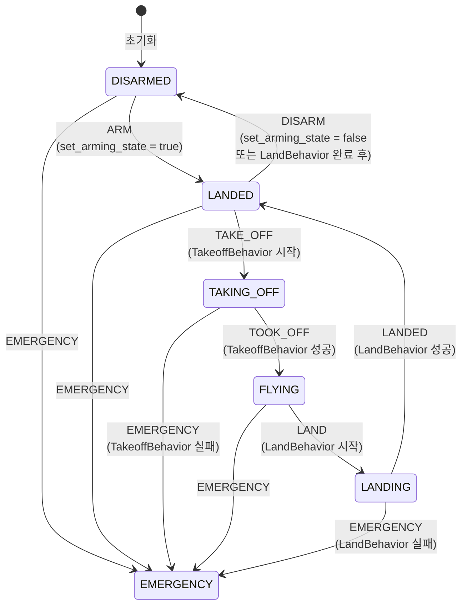

# PlatformStatus 상태 전이 그래프

## 1. 상태 정의

| 상수 | 값 | 의미 |
|---|---|---|
| `EMERGENCY` | -1 | 긴급 상태 (Kill Switch / Emergency Hover) |
| `DISARMED`  |  0 | 비무장 (초기 상태) |
| `LANDED`    |  1 | 무장 완료, 지상 대기 |
| `TAKING_OFF`|  2 | 이륙 중 |
| `FLYING`    |  3 | 비행 중 |
| `LANDING`   |  4 | 착륙 중 |

## 2. 이벤트 정의

| 이벤트 | 값 | 발생 주체 |
|---|---|---|
| `EMERGENCY` | -1 | AlertEvent (KILL_SWITCH / EMERGENCY_HOVER) |
| `ARM`       |  0 | `set_arming_state` 서비스 (SetBool true) |
| `DISARM`    |  1 | `set_arming_state` 서비스 (SetBool false) |
| `TAKE_OFF`  |  2 | TakeoffBehavior `process_goal()` |
| `TOOK_OFF`  |  3 | TakeoffBehavior `on_execution_end(SUCCESS)` |
| `LAND`      |  4 | LandBehavior `process_goal()` |
| `LANDED`    |  5 | LandBehavior `on_execution_end(SUCCESS)` |

---

## 3. 상태 전이 그래프



---

## 4. 이벤트 발생 경로 상세

```mermaid
flowchart TB
    subgraph TRIGGER["이벤트 트리거 경로"]
        direction TB

        subgraph SRV["서비스 호출"]
            A1["set_arming_state<br/>std_srvs/srv/SetBool"]
            A2["platform/takeoff<br/>std_srvs/srv/SetBool"]
            A3["platform/land<br/>std_srvs/srv/SetBool"]
            A4["state_machine_event<br/>as2_msgs/srv/SetPlatformStateMachineEvent"]
        end

        subgraph BEH["Behavior 내부"]
            B1["TakeoffBehavior<br/>process_goal()"]
            B2["TakeoffBehavior<br/>on_execution_end(SUCCESS)"]
            B3["TakeoffBehavior<br/>on_execution_end(FAILURE)"]
            B4["LandBehavior<br/>process_goal()"]
            B5["LandBehavior<br/>on_execution_end(SUCCESS)"]
            B6["LandBehavior<br/>on_execution_end(FAILURE)"]
        end

        subgraph ALERT["Alert 토픽"]
            C1["alert_event 토픽<br/>KILL_SWITCH"]
            C2["alert_event 토픽<br/>EMERGENCY_HOVER"]
        end
    end

    subgraph FSM["PlatformStateMachine"]
        E_ARM["ARM"]
        E_DISARM["DISARM"]
        E_TAKEOFF["TAKE_OFF"]
        E_TOOKOFF["TOOK_OFF"]
        E_LAND["LAND"]
        E_LANDED["LANDED"]
        E_EMERG["EMERGENCY"]
    end

    A1 -->|"true"| E_ARM
    A1 -->|"false"| E_DISARM
    A2 --> E_TOOKOFF
    A3 --> E_LANDED
    A4 -->|"직접 이벤트 전달"| FSM

    B1 --> E_TAKEOFF
    B2 --> E_TOOKOFF
    B3 --> E_EMERG
    B4 --> E_LAND
    B5 --> E_LANDED
    B6 --> E_EMERG

    C1 -->|"ownKillSwitch()"| E_EMERG
    C2 -->|"ownStopPlatform()"| E_EMERG
```



---

## 5. 정상 비행 흐름 (순서)

```
[시스템 시작]
    │
    ▼
DISARMED ──── ARM 이벤트 ────────────────────────────────────────────▶ LANDED
                │ set_arming_state(true) 서비스
                │ AerialPlatform::setArmingState(true)
                │ → ownSetArmingState() → handleStateMachineEvent(ARM)

LANDED ──────── TAKE_OFF 이벤트 ─────────────────────────────────────▶ TAKING_OFF
                │ TakeoffBehavior::process_goal()
                │ → sendEventFSME(TAKE_OFF)
                │ → SetPlatformStateMachineEvent 서비스 호출

TAKING_OFF ──── TOOK_OFF 이벤트 ─────────────────────────────────────▶ FLYING
                │ TakeoffBehavior::on_execution_end(SUCCESS)
                │ → sendEventFSME(TOOK_OFF)

FLYING ─────── LAND 이벤트 ──────────────────────────────────────────▶ LANDING
                │ LandBehavior::process_goal()
                │ → sendEventFSME(LAND)

LANDING ─────── LANDED 이벤트 ───────────────────────────────────────▶ LANDED
                │ LandBehavior::on_execution_end(SUCCESS)
                │ → sendEventFSME(LANDED)
                │ → sendDisarm() (set_arming_state false)

LANDED ──────── DISARM 이벤트 ───────────────────────────────────────▶ DISARMED
                │ AerialPlatform::setArmingState(false)
                │ → handleStateMachineEvent(DISARM)
```

---

## 6. EMERGENCY 진입 경로

```
어느 상태에서든 ──────────────────────────────────────────────────────▶ EMERGENCY

경로 1: KILL_SWITCH
  /alert_event 토픽 수신 (AlertEvent::KILL_SWITCH)
  → AerialPlatform::alertEvent()
  → state_machine_.processEvent(EMERGENCY)
  → ownKillSwitch()  (모터 즉시 정지)

경로 2: EMERGENCY_HOVER
  /alert_event 토픽 수신 (AlertEvent::EMERGENCY_HOVER)
  → AerialPlatform::alertEvent()
  → state_machine_.processEvent(EMERGENCY)
  → ownStopPlatform()  (제자리 정지)

경로 3: TakeoffBehavior 실패
  TakeoffBehavior::on_execution_end(FAILURE)
  → sendEventFSME(EMERGENCY)
  → TAKING_OFF → EMERGENCY

경로 4: LandBehavior 실패
  LandBehavior::on_execution_end(FAILURE)
  → sendEventFSME(EMERGENCY)
  → LANDING → EMERGENCY

경로 5: 직접 서비스 호출
  SetPlatformStateMachineEvent 서비스에 EMERGENCY 이벤트 전송
```

---

## 7. EMERGENCY 상태에서의 동작

EMERGENCY 상태 진입 후 `sendCommand()` 루프에서:

```cpp
// aerial_platform.cpp:318
if (state_machine_.getState().state == EMERGENCY) {
    ownStopPlatform();   // 매 cmd 루프(100Hz)마다 정지 명령 지속 전송
}
```

EMERGENCY 상태에서의 탈출 전이는 `defineTransitions()`에 **정의되어 있지 않다**.  
→ EMERGENCY는 **단방향 진입만 가능한 최종 상태**. 재사용하려면 플랫폼 재시작 필요.

---

## 8. FollowReferenceBehavior와의 연관

`checkGoal()` 에서 플랫폼 상태를 확인:

```cpp
// follow_reference_behavior.cpp:332
if (platform_state_ != as2_msgs::msg::PlatformStatus::FLYING) {
    RCLCPP_ERROR("Behavior reject, platform is not flying");
    return false;
}
```

| 상태 | FollowReference 실행 가능 여부 |
|---|---|
| DISARMED | 불가 |
| LANDED | 불가 |
| TAKING_OFF | 불가 |
| **FLYING** | **가능** |
| LANDING | 불가 |
| EMERGENCY | 불가 |
