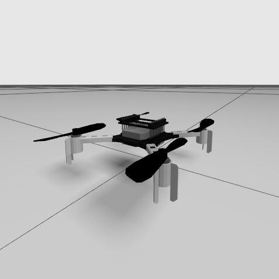
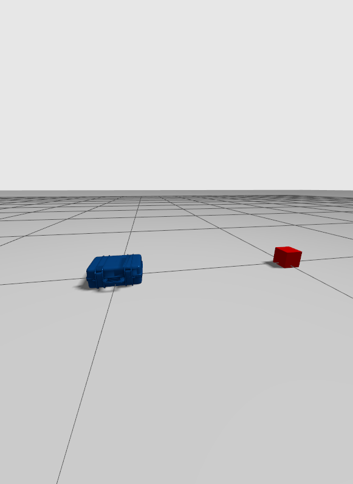

# ignition_assets

Colletion of AS2 Ignition Gazebo assets and scripts. 

Tested on **Ignition Gazebo Fortress**. Make sure to have it [installed](https://gazebosim.org/docs/fortress/install_ubuntu).

Gazebo naming has changed between ROS2 Galactic and ROS2 Humble releases [(Gazeno new era)](https://discourse.ros.org/t/a-new-era-for-gazebo-cross-post/25012). You should use *ignition_assets* package version corresponding to your ROS2 version.

## INDEX
- [RESOURCES](#resources)
    - [DRONES](#drone-models)
    - [SENSORS](#sensor-models)
    - [WORLDS](#world-models)
- [HOW TO RUN](#how-to-run-basic-usage)
    - [OPTIONS](#options)
        - [ENV VARS](#env-vars)
        - [CONFIG FILE](#config-file)
    - [MORE OPTIONS](#more-options)
- [EXAMPLES](#examples)
- [ADVANCED USAGE](#advanced-usage)
---

## RESOURCES
There are distinguish three kinds of reources: drone, sensor and world models.

### DRONE MODELS
<details>
<summary>Drone model list.</summary>
    
| SDF Name | Status | Image |
| - | :-: | - |
| *quadroto_base* | <span style="color:darkgreen">FLYING</span> |  |
| *hexrotor_base* | <span style="color:darkgreen">FLYING</span> |  |
| *crazyflie* | <span style="color:red">UNSTABLE FLYING</span> |  |
</details>

### SENSOR MODELS
<details>
<summary>Sensor model list.</summary>
    
| SDF Name | Description | Plugin |
| - | - | - |
| *imu* | **NOT SDF**: Alreay included in drone models. IMU sensor reports vertical position, angular velocity and linear acceleration readings. | ignition::gazebo::systems::Imu |
| *air_pressure* | **NOT SDF**: Alreay included in drone models. Air pressure sensor reports vertical position and velocity readings. | ignition::gazebo::systems::AirPressure |
| *magnetometer* | **NOT SDF**: Alreay included in drone models. Magnetometer sensor reports the magnetic field in its current location. | ignition::gazebo::systems::Magnetometer |
| *hd_camera* | RGB Camera with 1280x960 resolution. | - |
| *vga_camera* | RGB Camera with 640x480 resolution. | - |
| *semantic_camera* | RGB Camera with 1280x960 resolution with semantic segmentation data. | - |
| *rgbd_camera* | RGBD Camera with 640x480 resolution and 10 meters of depth sensing. | - |
| *point_lidar* | Single point lidar with 40 meter range. | - |
| *planar_lidar* | Planar scanning two-dimension lidar with 30 meter range. | - |
| *3d_lidar* | Three-dimensional scan with 100 meter range. | - |
| *gps* | Navigation satellite sensor reports position and velocity in spherical coordinates (latitude / longitude). | ignition::gazebo::systems::NavSat |
| *suction_gripper* | Light weight suction gripper. | mbzirc::SuctionGripperPlugin |
</details>

### WORLD MODELS
<details>
<summary>World model list.</summary>
    
| SDF Name | Description | Image |
| - | - | - |
| *empty* | Empty world with ground. |  |
| *test_gripper* | Empty world with two small objects to test the gripper. |  |
</details>

## HOW TO RUN: Basic usage

Previously setting AS2 environment, simply run:
```bash
${AEROSTACK2_PATH}/simulation/ignition/scripts/run_ign.sh 
```

or using a config file (see [config files](#config-file)) :

```bash
${AEROSTACK2_PATH/simulation/ignition/scripts/run_ign.sh <config-file>
```

This will run for you **ign gazebo server**, spawn an **quadrotor_base model** and open **ign gazebo client** (GUI).

### OPTIONS
Inital configuration aspects as world, drone model, drone pose or adding several drones can be done setting **environment variables** or using a **config file**.

- Run on start:
    ```bash
    export RUN_ON_START=1
    ```

- Verbose mode:
    ```bash
    export VERBOSE_SIM=1
    ```

#### ENV VARS
Previously set needed environment variables before launching the script.

- World
    ```bash
    export UAV_WORLD=<path-to-world>
    ```
- Drone model
    ```bash
    export UAV_MODEL=<model-name>
    ```
- Drone pose
    ```bash
    export UAV_X=<float>  # meters
    export UAV_Y=<float>  # meters
    export UAV_Z=<float>  # meters
    export UAV_YAW=<float>  # radians
    ```

Using environment variables is though when using only one drone.

#### CONFIG FILE
Using a config file lets you to set the simulation environment. You can select a world (or none) and attach to it a number of desired drones with desired model, position and set of sensors. Please pay atention to the format file, otherwise it may fail.

JSON file template:
```
{
    "world": "<world-name>",                // optional: deafult world if empty
    "drones": [                             // optional: no drones if empty
    {
        "model": "<model-name>",            // optional: default model if empty
        "name": "<namespace>",              // optional: default namespace if empty
        "xyz": [<x>, <y>, <z>],             // optional: [0, 0, 0] if empty
        "rpy": [<roll>, <pitch>, <yaw>],    // optional: [0, 0, 0] if empty
        "flight_time": <min>,               // optional: 0 or empty means not use battery
        "payload": {                        // optional: no sensors if none
            "<sensor-name>": {              // REQUIRED if sensor is used
                "sensor": "<sensor-type>",  // REQUIRED if sensor is used
                "xyz": [<x>, <y>, <z>],     // optional: [0, 0, 0] if empty
                "rpy": [<roll>, <pitch>, <yaw>], // optional: [0, 0, 0] if empty
            },
            "<sensor-name-2>": {
                // Second sensor...
            }
        }
    },
    {
        // Second drone...
    }
    ]
}
```
Notice that comments are not available in JSON format and fields between "<" and ">" should be replaced with each value or removed (along with the field) if is not wanted or required.

Example of a valid JSON config file:
```json
{
    "world": "empty",
    "drones": [
    {
        "model": "quadrotor_base",
        "name": "drone_sim_0",
        "xyz": [ 0.0, 0.0, 0.2 ],
        "payload": {
            "front_camera": {
                "sensor": "hd_camera",
                "rpy": [ 0.0, 0.0, 1.57 ]
            },
            "lidar_0": {
                "sensor": "3d_lidar",
                "xyz": [ 0.0, 0.0, -0.5 ]
            }
        }
    },
    {
        "model": "hexrotor_base",
        "xyz": [ 3.0, 0.0, 0.2 ],
        "rpy": [ 0, 0, 1.57 ],
        "flight_time": 10
    }
    ]
}
```

### MORE OPTIONS
- Use custom models in world/drone:
    ```bash
    export GAZEBO_MODEL_PATH=$GAZEBO_MODEL_PATH:<custom-model-path>
    ```
- Run simulation on start:
    ```bash
    export RUN_ON_START=1
    ```

## EXAMPLES
Several examples can be found on [test](/tests) folder.
