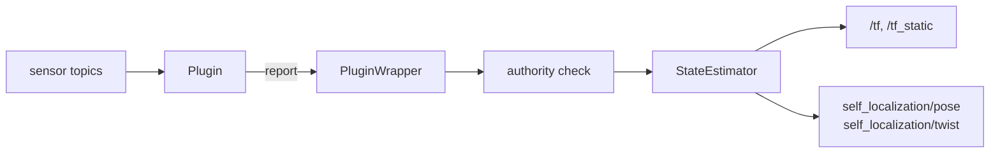

# as2_state_estimator

State estimation server for Aerostack2.

The `state_estimator` node maintains the drone's pose and velocity, publishes them on
`self_localization/*`, and broadcasts the REP-105 transform chain
`earth -> map -> odom -> base_link`. It does not itself know how to estimate anything: the
actual estimation is done by **plugins** loaded at runtime through `pluginlib`.

The node owns the output path. Plugins never touch `/tf` or the publishers directly, they
*report* state updates through an interface and the node decides what gets published.



## Index

- [Plugins](#plugins)
- [Frames](#frames)
- [Interface](#interface)
- [Parameters](#parameters)
- [Launching](#launching)
- [Writing a plugin](#writing-a-plugin)
- [Testing](#testing)

## Plugins

| Plugin | Use it when | Docs |
| --- | --- | --- |
| `raw_odometry` | The platform already gives you a fused odometry (PX4, DJI, flow deck). Optionally anchors the tree to a GPS datum. | [plugins/raw_odometry](plugins/raw_odometry/README.md) |
| `ground_truth` | You have a source of absolute, essentially exact pose: a simulator, or a motion capture rig. | [plugins/ground_truth](plugins/ground_truth/README.md) |
| `simple_ekf` | You want to fuse an IMU with one or more pose sources, or your pose source is slow, noisy or delayed. | [plugins/simple_ekf](plugins/simple_ekf/README.md) |

The plugin is selected with the `plugin_name` parameter. It accepts either a single string
or a list of strings, so more than one plugin can be loaded in the same node.

> **Multi-plugin is expressible but not yet arbitrated.** All three plugins currently claim
> every transform type, so loading two of them is last-write-wins rather than a real
> handover. Per-plugin scoping is future work.

## Frames

The node follows [REP-105](https://ros.org/reps/rep-0105.html):

| Transform | Meaning | Typically |
| --- | --- | --- |
| `earth -> map` | Where this drone's local frame sits in the global frame | Static, set once at startup |
| `map -> odom` | Accumulated correction from absolute measurements | Jumps when a correction arrives |
| `odom -> base_link` | Smooth, continuous dead-reckoned pose | Updated at sensor rate |

`earth` is shared by every drone. `map`, `odom` and `base_link` are namespaced per drone
(`drone0/map`, `drone0/odom`, ...).

**Empty frame names resolve to the namespace.** Setting `base_frame: ""` in a node under
namespace `drone0` gives the frame `drone0` instead of `drone0/base_link`. This is what
Gazebo needs, since it roots each model's TF at the bare model name, and it replaces the
old `use_gazebo_tf` parameter.

Plugins read TF through a filtered listener that hides the estimator's own three
transforms, so a plugin cannot accidentally consume the output it just produced.

## Interface

### Published topics

| Topic | Type | Frame |
| --- | --- | --- |
| `self_localization/pose` | `geometry_msgs/PoseStamped` | `earth` |
| `self_localization/twist` | `geometry_msgs/TwistStamped` | `base_link` |
| `/tf`, `/tf_static` | `tf2_msgs/TFMessage` | the three transforms above |

Per-plugin debug copies of the same state are published on
`state_estimation/<plugin_name>/pose` and `state_estimation/<plugin_name>/twist`. They
carry each plugin's own view, before the authority check, which makes them the way to see
what a non-authoritative plugin *would* have published. Rate is controlled by
`<plugin_name>.debug_publish_hz`.

Subscribed topics and services depend entirely on the loaded plugin. See the plugin READMEs.

## Parameters

Top-level parameters, from [`config/state_estimator_default.yaml`](config/state_estimator_default.yaml):

| Parameter | Type | Default | Description |
| --- | --- | --- | --- |
| `plugin_name` | string or string[] | (required) | Plugin(s) to load |
| `base_frame` | string | `base_link` | Body frame. `""` resolves to the namespace |
| `global_ref_frame` | string | `earth` | Global frame, not namespaced |
| `odom_frame` | string | `odom` | Odometry frame |
| `map_frame` | string | `map` | Map frame |
| `publish_hz` | double | `0.0` | Output rate. `0.0` publishes on every update |
| `<plugin_name>.debug_publish_hz` | double | `-1.0` | Per-plugin debug topics. `-1` = every update, `0` = disabled, `>0` = fixed rate |

Plugin parameters live in a block named after the plugin:

```yaml
/**:
  ros__parameters:
    plugin_name: "raw_odometry"
    base_frame: "base_link"
    publish_hz: 0.0

    raw_odometry:              # <- named after the plugin
      odom_sub_topic: "sensor_measurements/odom"
      use_gps: false
```

> :warning: **Unknown keys are silently ignored.** A parameter left at the top level, or
> misspelled, does not raise an error: the node starts and runs with the default. If a
> setting seems to have no effect, check the nesting first. The startup log prints every
> parameter the plugin actually read.

## Launching

```bash
# Plugin taken from the config file
ros2 launch as2_state_estimator state_estimator_launch.py \
    namespace:=drone0 \
    config_file:=path/to/config.yaml

# Plugin forced from the command line
ros2 launch as2_state_estimator state_estimator_launch.py \
    namespace:=drone0 \
    plugin_name:=simple_ekf \
    config_file:=path/to/config.yaml \
    plugin_config_file:=path/to/plugin_config.yaml
```

`state_estimator_launch.py` merges three layers, later ones overriding earlier ones:

1. `config/state_estimator_default.yaml` (core defaults)
2. `plugins/<plugin_name>/config/plugin_default.yaml` (plugin defaults)
3. your `config_file` and `plugin_config_file`

Because the defaults are always merged in, a user config only needs to list what it
changes. `state_estimator_simple_launch.py` skips the plugin-default layer, so a config
used with it must be complete.

## Writing a plugin

A plugin derives from `as2_state_estimator_plugin_base::StateEstimatorBase` and implements
two methods:

```cpp
class Plugin : public as2_state_estimator_plugin_base::StateEstimatorBase
{
public:
  void onSetup() override
  {
    // Read parameters (node_ptr_) and create subscriptions.
    auto topic = getParameter<std::string>(node_ptr_, "my_plugin.some_topic");
    // ...
  }

  std::vector<as2_state_estimator::TransformInformatonType>
  getTransformationTypesAvailable() const override
  {
    // Which parts of the state this plugin claims authority over.
    return {as2_state_estimator::TransformInformatonType::ODOM_TO_BASE,
            as2_state_estimator::TransformInformatonType::TWIST_IN_BASE};
  }
};

PLUGINLIB_EXPORT_CLASS(my_plugin::Plugin, as2_state_estimator_plugin_base::StateEstimatorBase)
```

From a callback, report state through `state_estimator_interface_`:

```cpp
state_estimator_interface_->setEarthToMap(transform, stamp, /*is_static=*/true);
state_estimator_interface_->setMapToOdomPose(pose, stamp);
state_estimator_interface_->setOdomToBaseLinkPose(pose, stamp);
state_estimator_interface_->setTwistInBaseFrame(twist, stamp);
```

Each report is checked against the authority table built from
`getTransformationTypesAvailable()`. A report for a transform the plugin did not claim is
logged and dropped.

Two things worth knowing:

- **`getParameter<T>()` has no default.** It declares the parameter with no fallback, so a
  parameter missing from the YAML is fatal. Every key a plugin reads must exist in its
  `plugin_default.yaml`, including the ones inside commented-out example blocks that users
  are expected to uncomment.
- **Use `tf_handler_`, not a raw TF listener**, so your lookups go through the filter that
  removes the estimator's own transforms.

To register a new plugin, add it to `PLUGIN_LIST` in `CMakeLists.txt`, declare it in
`plugins.xml`, and ship a `config/plugin_default.yaml`.

## Testing

```bash
colcon build --packages-select as2_state_estimator
colcon test --packages-select as2_state_estimator --event-handlers console_direct+
```

The integration suites bring up real ROS nodes, so they need a DDS domain that no
simulator is using:

```bash
ROS_DOMAIN_ID=77 colcon test --packages-select as2_state_estimator
```

The suites cover the three plugins as live nodes, multi-drone namespacing and TF
isolation, EKF maths without ROS, and pluginlib instantiation, plus the usual ament lint
tests.
