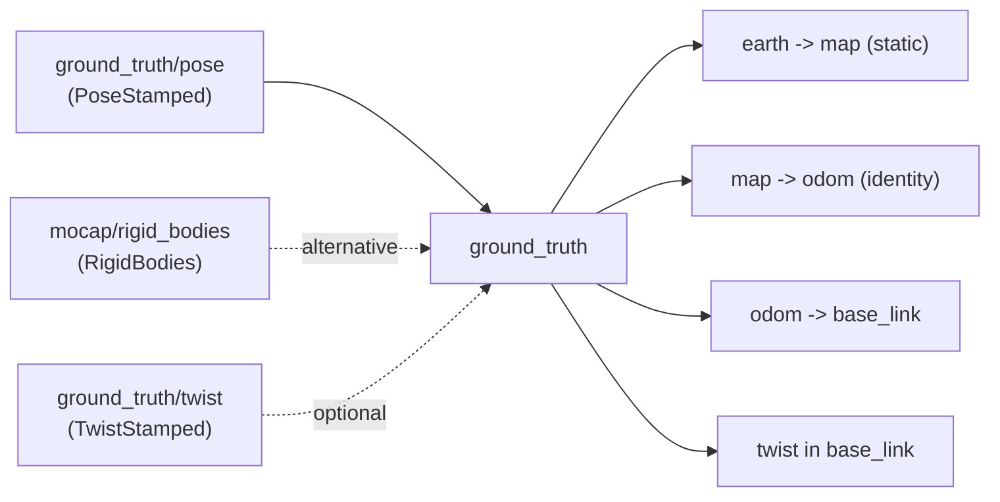

# ground_truth

State estimator plugin for sources that already give an absolute, essentially exact pose:
a simulator's ground truth, or a motion capture system.

There is no filtering and no fusion here. The pose is taken at face value and turned into
the TF tree. If your source is noisy, slow or delayed, use
[`simple_ekf`](../simple_ekf/README.md) instead.

## How it works

The incoming pose is interpreted as `earth -> base_link`. Since the tree has to stay
connected, the plugin fixes `earth -> map` and `map -> odom` and puts the whole pose into
`odom -> base_link`.



Poses must arrive in the `earth` frame. A pose in any other frame is rejected with an
error, it is not transformed.

`earth -> map` is set once, either from the first pose received or from the
`earth_map_transform` parameters. Anchoring it at the first pose means the drone starts at
the origin of its own `map` frame, which is what most missions expect.

## Input modes

The plugin reads a pose from exactly one source, and a twist from one of two:

| `mocap_sub_topic` | `twist_sub_topic` | Pose from | Twist from |
| --- | --- | --- | --- |
| `""` | `""` (default) | `pose_sub_topic` | Differentiated pose, low-pass filtered |
| `""` | set | `pose_sub_topic` | `twist_sub_topic` |
| set | `""` (default) | The named rigid body in `mocap_sub_topic` | Differentiated pose, low-pass filtered |
| set | set | The named rigid body in `mocap_sub_topic` | `twist_sub_topic` |

**`twist_sub_topic` is empty by default, so the twist is differentiated from the pose.**
That works for every source, including mocap rigs and any simulator, which is why it is the
default. Point it at a topic only when the source publishes its own twist and you would
rather use that than a differentiated one.

> :warning: **Setting `twist_sub_topic` to a topic nobody publishes gives a node that never
> publishes a pose.** `self_localization/pose` is published from the twist path, so if the
> named topic stays silent the node starts, logs nothing unusual, and produces TF but no
> pose. This is the failure mode a mocap rig hits if it inherits a `ground_truth/twist`
> setting from an older config. Leaving the parameter empty avoids it entirely, and is also
> what makes `twist_smooth_filter_cte` take effect.

## Parameters

All parameters live under the `ground_truth:` block. Defaults in
[`config/plugin_default.yaml`](config/plugin_default.yaml).

| Parameter | Type | Default | Description |
| --- | --- | --- | --- |
| `pose_sub_topic` | string | `ground_truth/pose` | Pose input. Ignored when `mocap_sub_topic` is set |
| `twist_sub_topic` | string | `""` | Twist input. Empty, the default, differentiates the pose instead |
| `twist_smooth_filter_cte` | double | `1.0` | Low-pass constant `(0, 1]` for the differentiated twist. `1.0` = no filtering, closer to `0` = heavier. Only used when `twist_sub_topic` is empty |
| `reject_repeated_positions` | bool | `false` | Drop poses whose position repeats the last processed one. See the note below before enabling |
| `mocap_sub_topic` | string | `""` | `mocap4r2_msgs/RigidBodies` input. Empty disables mocap mode |
| `rigid_body_name` | string | `33` | Rigid body to track. Only used in mocap mode |
| `earth_map_transform.set_earth_map` | bool | `false` | Pin `earth -> map` from parameters instead of the first pose |
| `earth_map_transform.position.{x,y,z}` | double | `0.0` | Position of `map` in `earth`, metres |
| `earth_map_transform.orientation.{roll,pitch,yaw}` | double | `0.0` | Orientation of `map` in `earth`, radians |

### Simulator

Everything but the plugin name is already the default, so this is enough:

```yaml
/**:
  ros__parameters:
    plugin_name: "ground_truth"
    base_frame_id: ""            # Gazebo roots model TF at the bare model name
```

To take the twist from the simulator instead of differentiating the pose:

```yaml
/**:
  ros__parameters:
    plugin_name: "ground_truth"
    base_frame_id: ""
    ground_truth:
      pose_sub_topic: "ground_truth/pose"
      twist_sub_topic: "ground_truth/twist"   # non-default: use the simulator's own twist
```

### Motion capture

```yaml
/**:
  ros__parameters:
    plugin_name: "ground_truth"
    ground_truth:
      mocap_sub_topic: "/mocap/rigid_bodies"
      rigid_body_name: "drone0"
      twist_smooth_filter_cte: 0.1 # heavy filtering, mocap-differentiated velocity is noisy
      reject_repeated_positions: true # non-default: an exact repeat means the cameras lost it
```

`rigid_body_name` should be quoted. An unquoted numeric name like `33` parses as an integer
and the plugin converts it back to a string with a warning.

### Fixed map origin

```yaml
ground_truth:
  earth_map_transform:
    set_earth_map: true
    position: {x: 1.0, y: 2.0, z: 0.0}
    orientation: {roll: 0.0, pitch: 0.0, yaw: 1.5708}
```

## Notes

- **No orientation filtering.** `twist_smooth_filter_cte` filters only the differentiated
  linear velocity. Orientation is passed through raw. This matters for mocap rigs migrating
  from the old `mocap_pose` plugin, which had an `orientation_smooth_filter_cte`: a noisy
  mocap yaw that used to be smoothed now passes through unfiltered. Feeding the mocap topic
  to [`simple_ekf`](../simple_ekf/README.md) instead gives you smoothing as a side effect
  of the filter.
- **Angular velocity is differentiated too**, from the rotation between consecutive
  orientations, and is already in base frame. It goes through the same
  `twist_smooth_filter_cte` low-pass as the linear velocity. Differentiated body rates are
  noisier than a gyro, so prefer a source that publishes its own twist when there is one.
- **Poses with a non increasing timestamp are always dropped**, whatever the source, since
  they are duplicated or out of order messages. No parameter controls this.
- **`reject_repeated_positions` drops poses that do not move**, within 1 µm of the last
  processed position. It is off by default, and whether you want it depends entirely on the
  source:
  - **Mocap: enable it.** A tracked rigid body always jitters, so an exact repeat means the
    cameras lost it and the mocap software is replaying its last known frame with fresh
    timestamps. Feeding those into the estimator makes a lost robot look stationary.
  - **Simulator or any source reporting an exact position: leave it off.** There, a repeat
    genuinely means the robot is not moving. Enabling it makes the plugin stop publishing
    entirely while the robot holds still — no TF, no pose, no twist — and the state freezes
    at the last timestamp it moved.

  Only position is compared, never orientation, so a robot rotating perfectly in place is
  dropped as well when this is on.
- **All-zero mocap poses are dropped**, since mocap systems publish those for a rigid body
  they have lost track of.
- **No GPS.** This plugin has no geodetic path at all. GPS lives on
  [`raw_odometry`](../raw_odometry/README.md).
- The plugin claims all four transform types.
