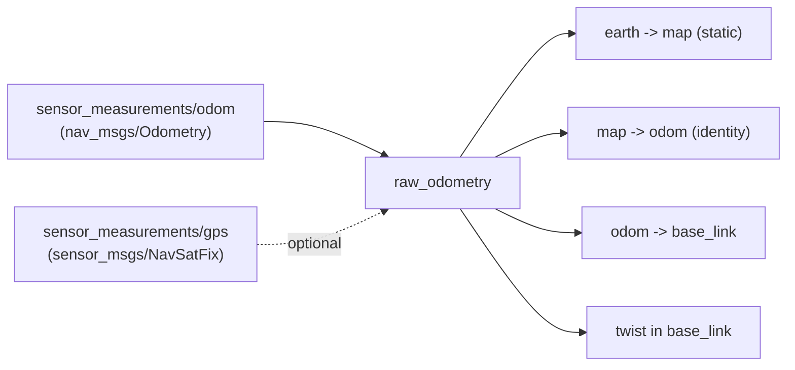

# raw_odometry

State estimator plugin that republishes an odometry topic that the platform has already
computed, optionally anchoring the TF tree to a GPS datum.

Use it when the autopilot or the sensor stack does the fusion for you: PX4, DJI, a
Crazyflie flow deck, a RealSense T265, or any driver that publishes a `nav_msgs/Odometry`.

## How it works

The incoming odometry is taken as the `odom -> base_link` transform, and its twist as the
body velocity. `map -> odom` is identity: this plugin does no correction, it forwards what
it is given.



The frame ids on the incoming message are not trusted: if `header.frame_id` is not the odom
frame or `child_frame_id` is not the base frame, the plugin warns once and overrides them.

Where `earth -> map` comes from depends on the configuration:

| `use_gps` | `set_earth_map` | `earth -> map` |
| --- | --- | --- |
| `false` | `false` | Identity. `map` and `earth` coincide |
| `false` | `true` | The pose in `earth_map_transform` |
| `true` | `false` | Placed at the first GPS fix, expressed relative to the datum |
| `true` | `true` | The pose in `earth_map_transform`. GPS only supplies the datum |

## Parameters

All parameters live under the `raw_odometry:` block. Defaults in
[`config/plugin_default.yaml`](config/plugin_default.yaml).

| Parameter | Type | Default | Description |
| --- | --- | --- | --- |
| `odom_sub_topic` | string | `sensor_measurements/odom` | Odometry input |
| `earth_map_transform.set_earth_map` | bool | `false` | Pin `earth -> map` from parameters instead of letting it be derived |
| `earth_map_transform.position.{x,y,z}` | double | `0.0` | Position of `map` in `earth`, metres |
| `earth_map_transform.orientation.{roll,pitch,yaw}` | double | `0.0` | Orientation of `map` in `earth`, radians |
| `use_gps` | bool | `false` | Anchor `earth` at a geodetic datum |
| `gps_origin.set_origin` | string | `first_gps` | Where the datum comes from: `first_gps`, `manual` or `service` |
| `gps_origin.coordinates.latitude` | double | `0.0` | Datum latitude, degrees (WGS84) |
| `gps_origin.coordinates.longitude` | double | `0.0` | Datum longitude, degrees |
| `gps_origin.coordinates.altitude` | double | `0.0` | Datum altitude, metres, same convention as the fixes |

Minimal configuration:

```yaml
/**:
  ros__parameters:
    plugin_name: "raw_odometry"
    raw_odometry:
      odom_sub_topic: "sensor_measurements/odom"
```

## GPS

`use_gps: true` gives the tree a **geodetic datum**: a latitude/longitude/altitude that the
`earth` frame origin sits on. Everything downstream stays in metres, but now those metres
mean something on the planet, which is what lets a mission be written in GPS coordinates
and what `get_origin` reports to the rest of the stack.

Enabling it adds:

| Interface | Type | Purpose |
| --- | --- | --- |
| `sensor_measurements/gps` | `sensor_msgs/NavSatFix` | Input. Only the **first** fix is read, then the subscription is dropped |
| `set_origin` | `as2_msgs/srv/SetOrigin` | Supply the datum at runtime |
| `get_origin` | `as2_msgs/srv/GetOrigin` | Query the datum |

### The three `set_origin` modes

| Mode | Datum comes from | Use it when |
| --- | --- | --- |
| `first_gps` | The first fix received | Normal outdoor flight. Take off from wherever you are and treat that point as the origin |
| `manual` | `gps_origin.coordinates` | Repeated flights over the same site, or multiple drones that must share one origin so their local coordinates agree |
| `service` | A `set_origin` call | Something else, a ground station or a mission script, decides the origin at runtime |

In `manual` and `service` modes the first fix is still needed, but only to compute *where
the drone is* relative to the datum. In `service` mode that fix is held aside until the
call arrives.

**The datum can only be set once.** Whichever source wins, later `set_origin` calls are
refused with `success: false`. `get_origin` always answers once a datum exists.

> :warning: **In `service` mode the TF tree stays incomplete until `set_origin` is
> called.** `earth -> map` is not published before that, so nothing downstream can resolve
> a pose. This is intentional and matches the historical behaviour, but a misconfigured
> `service` mode looks exactly like a hung estimator. The startup log says so explicitly.

An unrecognised value for `set_origin` logs a warning and falls back to `first_gps`.

### Examples

Take the origin from the first fix:

```yaml
raw_odometry:
  use_gps: true
  gps_origin:
    set_origin: "first_gps"
    coordinates: {latitude: 0.0, longitude: 0.0, altitude: 0.0}
```

Fixed site origin, shared between flights and between drones:

```yaml
raw_odometry:
  use_gps: true
  gps_origin:
    set_origin: "manual"
    coordinates:
      latitude: 40.4378698
      longitude: -3.8196207
      altitude: 660.0
```

Fixed site origin *and* a known starting position inside it. `earth_map_transform` places
`map`, GPS supplies the datum:

```yaml
raw_odometry:
  use_gps: true
  earth_map_transform:
    set_earth_map: true
    position: {x: 10.0, y: -5.0, z: 0.0}
    orientation: {roll: 0.0, pitch: 0.0, yaw: 1.5708}
  gps_origin:
    set_origin: "manual"
    coordinates: {latitude: 40.4378698, longitude: -3.8196207, altitude: 660.0}
```

Wait for a ground station to set the origin:

```yaml
raw_odometry:
  use_gps: true
  gps_origin:
    set_origin: "service"
    coordinates: {latitude: 0.0, longitude: 0.0, altitude: 0.0}
```

```bash
ros2 service call /drone0/set_origin as2_msgs/srv/SetOrigin \
  "{origin: {latitude: 40.4378698, longitude: -3.8196207, altitude: 660.0}}"
```

> Every key must be present in the YAML even when the mode does not use it. Parameters are
> declared without defaults, so a missing `coordinates` block is fatal regardless of the
> mode. This is why the examples above always carry the full block.

## Notes

- `map -> odom` is always identity. Any drift in the platform's odometry propagates
  straight through to the published pose, since nothing here corrects it. If you need
  correction from an absolute source, use [`simple_ekf`](../simple_ekf/README.md).
- The plugin claims all four transform types.
- The GPS subscription is dropped after the first fix. The plugin never re-reads GPS, so a
  changing fix cannot move the tree.
