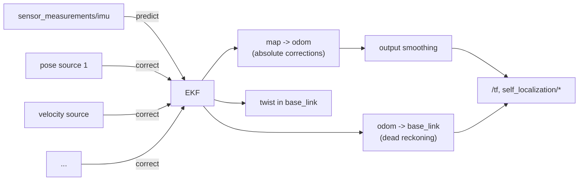

# simple_ekf

15-state Extended Kalman Filter that predicts on IMU and corrects from an arbitrary,
configurable list of pose and velocity sources.

Use it when you need actual fusion: a pose source that is slow, noisy or delayed, several
sources at once, or a platform whose odometry drifts and needs correcting from something
absolute.

The filter's Jacobians are generated symbolically with CasADi and compiled into the
[`ekf` library](lib/ekf/README.md) that ships with the plugin.

## How it works



IMU messages drive the prediction step, and measurements correct it. Both publish
immediately afterwards, so in practice the IMU rate sets the output rate, since it is
normally the fastest of the two. Nothing is published until `earth -> map` is known.

### State vector

| Index | State | Notes |
| --- | --- | --- |
| 0-2 | `x, y, z` | Position in `map` |
| 3-5 | `vx, vy, vz` | Velocity |
| 6-8 | `roll, pitch, yaw` | Orientation, Euler angles |
| 9-11 | `abx, aby, abz` | Accelerometer bias |
| 12-14 | `wbx, wby, wbz` | Gyroscope bias |

> Attitude is parametrised as Euler angles, which is singular at pitch = ±90°. Fine for
> normal flight, not for aggressive or near-vertical manoeuvres. A quaternion formulation
> is future work.

### What a source can measure

| Message | Corrects | Notes |
| --- | --- | --- |
| `geometry_msgs/msg/PoseStamped` | position and orientation | Covariance from the config |
| `geometry_msgs/msg/PoseWithCovarianceStamped` | position and orientation | |
| `nav_msgs/msg/Odometry` | position and orientation | Its twist is ignored |
| `mocap4r2_msgs/msg/RigidBodies` | position and orientation | Covariance from the config |
| `geometry_msgs/msg/TwistWithCovarianceStamped` | linear velocity | Body frame by default |

A velocity source corrects how fast the filter thinks the vehicle is moving, never where
it is: the position that follows is dead reckoning, so the correction is absorbed by
`odom -> base_link` whatever `is_odometry` says, and it cannot bootstrap `earth -> map`.
It is rotated into the map frame with the filter's own attitude, so a body frame source
needs no transform tree of its own; set `is_body_frame: false` for one already in the map
frame.

> Only the diagonal of the rotated covariance reaches the update step, which is what the
> velocity model takes. The correlation a tilted body frame measurement carries is dropped,
> which is small for a source whose axes are similarly noisy.

### Components a source does not measure

A message marks a component it does not observe with a **non-positive variance**, the ROS
convention for an unknown: an optical flow module measures two horizontal velocities, a
rangefinder one height, a source used as a compass only heading. Any of the types above can
leave components out this way, and the filter treats them as absent — the component is
replaced by the filter's own prediction, so it produces exactly no correction. The flags are
read in the source's frame and applied after the rotation into the map frame, which is exact
for the cases that occur: all three components, none, or the horizontal pair under this
tree's yaw-only rotations. The substitution is redone whenever the correction is replayed,
against the state at the instant it lands rather than the one it arrived at.

The variance those components are given, `unobserved_variance`, does not leave the state
covariance alone: an update against a measurement of variance V pulls a state variance
towards V, so a component nobody measures cannot grow past this number while that lasts.
The default of 1e2 costs four decimals against state variances around 1e-2, and the ceiling
only starts to bite once a state's own variance approaches it. Lifting it entirely needs the
update to skip the component rather than absorb it, which is more machinery than a plugin
called simple carries.

> The textbook alternative, a variance of 1e9, does not work here, which is why
> `unobserved_variance` warns above 1e4. The gain comes from inverting the whole innovation
> covariance, and once that holds position-to-orientation correlations, mixing 1e9 and 1e-3
> leaves an inverse with no significant digits: the filter diverges within a few samples.

Two things follow from a variance being a marker. A **negative** one is a deliberate
statement and survives `use_message_covariance: false`, so configuring fixed numbers for a
rangefinder does not turn the components it never measured into readings of whatever its
message left behind. A **zero** is not that statement: it is what a message carrying no
covariance at all is full of, and supplying the number it lacks is what
`use_message_covariance: false` is for, so there a zero is replaced like any other. With
`use_message_covariance: true` a zero still reads as unobserved and the component is
dropped, which is almost always a misconfiguration, so the plugin warns.

### Measurements the filter refuses to believe

`innovation_gate` sets how far a measurement may sit from the filter's prediction, in
standard deviations of the two combined, before it is dropped. It earns its place when a
source can be wrong in a way that looks valid: a rangefinder over an object on the floor
reports a real distance to something that is not the ground.

Left at `0.0`, the default, nothing is gated. A gate is only meaningful when something else
observes the same state, since one on the only source of a state can lock the filter out of
correcting it; against that, `innovation_gate_timeout` seconds of uninterrupted rejection
forces the next measurement through.

### Where a correction lands: `is_odometry`

The EKF produces one corrected pose, but that correction can be applied to the tree in two
different places, and picking the wrong one is the most common way to get bad results.

| `is_odometry` | The correction moves | Right for |
| --- | --- | --- |
| `false` | `map -> odom` | **Absolute, drift-free** sources: mocap, ground truth, a global localiser. The correction is a real statement about where the drone is in the world, so it belongs in the global part of the tree |
| `true` | `odom -> base_link` | **Dead-reckoned, drifting** sources: wheel or visual odometry. Its drift must not leak into the global frame, so the correction is absorbed locally and `map -> odom` is left alone |

The default is derived from the message type: `true` for `nav_msgs/msg/Odometry`, `false`
for everything else. Set it explicitly per topic to override.

### Out-of-sequence measurements

A pose that arrives stamped *earlier* than IMU predictions already applied is not simply
dropped. The plugin keeps a chronological buffer of every EKF operation, rewinds to the
measurement's timestamp, applies the correction there, and replays the intervening
predictions. Anything older than `max_update_latency_ms` is dropped as stale.

This is what makes slow, heavily-processed sources usable: a vision pipeline whose pose is
200 ms old still lands at the right point in the timeline.

### Output smoothing

Every correction moves `map -> odom` in a step. Handing that step straight to a controller
is not ideal, so the published `map -> odom` is an exponential moving average of the raw
EKF value:

```
published = (1 - alpha) * published + alpha * raw
```

The blend is stepped only from the plugin timer, so its time constant is well defined:

```
tau = -1 / (timer_hz * ln(1 - map_odom_alpha))
```

`map_odom_alpha` weights the **new** value: `0.1` is heavy smoothing, `1.0` disables it and
publishes the raw EKF output. The plugin logs the resulting time constant in milliseconds
at startup. Note that only the published copy is smoothed, the filter's internal
`map -> odom` stays raw, since it is used to transform incoming measurements.

To compare the two, enable `internal_ekf_debug_topics`. It publishes the raw pre-smoothing
state with the same timestamps as the external one, so the traces overlay exactly.

### Pre-flight zero-pose correction

Before the drone first goes offboard (or arms, with `use_arm: true`) it is known to be
sitting still at its origin. The plugin uses that: at every timer tick it corrects the
filter towards pose zero with a very low covariance. This pins the state and lets the IMU
biases converge while the drone waits on the ground.

Once the drone has been offboard at least once, the correction is never applied again, even
after landing. Setting `platform_topic: ""` assumes offboard is always true and disables
the whole mechanism.

## Parameters

All parameters live under the `simple_ekf:` block. Defaults in
[`config/plugin_default.yaml`](config/plugin_default.yaml).

### Core

| Parameter | Type | Default | Description |
| --- | --- | --- | --- |
| `predict_topic` | string | `sensor_measurements/imu` | IMU input, drives prediction and output rate |
| `update_topics` | string[] | `["posestamped1"]` | Names of the per-topic config blocks to load |
| `timer_hz` | double | `100.0` | Timer rate. Sets the smoothing time constant, the `earth -> map` republish rate when `static_tf` is false, and the pre-offboard correction rate |
| `map_odom_alpha` | double | `0.1` | Output smoothing weight on the new value, range `(0, 1]`. `1.0` disables it |
| `max_update_latency_ms` | double | `1000.0` | Maximum measurement age before it is dropped |
| `unobserved_variance` | double | `1e2` | Variance standing in for a component no source measures. A conditioning constant, not a tuning knob: warns above 1e4 |
| `gravity` | double | `9.81` | Gravitational acceleration, m/s² |
| `platform_topic` | string | `platform/info` | Platform status for the pre-flight correction. Empty assumes always offboard |
| `use_arm` | bool | `false` | Gate on `armed` instead of `offboard` |
| `verbose` | bool | `true` | Startup and operational logging |
| `debug_verbose` | bool | `false` | Per-message state and covariance logging. Very noisy |
| `debug_publish_hz` | double | `-1.0` | Rate of the wrapper's `state_estimation/simple_ekf/*` topics. `-1` = every update, `0` = disabled |
| `internal_ekf_debug_topics` | string | `""` | Base name for the raw pre-smoothing debug topics. Empty disables them |

### IMU noise

| Parameter | Type | Default |
| --- | --- | --- |
| `imu_params.accelerometer_noise_density` | double | `1e-3` |
| `imu_params.gyroscope_noise_density` | double | `1e-4` |
| `imu_params.accelerometer_random_walk` | double | `1e-4` |
| `imu_params.gyroscope_random_walk` | double | `1e-5` |

These feed the process noise covariance. Use the values from your IMU's datasheet or an
Allan variance analysis if you have them.

### Initial covariance

| Parameter | Type | Default | Applies to |
| --- | --- | --- | --- |
| `initial_covariance.position` | double | `0.0` | `x, y, z` |
| `initial_covariance.velocity` | double | `0.0` | `vx, vy, vz` |
| `initial_covariance.orientation` | double | `0.0` | `roll, pitch, yaw` |
| `initial_covariance.bias_acc` | double | `1e-8` | Accelerometer bias |
| `initial_covariance.bias_gyro` | double | `1e-8` | Gyroscope bias |

Zero means the initial state is taken as exactly known, which is reasonable here because
the drone genuinely starts at the origin of its own `map` frame.

### earth -> map

| Parameter | Type | Default | Description |
| --- | --- | --- | --- |
| `earth_map_transform.static_tf` | bool | `true` | Publish `earth -> map` on `/tf_static` rather than republishing it on `/tf` at `timer_hz` |
| `earth_map_transform.set_earth_map` | bool | `false` | Pin `earth -> map` from parameters |
| `earth_map_transform.position.{x,y,z}` | double | `0.0` | Position of `map` in `earth`, metres |
| `earth_map_transform.orientation.{roll,pitch,yaw}` | double | `0.0` | Orientation of `map` in `earth`, radians |

If no update topic sets `set_earth_map: true` and `set_earth_map` is false here, the
transform is published as identity as soon as the first IMU message arrives, so the tree is
never left dangling.

### Per-topic configuration

Each name in `update_topics` refers to a sibling block:

| Parameter | Type | Required | Description |
| --- | --- | --- | --- |
| `topic` | string | yes | Topic to subscribe to |
| `type` | string | yes | One of `geometry_msgs/msg/PoseStamped`, `geometry_msgs/msg/PoseWithCovarianceStamped`, `nav_msgs/msg/Odometry`, `mocap4r2_msgs/msg/RigidBodies`, `geometry_msgs/msg/TwistWithCovarianceStamped` |
| `set_earth_map` | bool | yes | Bootstrap `earth -> map` from this topic's first message |
| `use_message_covariance` | bool | yes | Use the message's covariance (scaled by the multipliers) instead of fixed values |
| `position_covariance` | double[3] | when `use_message_covariance` is false | Fixed variances for `x, y, z` |
| `orientation_covariance` | double[3] | when `use_message_covariance` is false | Fixed variances for `roll, pitch, yaw` |
| `position_multiplier` | double[3] | optional | Scale on the message's position covariance. Default `[1, 1, 1]` |
| `orientation_multiplier` | double[3] | optional | Scale on the message's orientation covariance. Default `[1, 1, 1]` |
| `rigid_body_name` | string | for `RigidBodies` | Rigid body to track. Quote it |
| `update_rate_hz` | double | optional | Cap how often this topic feeds the filter. `0` or absent means no limit |
| `is_odometry` | bool | optional | See above. Defaults from `type` |
| `reject_repeated_positions` | bool | optional | Drop messages repeating this topic's last position. Defaults from `type`: `true` for `RigidBodies`, `false` otherwise |
| `linear_covariance` | double[3] | twist, fixed | Fixed variances for `vx, vy, vz` |
| `linear_multiplier` | double[3] | twist, from message | Scale on the message's linear covariance. Default `[1, 1, 1]` |
| `is_body_frame` | bool | optional | Twist topics: the velocity is in the vehicle's frame. Default `true` |
| `innovation_gate` | double | optional | Standard deviations of disagreement with the prediction beyond which a measurement is dropped. `0` disables it, the default |
| `innovation_gate_timeout` | double | optional | Seconds of uninterrupted rejection after which the next measurement is accepted anyway. Default `1.0` |

The pose keys and the twist keys are read per type: a twist topic reads `linear_*` and
ignores `position_*` and `orientation_*`, and the pose types do the opposite.

`RigidBodies` carries no covariance, so `use_message_covariance` must be false for it.

### Repeated positions

Each topic is compared only against its own last accepted position, so one source stalling
does not affect the others. Only position is compared, never orientation, and timestamps
play no part: a message is judged solely on whether its position moved.

The default follows the message type, because what a repeat *means* depends on the source:

- **`mocap4r2_msgs/msg/RigidBodies` defaults to `true`.** A motion capture system keeps
  publishing the last known pose when its cameras lose the rigid body. Since a tracked body
  always jitters, an exact repeat means the tracking dropped, not that the robot is still.
  This matters more for an EKF than for a pass-through estimator: every update is treated as
  independent new information, so re-feeding the same measurement shrinks the state
  covariance as if the mocap had confirmed the position again. Left unchecked, the filter
  grows confident about a position nobody is measuring and stops trusting the IMU exactly
  when the IMU is all it has.
- **Every other type defaults to `false`**, since an exact repeat there usually means the
  robot is not moving, which is legitimate data.

Dropping an update does not stop the estimator: the IMU prediction and the publish timer
keep running, so the state keeps being published. You lose a correction, not the output.

> Parameters are declared without defaults, so anything a block references must exist in
> the YAML. When copying a commented-out example, uncomment the whole block.

## Examples

### Single absolute pose source

```yaml
/**:
  ros__parameters:
    plugin_name: "simple_ekf"
    simple_ekf:
      predict_topic: "sensor_measurements/imu"
      update_topics: ["gt"]
      gt:
        topic: "ground_truth/pose"
        type: "geometry_msgs/msg/PoseStamped"
        set_earth_map: true
        use_message_covariance: false
        position_covariance: [1e-4, 1e-4, 1e-4]
        orientation_covariance: [1e-5, 1e-5, 1e-5]
```

### Motion capture

```yaml
simple_ekf:
  update_topics: ["mocap"]
  mocap:
    topic: "/mocap/rigid_bodies"
    type: "mocap4r2_msgs/msg/RigidBodies"
    rigid_body_name: "drone0"
    set_earth_map: true
    use_message_covariance: false
    position_covariance: [1e-4, 1e-4, 1e-4]
    orientation_covariance: [1e-5, 1e-5, 1e-5]
    update_rate_hz: 50.0
    is_odometry: false
```

### Optical flow and a rangefinder

The pairing a velocity source is for. The flow measures how fast the vehicle moves over
the ground and the rangefinder how far above it is, so between them they observe the
velocity and the height, and nothing else. What they cannot observe — the horizontal
position, which is left to dead reckoning, and the heading — is what the covariances below
leave out.

```yaml
simple_ekf:
  update_topics: ["flow_twist", "flow_height"]

  flow_twist:
    topic: "sensor_measurements/mtf01/twist"
    type: "geometry_msgs/msg/TwistWithCovarianceStamped"
    set_earth_map: false          # a velocity says nothing about where the map is
    use_message_covariance: true  # the driver knows its own noise, quality and range
    linear_multiplier: [1.0, 1.0, 1.0]
    is_body_frame: true

  flow_height:
    topic: "sensor_measurements/mtf01/height"
    type: "geometry_msgs/msg/PoseWithCovarianceStamped"
    set_earth_map: false
    use_message_covariance: true  # x, y and the angles arrive marked as not measured
    position_multiplier: [1.0, 1.0, 1.0]
    orientation_multiplier: [1.0, 1.0, 1.0]
    innovation_gate: 3.0          # an object on the floor is not the ground
```

### Drifting odometry corrected by an absolute source

The classic reason to run an EKF. Visual odometry gives a smooth, high-rate but drifting
pose, and a slower absolute source pins it to the world.

```yaml
simple_ekf:
  update_topics: ["vo", "global"]

  vo:
    topic: "sensor_measurements/odom"
    type: "nav_msgs/msg/Odometry"
    set_earth_map: false          # its origin is arbitrary, do not anchor the tree to it
    use_message_covariance: true
    position_multiplier: [1.0, 1.0, 1.0]
    orientation_multiplier: [1.0, 1.0, 1.0]
    # is_odometry defaults to true for this type: drift stays out of map -> odom

  global:
    topic: "global_localization/pose"
    type: "geometry_msgs/msg/PoseWithCovarianceStamped"
    set_earth_map: true
    use_message_covariance: true
    position_multiplier: [1.0, 1.0, 1.0]
    orientation_multiplier: [1.0, 1.0, 1.0]
    update_rate_hz: 5.0
    is_odometry: false            # absolute: this one is allowed to move map -> odom
```

## Tuning

| Symptom | Try |
| --- | --- |
| Pose jumps visibly when a correction arrives | Lower `map_odom_alpha` |
| Pose lags behind reality | Raise `map_odom_alpha`, or `1.0` to publish raw |
| Filter ignores a source | Its covariance is too high relative to the others. Lower it |
| Position drifts steadily with a velocity source | Velocity corrects velocity, and position is its integral: any error accrued while the source was unavailable is permanent. Check that the source covers the whole flight, take-off included |
| A gated source is never fused again | Its state has drifted past the gate. Lower `innovation_gate_timeout`, or widen the gate |
| Filter follows a noisy source too closely | Raise that source's covariance |
| Position drifts while stationary | Check IMU noise parameters, and confirm the pre-flight correction is running (`platform_topic` reachable) |
| A delayed source seems to have no effect | Compare its latency against `max_update_latency_ms` |

Enable `internal_ekf_debug_topics` and plot it against `self_localization/pose` to
separate a filter problem from a smoothing problem.

## Debug topics

| Topic | Content |
| --- | --- |
| `state_estimation/simple_ekf/pose`, `.../twist` | The plugin's reported state, before the node's authority check. Rate from `debug_publish_hz` |
| `<internal_ekf_debug_topics>/pose`, `/twist`, `/map_to_odom` | Raw pre-smoothing EKF state, same timestamps as the external state |

For example, `internal_ekf_debug_topics: "debug/internal_ekf_state"` publishes
`<ns>/debug/internal_ekf_state/{pose,twist,map_to_odom}`.

> :warning: **`debug_verbose: true` shuts the node down on a large jump.** If a correction
> moves the position by more than 1 m in one step, the plugin logs an error and calls
> `rclcpp::shutdown()` so the state can be inspected. This is a diagnostic aid, not
> something you want on during a flight. Leave `debug_verbose` false unless you are chasing
> a divergence.

## See also

- [`lib/ekf`](lib/ekf/README.md), the standalone filter library and its CasADi definition
- [`raw_odometry`](../raw_odometry/README.md), when the platform already fuses for you
- [`ground_truth`](../ground_truth/README.md), when the pose is exact and needs no filtering
