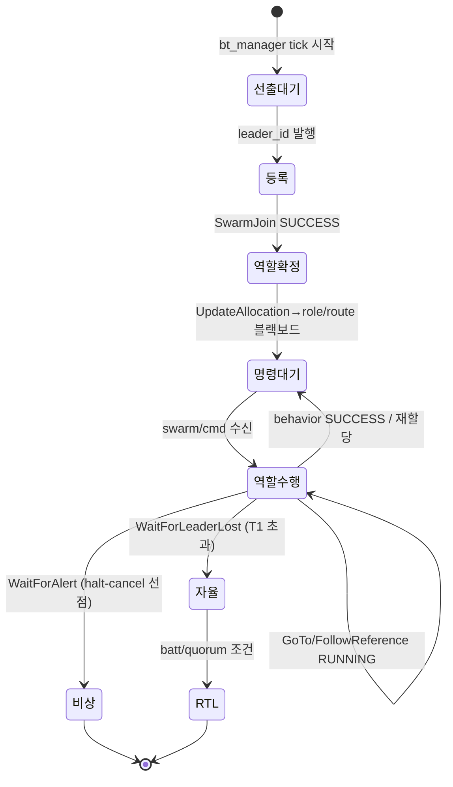
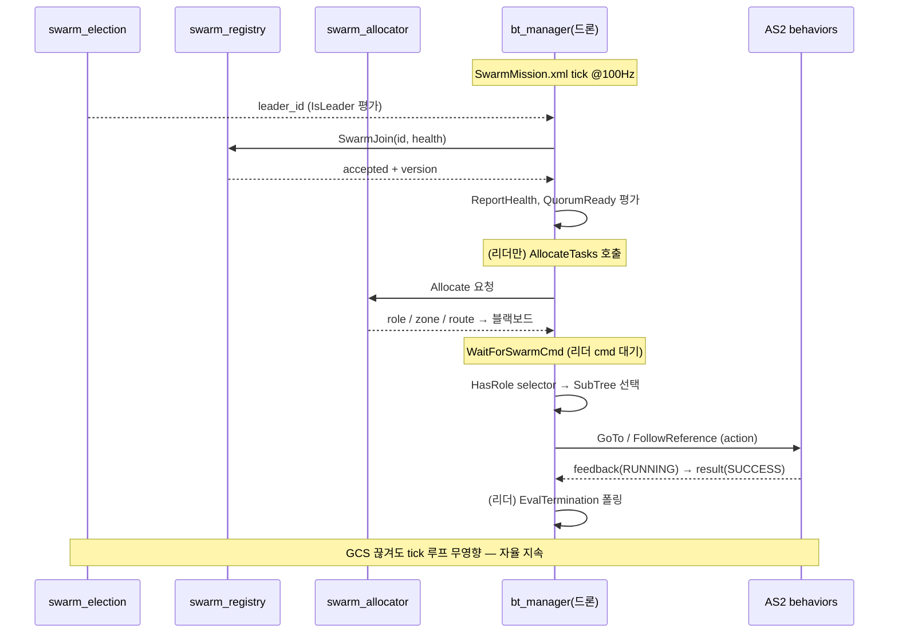

# 군집 조율 — AS2 Behavior Tree 네이티브 설계

> **전제**: 기존 설계 문서(`swarm_intelligence_layer_spec_v1.md`, `swarm_drone_coordination_design.md`, `swarm_design_graft_analysis.md`) 무시. AS2 `as2_behavior_tree` 구현에 맞춰 처음부터 설계.
> **기준**: `as2_behavior_tree` v1.1.3 소스 (BtActionNode/BtServiceNode 어댑터, WaitForEvent/WaitForAlert 반응형, 100Hz tick, halt-cancel 선점, 자기선택 트리).

---

## 0. 설계 원칙 (BT-first)

1. **조율 = 트리.** 별도 오케스트레이션 레이어(brain/follower_agent) 없음. 각 드론이 `bt_manager` + 군집-aware XML 한 벌.
2. **무거운 상태/계산만 백그라운드 서비스.** BT 리프 노드가 query — 기존 BtActionNode가 behavior를 래핑하는 구조와 동형.
3. **단일 XML 자기선택.** 같은 트리를 전 드론에 배포, `IsLeader` 조건이 리더/팔로워 분기. 누구나 리더 가능(어떤 드론이든 승계).
4. **반응형 = 기존 패턴 재사용.** WaitForEvent(리더 cmd), WaitForAlert(안전), halt-선점(우선순위 ladder).

> 핵심 요구 유지: GCS 단절돼도 임무 지속 (BT는 부팅 후 로컬 tick, GCS 의존 루프 없음).

---

## 1. 신규 BT 노드 (군집 조율 어휘)

패키지 `aiss_swarm_bt`. `as2_behavior_tree_node.cpp` 팩토리에 `registerNodeType` 추가 (또는 plugin 등록).

**커스텀 20 + 래퍼 2.** (IO·tick결과 상세 = `swarm_bt_node_reference.md`)

| 분류 | 노드 |
|---|---|
| Condition 8 | IsLeader, QuorumReady, HasMissionType, HasModality, HasRole, EvalTermination, BatteryLow, MissionTerminated |
| Action 6 | SwarmJoin(srv), UpdateAllocation(상시구독), AllocateTasks(srv), SwarmFormation(pub), FollowReference(action), RfSurvey |
| SyncAction 2 | ReportHealth(pub), PublishTelemetry(pub) |
| Decorator 4 | WaitForLeaderLost, WaitForSwarmCmd, WaitForAlert, WaitLaunchSlot |
| 커스텀 래퍼 2 | SwarmTakeoff(sleep 제거), SwarmFollowPath(다점 파서) |
| 재사용 AS2 | IsFlying, Arm, Offboard, Land, GoTo, PointGimbal |

> 데코 4종 = 신규(다중tick 자식 유지) — 상세 `swarm_bt_decorators.md`. AS2 무수정 원칙.
> ⚠️ **본 §1~§7은 개요.** 권위본 = `swarm_mission_example.xml`(ReactiveFallback+Parallel) + `swarm_bt_node_reference.md` §J.

---

## 2. 백그라운드 서비스 (상태/계산만, BT 아님)

패키지 `aiss_swarm_core`. BT tick과 독립 상시 동작. **6개.**

| 노드 | 역할 | 인터페이스 |
|---|---|---|
| `swarm_election` | heartbeat 5Hz, lowest-alive-id 선출 | pub `swarm/leader_id`, `swarm/heartbeat` |
| `swarm_registry` | Join 수락, registry/quorum/version | srv `swarm/join`, pub `swarm/registry` |
| `swarm_coordinator` | 의도 복제 (MissionUpload→`swarm/mission_intent` 전 드론 캐시, NEW-8) | srv `swarm/mission_upload`, pub `swarm/mission_intent`(latch) |
| `swarm_allocator` | 의도 분해·할당 (로컬 캐시 intent → per-drone task) | srv `swarm/allocate`, pub `/{drone}/swarm_agent/task` |
| `formation_ref` (드론별) | `/swarm/formation`[me] → TF (NEW-4) | TF `{drone}/formation_ref` |
| `separation_monitor` (드론별) | CPA/TCPA 분리감시 (NEW-9) | sub `swarm/telemetry`, pub `{drone}/alert_event` |

> BT 리프가 이 서비스들을 구독/호출. behavior를 BtActionNode가 래핑하는 것과 동형.

---

## 3. 트리 구조 (자기선택 XML)

### 3-1. 루트

```xml
<BehaviorTree ID="SwarmMission">
 <Parallel success_threshold="1" failure_threshold="1">

   <!-- 1. 안전: 상시 최상위 선점 -->
   <Decorator ID="WaitForAlert" topic_name="alert_event">
     <SubTree ID="Emergency"/>            <!-- Hover / Land -->
   </Decorator>

   <!-- 2. 조율: 리더면 조율+비행 동시, 아니면 비행만 -->
   <Fallback>
     <Sequence>
       <Condition ID="IsLeader"/>
       <Parallel>
         <SubTree ID="LeaderCoord"/>      <!-- 조율 -->
         <SubTree ID="FollowerMission"/>  <!-- 리더도 자기 비행 -->
       </Parallel>
     </Sequence>
     <SubTree ID="FollowerMission"/>       <!-- 일반 팔로워 -->
   </Fallback>

 </Parallel>
</BehaviorTree>
```

> 리더 드론은 **조율 + 비행 동시** (Parallel). IsLeader는 매 루프 재tick → 리더 교체 시 반응형 전환. 교체 시 halt-cancel이 이전 분기 액션 정리.

> 실제 구조 = 권위본 `swarm_mission_example.xml`. 아래는 요지(연속노드=Parallel KeepRunning, selector=ReactiveFallback).

### 3-2. LeaderCoord (연속 동작 Parallel)

```xml
<SequenceStar ID="LeaderCoord">
  <Condition ID="QuorumReady"/>                         <!-- 1회 게이트 -->
  <Parallel s=1 f=1>                                     <!-- 지속 동시 -->
    <KeepRunningUntilFailure><Action ID="AllocateTasks"/></KeepRunningUntilFailure>   <!-- 지속 재할당 -->
    <KeepRunningUntilFailure><Action ID="SwarmFormation"/></KeepRunningUntilFailure>  <!-- 편대 연속발행(NEW-2) -->
    <KeepRunningUntilFailure><Condition ID="EvalTermination"/></KeepRunningUntilFailure> <!-- 종료시 F+RTH방송(NEW-14) -->
  </Parallel>
</SequenceStar>
```

### 3-3. FollowerMission (연속 ∥ 임무, 반응형 selector)

```xml
<SequenceStar ID="FollowerMission">
  <Action ID="SwarmJoin"/>                               <!-- 1회 등록 -->
  <Fallback><Condition ID="IsFlying"/>
    <Decorator ID="WaitLaunchSlot"><SubTree ID="ArmTakeoff"/></Decorator></Fallback>  <!-- 이륙 순번(NEW-10) -->
  <Parallel s=1 f=1>                                     <!-- 연속 ∥ 임무 -->
    <KeepRunningUntilFailure><Action ID="ReportHealth"/></KeepRunningUntilFailure>      <!-- 상시 health -->
    <KeepRunningUntilFailure><Action ID="PublishTelemetry"/></KeepRunningUntilFailure>  <!-- 상시 telemetry -->
    <KeepRunningUntilFailure><Action ID="UpdateAllocation"/></KeepRunningUntilFailure>  <!-- 배정 상시구독(NEW-1) -->
    <ReactiveFallback>                                   <!-- 임무(Parallel 구동) -->
      <ReactiveSequence><Condition ID="BatteryLow"/><SubTree ID="IndividualRTB"/></ReactiveSequence>       <!-- 개별RTB(NEW-11) -->
      <ReactiveSequence><Condition ID="MissionTerminated"/><SubTree ID="IndividualRTB"/></ReactiveSequence> <!-- 종료RTB(NEW-14) -->
      <Decorator ID="WaitForLeaderLost"><Decorator ID="WaitForSwarmCmd">
        <ReactiveFallback>  <!-- 종류→수단→역할 3계층 selector (ReactiveSequence 가드) -->
          ... HasMissionType/HasModality/HasRole ...
        </ReactiveFallback>
      </Decorator></Decorator>
      <SubTree ID="AutonomousCached"/>                   <!-- 리더상실 폴백 -->
    </ReactiveFallback>
  </Parallel>
</SequenceStar>
```

핵심 원칙:
- **연속 동작**(health/telemetry/배정/편대) = `Parallel{ KeepRunning(...) }` (1회성 SequenceStar 금지, NEW-1/2/3).
- **selector** = `ReactiveFallback`+`ReactiveSequence` (조건 매tick 재평가 → 동적 재선택, P0).
- 역할/종류/수단 = 사전 enumerate, per-drone string 배정.

---

## 4. 요구사항 매핑 (BT-네이티브)

| 요구 | BT 실현 |
|---|---|
| GCS 단절 임무지속 | 트리는 블랙보드/XML 로컬로 tick. GCS 의존 tick 루프 없음 → 부팅 후 자율 |
| 리더 선출/교체 | `swarm_election` pub → `IsLeader` 조건 반응형. 교체 시 트리 재평가, 새 리더 LeaderCoord 활성 |
| 리더 단절 폴백 | `WaitForLeaderLost` 데코 → `AutonomousCached` (블랙보드 route 단독수행) |
| 편대 | **분산**: 리더 `SwarmFormation`이 `/swarm/formation`(centroid+오프셋) 발행 → 각 드론 `FollowReference`가 자기 reference 추종. (AS2 `swarm_flocking` 노드 **미사용** — 단일노드+TF권위가 이동리더와 충돌, 옵션3 결정) |
| 안전 선점 | Parallel 최상위 `WaitForAlert` + halt-cancel = 우선순위 ladder |
| 동적 역할 | 블랙보드 `role` + `HasRole` **ReactiveFallback** selector (트리 고정, 선택만 동적) |
| 종료 온보드 | `EvalTermination` 조건 (coverage/batt/time, GCS 무관) |

---

## 5. 신규 인터페이스 (최소)

- **srv 3**: `JoinRequest`, `Allocate`, `MissionUpload`
- **msg 7**: `Heartbeat`, `Health`, `DroneInfo`, `Registry`, `Task`, `MissionIntent`(의도복제), `SwarmTelemetry`
- **재사용**: `FollowReference`(action), `PoseStampedWithIDArray`(편대), `AlertEvent`(안전), `std_msgs/String`(cmd), `Geozone`·`PoseWithID[]`(route)
- **미사용**: `SwarmFlocking`/`swarm_flocking` — 존치, 호출 안 함 (분산편대 대체)
- **블랙보드**: `role`/`mtype`/`modality`/`route`/`zone`/`leader_id`/`home`

---

## 6. 리스크 (BT 특성)

| # | 리스크 (소스 근거) | 대응 |
|---|---|---|
| 1 | BtServiceNode 생성자 무한 wait (§17.4) | 백그라운드 6서비스 **먼저** 기동 (런치순서). 서버측 요청대기와 무관 |
| 2 | TakeoffAction 500ms sleep (§17.1) | **커스텀 SwarmTakeoff**(sleep 제거) + FCU failsafe 병행 |
| 3 | 트리 정적 — 런타임 신규 behavior 조합 불가 | 사전 enumerate. 개방형은 동적트리(C2) |
| 4 | `/swarm/*` 전역 ↔ 드론 ns 혼재 | swarm/ 절대토픽명 강제 |
| 5 | 연속 BT 노드 100Hz 발행부하 (NEW-15) | 노드 내부 throttle(실발행 10~20Hz) |
| 6 | FollowPath 2점 한계 (§17.2) | **커스텀 SwarmFollowPath**(다점 파서) |

> 상세·전체 미해결: `swarm_open_issues.md`. AS2 문제노드는 전부 커스텀 대체(무수정).

---

## 7. 결론

**BT-네이티브 군집조율 = 커스텀 BT 노드 20 + 커스텀 래퍼 2 + 백그라운드 서비스 6 + 자기선택 XML 1벌.** (상세 최신: `swarm_bt_node_reference.md` §J)

- 별도 오케스트레이션 레이어 없이 조율을 **트리로 표현**.
- 기존 설계의 follower_agent/brain 다수 노드 → BT 리프 + 6 서비스로 흡수. msg 17 → srv 3 + msg 7.
- AS2 BT 어댑터 패턴·반응형 노드·halt-선점을 그대로 활용 → **AS2 정합성 최고**.
- 부가 이득: Groot2 시각화 무료, XML 임무정의, 검증된 tick 엔진.
- 비용: 동적성이 **사전 enumerate 범위**로 제한 (런타임 임의 behavior 조합 불가).

### 다음 단계 (구현 전)
1. `aiss_swarm_bt` 패키지 — 20 BT 노드 + 2 래퍼 헤더/플러그인 골격.
2. `aiss_swarm_core` 패키지 — 6 서비스(election/registry/coordinator/allocator/formation_ref/separation_monitor) 골격.
3. `JoinRequest`·`Allocate` srv + `Heartbeat`·`Registry` msg 정의.
4. `SwarmMission.xml` + 서브트리(LeaderCoord/FollowerMission/Track/Scout/Standby/Emergency/AutonomousCached).
5. 런치: 백그라운드 3서비스 → bt_manager 순서 보장.

---

## 8. 동작 구조 — tick 실행 모델

BT는 명령형 스크립트가 아니라 **매 tick 트리 전체를 위→아래 재평가**하는 모델. 이걸 이해해야 시퀀스가 읽힌다.

### 8-1. tick 기본
- `bt_manager`가 `tickWhileRunning()`을 `bt_loop_duration`(=10ms, 100Hz)마다 호출.
- 매 tick = 루트부터 DFS로 자식 tick. 각 노드는 `SUCCESS / FAILURE / RUNNING` 반환.
- 장시간 동작(behavior 액션)은 **완료 전까지 RUNNING** 반환 → 부모가 그 자리서 대기, 다음 tick 재진입.
- **조건/데코는 매 tick 재평가** = 반응형. (IsLeader/WaitForAlert/HasRole이 상태변화에 즉시 반응하는 근거)

### 8-2. 제어노드 의미 (이 설계서 쓰는 것)
| 노드 | tick 규칙 | 이 설계 용도 |
|---|---|---|
| `Parallel(s=1,f=1)` | 자식 동시 tick. 1 SUCCESS→전체 SUCCESS, 1 FAILURE→전체 FAILURE | 루트: 안전 ∥ 조율 동시 |
| **`ReactiveFallback`** | **매tick 첫 자식부터 재tick** (조건 재평가). 첫 non-FAILURE서 멈춤, 우선순위 바뀌면 실행중 자식 halt | **IsLeader 분기 + 종류/수단/역할 selector** (동적 재선택) |
| **`ReactiveSequence`** | **매tick 첫 자식부터 재tick**. 가드 조건+동작 묶음 — 조건 flip 시 동작 halt+F | selector 내부 가드 (조건+서브트리) |
| `Fallback` (비반응형) | 첫 SUCCESS까지 순차, RUNNING 자식서 재개 (조건 재평가 X) | arm 일회성만 (동적분기엔 부적합) |
| `Sequence` | 첫 FAILURE까지 순차. 자식 RUNNING이면 거기서 멈춤 | LeaderCoord 단계 게이트 |
| `Decorator(WaitForX)` | 이벤트 전 RUNNING, 수신 시 **자식 RUNNING 동안 계속 tick** (신규 구현) | 리더cmd/안전/단절 대기 |
| `KeepRunningUntilFailure` | 자식 SUCCESS여도 RUNNING 유지, FAILURE면 종료 | 종료조건 폴링 루프 |

> ⚠️ **동적 재선택은 `Reactive*` 필수**. 평범한 `Fallback`/`Sequence`는 RUNNING 자식서 재개해 위쪽 조건을 재평가 안 함 → 역할/종류/리더 변경이 실행중 가지를 못 바꿈. 예제 XML은 selector를 `ReactiveFallback{ReactiveSequence{조건, 서브트리}}`로 수정 반영.

### 8-3. halt-선점 (우선순위 ladder 실현)
- 상위 분기가 활성화되면 BT 엔진이 하위 실행중 노드의 `halt()` 호출 → `async_cancel_goal()`로 **AS2 액션 취소**.
- 예: 비행중(`GoTo` RUNNING) AlertEvent 수신 → Parallel 안전브랜치 SUCCESS 경로 → 조율브랜치 halt → GoTo 취소 → Emergency 진입.
- = AlertEvent > detour > route > formation 우선순위가 **트리 구조 자체로** 강제됨 (별도 mux 불필요).

---

## 9. 부팅 후 실행 시퀀스 (tick 관점)

### 9-0. 런치 순서 (필수)
```
t0  swarm_election · swarm_registry · swarm_allocator 기동  (백그라운드 3)
    └ BtServiceNode 무한 wait_for_service 회피 위해 반드시 먼저
t1  AS2 substrate (platform/estimator/controller/behaviors) 기동
t2  bt_manager 기동 → SwarmMission.xml 로드 → tick 시작
```

### 9-1. 단계별 tick 흐름 (드론 1대 관점)

| 국면 | 활성 노드 (tick 경로) | 전이 트리거 |
|---|---|---|
| **P0 선출대기** | 루트 Parallel → Fallback → `IsLeader`(FAILURE, 아직 리더없음) → FollowerMission → `SwarmJoin`(RUNNING, 등록중) | swarm_election이 leader_id 발행 |
| **P1 역할확정** | FollowerMission → `SwarmJoin`(SUCCESS) → `ReportHealth` → `UpdateAllocation`(RUNNING) | allocator가 role/route 반환 → 블랙보드 기록 |
| **P2 명령대기** | `WaitForSwarmCmd`(RUNNING, 리더 cmd 대기) | `swarm/cmd` String 수신 |
| **P3 역할수행** | `WaitForSwarmCmd`→자식 Fallback→`HasRole`(role 매칭)→해당 SubTree→`GoTo`/`FollowReference`(RUNNING) | behavior 완료 SUCCESS |
| **종료** | (리더만) LeaderCoord→`EvalTermination` FAILURE→KeepRunning 종료 | coverage/batt/time |

### 9-2. 리더 드론 추가 경로
`IsLeader`(SUCCESS) → Parallel{ LeaderCoord, FollowerMission } 동시:
```
LeaderCoord: QuorumReady(quorum 전 FAILURE→멈춤, 충족시 통과; registry는 swarm_registry 서비스)
          → Parallel{ KeepRunning(AllocateTasks 지속재할당),
                      KeepRunning(SwarmFormation /swarm/formation 연속발행),
                      KeepRunning(EvalTermination 종료감시→F시 RTH방송) }
FollowerMission: (위 P0~P3 동일, 리더도 자기 비행)
```

### 9-3. 리더 교체 (tick 반응형)
```
[정상] IsLeader=FAILURE → FollowerMission tick 중
swarm_election: 기존 리더 heartbeat 끊김 → 차순위 lowest-alive-id = 본 드론
다음 tick: IsLeader 재평가 → SUCCESS
  → Fallback이 리더분기 선택 → FollowerMission halt? 아니오:
    리더분기 = Parallel{LeaderCoord, FollowerMission} 이므로 비행 유지
  → LeaderCoord 신규 활성 (registry/allocation은 백그라운드 서비스가 상태보유 → 인수 매끄러움)
```

### 9-4. 단절 분기 (tick 반응형)
```
WaitForLeaderLost 데코: swarm_election heartbeat timeout 감시
  정상: 자식(UpdateAllocation→역할수행) tick 통과
  리더상실 + 재선출 미수렴(T1): 데코가 AutonomousCached 서브트리로 전환
    → 블랙보드 route로 단독비행, batt/quorum 조건시 RTL behavior
GCS 단절: tick 루프 어디도 GCS 구독 안 함 → 무영향, 그대로 진행
```

---

## 10. 블랙보드 데이터 흐름

BT 노드간 결합은 공유 블랙보드 키-값으로. 누가 쓰고 읽나:

| 변수 | writer | reader | 갱신 시점 |
|---|---|---|---|
| `leader_id` | `IsLeader`(election 구독→기록) | (분기판정 내부) | heartbeat마다 |
| `role` | `UpdateAllocation`(allocator 응답) | `HasRole` selector | 할당/재지정 시 |
| `route` | `UpdateAllocation` | `GoTo`/`FollowPath`/AutonomousCached | 할당/replan 시 |
| `zone` | `UpdateAllocation` | Scout/Track SubTree | 할당 시 |
| `node`(ROS2) | bt_manager(시스템) | 전 BT 노드 | 부팅 1회 |

> 동적 역할변경(SCOUT→TRACK)=allocator가 새 `role` 반환→`UpdateAllocation` 블랙보드 갱신→다음 tick `HasRole` selector가 다른 SubTree 선택. **트리 구조 불변, 데이터만 바뀜.**

---

## 11. Mermaid

### 11-1. tick 상태 흐름 (팔로워)


### 11-2. 시퀀스 (선출→할당→수행→종료)


> 핵심: 모든 조율이 **tick마다 트리 재평가**로 일어남. 외부 명령(리더 cmd/안전/선출)은 조건·데코가 매 tick 읽어 즉시 반영. 명령형 상태머신을 별도로 안 돌림.

---

## 12. 다종 임무 처리 (정찰 / 추적 / 감시)

GCS가 임무 **종류**를 선택해 업로드. BT는 종류별로 다른 단계·편대·종료조건을 처리해야 한다.

### 12-1. 핵심 구분 — 종류 ≠ 역할

| 개념 | 범위 | 결정자 | BT 표현 |
|---|---|---|---|
| **임무 종류** (RECON/TRACK/SURVEIL) | 군집 전체 목표 | GCS 업로드 | `HasMissionType` selector (1계층) |
| **역할** (SCOUT/TRACKER/RELAY/STANDBY) | 드론별 배정 | swarm_allocator | `HasRole` selector (2계층) |

> 종류는 트리 모양 전체(단계/편대/종료)를 바꾸고, 역할은 그 안에서 드론별 가지를 바꾼다.

### 12-2. 2계층 selector 구조

```
WaitForSwarmCmd
└─ Fallback (1계층: 종류)
   ├─ HasMissionType RECON?   → ReconMission
   │                              └─ Fallback (2계층: 역할) TRACK/SCOUT/STANDBY
   ├─ HasMissionType TRACK?   → TrackTypeMission
   │                              └─ Fallback TRACKER/RELAY/STANDBY
   ├─ HasMissionType SURVEIL? → SurveilMission
   │                              └─ Fallback SCOUT/RELAY/STANDBY
   └─ StandbyMission (기본)
```

종류별 역할집합·behavior 조합이 다름:

| 종류 | 편대 | 역할집합 | 주 behavior | 종료조건 |
|---|---|---|---|---|
| 정찰 RECON | line/grid | SCOUT/TRACK/STANDBY | FollowPath(탐색)+FollowReference | coverage≥95% |
| 추적 TRACK | follow | TRACKER/RELAY | GoTo(표적 동적) | target lost |
| 감시 SURVEIL | loiter ring | SCOUT/RELAY | FollowPath(거점 순환) | 시간기반 지속 |

### 12-3. 종류-aware 백그라운드 (BT 밖 영향)

종류는 BT 가지뿐 아니라 백그라운드도 바꿈:
- `swarm_allocator`: `Allocate` 요청에 `type` 포함 → 종류별 role/route/formation 반환. (BT 가지는 단계구조만, 할당내용은 allocator가)
- `EvalTermination`: 종류별 종료조건 분기 (coverage / target-lost / time).
- `SwarmFormation`: 종류별 편대(line/follow/loiter).

### 12-4. GCS 흐름 + 동적 전환

```
GCS MissionUpload{ mission_type:"SURVEIL", ... }
  → swarm_registry/allocator 보유
  → /swarm/mission_type 발행 (or Allocate 응답에 포함)
  → BT HasMissionType 조건이 매 tick 읽음 → 종류 가지 선택
```
종류 변경도 동적: GCS가 새 mission_type 발행 → 다음 tick selector가 다른 가지 → 기존 가지 **halt-cancel** → 신규 종류 진입. (역할 재지정과 동일 메커니즘)

### 12-5. 한계 — 3 옵션

| 옵션 | 방식 | 신규종류 추가 | mid-flight 전환 |
|---|---|---|---|
| **A. 종류 selector (채택)** | 1 메가트리에 종류 전부 enumerate | XML 재배포 | ✅ 동적(halt-cancel) |
| B. 종류별 XML | `tree:=surveil.xml` 로드 | 파일추가 | ❌ bt_manager 재시작 (AS2는 부팅1회 로드, 분석 §12) |
| C. 동적 트리 | GCS가 트리 XML/디스크립터 전송, `createTreeFromText` | ✅ 런타임 | ✅ 단 bt_manager 확장+검증 필요 |

**채택 = A.** BT-네이티브, 재시작 없이 동적전환, 알려진 종류집합엔 충분. 트리 정적이라 **종류 사전 enumerate** 제약. 진짜 개방형(런타임 신규종류)은 C로 미룸 (bt_manager에 동적 트리로드 추가, 향후).

> 예제: `swarm_mission_example.xml`에 ReconMission/TrackTypeMission/SurveilMission 2계층 selector 반영됨.
