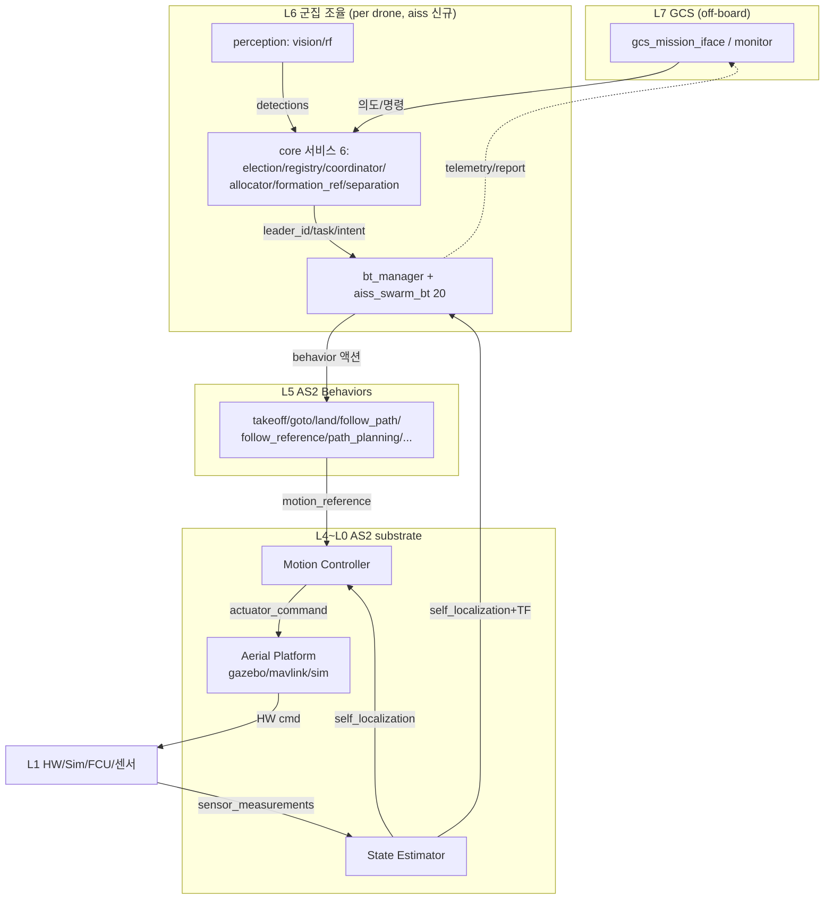

# 전체 프레임워크 구조 — AS2 + 군집(Swarm) 레이어 종합

> AS2(Aerostack2) 단일드론 스택 위에 군집 조율 레이어(aiss)를 얹은 **전체 계층 구조**. 레이어별 주요 노드 포함.
> 기준: `AS2_NODES_ANALYSIS.md`(AS2 substrate) + `swarm_bt_native_design.md`/`swarm_bt_node_reference.md`(swarm 레이어).

---

## 1. 계층 스택 (수직)

```
┌─ L7  GCS (off-board, 제어루프 밖) ──────────────────────────────────┐
│   gcs_mission_iface(의도 업로드·명령) · gcs_monitor(상태·영상)        │
└───────────────────────────┬─────────────────────────────────────────┘
        MissionUpload / swarm cmd / telemetry·report   │ (끊겨도 임무 지속)
┌─ L6  군집 조율 (per drone, aiss — 신규) ─────────────────────────────┐
│  ▸ bt_manager (as2_behavior_tree 엔진 재사용) + aiss_swarm_bt 20노드  │
│      IsLeader/Has*/EvalTermination·SwarmJoin/UpdateAllocation·        │
│      SwarmFormation/FollowReference·WaitFor*·SafeHover ...            │
│  ▸ aiss_swarm_core 서비스 6: election·registry·coordinator·          │
│      allocator·formation_ref·separation_monitor                      │
│  ▸ aiss_swarm_perception: vision_detect · rf_scan                    │
└───────────────────────────┬─────────────────────────────────────────┘
        AS2 behavior 액션/서비스 호출 (Takeoff/GoTo/Land/FollowReference/Arm...) │
┌─ L5  AS2 Behaviors (액션서버) ───────────────────────────────────────┐
│   takeoff · go_to · land · follow_path · follow_reference ·          │
│   trajectory_generation · path_planning(A*/Voronoi) ·                │
│   detect_aruco · point_gimbal · geozones ...                         │
│   (swarm_flocking 존치·미사용 — 분산편대로 대체)                       │
└───────────────────────────┬─────────────────────────────────────────┘
        motion_reference/{pose,twist,trajectory,thrust}   │
┌─ L4  Motion Reference Handlers (lib, behavior가 링크) ───────────────┐
└───────────────────────────┬─────────────────────────────────────────┘
┌─ L3  AS2 Motion Controller (controller_manager + PID/diff_flatness) ─┐
└───────────────────────────┬─────────────────────────────────────────┘
        actuator_command/{pose,twist,trajectory,thrust}   │
┌─ L2  AS2 Aerial Platform (HW 추상화) ────────────────────────────────┐
│   as2_platform_gazebo · as2_platform_mavlink(MAVROS) ·               │
│   as2_platform_multirotor_simulator                                  │
└───────────────────────────┬─────────────────────────────────────────┘
        HW cmd (cmd_vel / AttitudeTarget / acro)          │
┌─ L1  HW / Sim ───────────────────────────────────────────────────────┐
│   Gazebo · 내장 멀티로터 sim · 실 FCU(PX4/ArduPilot via MAVROS) ·     │
│   센서(realsense/usb_camera/RF) · gazebo bridges                     │
└───────────────────────────┬─────────────────────────────────────────┘
        sensor_measurements/{imu,gps,camera,lidar,battery,odom}, ground_truth │
┌─ L0  AS2 State Estimator (+plugins) ─────────────────────────────────┐
│   ground_truth / raw_odometry / mocap / gps fuse                     │
│   → self_localization/{pose,twist,odom} + TF(earth→map→odom→base)     │
└──────────────────────────────────────────────────────────────────────┘
        self_localization → L0~L6 전체로 피드백 (순환)
```

> **순환**: 센서(L1) → estimator(L0) → self_localization → behaviors/controller/swarm 전부 소비 → actuator → platform → HW → 다시 센서.

---

## 2. 레이어별 주요 노드 + 소유

| L | 레이어 | 주요 노드/컴포넌트 | 소유 |
|---|---|---|---|
| L7 | GCS | gcs_mission_iface, gcs_monitor | **aiss 신규** (off-board) |
| L6 | 군집 조율 | bt_manager+aiss_swarm_bt(20), aiss_swarm_core(6 서비스), perception(2) | **aiss 신규** |
| L5 | Behaviors | takeoff/go_to/land/follow_path/follow_reference/trajectory_gen/path_planning/detect_aruco/point_gimbal/geozones | **AS2 재사용** (swarm_flocking 미사용) |
| L4 | Motion Ref Handlers | basic_motion_references (lib) | AS2 |
| L3 | Motion Controller | controller_manager + pid_speed/differential_flatness | AS2 |
| L2 | Aerial Platform | platform_gazebo/mavlink/multirotor_sim | AS2 |
| L1 | HW/Sim | Gazebo/sim/FCU(MAVROS), 센서, gazebo bridges | AS2 + HW |
| L0 | State Estimator | state_estimator + 플러그인(ground_truth/raw_odom/mocap/gps) | AS2 |

**가로지름(cross-cutting)**:
| 컴포넌트 | 역할 | 소유 |
|---|---|---|
| `as2_core` | 표준 토픽이름(as2_names)·TF·QoS·노드 base | AS2 |
| `as2_msgs` | 표준 메시지 | AS2 |
| **`aiss_swarm_msgs`** | 군집 메시지 7 + srv 3 | **aiss 신규** |
| `as2_map_server` | LaserScan→OccupancyGrid (path_planning 입력) | AS2 |
| `as2_geozones` | 지오펜스→AlertEvent | AS2 (안전 입력) |

---

## 3. 군집 레이어(L6) 내부 상세

```
┌──────────────── L6 군집 조율 (드론 1대) ─────────────────┐
│                                                          │
│  [aiss_swarm_core 서비스] (BT 아님, 상시)                 │
│   election ─leader_id─┐   registry ─registry─┐           │
│   coordinator ─mission_intent(복제)─┐         │           │
│   allocator ─task(per-drone)─┐      │         │           │
│   formation_ref ─TF─┐        │      │         │           │
│   separation_monitor ─alert─┐│      │         │           │
│        │ │ │ │ │ │           ▼▼      ▼         ▼           │
│  [bt_manager + aiss_swarm_bt]  ◄── 구독/호출 ──           │
│   루트 Parallel{ 안전(WaitForAlert→Emergency),            │
│     ReactiveFallback{ IsLeader→[LeaderCoord∥Follower],    │
│                       Follower } }                        │
│        │ behavior 액션 호출                                │
│  [aiss_swarm_perception] vision_detect/rf_scan ─detections─▶ allocator │
└──────────────────────┬───────────────────────────────────┘
                       ▼  L5 AS2 Behaviors (Takeoff/GoTo/FollowReference/...)
```

- **서비스 = 무거운 상태/계산** (선출·등록·할당·의도복제·편대TF·분리감시).
- **BT = 흐름제어** — 서비스 결과를 구독/호출, AS2 behavior로 실행.
- **perception = 인식** → 탐지를 allocator로(재할당 루프).

---

## 4. 수직 데이터 흐름 (한 명령)

```
GCS 의도 ─▶ coordinator(복제) ─▶ allocator(분해) ─▶ task ─▶ BT UpdateAllocation
  ─▶ BT selector(종류/수단/역할) ─▶ BT가 AS2 behavior 액션 호출(GoTo 등)
  ─▶ behavior ─▶ motion_reference ─▶ controller ─▶ actuator_command
  ─▶ platform ─▶ HW cmd ─▶ FCU/sim ─▶ 기동
센서 ─▶ estimator ─▶ self_localization ─▶ (behavior/controller/swarm telemetry) 피드백
```

## 5. 수평 흐름 (드론 간, 군집)

```
전 드론 ◀─heartbeat─▶ election (리더 선출)
팔로워 ─join─▶ registry / 리더 ─mission_intent(복제)─▶ 전 드론 캐시
리더 allocator ─task(per-drone)─▶ 각 드론 / 리더 ─formation─▶ 각 드론 FollowReference
각 드론 ─telemetry─▶ separation_monitor(충돌감시) + GCS
```

---

## 6. 핵심 결합 원리

| 원리 | 내용 |
|---|---|
| **AS2 무수정** | swarm은 L6에만 존재. L5 이하 AS2는 안 건드림. 문제노드는 커스텀 BT로 대체 |
| **behavior 경계** | swarm↔AS2 접합 = behavior 액션(Takeoff/GoTo/FollowReference). 표준 계약 |
| **표준 어휘** | as2_names 토픽 + 드론 네임스페이스로 결합. 플러그인 교체 무영향 |
| **swarm/ 전역 스코프** | 군집 토픽은 절대경로 `/swarm/*`(리더 역할), 드론 토픽은 ns 상대 |
| **단절생존** | L7(GCS) 끊겨도 L6 로컬 tick + 의도복제 → 자율 지속 |

---

## 7. Mermaid (전체)



---

> 상세: L6 = `swarm_bt_native_design.md`/`swarm_bt_node_reference.md`, L0~L5 = `AS2_NODES_ANALYSIS.md`. 기능 관점 = `swarm_overview.md`.
