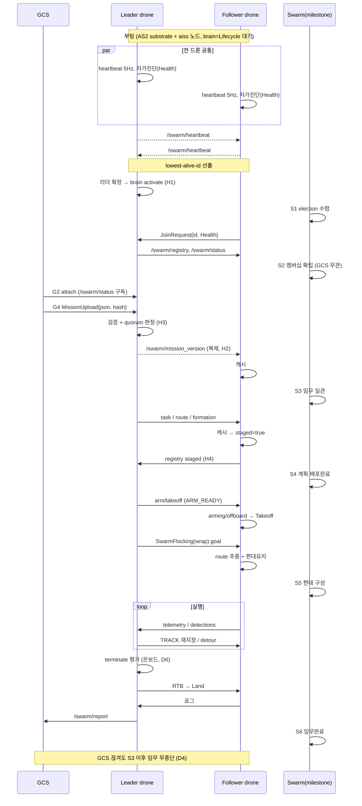

# 군집 지능 레이어 — 노드 책임·IO 계약 명세 v1

**목적**: AS2(Aerostack2) 실행 기반 위에 리더-팔로워 군집 지능 레이어를 추가한다. 이 문서는 신규 레이어의 노드별 책임과 입/출력(ROS2 인터페이스) 계약을 확정한다. ROS2 노드는 언어중립 IDL(msg/action/srv)로만 결합하므로, 계약을 먼저 못박고 구현 언어는 노드별로 나중에 결정한다.

**기준 문서**: `AS2_NODES_ANALYSIS.md`, `swarm_mission_scenario_v1.md`, `as2_behaviors_swarm_flocking` 분석.

---

## 0. 확정된 아키텍처 결정

| # | 결정 | 내용 |
|---|---|---|
| D1 | **리더 위치** | On-drone 선출형. 리더는 *역할*이지 고정 노드 아님. 모든 드론이 brain 코드 적재, 1대만 활성. |
| D2 | **선출 메커니즘** | Lowest-alive-id. heartbeat로 생존 감지, 살아있는 최저 id가 리더. 임무패키지가 복제되어 있어 권위상태 인수 = 캐시 읽기. |
| D3 | **GCS 위치** | 제어루프 밖. 임무 업로드 + 사람 오버라이드(선택) + 보고 수신. GCS 링크 단절돼도 임무는 군집 캐시플랜으로 자율 계속. |
| D4 | **GCS 명령 의미론** | Best-effort 오버라이드. 수신되면 적용, 부재≠중단. 모든 명령 idempotent + version_tag. 재연결 시 버전해시 비교로 catch-up. |
| D5 | **임무 복제** | 업로드 시 모든 드론에 임무패키지 + version_hash 배포. arm 후 어떤 드론도 GCS 불필요. |
| D6 | **종료조건 온보드 평가** | battery/time/coverage/quorum 전부 드론 내부서 판정. GCS 강제종료(ABORT)만 외부 입력, 미수신을 종료로 오판 금지. |
| D7 | **통신 채널 분리** | 드론간 DDS = 한 채널(mesh/radio), GCS 링크 = 별 채널. GCS 끊겨도 inter-drone DDS 생존. |
| D8 | **편대 실행 (flocking)** | **Wrap**. 기존 `as2_behaviors_swarm_flocking` 무변경, brain(formation_manager)이 action client로 호출. 리더 이동 시 재기동 처리만 설계. |
| D9 | **언어** | 미정. 인터페이스 계약 확정 후 노드별 결정. (현 검토: brain=Python, hotpath=C++ 혼합 유력) |
| D10 | **멤버십/quorum 분리** | Swarm 형성(election+health+registry=멤버십)은 boot 직후 GCS·임무 독립. quorum 판정만 mission 후(min_quorum이 MissionPackage에 종속). scenario doc의 "군집 등록(step3)"을 boot 직후로 당김. |
| D11 | **GCS 연결 = 감독축** | GCS 연결확인은 swarm 형성과 직교(별 채널). arm HARD 게이트 아님(D4 일관). `require_gcs_approval` 파라미터로만 HARD 전환 옵션, 기본 SOFT. |

---

## 1. 이름 어휘 (Name Vocabulary)

`as2_names` 패턴을 따라 군집 레이어 표준 이름을 정의한다. 두 스코프:

- **`/swarm/*`** — 리더 역할 스코프. 현재 리더 드론이 발행한다. GCS·follower는 드론 id를 몰라도 역할 이름에 말을 건다. 리더가 바뀌어도 이름 불변.
- **`/{droneN}/swarm_agent/*`** — follower별 스코프.

기존 AS2 인터페이스 재사용:
- `/{droneN}/FollowReferenceBehavior`, `/{droneN}/{Takeoff,GoTo,Land}Behavior` (action)
- `/{droneN}/self_localization/{pose,twist}`, `/{droneN}/platform/info`, `/{droneN}/alert_event` (topic)
- platform arming/offboard/takeoff/land (service)
- `/Swarm/SwarmFlockingBehavior` (action, wrap 대상)

표기: **kind** = topic(T) / action(A) / service(S). **재사용** = new(순수신규) / reuse:기존타입 / compose(조각합성) / align(기존 패턴 모방).

---

## 1.5 메시지 재사용 결정 요약

`as2_msgs` 기정의 메시지와 중복 검토 결과. 신규 후보 17개 중 다수를 재사용/합성으로 흡수한다.

**강한 중복 → 재사용 (신규 정의 금지)**
| 스펙 후보 | 대체 | 비고 |
|---|---|---|
| SafetyEvent | `as2_msgs/AlertEvent` | KILL_SWITCH/EMERGENCY_HOVER/LAND/FORCE_HOVER/FORCE_LAND 완비 |
| Waypoints[] | `as2_msgs/PoseWithID[]` + `YawMode` | FollowPath.action이 쓰는 그 타입 |
| route geofence | `as2_msgs/Geozone` + `SetGeozone.srv` | polygon+z_up/down+alert |
| SwarmCommand의 RTH/ABORT | `as2_msgs/AlertEvent` | 안전계열 분리 |
| SwarmCommand의 HOLD/RESUME/PAUSE | `as2_msgs/MissionUpdate` enum | 생명주기 명령은 LOAD/START/PAUSE/RESUME/STOP 패턴 |
| Detection[] | `vision_msgs/Detection3DArray` (표준) | 또는 `PoseStampedWithIDArray` |

**부분 중복 → 합성(compose)**
| 스펙 후보 | 조각 | 비고 |
|---|---|---|
| SwarmTelemetry | `PlatformInfo` + `PlatformStatus`(state) + BatteryState; role만 신규 | flat 신규 금지 |
| Health | `PlatformInfo` 일부 + `diagnostic_msgs/DiagnosticArray` | comm/gps/imu 진단 |
| MissionPackage | `MissionUpdate`(JSON string mission + action enum); version_hash만 추가 | JSON-string 관례 재사용 |
| TrackState | `nav_msgs/Odometry`(pos/vel) + conf wrap | |

**패턴 모방(align)**
| 스펙 후보 | 모방 대상 |
|---|---|
| Task.role enum (SCOUT/TRACK/STANDBY) | `FollowTargetInfo` enum 스타일 |

**순수 신규 (중복 없음 → 새로 정의)**
`Heartbeat` · `DroneRegistry[]` · `SwarmStatus` · `MissionPhase` · `TerminateDecision` · `MissionReport` · `Task`(zone/pattern) · `JoinRequest.srv`

> 무관 주의: `NodeStatus`(per-노드 라이프사이클) ≠ DroneRegistry. `MissionEvent`(trigger header+data) ≠ MissionReport.

---

## 2. GCS 레이어 (제어루프 밖, off-board)

### `gcs_mission_iface` — 임무 업로드 + 사람 오버라이드 + 보고 수신
| dir | name | kind | payload | 재사용 |
|---|---|---|---|---|
| out | `/swarm/mission_upload` | S(new) | MissionPackage{zone, priority, time_limit, min_quorum} + version_hash | compose: `MissionUpdate` JSON-string + version_hash |
| out | `/swarm/command` | T | SwarmCommand{type, version_tag} (idempotent best-effort) | reuse 분해: 안전(RTH/ABORT)→`AlertEvent`, 생명주기(HOLD/RESUME)→`MissionUpdate` enum |
| in | `/swarm/report` | T(new) | MissionReport | new |
| in | `/swarm/status` | T(new) | SwarmStatus{leader_id, phase, quorum} | new |

### `gcs_monitor` — 모니터 대시보드 (읽기전용)
| dir | name | kind | payload | 재사용 |
|---|---|---|---|---|
| in | `/swarm/telemetry` | T | SwarmTelemetry[]{drone_id, pose, batt, role, state} | compose: `PlatformInfo`+`PlatformStatus`+BatteryState; role 신규 |
| in | `/swarm/status` | T(new) | SwarmStatus | new |
| in | `/swarm/report` | T(new) | MissionReport | new |

> `fleet_manager_node` (Python) 를 base로 확장 가능.

---

## 3. Brain 레이어 (선출 리더 드론 위 실행, `/swarm/` 발행)

> 모든 brain 노드는 every drone에 적재되지만, 선출된 리더에서만 활성화된다. `leader_election`이 활성/대기를 게이팅한다.

### `leader_election` — heartbeat + lowest-alive-id 선출
| dir | name | kind | payload | 재사용 |
|---|---|---|---|---|
| out | `/swarm/heartbeat` | T(new) | Heartbeat{drone_id, term, alive_set} @ 5Hz | new |
| in | `/swarm/heartbeat` | T(new) | (전 드론 구독, 최저 살아있는 id 계산) | new |
| out | `/{drone}/swarm_agent/leader_id` | T | 현재 리더 id 광고 | reuse: `std_msgs/String` (단일 id) |

### `swarm_coordinator` — registry, version sync, quorum, GCS 브리지
| dir | name | kind | payload | 재사용 |
|---|---|---|---|---|
| in | `/{drone}/swarm_agent/join` | S(new) | JoinRequest{drone_id, health} | new (health=compose) |
| out | `/swarm/registry` | T(new) | DroneRegistry[] | new |
| out | `/swarm/mission_version` | T | version_hash (브로드캐스트) | reuse: `std_msgs/String` |
| in | `/swarm/mission_upload` | S(new) | (GCS→리더, 수신·검증) | compose: `MissionUpdate` JSON+hash |
| out | `/swarm/status` | T(new) | SwarmStatus{leader_id, phase, quorum} → GCS | new |

### `mission_manager` — 생명주기 + 종료조건 온보드 평가
| dir | name | kind | payload | 재사용 |
|---|---|---|---|---|
| in | `/swarm/registry`, coverage, batt, time, `/swarm/command` | T | ↑ | — |
| out | `/swarm/phase` | T(new) | MissionPhase{PRE/EXEC/RTB/LAND} | new (SwarmStatus에 접을지 검토) |
| out | `/swarm/terminate` | T(new) | TerminateDecision{reason, uncovered_zones} | new |

종료조건 평가 (우선순위 순, 전부 온보드):
1. GCS 강제 ABORT (수신 시에만, 부재≠abort)
2. battery ≤ 30%
3. mission timeout
4. quorum < min
5. coverage ≥ 95%

### `task_allocator` — 역할·구역 할당 (Voronoi)
| dir | name | kind | payload | 재사용 |
|---|---|---|---|---|
| in | `/swarm/registry`, analysis, batt | T | ↑ | — |
| out | `/{drone}/swarm_agent/task` | T(new) | Task{role: SCOUT/TRACK/STANDBY, zone, pattern} | new; role enum align: `FollowTargetInfo` 스타일 |

트리거: detection 수신 시 최근접·고배터리 기체를 TRACKER로 재지정, 새 Task 배포.

### `swarm_route_planner` — 6 하위경로 생성 + 패턴 선택
| dir | name | kind | payload | 재사용 |
|---|---|---|---|---|
| in | task, analysis, drone_count | T | ↑ | — |
| out | `/{drone}/swarm_agent/route` | T(new) | Route{waypoints, geofence, pattern} | compose: waypoints=`PoseWithID[]`, geofence=`Geozone`; pattern enum만 신규 |
| in | safety detour req | T | (dynamic replan 트리거) | reuse: `AlertEvent`/detour |

> per-drone 세부 경로계획은 기존 `as2_behaviors_path_planning`(A*/Voronoi) 재사용.

### `formation_manager` — 편대 결정 + flocking 구동 (Wrap)
| dir | name | kind | payload | 재사용 |
|---|---|---|---|---|
| in | route(폭), drone list | T | ↑ | — |
| out | `/Swarm/SwarmFlockingBehavior` | A(reuse) | SwarmFlocking goal{virtual_centroid, swarm_formation, drones_namespace} | reuse: `as2_msgs/action/SwarmFlocking` |
| out | `/{drone}/swarm_agent/formation` | T | type + offset (follower 캐시용) | reuse: `PoseWithIDArray` (offset) |

> **Wrap 결정(D8)**: flocking 소스 무변경. formation_manager가 action client로 goal 전송. 리더 드론 이동 시 SwarmFlocking 재기동(stop→재goal) 책임은 formation_manager가 가진다. 기존 flocking의 알려진 제약(static TF, sleep(5s), checkPosition 블로킹, max_speed=15 하드코딩)은 wrap 경계 밖에 격리된다.

### `mission_reporter` — 보고 통합
| dir | name | kind | payload | 재사용 |
|---|---|---|---|---|
| in | flight log, detection log, tracking log, safety log | T(new) | ↑ | new (로그 집계) |
| out | `/swarm/report` | T(new) | MissionReport → GCS | new |

---

## 4. Follower 레이어 (every drone, `/{droneN}/swarm_agent/`)

### `follower_agent` ★단절생존 핵심 — 리더 cmd → AS2 behavior 호출 + 캐시 + 자율 폴백
| dir | name | kind | payload | 재사용 |
|---|---|---|---|---|
| in | task, route, formation, leader_id | T | ↑ (수신 즉시 **로컬 캐시**) | reuse: 위 정의 타입들 |
| out→AS2 | `/{drone}/{Takeoff,GoTo,FollowReference,Land}Behavior` | A(reuse) | behavior goal | reuse: 기존 action |
| out→AS2 | `/{drone}/platform` arming/offboard | S(reuse) | ↑ | reuse: `SetArmingState`/`SetOffboardMode` |
| out | `/{drone}/swarm_agent/health` | T | Health{gps, imu, batt, comm, READY} | compose: `PlatformInfo` + `diagnostic_msgs/DiagnosticArray` |
| out | `/swarm/telemetry` 기여 | T | pose/batt/role/state | compose: `PlatformInfo`+`PlatformStatus`+BatteryState |
| in | `/{drone}/swarm_agent/detour` | T | local_replanner 우회 (최우선 반영) | reuse: `PoseWithID[]` |

상태기계:
```
NORMAL
  └─(leader heartbeat 끊김)─► LEADER_LOST
        ├─(선출완료)──────────► NORMAL (새 리더 인수)
        └─(타임아웃 T1 초과)──► AUTONOMOUS (캐시 플랜 단독 수행)
AUTONOMOUS
  └─(quorum < min ∥ batt < 30%)─► RTH (60s hover → 개별 RTH)
```

### `sensor_processor` — EO/IR/LiDAR 전처리
| dir | name | kind | payload | 재사용 |
|---|---|---|---|---|
| in | `/{drone}/sensor_measurements/{camera,...}` | T(reuse) | raw 영상/클라우드 | reuse: `sensor_msgs/Image`,`PointCloud2` |
| out | `/{drone}/swarm_agent/{eo,ir}_proc`, `.../cloud_proc` | T | 전처리 영상 / 필터 클라우드 | reuse: `sensor_msgs/Image`,`PointCloud2` |

### `detection` — 온보드 AI (Jetson GPU, YOLO 30Hz)
| dir | name | kind | payload | 재사용 |
|---|---|---|---|---|
| in | eo/ir_proc | T | ↑ | reuse: `sensor_msgs/Image` |
| out | `/{drone}/swarm_agent/detections` | T | Detection[]{pos, class, conf} | reuse: `vision_msgs/Detection3DArray` (또는 `PoseStampedWithIDArray`) |

> 기존 `detect_aruco_markers_behavior` 가 카메라 구독 + PoseStampedWithIDArray 발행 패턴의 템플릿.

### `tracking` — Kalman 표적 추적
| dir | name | kind | payload | 재사용 |
|---|---|---|---|---|
| in | detections, self pose | T | ↑ | reuse: `vision_msgs`, `PoseStamped` |
| out | `/{drone}/swarm_agent/track` | T | TrackState{pos, vel, heading, conf} | compose: `nav_msgs/Odometry`(pos/vel) + conf wrap |

---

## 5. Safety 레이어 (every drone, Mission과 독립 상시 동작)

### `safety_monitor` — separation / geofence / collision 통합 감시
| dir | name | kind | payload | 재사용 |
|---|---|---|---|---|
| in | `/swarm/telemetry` (전 드론 pose), geofence | T | ↑ | reuse: telemetry compose, `Geozone` |
| out | `/{drone}/alert_event` | T(reuse) | AlertEvent | reuse: `as2_msgs/AlertEvent` |
| out | `/swarm/safety_event` | T | 보고용 | reuse: `AlertEvent` (별도 SafetyEvent 정의 안 함) |

> geofence 1차 감시는 기존 `as2_geozones` 재사용 가능.

### `local_replanner` — 200ms 실시간 우회 (C++ 강제 — 데드라인)
| dir | name | kind | payload | 재사용 |
|---|---|---|---|---|
| in | LiDAR/Radar, `/{drone}/map` | T(reuse) | ↑ | reuse: `sensor_msgs/LaserScan`, `nav_msgs/OccupancyGrid` |
| out→follower_agent | `/{drone}/swarm_agent/detour` | T | 즉시 우회 waypoint | reuse: `PoseWithID[]` |

---

## 6. 재사용으로 신규 노드 안 만드는 것

| scenario doc 노드 | 처리 | AS2 자산 |
|---|---|---|
| `ardupilot_bridge` | 재사용 | `as2_platform_mavlink` |
| 편대 실행 | 재사용 (wrap) | `as2_behaviors_swarm_flocking` |
| per-drone 경로계획 | 재사용 | `as2_behaviors_path_planning` (A*/Voronoi) |
| geofence 1차 | 재사용 | `as2_geozones` |
| arm/takeoff/land/goto | 재사용 | 기존 motion behaviors (action client) |

---

## 7. 3-Tier 구조 요약

```
GCS (제어루프 밖)  gcs_mission_iface · gcs_monitor
  │ 임무 업로드(1회) + best-effort 오버라이드 + 텔레메트리 구독
  │ ※ 끊겨도 아래 전부 계속 동작
  ▼
[Swarm Brain] (현재 리더 드론 위 실행, /swarm/* 발행)
  leader_election · swarm_coordinator · mission_manager
  task_allocator · swarm_route_planner · formation_manager · mission_reporter
  ▲ heartbeat. 끊기면 최저 살아있는 id 승계, 캐시상태 인수
  │ swarm/ topic·action (inter-drone DDS)
  ▼
[Follower Agent] (drone0..N 전부, 리더 드론도 자기 agent 보유)
  follower_agent(캐시+자율폴백) · sensor_processor · detection · tracking
  ▼
[AS2 substrate] (무변경)
  platform(mavlink) · estimator · controller · behaviors · swarm_flocking
```

---

## 8. 다음 단계 (구현 전)

1. **신규 ROS2 인터페이스 목록 도출** (§1.5 재사용 검토 반영) — 별도 overlay 워크스페이스 `aiss_ws/src/aiss/aiss_swarm_msgs` 패키지에 추가:
   - **순수 신규 msg**: Heartbeat, DroneRegistry, SwarmStatus, MissionPhase, TerminateDecision, MissionReport, Task, Route(=PoseWithID[]+Geozone+pattern 합성)
   - **합성 msg** (조각 재사용): SwarmTelemetry, Health, TrackState
   - **신규 srv**: JoinRequest, MissionUpload(=MissionUpdate JSON + version_hash)
   - **재사용 (신규 정의 안 함)**: AlertEvent(safety/command 안전계열), MissionUpdate(command 생명주기계열), PoseWithID[]/PoseWithIDArray(waypoint/formation/detour), Geozone(geofence), SwarmFlocking(편대), vision_msgs/Detection3DArray(탐지), sensor_msgs/nav_msgs(센서·odom), std_msgs/String(leader_id/version_hash)
2. **언어 결정** — 계약 확정 후 노드별. (검토안: brain=Python, perception/local_replanner=C++)
3. **패키지 골격 생성** — 확인 후 진행.

> 결정 D1~D9 반영 완료. Q1=Wrap(D8) 확정. §1.5 메시지 재사용 검토 반영 완료.

---

## 9. Pre-flight Check

이륙 전 점검. 2계층: **기체별 자가진단(A)** → READY, **군집 arm 게이트(B)** → ARM. A 전원 통과해야 B 평가. 모든 HARD 항목은 부팅 직후 AS2 상시토픽으로 실측 가능(별도 진단 파이프 불필요).

### 9-A. 기체별 자가진단 (follower_agent → Health 보고)

| 항목 | AS2 신호원 | 판정 기준 | Health 필드 | 등급 |
|---|---|---|---|---|
| 플랫폼 연결 | `platform/info.connected` | true | comm_ok | HARD |
| 상태 정상 | `platform/info.status` | DISARMED 또는 LANDED | (telemetry.state) | HARD |
| 미무장 확인 | `platform/info.armed` | false (이중 arm 방지) | — | HARD |
| 오프보드 가능 | `platform/list_control_modes` (srv) | 필요 모드 존재 | diagnostics | HARD |
| 측위 수렴 | `self_localization/pose` + TF `earth→base_link` | 발행중 + covariance 임계내 | diagnostics(승격 후보: localization_ok) | HARD |
| IMU 생존 | `sensor_measurements/imu` | 주기 발행 + 값 정상 | imu_ok | HARD |
| GPS fix | `sensor_measurements/gps` (NavSatFix) | fix≥3D, sat수 임계 | gps_ok | HARD(실외)/SOFT(실내 mocap) |
| 배터리 | `sensor_measurements/battery` | 잔량≥임계 + 전압 정상 | battery | HARD |
| 시간 동기 | `/clock`(sim) / 시스템 시계 | use_sim_time 일치, clock 흐름 | diagnostics | HARD |
| 컨트롤러 준비 | `controller/info` | 발행중 + 모드 설정됨 | diagnostics | HARD |
| 센서 페이로드 | camera/lidar 토픽 (임무 필요시) | 발행중 | diagnostics | SOFT |

> HARD 하나라도 실패 → `Health.ready=false` → JoinRequest 거부 / arm 차단.
> 실내·mocap 운용 시 GPS는 파라미터 `require_gps`로 HARD→SOFT 전환.

### 9-B. 군집 arm 게이트 (리더/GCS — scenario doc "5 선행조건" + 순서위험 게이트)

| 선행조건 | 소스 | 강제노드 | 위험매핑(§참조) |
|---|---|---|---|
| 전 follower READY | registry `DroneInfo.ready` 전원 true + quorum | mission_manager | H3 |
| 임무버전 동기 | registry `mission_version_synced` 전원 true | swarm_coordinator | H2 |
| 계획 staged | registry `staged` 전원 true (task+route+formation 캐시) | mission_manager | H4 |
| Geofence 업로드 | `as2_geozones` SetGeozone 완료 | safety | — |
| Safety 활성 | safety_monitor / local_replanner 노드 alive | safety | — |
| 기상/환경 | 외부 입력 (선택) | GCS | SOFT |
| GCS arm 승인 | `/swarm/command(RESUME)` (best-effort) | mission_manager | D4: 부재≠차단 (자율조건 충족 시 진행) |

> 9-A(기체 HARD 전부) + 9-B(군집 조건) 모두 충족 = `ARM_READY` 상태 (§순서위험 PRE_MISSION 서브상태기계의 종착).

### 9-C. Health.msg 커버리지

핵심 HARD 4종(comm/gps/imu/battery)은 top-level 플래그로 충분. 나머지(측위/오프보드/시간/페이로드)는 `diagnostic_msgs/DiagnosticArray diagnostics`에 key-value로 수용 → **메시지 구조 변경 불필요**. 단 측위수렴(localization_ok)은 비행안전 직결이라 top-level 승격 검토 대상.

---

## 10. 부팅 후 동작 시퀀스

D1~D11 반영. 핵심 원칙: **Swarm 형성(멤버십)은 boot 직후 GCS·임무 독립**(D10), **GCS 연결은 직교 감독축**(D11), **quorum 판정만 임무 후**.

### 10-0. 동시 상시 루프 (부팅 직후 ~ 종료, 임무와 독립)
| 루프 | 노드 | 주기 | 비고 |
|---|---|---|---|
| heartbeat | leader_election (전 드론) | 5Hz | `/swarm/heartbeat` 송수신, 선출 입력 |
| safety | safety_monitor + local_replanner | 상시 | `/swarm/telemetry`+LiDAR → AlertEvent/detour |
| health 모니터 | follower_agent | 상시 | 비행중 이상 → AlertEvent/RTH |

### 10-1. Phase별 시퀀스

| Phase | 단계 | 행위자 | GCS 의존 | 게이트 |
|---|---|---|---|---|
| 0 | Bringup | 전 드론 (AS2 substrate + aiss 노드 기동, brain 비활성) | 무관 | — |
| 1 | 선출 수렴 | leader_election (heartbeat → lowest-alive-id, 리더 brain 활성) | 무관 | 선출 디바운스 K회 (H1) |
| 2 | health + 등록 = **멤버십 형성** | follower_agent(self-diag→Health) → JoinRequest → swarm_coordinator(registry) | **무관 (D10)** | health HARD 통과해야 등록 (§9-A) |
| 3 | GCS attach + 임무 업로드 | gcs_mission_iface → MissionUpload(json+hash) → coordinator → 전 드론 복제 → quorum 판정 | **이 구간만 GCS 필요** | quorum_ok (H3) |
| 4 | 사전계획 | task_allocator(task) · route_planner(route) · formation_manager(formation) → 각 follower 캐시 | 무관 (임무 복제됨) | 전원 staged (H4) |
| 5 | Arm + 이륙 | follower_agent(arming/offboard→Takeoff) | best-effort 승인 (D4/D11) | 9-A 재검 + 9-B 전조건 = ARM_READY |
| 6 | 실행 | formation_manager(SwarmFlocking wrap) · follower_agent(route 추종) · detection/tracking · local_replanner | 무관 | — |
| 7 | 종료→복귀→보고 | mission_manager(terminate) → route_planner(RTB) → follower(Land) → mission_reporter(report) | 무관 | 종료조건 온보드 (D6) |

### 10-2. 멤버십 vs quorum 분리 (D10)

```
boot
 ├─[P1] election            ─ GCS·임무 무관
 ├─[P2] health + registry   ─ GCS·임무 무관 → 군집 멤버십 확립
 ├─[P3] GCS attach + upload ─ min_quorum 도착 → quorum 판정 (멤버십은 이미 존재, 판정만)
 └─[P4~5] 계획 + arm
```
멤버십 형성은 임무 없이 boot 직후 완료. quorum은 `min_quorum`(MissionPackage 종속)이라 임무 후 판정. → GCS 끊긴 채 부팅해도 군집은 형성됨.

### 10-3. 3 활동 배치 (연결확인/health/형성)

| 활동 | Phase | 성격 |
|---|---|---|
| Swarm 형성 — 멤버십 | P1~2 (boot 직후) | 1회 수렴 → 유지 |
| 기체 health (1차) | P2 등록 시 | 게이트 (등록 거부) |
| Swarm 형성 — quorum 판정 | P3 (임무 후) | 게이트 |
| GCS 연결확인 | P3 attach + 이후 상시 | **모니터 (arm 게이트 아님, D11)** |
| 기체 health (2차 재검) | P5 arm 직전 | 게이트 (9-A HARD) |
| 기체 health (상시) | P5~7 | 모니터 |

### 10-4. 단절 분기 (P3 이후 어디서나)

**GCS 링크 끊김**: `/swarm/command`·MissionUpload 수신 불가, report·status 송신 실패. **임무 무중단** — 캐시플랜 계속, 종료조건 온보드(D6). 재연결 시 version_hash 비교 catch-up(D4).

**리더 드론 단절/사망**:
```
follower: leader heartbeat 끊김 → LEADER_LOST
leader_election: alive_set서 제외 → 차순위 lowest-alive-id 승계 (brain 활성, registry·mission_version 캐시 인수, D2)
follower: 새 leader_id 수신 → NORMAL
T1 내 미수렴 → AUTONOMOUS (캐시 task/route 단독수행)
  └ quorum<min OR batt<30% → RTH (60s hover → 개별 RTH)
```

### 10-5. 순서 위험 게이트 (요약, 상세 별도)

PRE_MISSION 서브상태기계 — 각 전이는 직전 배리어 충족이 선행, 단조 진행:
```
REGISTERING ─quorum_ok─▶ QUORUM_OK ─mission_version 전원동기─▶
SYNCED ─전원 staged─▶ STAGED ─(GCS승인 or 자율조건)─▶ ARM_READY ─▶ EXECUTION
```
| 위험 | 게이트 | 강제노드 |
|---|---|---|
| H1 선출 前 `/swarm/*` 무효 | brain=Lifecycle 노드, election이 activation 관리 + term staleness 가드 | leader_election |
| H2 복제 前 arm | follower 자가가드 + registry `mission_version_synced` 전원 | follower_agent + mission_manager |
| H3 quorum 前 할당 | `quorum_ok` 전엔 PLANNING 미진입 | mission_manager |
| H4 캐시 前 arm | registry `staged` 전원 (배리어) | follower_agent + mission_manager |
| H5 detour > route | follower_agent 우선순위 ladder: AlertEvent > detour > route > formation | follower_agent |

---

## 11. 액터별 부팅 시퀀스 (Swimlane)

§10의 Phase 뷰를 액터 관점으로 재구성. `Drone 공통`을 먼저 정의하고 Leader/Follower는 델타. **Swarm**은 노드가 아니라 개별 액터 행위의 동기화 milestone.

### 11-0. Drone 공통 (모든 기체, 역할 확정 前, T0)
```
D1. AS2 substrate 기동 → platform/info, self_localization/{pose,twist},
    sensor_measurements/*, TF earth→base_link 발행 시작
D2. aiss 노드 기동
      leader_election=활성 / brain(6종)=Lifecycle configure(비활성 대기)
      follower_agent=활성 / perception·safety=활성
D3. heartbeat 송수신 시작 (/swarm/heartbeat, 5Hz)
D4. 자가진단(Health) 계산 ← platform/info.connected, imu, gps, battery, 측위
D5. 선출 참여 → leader_id 수신
D6. 분기: leader_id == self ? [리더 경로] : [팔로워 경로]
```
> D1~D5 = GCS·임무 완전 무관 (D10). 부팅 자율 완료.

### 11-1. Leader drone (D1~D6 + 델타)
```
L1. 선출 확정 → brain 노드 Lifecycle activate (H1)
L2. coordinator → /swarm/status·/swarm/registry 발행 시작
L3. JoinRequest 수신 → registry 구성 (멤버십)
L4. [GCS attach 대기] MissionUpload(json+hash) 수신 → 검증
L5. /swarm/mission_version 브로드캐스트 → 복제확인 (H2)
L6. quorum 판정 (min_quorum ← MissionPackage) (H3)
L7. 계획: task_allocator→task, route_planner→route, formation_manager→formation
L8. staged 배리어: registry 전원 staged (H4)
L9. ARM_READY → (GCS승인 best-effort or 자율조건) → arm/이륙 전파
L10. 실행: SwarmFlocking(wrap), monitoring, detection→TRACK 재지정, coverage 집계
L11. terminate 평가 → RTB → 착륙순서 → report
※ 리더도 자기 follower_agent 보유 → 자기 비행은 팔로워 경로
```

### 11-2. Follower drone (D1~D6 + 델타)
```
F1. 비리더 → brain 비활성 유지
F2. JoinRequest{id, Health} 송신 → 등록 (← L3)
F3. /swarm/mission_version 수신 → 캐시 (D5 복제)
F4. task/route/formation 수신 → 캐시
F5. 셋 다 캐시 → staged=true 보고 (→ L8)
F6. arm/takeoff 수신 → arming/offboard(srv) → TakeoffBehavior(action)
F7. route 추종(GoTo/FollowReference) + 편대유지 + telemetry/health 발행
      perception: detections, track / detour 최우선 (H5)
F8. terminate/RTB → 복귀 → LandBehavior → 로그 업로드
※ 단절: leader heartbeat 끊김 → LEADER_LOST →(T1)→ AUTONOMOUS →(조건)→ RTH
```

### 11-3. GCS (off-board, 별도 부팅)
```
G1. gcs_mission_iface + gcs_monitor 기동
G2. swarm discovery: /swarm/status 구독 → leader_id, phase = attach (P3)
G3. 연결상태 표시: /swarm/telemetry + /swarm/registry (모니터, 게이트X — D11)
G4. 운용자 임무 구성 → MissionUpload{json, version_hash} (→ L4)
G5. 검증결과 수신
G6. (선택) arm 승인 → /swarm/command(RESUME) (best-effort, D4)
G7. 상시 모니터링
G8. 종료 시 /swarm/report 수신·저장
```
> G1~swarm 형성 사이 시간차 무관 — swarm은 GCS 없이 이미 형성.

### 11-4. Swarm milestone (창발 동기화 지점, 노드 아님)
```
S1 election 수렴   ← 전드론 D5 + L1        = 리더 존재
S2 멤버십 확립     ← 전follower F2 + L3     = registry 완성
S3 임무 일관       ← L5 + 전follower F3      = version 전원동기
S4 계획 배포완료   ← L7 + 전follower F5      = staged 전원
S5 편대 구성       ← L10 + F7               = 오프셋 점유
S6 임무완료        ← L11 terminate          = 조건 충족
```

### 11-5. 임계경로 / 의존
```
Drone공통 D1~D5(자율) → S1 → S2 → [GCS G4 upload] → S3 → S4 → arm
```
GCS는 S3 직전에만 끼어듦. 그 전(S1·S2)은 전적으로 군집 자율.

### 11-6. Mermaid 시퀀스



