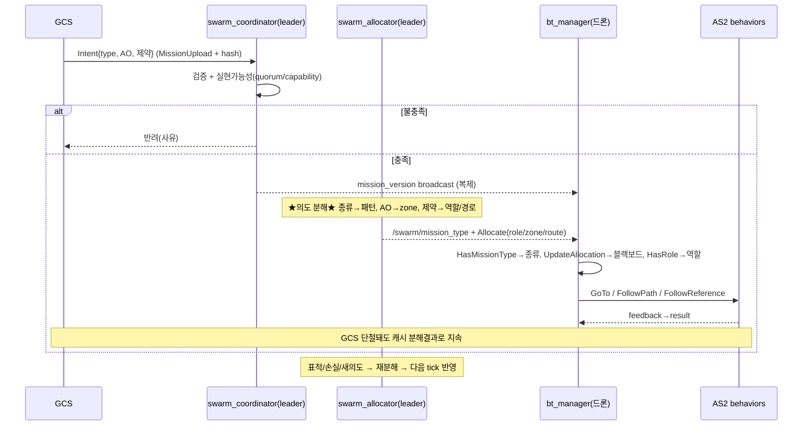
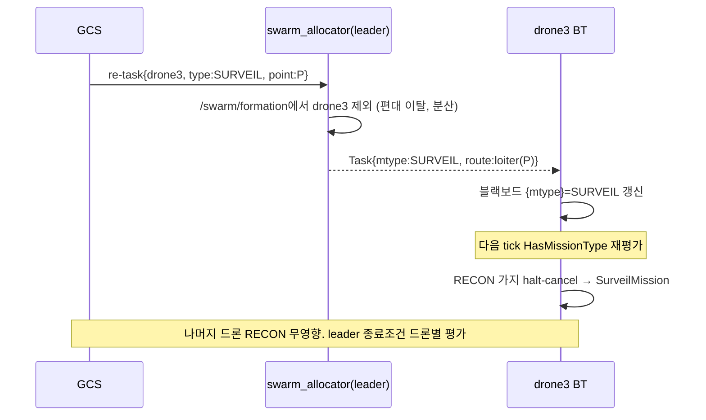

# 의도 기반 상위 임무 처리 절차

> **전제**: 주력 설계 B(BT 네이티브, `swarm_bt_native_design.md`) 기반.
> **범위**: GCS가 **의도(추상 목표)** 만 전송할 때 — per-drone waypoint/역할 없이 "이 구역 정찰", "표적 X 추적" 수준 — 군집이 이를 분해·실행하는 절차.

---

## 1. 의도 기반 임무란

GCS가 상세 명령이 아니라 **추상 목표**를 전송. 군집이 구체 행동으로 분해.

예: `{ type: RECON, AO: <polygon>, priority, time_limit, min_quorum }` — 드론별 경로·역할 **없음**.

---

## 2. 핵심 책임분할

**의도 분해 = 백그라운드(leader allocator). BT = 실행만.**

- BT 리프는 의도를 분해하지 않음 — 분해된 결과를 블랙보드로 소비.
- allocator가 BT 리프가 아닌 **백그라운드 서비스**인 이유(`swarm_bt_native_design.md` §2): 의도분해(Voronoi/패턴/경로)는 무거운 compute → tick 블로킹 방지.

> 경계: **BT = "무엇을 할지 선택+실행", allocator = "의도를 무엇으로 풀지 계산".**

---

## 3. 의도 추상화 수준 매핑

| GCS 제공 (의도) | 군집 도출 (분해) | 담당 |
|---|---|---|
| 임무종류 (정찰/추적/감시) | 탐색패턴 선택 (lawnmower/spiral/sector) | allocator |
| AO (구역 폴리곤) | Voronoi 분할 → 드론별 zone | allocator |
| 우선순위·제약 (시간/최소기체) | 역할배정·기체수 적응 | allocator |
| **정찰 수단** (비전/RF, or 자동) | 능력↔수단 매칭, 수단별 경로 생성 | allocator (capability-aware) |
| 표적 (추적 시) | tracker 선정·추적경로 | allocator |
| (routes 없음) | waypoint 생성 | allocator |
| 종료의도 (coverage/지속) | EvalTermination 조건 | leader |

---

## 4. 처리 파이프라인

```
G. GCS: Intent{ type:RECON, AO_polygon, priority, time_limit, min_quorum, [target] }
        ※ per-drone 상세 없음 = 의도 레벨
   │ MissionUpload (version_hash)
   ▼
P0 [swarm_coordinator] 수신·검증
   ├ 스키마/AO 유효성
   ├ 실현가능성: quorum·capability 충족? (불충족 → GCS 반려)
   └ version_hash 발급
   │
P1 [coordinator] ★의도 복제★ → /swarm/mission_intent(transient_local) 발행
   └ **전 드론이 MissionIntent 로컬 캐시** (NEW-8: 누구나 할당 리더 가능, 리더 교체에도 의도 보존)
   │
P2 [swarm_allocator] ★의도 분해★ (leader, **로컬 캐시 intent** 사용)
   ├ 종류 → 탐색패턴
   ├ AO → Voronoi → 드론별 zone
   ├ 제약·기체수 → 역할배정 (SCOUT/TRACK/STANDBY ...)
   └ zone+패턴 → 드론별 route(waypoint) 생성
   │
P3 배포
   ├ /swarm/mission_type  (종류)
   └ Allocate 응답: 드론별 role/zone/route
   │
P4 [각 드론 BT] 실행 (의도 분해결과 소비)
   ├ HasMissionType → 종류 가지 선택
   ├ UpdateAllocation → role/route 블랙보드 적재
   ├ HasRole selector → 역할 서브트리
   └ GoTo/FollowPath/FollowReference (AS2 behavior)
   │
P5 적응·재분해 (런타임 변화 시)
   ├ 표적 발견 → allocator 재할당(TRACK 재지정) → 다음 tick 반영
   ├ 기체 손실 → 잔여 zone 재분배
   └ GCS 새 의도 → P0 재진입
```

---

## 5. BT vs 백그라운드 경계

| 일 | 위치 | 이유 |
|---|---|---|
| 의도 검증·**복제(전 드론 캐시)** | `swarm_coordinator` (서비스) | 상태판단 + 단절생존 전제(NEW-8) |
| **의도 → 구체 분해** | **`swarm_allocator` (서비스)** | Voronoi/패턴/경로 무거운 compute |
| 종류 선택 | BT `HasMissionType` | tick 반응형 |
| 역할 선택 | BT `HasRole` | tick 반응형 |
| 실행 | BT 리프 → behavior | AS2 액션 |
| 종료판정 | BT `EvalTermination` (leader) | 온보드 |

> 의도분해를 BT에 넣으면 tick 블로킹 → 백그라운드가 정답. BT는 분해결과를 selector+behavior로 실행만.

---

## 6. 동적 의도 변경

```
GCS 새 Intent (예: 정찰→추적 전환, AO 확장)
 → coordinator 재검증 → version 갱신 → broadcast
 → allocator 재분해 → 새 mission_type / role / route
 → BT: HasMissionType / HasRole 다음 tick 재평가
   → 기존 가지 halt-cancel → 새 의도 가지 진입
```
의도 변경 = **트리구조 불변, 블랙보드(mtype/role/route)만 갱신** → selector 재선택. 역할 재지정과 동일 메커니즘.

---

## 7. 단절 시 의도 처리

- **의도 + 분해결과 둘 다 캐시** (mission_version + role/route 블랙보드).
- **GCS 단절**: 캐시된 분해결과로 BT 계속 — 의도 재수신 불필요.
- **리더 단절**: 새 리더 allocator가 mission_version으로 의도 인수 → 재분해 가능 (registry 백그라운드 상태보유).
- 새 의도는 링크 복구까지 보류 (부재 ≠ 중단, GCS best-effort 일관).

---

## 8. 한계 — 의도 표현범위

의도가 처리되려면 **2조건**:
1. **allocator가 분해 가능** — 종류·패턴·AO 분해 로직 보유. 신규 분해방식 = allocator 코드 추가.
2. **BT가 실행구조 보유** — 옵션 A면 종류 사전 enumerate. 신규 임무구조 의도 = 옵션 C2(템플릿 합성) 필요.

| 의도 유형 | A로 처리 | 비고 |
|---|---|---|
| 알려진 종류 + 임의 AO/제약 | ✅ allocator가 분해 | 가장 흔함 |
| 알려진 종류 조합 | ✅ selector | |
| 신규 임무구조 (enumerate 밖) | ❌ → C2 템플릿 합성 | 현장 정의 |

> 의도 추상화가 높을수록 **allocator 분해지능 + (개방형이면) C2** 의존. 알려진 종류 내 의도는 A로 완전처리.

---

## 9. 시퀀스 (Mermaid)



---

## 10. 결론

- **의도 처리 = coordinator(검증) → allocator(분해) → BT(실행) 파이프라인.** 핵심 = allocator가 의도→구체 변환.
- **BT는 의도 분해 안 함** — 분해결과를 selector+behavior로 실행. 백그라운드/BT 경계 명확.
- 동적 의도변경·단절 = 기존 halt-cancel·캐시 메커니즘 재사용, 추가설계 최소.
- 한계: 의도범위 = allocator 분해능력 + 트리 enumerate(A) / 템플릿(C2). 알려진 종류는 A로 충분, 개방형 의도는 C2.

### 구현 함의
- `swarm_allocator`를 **의도-분해 엔진**으로 설계 (종류-aware, Voronoi/패턴/경로 생성).
- `MissionUpload`/`MissionDescriptor`에 의도 필드(type/AO/제약/target) 포함.
- BT는 무변경 — 의도는 allocator 출력(mission_type/role/route)으로만 BT에 도달.

---

## 11. per-drone 종류 이질성 (re-task)

**시나리오**: 전체 정찰(RECON) 중 특정 드론만 감시(SURVEIL)로 전환. = 역할(role)이 아닌 **임무 종류(type) 자체**를 한 드론만 변경.

### 11-1. 가능 여부 — 부분적 가능, mtype 출처가 관건

| 모델 | mtype 출처 | 이질 종류 |
|---|---|---|
| 현재 (암묵) | `/swarm/mission_type` 전역 broadcast | ❌ 전 드론 동일 종류 |
| **변경** | **Allocate 응답의 per-drone 필드** (or 전역 default + per-drone override) | ✅ 드론별 종류 |

예제 트리는 종류를 **블랙보드 `{mtype}`로 라우팅**(`HasMissionType type="{mtype}"`) → `{mtype}`가 per-drone이면 drone3만 SURVEIL 가지. **트리·BT 노드 무변경**, mtype 출처만 전역→per-drone.

### 11-2. 동작 메커니즘
```
트리거: GCS "drone3 → SURVEIL @P"  (or allocator 자동: 지속감시 가치 발견)
 → allocator: drone3 재할당 → mtype=SURVEIL, route=loiter(P)
 → drone3 UpdateAllocation → 블랙보드 {mtype}=SURVEIL 갱신
 → 다음 tick: HasMissionType RECON?FAIL → SURVEIL?SUCCESS
   → RECON 가지 halt-cancel(FollowPath 취소) → SurveilMission 진입
 나머지 드론: {mtype}=RECON 유지 → 무영향
```
= 역할 재지정의 **종류 레벨 확장**, 동일 halt-cancel 반응형.

### 11-3. 같이 처리할 것 (단순 type 변경 넘어)

| # | 이슈 | 대응 |
|---|---|---|
| 1 | **편대 이탈** — drone3가 RECON 편대 떠남 | 분산편대: allocator가 `/swarm/formation`에서 drone3 **제외** → drone3 FollowReference 해제 (ModifySwarm 불필요, swarm_flocking 미사용) |
| 2 | **이질 종료조건** — RECON=coverage95%, SURVEIL=지속/시간 | leader EvalTermination이 드론별/서브임무별 평가 |
| 3 | **coverage 재산정** — drone3 빠진 RECON 잔여구역 | allocator 잔여 zone 재분배 (기체손실과 동일) |
| 4 | **quorum/일관성** — 단일임무 가정 깨짐 | **task-group 개념**: 서브그룹(RECON팀/SURVEIL팀)별 quorum·종료 독립 |
| 5 | GCS 인터페이스 | 특정 드론 타겟 **re-task 명령**(drone_id + new type + params) |

### 11-4. 옵션 A 범위 내 — YES
RECON·SURVEIL 가지 **둘 다 정적 트리에 존재**(HasMissionType selector). per-drone 라우팅 = 같은 트리서 드론마다 다른 가지 선택. **C2 불필요** (단 종류집합은 사전 enumerate, A 제약 그대로).

### 11-5. 시퀀스


### 11-6. 핵심 설계변경
- `mission_type`을 **전역 → per-drone**(또는 전역 default + per-drone override)로.
- `swarm_allocator`를 **이질 할당 엔진**으로 (드론별 type+role+route).
- 편대 detach(ModifySwarm) + task-group으로 quorum/종료 분리.

> 현 문서들은 mission_type을 암묵 전역으로 다룸 — 이질 종류 지원하려면 그 가정을 per-drone으로 명시 수정 필요 (bt_native/example의 broadcast 가정).

### 11-7. group-aware 종료 (NEW-12)

이질 군집(예: RECON팀+SURVEIL팀)은 종류별 종료조건이 다름. `EvalTermination`이 **group별 평가**:

| 종류 group | 종료조건 |
|---|---|
| RECON | 담당 zone coverage ≥ target |
| SURVEIL | **자연종료 없음** — time_limit 도달 or GCS 종료명령 (지속 감시) |
| TRACK | target lost or time_limit |
| (공통) | GCS ABORT 즉시 / 정족수 미달 |

- swarm 종료 = **전 active group 충족 시만**. SURVEIL 존재하면 coverage만으로 안 끝남 → time/GCS 필요.
- 먼저 끝난 group 드론(예: RECON coverage 완료) → allocator가 **재배정**(STANDBY/RELAY or 개별 RTB), 임무 종료 아님.
- 구현: EvalTermination이 registry(group 멤버십)+coverage(zone별)+time+cmd 종합. 단일 BT 노드, 내부 group-aware.

---

## 12. 정찰 수단 (modality) 분기 — 비전 vs RF

정찰 수단(EO/IR 카메라 비전 vs 스펙트럼 RF)별로 **별도 동작** 필요. type/role과 직교한 **3번째 축**.

### 12-1. 3축 직교
```
종류 RECON  → 수단 selector  VISION / RF   ← HasModality
                  × 역할 (SCOUT/TRACK/...)   ← HasRole
allocator: Allocate{ type, modality, role, route }  3축 동시배정
```
selector 계층: **종류 → 수단 → 역할** (예제 트리 ReconMission→Vision/RfReconMission→역할).

### 12-2. 수단별 별도 동작

| 수단 | 비행패턴 | 센서/기동 | perception | 출력 |
|---|---|---|---|---|
| **VISION** | lawnmower 면적 커버리지 | FollowPath + PointGimbal(카메라 지향) | `vision_detect`(카메라) | detections(bbox) |
| **RF** | 신호측위(삼각측량/DF/peak loiter) | `RfSurvey`(RF 특화 기동+스캔) | `rf_scan`(스펙트럼) | emitters(방위/주파수) |

> 비행패턴이 다름(커버리지 vs 측위) → 별도 서브트리가 맞음. EO/IR=기존 카메라+gimbal 재사용, **RF=신규 sensor 인터페이스**(`sensor_measurements/rf`).

### 12-3. 의도 흐름에서의 수단 결정

| 배치 | 수단 결정 | 적합 |
|---|---|---|
| **(a) allocator 배정 (권장)** | "정찰" 의도 → allocator가 능력↔수단 매칭 | 의도는 하나, 수단은 능력 따라 |
| (b) GCS 직접 지정 | GCS가 modality 필드로 명시 | 운용자가 수단 통제 |

allocator capability-aware 필수: 기체 탑재능력(EO/IR/RF) ↔ 구역 요구수단 매칭. 능력은 `Health`/registry에 광고.

### 12-4. 동적 전환
RF 신호 포착 → allocator가 해당 드론 `{modality}=RF` 재배정 → 다음 tick `HasModality` 재평가 → VisionRecon halt-cancel → RfRecon 진입. (type/role 재지정과 동일 메커니즘)

### 12-5. 필요 변경
- BT: `HasModality`(Condition), `RfSurvey`(Action, RF 기동) 신규. `PointGimbal`(비전) 재사용.
- 서브트리: `VisionReconMission` / `RfReconMission`.
- perception: `vision_detect` / `rf_scan` (modality별 배경 노드).
- allocator: capability-aware + `Allocate.modality`.
- `Health`/registry: 능력필드(EO/IR/RF).
- AS2: RF 신규 sensor 인터페이스 (EO/IR은 기존 카메라/gimbal).
- 블랙보드: `{modality}`.
