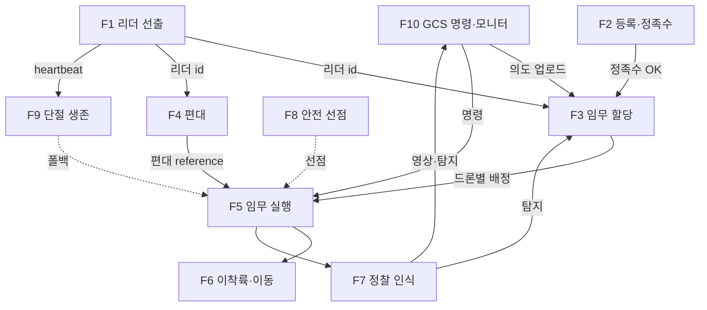

# 군집(Swarm) 레이어 기능 개요 — 설명 자료

> **대상**: 이 설계를 처음 접하는 사람.
> **요약**: Aerostack2(단일 드론 자율비행 프레임워크) 위에, 여러 드론을 **리더-팔로워 군집**으로 조율하는 레이어. 각 드론이 동일한 Behavior Tree(BT)를 돌리고, 리더는 선출로 정해진다. **GCS(지상국)가 끊겨도 임무를 계속 수행**하는 것이 핵심 목표.

---

## 1. 한눈에 보기

```
            ┌─────────────── GCS (지상국, 제어루프 밖) ───────────────┐
            │   임무 의도 업로드 / 실시간 모니터 / 영상수신             │
            └───────────────────────────┬────────────────────────────┘
                                         │ (끊겨도 임무 지속)
   ┌─────────────────────────────────────┴──────────────────────────────┐
   │                         군집 (드론 N대)                              │
   │   [선출된 리더] ── 조율(할당·편대·종료판정) ──► [팔로워들]           │
   │        ▲ heartbeat 선출                              │               │
   │        └──────────────── 같은 BT, IsLeader로 역할 자기선택 ──────────┘
   │                                                                      │
   │   각 드론 = AS2(이착륙/이동/제어/센서) + 군집 BT 노드 + 인식         │
   └──────────────────────────────────────────────────────────────────────┘
```

- 모든 드론이 **같은 임무 트리**를 실행. `리더`는 *역할*이며 선출로 이동(고정 노드 아님).
- 무거운 계산(할당)·상태(등록부)는 **백그라운드 서비스**, 흐름 제어는 **BT**가 담당.

---

## 2. 기능 목록 (10)

| # | 기능 | 한 줄 역할 | 핵심 컴포넌트 |
|---|---|---|---|
| F1 | **리더 선출** | 누가 조율할지 결정 (장애 시 자동 승계) | swarm_election |
| F2 | **군집 등록·정족수** | 멤버십 구성, 최소 기체수 확인 | swarm_registry, SwarmJoin |
| F3 | **임무 할당 (의도 분해)** | 추상 의도 → 드론별 구역·역할·경로 | swarm_allocator, AllocateTasks/UpdateAllocation |
| F4 | **편대 형성·유지 (분산)** | 대형 생성, 각 드론이 자기 위치 추종 | SwarmFormation, formation_ref, FollowReference |
| F5 | **임무 실행** | 종류·수단·역할별 비행 동작 선택·수행 | Has* selector, GoTo/FollowPath 등 |
| F6 | **이착륙·이동** | 기본 비행 동작 (AS2 재사용/커스텀) | SwarmTakeoff, GoTo, Land |
| F7 | **정찰 인식** | 카메라/RF로 표적 탐지 | vision_detect, rf_scan, RfSurvey |
| F8 | **안전 선점** | 비상 시 임무 중단·회피 | WaitForAlert, Emergency |
| F9 | **단절 생존** | 리더/GCS 끊겨도 자율 지속 | WaitForLeaderLost, AutonomousCached |
| F10 | **GCS 명령·모니터** | 의도 업로드·오버라이드·상태 표시 | (외부) + WaitForSwarmCmd |

---

## 3. 기능별 상세 (역할 / 입력 / 출력 / 연관)

### F1. 리더 선출
- **역할**: 전 드론이 heartbeat를 주고받아 살아있는 최저 id를 리더로 정함. 리더가 죽으면 차순위 자동 승계 → 단일장애점 제거.
- **입력**: 전 드론 heartbeat.
- **출력**: 현재 리더 id (`/swarm/leader_id`).
- **연관**: → F3·F4(리더만 할당·편대 구동), F9(상실 감지).

### F2. 군집 등록·정족수
- **역할**: 팔로워가 자가진단(health) 싣고 가입, 등록부 구성. 최소 정족수(quorum) 충족 여부 판정. 임무 버전 동기화.
- **입력**: 가입 요청(id+health).
- **출력**: 등록부(`/swarm/registry`), 정족수 OK 여부, 임무 버전 해시.
- **연관**: ← F1(리더가 수락), → F3(정족수 충족 시 할당 시작).

### F3. 임무 할당 (의도 분해) ★핵심
- **역할**: GCS의 **추상 의도**(예: "이 구역 정찰")를 드론별 **구체 배정**으로 변환 — 구역 분할(Voronoi), 탐색 패턴, 역할, 수단, 경로 생성. 표적 발견·기체 손실 시 재할당.
- **입력**: 임무 의도(구역/제약), 등록부, 탐지 결과.
- **출력**: 드론별 배정(`/{drone}/swarm_agent/task`: 종류/수단/역할/경로/구역/이륙슬롯).
- **연관**: ← F2(멤버), → F5(배정이 실행 분기 결정), ← F7(탐지→재할당).

### F4. 편대 형성·유지 (분산)
- **역할**: 리더가 편대 형태에서 중심(centroid)+드론별 오프셋을 계산해 **연속 발행**. 각 드론은 자기 목표를 추종 → 편대 유지. (중앙 편대 노드 없음 → 리더 교체에 강함)
- **입력**: 편대 형태/간격, 임무 진행.
- **출력**: 편대 reference(`/swarm/formation`) → 드론별 TF → 추종.
- **연관**: ← F1(리더 발행), → F5(편대 비행에 사용).

### F5. 임무 실행
- **역할**: 배정된 **종류(정찰/추적/감시) → 수단(비전/RF) → 역할(SCOUT/TRACKER/RELAY/STANDBY)** 3계층으로 분기해 해당 비행 동작 수행. 배정이 바뀌면 즉시 다른 동작으로 전환(반응형).
- **입력**: 배정(블랙보드 type/modality/role/route), 리더 명령.
- **출력**: AS2 비행 동작 호출 (이동/경로/편대/카메라).
- **연관**: ← F3(배정), ← F4(편대), → F6(비행), → F7(인식 동반).

### F6. 이착륙·이동
- **역할**: arm/이륙/이동/경로/착륙 등 기본 비행. AS2 기존 동작 재사용, 문제 있는 것은 커스텀(SwarmTakeoff: 블로킹 sleep 제거, SwarmFollowPath: 다점 경로).
- **이륙 충돌회피(NEW-10)**: `WaitLaunchSlot` 게이트 — 리더가 배정한 이륙 순번(launch_slot)대로, 하위 슬롯 airborne 후 이륙. 밀집 동시이륙 방지.
- **입력**: 목표 위치/고도/경로, 이륙 슬롯.
- **출력**: 실제 기체 제어 (AS2 → 플랫폼).
- **연관**: ← F5(임무가 호출), ← F3(launch_slot 배정).

### F7. 정찰 인식
- **역할**: 수단별 센서로 표적 탐지 — 비전(EO/IR 카메라→bbox), RF(스펙트럼→방사원 방위/주파수). RF는 신호측위 특화 기동(RfSurvey).
- **입력**: 카메라/RF 센서 데이터.
- **출력**: 탐지 결과(detections/emitters).
- **연관**: → F3(재할당 트리거), → F10(GCS 융합·보고).

### F8. 안전 선점
- **역할**: 비상 이벤트(AlertEvent) 발생 시 최우선으로 임무를 중단(halt)하고 비상 동작(호버→복귀→착륙) 수행. 트리 구조상 항상 최상위.
- **입력**: AlertEvent — 지오펜스 위반(as2_geozones), **드론간 충돌위험(separation_monitor: CPA/TCPA, NEW-9)**, 배터리 등.
- **출력**: 비상 비행 (Emergency / FORCE_HOVER).
- **연관**: → F5 선점(임무 halt), AS2/FCU failsafe와 병행.
- **충돌회피 2계층**: 예측분리(경로계획서 사전회피) + 임박충돌(separation_monitor→AlertEvent→호버, 최후수단).

> **개별 배터리 RTB (NEW-11)**: 한 드론 배터리가 낮으면 그 드론만 편대 이탈→복귀→착륙(`BatteryLow`→`IndividualRTB`, 반응형 선점). **swarm 임무는 계속** — 전군 종료는 coverage/시간/정족수만(개별 배터리 ≠ 임무종료). 너무 많이 RTB하면 정족수 미달로 자연 종료.

### F9. 단절 생존
- **역할**: 리더 heartbeat 끊김+타임아웃 시 자율 모드 전환(캐시된 경로로 단독 비행→복귀). 리더 복귀 시 자동 재합류. GCS 단절은 무영향(BT는 로컬로 계속).
- **전제**: **의도(intent)가 전 드론에 복제·캐시**됨 → 리더가 죽어도 새 리더(누구든)가 캐시 의도로 재할당 가능 (F3과 연결, NEW-8).
- **입력**: heartbeat 상태, 캐시된 의도+배정.
- **출력**: 자율 비행(AutonomousCached) 또는 임무 복귀.
- **연관**: ← F1(상실 감지), ← F3(캐시 의도/배정 사용).

### F10. GCS 명령·모니터
- **역할**: 운용자가 임무 의도 업로드, 실시간 모니터, 선택적 명령(HOLD/RESUME/RTH). 명령은 best-effort — 없거나 끊겨도 군집은 자율 진행.
- **입력**: 텔레메트리·상태·보고.
- **출력**: 임무 의도, 명령(`/swarm/cmd`).
- **연관**: → F3(의도→할당), → F5(명령 게이트), ← F7(영상/탐지 수신).

---

## 4. 기능 간 연관 (전체도)



---

## 5. 한 임무 사이클 (데이터 흐름)

```
1. 선출      전 드론 heartbeat → 리더 결정                    (F1)
2. 등록      팔로워 가입 → 등록부·정족수                       (F2)
3. 의도      GCS가 "구역 정찰" 업로드 → 리더                   (F10→F3)
4. 분해      리더가 구역분할·역할·경로 생성 → 드론별 배포       (F3)
5. 이륙·집결 arm·이륙 → 편대 구성                              (F6,F4)
6. 실행      종류·수단·역할 분기 → 탐색 비행 + 인식             (F5,F6,F7)
7. 재할당    표적 발견 → 추적 역할 재지정 (반응형 전환)         (F7→F3→F5)
8. 종료판정  coverage≥95% / 시간초과 / 정족수미달 → 리더 온보드  (F3 내, group별)
9. 종료전파  리더 → RTH 브로드캐스트 → 팔로워 복귀 (NEW-14)      (F10 경로)
10. 복귀·보고 RTB → 착륙 → 보고서 → GCS                          (F6,F10)

※ 어느 단계든:
  - 비상(F8) 선점, 리더/GCS 단절(F9) 자율 지속.
  - 개별 배터리 낮음 → 그 드론만 RTB(NEW-11), swarm 임무는 계속.
  - 트리는 transient 실패에 안 죽음 — SafeHover 최종폴백(NEW-16).
```

---

## 6. 설계 특징 (왜 이렇게)

| 특징 | 이유 |
|---|---|
| **BT 네이티브** (조율=트리) | AS2 BT 어댑터·반응형·선점을 그대로 활용, 별도 레이어 불필요 |
| **선출 리더 (이동)** | 단일장애점 제거, 리더 죽어도 임무 지속 |
| **분산 편대** | 중앙 편대노드 SPOF 제거, 리더 교체에 강함 |
| **배정 push + 반응형 selector** | 실시간 재할당이 즉시 비행에 반영 |
| **GCS 제어루프 밖** | 통신 끊겨도 군집 자율 |
| **AS2 무수정** | 문제 노드는 커스텀으로 대체, 업스트림 정합성 유지 |
| **per-drone 이질 임무** | 종류/역할이 드론별(string) → 한 군집서 정찰+감시 혼재, re-task 가능 |
| **트리 사망 방지** | 비행 중 transient 실패에도 SafeHover로 트리 유지 → 추락 방지 (NEW-16) |

---

## 7. 용어

| 용어 | 뜻 |
|---|---|
| AS2 | Aerostack2 — 단일 드론 자율비행 프레임워크 (이착륙/제어/센서 제공) |
| BT | Behavior Tree — 임무를 트리로 표현, 100Hz로 재평가하며 동작 선택 |
| 리더/팔로워 | 선출된 조율자 / 명령 수행 기체. 같은 트리, IsLeader로 자기선택 |
| 의도(Intent) | GCS가 주는 추상 목표(구역/제약). 드론별 상세는 군집이 분해 |
| 배정(Task) | 드론별 종류·수단·역할·경로 |
| 정족수(Quorum) | 임무 진행에 필요한 최소 기체 수 |
| 단절 생존 | GCS/리더 통신 끊겨도 임무 지속하는 자율성 |

---

> 상세: `swarm_full_architecture.md`(전체 계층), `swarm_bt_native_design.md`(설계), `swarm_bt_node_reference.md`(노드 IO), `swarm_mission_example.xml`(트리), `swarm_intent_processing.md`(의도 처리). 미해결: `swarm_open_issues.md`.
